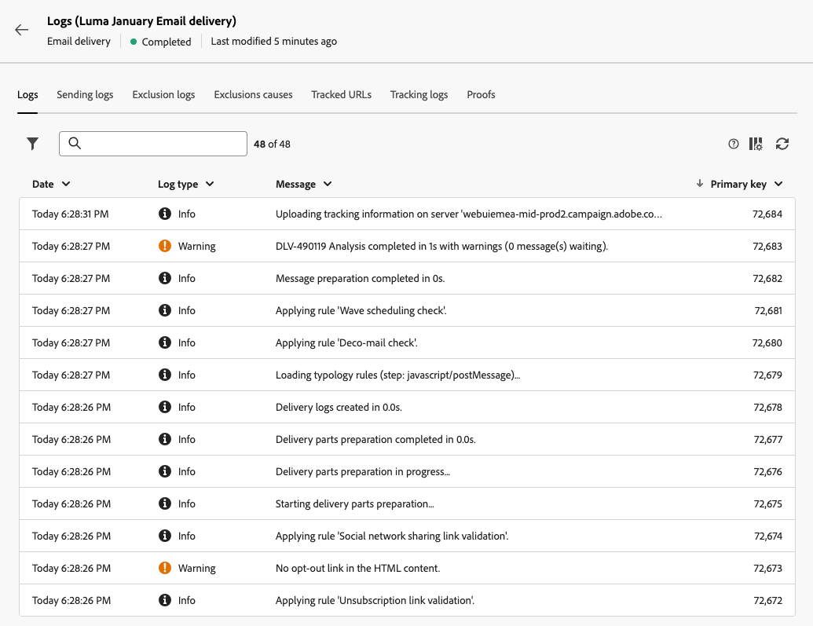

# Leveringslogboeken controleren {#delivery-logs}

>[!NOTE]
>
>Deze documentatie is in opbouw en wordt regelmatig bijgewerkt. De definitieve versie van deze inhoud zal in Januari 2023 klaar zijn.

>[!CONTEXTUALHELP]
>id="acw_deliveries_email_preparation_logs"
>title="Leveringslogboeken"
>abstract="TBC"

Nadat u een e-mail hebt voorbereid en verzonden, kunt u met de leveringslogboeken controleren of er geen fout is opgetreden. Deze logboeken kunnen direct van het berichtdashboard worden betreden. Zij tonen de details van de verzending, welk doel is uitgesloten en waarom, evenals de tracking-informatie zoals aantal geopend en aantal klikken.

Klik op de knop **Logboeken** knop.

Verschillende tabbladen bevatten informatie (indien aanwezig) over de verzendende logboeken, uitsluitingslogboeken, oorzaken van uitsluiting, logbestanden bijhouden en bijgehouden URL&#39;s.

**Los** tab

De **Logboeken** bevat alle berichten met betrekking tot de levering en de proefdrukken. Met specifieke pictogrammen kunt u fouten of waarschuwingen identificeren.

Alle validatiestappen, waarschuwingen en fouten worden weergegeven. De gekleurde pictogrammen tonen het berichttype:

* Het grijze pictogram geeft een informatief bericht aan.
* Het gele pictogram geeft een niet-kritieke verwerkingsfout aan.
* Het rode pictogram geeft een kritieke fout aan die het verzenden van de levering verhindert.

**Leveringen** tab

De **Leveringen** biedt een geschiedenis van elk exemplaar van deze levering aan. De lijst met verzonden berichten en hun status is hier opgeslagen. Op dit tabblad kunt u de leveringsstatus voor elke ontvanger bekijken.

**Uitsluitingen** tab

Het lusje van de Logboeken van de Uitsluiting maakt een lijst van alle berichten die van het verzonden doel zijn uitgesloten en specificeert de reden voor de verzendmislukking.

**Uitsluiting veroorzaakt** tab

De **Uitsluiting veroorzaakt** toont het volume (in aantal berichten) van berichten die van het doel werden uitgesloten verzendt.

**Bijgehouden URL&#39;s** tab

De **Bijgehouden URL&#39;s** tabweergaven

**Tekstspatiëring** tab

De **Tekstspatiëring** wordt de volggeschiedenis voor deze levering weergegeven. Op dit tabblad worden volggegevens weergegeven voor de verzonden berichten, d.w.z. alle URL&#39;s die door Adobe Campaign moeten worden gevolgd. De volgende gegevens worden per uur bijgewerkt.

>[!NOTE]
>
>Als &#39;tracking&#39; niet is ingeschakeld voor levering, wordt dit tabblad niet weergegeven.

Het volgen van gegevens wordt geïnterpreteerd in de leveringsrapporten. Zie deze sectie.

