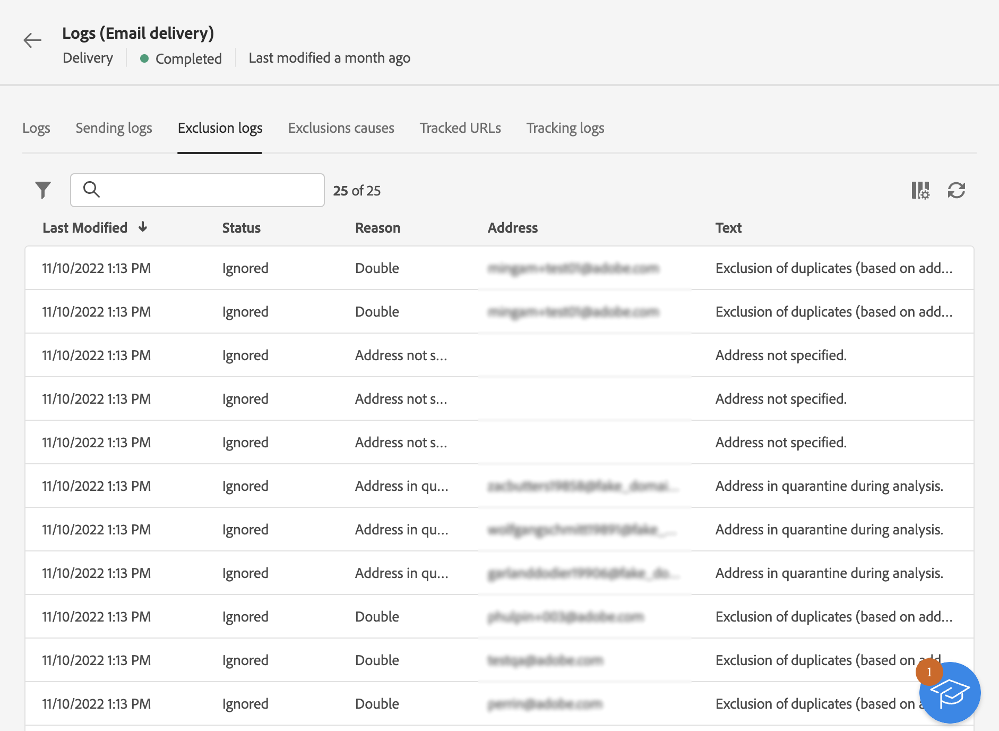

# Leveringslogboeken controleren {#delivery-logs}

>[!CONTEXTUALHELP]
>id="acw_deliveries_email_preparation_logs"
>title="Leveringslogboeken"
>abstract="De leveringslogboeken tonen het detail van het verzenden. Zij tonen de details van de verzending, welk doel is uitgesloten en waarom, evenals de tracking-informatie zoals aantal geopend en aantal klikken."

Zodra de levering wordt voorbereid en u klikte **Verzenden** Blader naar de leveringslogboeken om de waarschuwingen, fouten, status, uitsluitingen en trackinggegevens te controleren. Deze logboeken kunnen direct van het berichtdashboard worden betreden. Zij tonen de details van de verzending, welk doel is uitgesloten en waarom, evenals de tracking-informatie zoals aantal geopend en aantal klikken.

Als u de logbestanden wilt weergeven, opent u het dashboard voor de levering en klikt u op de knop **Logboeken** knop.

De volgende tabbladen zijn beschikbaar:

* [Logboeken](#logs-tab)
* [Leveringen](#deliveries-tab)
* [Uitsluitingen](#exclusion-tab)
* [Uitsluiting veroorzaakt](#exclusion-causes)
* [Bijgehouden URL&#39;s](#tracked-urls)
* [Tracking](#tracking)

## Logboeken {#logs-tab}

De **Logboeken** bevat alle berichten met betrekking tot de levering en de proefdrukken. Met specifieke pictogrammen kunt u fouten of waarschuwingen identificeren.

Alle validatiestappen, waarschuwingen en fouten worden weergegeven. De gekleurde pictogrammen tonen het berichttype:

* Het grijze pictogram geeft een informatief bericht aan.
* Het gele pictogram geeft een niet-kritieke verwerkingsfout aan.
* Het rode pictogram geeft een kritieke fout aan die het verzenden van de levering verhindert. Er moeten kritieke fouten worden gecorrigeerd voordat de levering wordt verzonden.

## Leveringen {#deliveries-tab}

De **Logboeken verzenden** biedt een geschiedenis van elk exemplaar van deze levering aan. De lijst met verzonden berichten en hun status is hier opgeslagen. Op dit tabblad kunt u de leveringsstatus voor elke ontvanger bekijken.

## Uitsluitingen {#exclusion-tab}

De **Uitsluitingslogboeken** bevat een lijst met alle berichten die zijn uitgesloten van het doel en geeft de reden voor de verzendfout op.

## Uitsluiting veroorzaakt {#exclusion-causes-tab}

De **Uitsluiting veroorzaakt** wordt voor elke mogelijke oorzaak het aantal berichten weergegeven dat van het doel is uitgesloten.

## Bijgehouden URL&#39;s {#tracked-urls-tab}

De **Bijgehouden URL&#39;s** worden de URL&#39;s in de verzonden berichten opnieuw gegroepeerd, inclusief hun URL-type en hun bron-URL.

## Tracking {#tracking-tab}

De **Tekstspatiëring** wordt de volggeschiedenis voor deze levering weergegeven. Op dit tabblad worden trackinggegevens weergegeven voor de verzonden berichten, d.w.z. alle URL&#39;s die door Adobe Campaign moeten worden gevolgd.

>[!NOTE]
>
>Als &#39;tracking&#39; niet is ingeschakeld voor levering, wordt dit tabblad niet weergegeven.