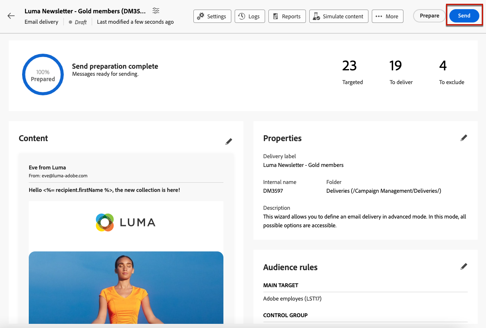

# Uw e-mail voorbereiden en verzenden {#prepare-send}

## De verzending voorbereiden {#prepare}

Wanneer u uw [content](../content/edit-content.md), [publiek](../audience/add-audience.md) en uw planning, bent u bereid om uw e-maillevering voor te bereiden.

Tijdens de voorbereiding, wordt de doelbevolking berekend en de berichtinhoud geproduceerd voor elk profiel inbegrepen in het doel. Zodra de voorbereiding is voltooid, zijn de berichten klaar om te worden verzonden, of onmiddellijk of op de geplande datum en tijd.

De validatieregels die worden gebruikt tijdens de voorbereiding van de levering worden beschreven in de [Campagne v8 (console)-documentatie](https://experienceleague.adobe.com/docs/campaign/campaign-v8/campaigns/send/validate/delivery-analysis.html){target="_blank"}.

De belangrijkste stappen voor het voorbereiden van de verzending worden hieronder vermeld.

1. Van het leveringsdashboard, klik **[!UICONTROL Review and send]**.

   

1. Klik op de knop **[!UICONTROL Prepare]** in de rechterbovenhoek en bevestig.

   

   >[!NOTE]
   >
   >Als u de levering hebt gepland en de optie **[!UICONTROL Enable confirmation before sending]** , worden de voorbereidings- en verzendingsstappen gegroepeerd onder de **[!UICONTROL Prepare and send]** knop. [Meer informatie over plannen](../email/create-email.md#schedule)

1. De voortgang van de voorbereiding wordt weergegeven. Afhankelijk van de omvang van de doelpopulatie kan deze operatie enige tijd in beslag nemen.

   U kunt de bereiding op elk gewenst moment stoppen met de **[!UICONTROL Stop preparation]** knop.

   

   >[!NOTE]
   >Tijdens de voorbereidingsfase worden geen berichten verzonden. U kunt dit daarom starten of stoppen zonder het risico te lopen iets te beïnvloeden.

1. Controleer de PKI&#39;s wanneer de bereiding is voltooid. Als het aantal berichten dat u wilt verzenden niet overeenkomt met uw verwachtingen, wijzigt u het publiek en start u de voorbereiding opnieuw.

   

   Hier worden de verschillende KPI&#39;s weergegeven:

   * **[!UICONTROL Targeted]**: het aantal doelgroepen.
   * **[!UICONTROL To deliver]**: het aantal berichten dat wordt verzonden.
   * **[!UICONTROL To exclude]**: het aantal berichten dat door een [typologieregel](../advanced-settings/delivery-settings.md#typology).

1. Klik op de knop **[!UICONTROL Logs]** en controleert u of er geen fout optreedt. In het laatste logbericht worden foutberichten en het aantal fouten weergegeven. [Meer informatie](delivery-logs.md)

   

1. Als in het preparaat een kritieke fout wordt aangetroffen waardoor de levering niet kan worden verzonden, wordt de status van het preparaat in het leveringsdashboard weergegeven als mislukt.

   

1. Als u na de bereiding wijzigingen aanbrengt in uw aflevering, moet u de voorbereiding opnieuw starten om met deze wijzigingen rekening te houden.

Zodra de voorbereiding zonder fout volledig is, is uw bericht klaar om te worden verzonden.

## Bericht verzenden {#send}

>[!CONTEXTUALHELP]
>id="acw_deliveries_email_metrics_delivered"
>title="Geleverd"
>abstract="Het aantal berichten dat is afgeleverd. Deze indicator wordt elke 5 minuten bijgewerkt. Het getoonde percentage is gebaseerd op het totale aantal verzonden berichten."

>[!CONTEXTUALHELP]
>id="acw_deliveries_email_metrics_opens"
>title="Geopende items"
>abstract="Het aantal geopende berichten. Deze indicator wordt elke 5 minuten bijgewerkt. Het getoonde percentage is de verhouding van het aantal verschillende opent in vergelijking met het aantal geleverde berichten."

>[!CONTEXTUALHELP]
>id="acw_deliveries_email_metrics_clicks"
>title="Klikken"
>abstract="Het aantal ontvangers dat ten minste één keer in de e-mail heeft geklikt. Deze indicator wordt elke 5 minuten bijgewerkt. Het getoonde percentage is de verhouding van het aantal verschillende kliks in vergelijking met het aantal geleverde berichten."

Wanneer de [voorbereiding](#prepare) is voltooid, kunt u uw e-mail nu verzenden.

Als het bericht gepland is, zal het op de bepaalde datum en de tijd worden verzonden. [Meer informatie](#schedule-the-send)

### Direct verzenden {#send-immediately}

Voer de onderstaande stappen uit als u direct een e-mail wilt verzenden.

1. Klik op het bezorgdashboard op de knop **[!UICONTROL Send]** in de rechterbovenhoek.

   

1. Bevestig deze actie om het bericht aan het belangrijkste doel onmiddellijk te verzenden.

1. De verzendvoortgang wordt weergegeven.

### Plan de verzending {#schedule-the-send}

Voer de onderstaande stappen uit als u uw e-mail op een latere datum en tijd wilt verzenden.

1. Voordat u op de knop **[!UICONTROL Review and send]** controleert u of u een schema voor uw e-mail hebt gedefinieerd. [Meer informatie](../email/create-email.md#schedule)

1. Klik op het bezorgdashboard op de knop **[!UICONTROL Send as scheduled button]** in de rechterbovenhoek.

   

1. Klik op **[!UICONTROL Confirm sending]**. De levering zal op de geplande datum aan het belangrijkste doel worden verzonden.

   >[!NOTE]
   >
   >Als u de optie **[!UICONTROL Enable confirmation before sending]** , worden de voorbereidings- en verzendingsstappen gegroepeerd onder de **[!UICONTROL Prepare and send]** knop. [Meer informatie over plannen](../email/create-email.md#schedule)

## De verzending onderbreken of stoppen {#pause-stop-sending}

Of uw levering gepland of niet is, kunnen twee acties op elk ogenblik tijdens het verzendende proces worden uitgevoerd:

* Klikken **[!UICONTROL Pause sending]** om het verzenden van de berichten te onderbreken. U kunt het verzenden op elk gewenst moment hervatten.

* Klikken **[!UICONTROL Stop sending]** om het verzenden onmiddellijk te onderbreken. Na stopzetting kan noch de bereiding noch de verzending worden hervat.

## De KPI&#39;s controleren {#check-kpis}

>[!CONTEXTUALHELP]
>id="acw_deliveries_email_metrics_sent"
>title="Verzonden cijfers"
>abstract="Het totale aantal berichten dat tijdens de leveringsanalyse wordt verwerkt."

>[!CONTEXTUALHELP]
>id="acw_deliveries_email_metrics_errors"
>title="Metrische fouten"
>abstract="Totaal van fouten die tijdens levering en automatische terugkeerverwerking met betrekking tot het totale aantal verzonden berichten worden gecumuleerd."

Zodra verzenden volledig is, kunt u getoonde KPIs controleren:

* **[!UICONTROL Sent]**: het aantal geleverde berichten. Het getoonde percentage is gebaseerd op het totale aantal te leveren berichten.

* **[!UICONTROL Delivered]**: het aantal berichten dat is afgeleverd. Het getoonde percentage is gebaseerd op het totale aantal verzonden berichten.

* **[!UICONTROL Opens]**: het aantal geopende berichten. Het getoonde percentage is het aantal verschillende opent in vergelijking met het aantal geleverde berichten.

* **[!UICONTROL Clicks]**: het aantal ontvangers dat ten minste één keer in de e-mail heeft geklikt. Het getoonde percentage is het aantal verschillende kliks in vergelijking met het aantal geleverde berichten.

* **[!UICONTROL Errors]**: het aantal e-mailberichten met de foutstatus. Het getoonde percentage is gebaseerd op het totale aantal verzonden berichten.

>[!NOTE]
>
>Alle indicatoren worden elke 5 minuten na de start van de levering bijgewerkt. De indicatoren voor de voorbereiding van de levering zijn realtime.

U kunt ook de logbestanden controleren. [Meer informatie](delivery-logs.md)