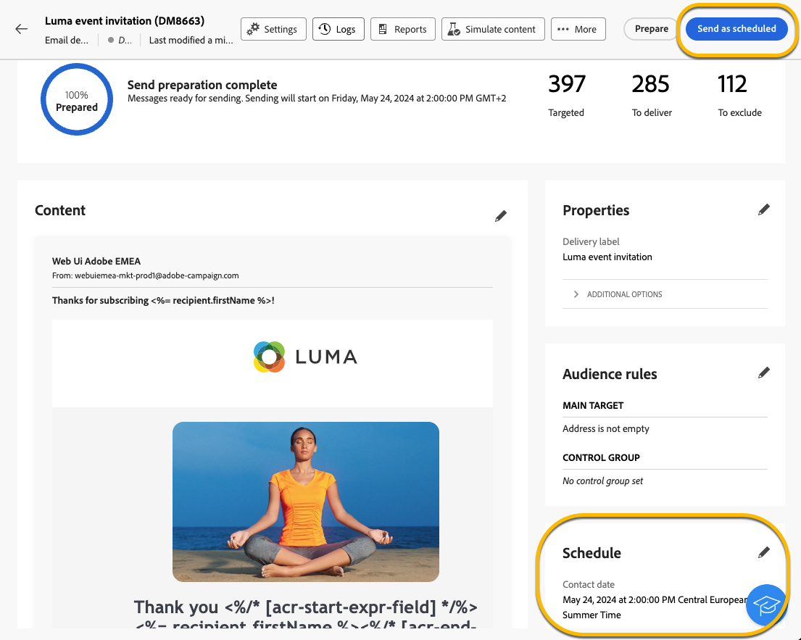

# Plaats de verzending van een levering {#schedule-sending}

U kunt de verzending van een levering plannen. De stappen voor dit zullen afhangen van of het een standalone (one-shot) levering is, of als u in de context van een campagnewerkschema werkt.

## Zelfstandige levering

Voor standalone leveringen, kunt u de datum en de tijd in de levering direct plannen.
Zie de volgende voorbeelden voor elk type levering: e-mail, sms, pushmelding.

### Email {#schedule-email-standalone}

Volg onderstaande stappen om de verzending van een e-mailbericht te plannen:

1. In de **[!UICONTROL Schedule]** van uw leveringseigenschappen, activeer **[!UICONTROL Enable scheduling]** schakelen

1. Stel de gewenste datum en tijd in voor verzending en klik op **[!UICONTROL Review and send]** knop.

   {zoomable="yes"}

>[!NOTE]
>
>Standaard worden de **[!UICONTROL Enable confirmation before sending]** is ingeschakeld. Voor deze optie moet u de verzending bevestigen voordat de levering op de geplande datum en tijd wordt verzonden. Als u **de levering automatisch verzenden** op de geplande datum en tijd, moet u deze optie onbruikbaar maken.
>

1. Controleer of het schema correct is en klik op **[!UICONTROL Prepare]** knop.

{zoomable="yes"}

1. Zodra de voorbereiding is voltooid, zijn de berichten klaar om te worden verzonden. De belangrijkste metriek voor de levering wordt getoond: totale doelbevolking, aantal te leveren berichten, aantal uitgesloten ontvangers. Klik op de knop **[!UICONTROL Send as scheduled]** om te bevestigen dat u de levering op de geplande datum en tijd naar het hoofddoel kunt verzenden.

{zoomable="yes"}

### Sms

Als u de levering van SMS naar een bepaalde datum en tijd wilt plannen, zijn de stappen hetzelfde als voor e-mailleveringen. [zie hierboven](#schedule-email-standalone).

{zoomable="yes"}

U kunt ook controleren of het schema in acht wordt genomen:

{zoomable="yes"}

### Pushmelding

Als u een zelfstandige pushlevering wilt plannen op een bepaalde datum en tijd, zijn de stappen hetzelfde als voor e-mailleveringen. [zie hierboven](#schedule-email-standalone).

{zoomable="yes"}

U kunt ook controleren of het schema in acht wordt genomen:

{zoomable="yes"}

### Zelfstandige levering in een campagne

U kunt een zelfstandige levering binnen een campagne tot stand brengen zonder een werkschema te gebruiken. U kunt datum en tijdschema voor deze levering instellen zoals hierboven beschreven.
De campagne kan zijn programma, met een begindatum en een einddatum hebben. Dit schema interfereert niet met uw leveringsschema.

{zoomable="yes"}

## Een levering plannen in een campagneworkflow

In de context van een campagneworkflow **beste praktijken** is om de **[!UICONTROL Scheduler]** activiteit om een datum en tijd toe te passen die de werkstroom zullen lanceren, met inbegrip van het verzenden van de levering. [Meer informatie over Scheduler](../workflows/activities/scheduler.md)

{zoomable="yes"}

U moet de datum en de tijd in **[!UICONTROL Scheduler]** activiteit.

{zoomable="yes"}

>[!NOTE]
>
>Wanneer u de opdracht **[!UICONTROL Scheduler]** activiteiten om de verzending van uw levering in een werkstroom te plannen; **niet activeren** de **[!UICONTROL Enable scheduling]** schakelen in de **[!UICONTROL Delivery]** activiteitinstellingen. De levering wordt automatisch verzonden.
>

Als u het dialoogvenster **[!UICONTROL Enable scheduling]** schakelen in de **[!UICONTROL Delivery]** activiteit montages, en opstelling daar een datum en een tijd, zal de levering wachten om op deze datum en tijd worden verzonden. Dit betekent dat als er een vertraging is tussen de startdatum van de workflow en de verzenddatum, het publiek mogelijk niet up-to-date is.

