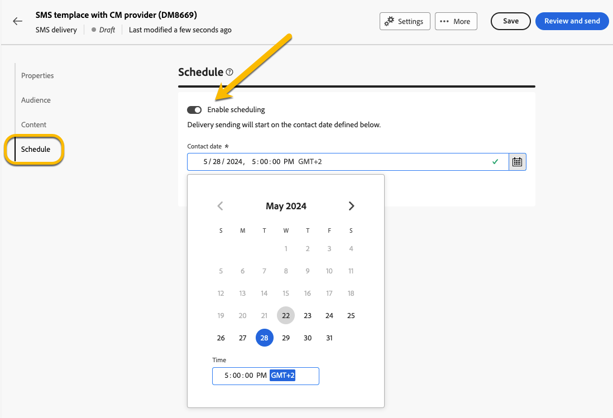

# Plaats de verzending van een levering {#schedule-sending}

U kunt de verzending van een levering plannen. De stappen voor dit zullen afhangen van of het een standalone (one-shot) levering is, of als u in de context van een campagnewerkschema werkt.

## Zelfstandige levering

Voor standalone leveringen, kunt u de datum en de tijd in de levering direct plannen.
Zie de volgende voorbeelden voor elk type levering: e-mail, sms, pushmelding.

### Email {#schedule-email-standalone}

Volg onderstaande stappen om de verzending van een e-mailbericht te plannen:

1. Activeer in de sectie **[!UICONTROL Schedule]** van de leveringseigenschappen de schakeloptie **[!UICONTROL Enable scheduling]**

1. Stel de gewenste datum en tijd in voor het verzenden en klik op de knop **[!UICONTROL Review and send]** .

   {zoomable="yes"}

>[!NOTE]
>
>Standaard is de optie **[!UICONTROL Enable confirmation before sending]** ingeschakeld. Voor deze optie moet u de verzending bevestigen voordat de levering op de geplande datum en tijd wordt verzonden. Als u de levering **op de geplande datum en tijd automatisch moet verzenden**, moet u deze optie onbruikbaar maken.
>

1. Controleer of het schema juist is en klik op de knop **[!UICONTROL Prepare]** .

{zoomable="yes"}

1. Zodra de voorbereiding is voltooid, zijn de berichten klaar om te worden verzonden. De belangrijkste metriek voor de levering wordt getoond: totale doelbevolking, aantal te leveren berichten, aantal uitgesloten ontvangers. Klik op de knop **[!UICONTROL Send as scheduled]** om te bevestigen dat de levering op de geplande datum en tijd naar het hoofddoel moet worden verzonden.

{zoomable="yes"}

### Sms

Om uw sms levering aan een specifieke datum en tijd te plannen, zijn de stappen het zelfde als voor e-mailleveringen, [ zie hierboven ](#schedule-email-standalone).

{zoomable="yes"}

U kunt ook controleren of het schema in acht wordt genomen:

{zoomable="yes"}

### Pushmelding

Om een standalone duw levering aan een specifieke datum en tijd te plannen, zijn de stappen het zelfde als voor e-mailleveringen, [ zie hierboven ](#schedule-email-standalone).

{zoomable="yes"}

U kunt ook controleren of het schema in acht wordt genomen:

{zoomable="yes"}

### Zelfstandige levering in een campagne

U kunt een zelfstandige levering binnen een campagne tot stand brengen zonder een werkschema te gebruiken. U kunt datum en tijdschema voor deze levering instellen zoals hierboven beschreven.
De campagne kan zijn programma, met een begindatum en een einddatum hebben. Dit schema interfereert niet met uw leveringsschema.

{zoomable="yes"}

## Een levering plannen in een campagneworkflow

In de context van een campagnewerkschema, **beste praktijken** moet de **[!UICONTROL Scheduler]** activiteit gebruiken om een datum en een tijd toe te passen die van het werkschema zullen lanceren, die het verzenden van de levering impliceren. [ leer meer over Planner ](../workflows/activities/scheduler.md)

{zoomable="yes"}

U moet de datum en tijd configureren in de **[!UICONTROL Scheduler]** -activiteit.

{zoomable="yes"}

>[!NOTE]
>
>Wanneer u de **[!UICONTROL Scheduler]** activiteit gebruikt om het verzenden van uw levering in een werkschema te plannen, **activeer** niet de **[!UICONTROL Enable scheduling]** knevel in de **[!UICONTROL Delivery]** activiteitenmontages. De levering wordt automatisch verzonden.
>

Als u de schakeloptie **[!UICONTROL Enable scheduling]** activeert in de instellingen voor **[!UICONTROL Delivery]** activity, en daar een datum en tijd instelt, wacht de levering tot deze datum en tijd zijn verzonden. Dit betekent dat als er een vertraging is tussen de startdatum van de workflow en de verzenddatum, het publiek mogelijk niet up-to-date is.
