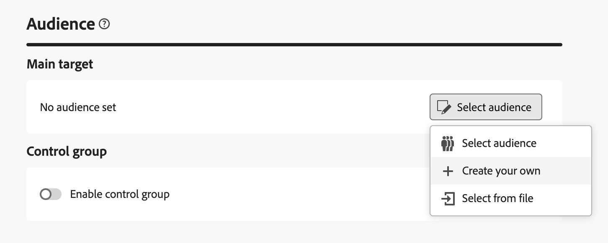

# Een levering maken {#create-delivery}

U kunt zelfstandige leveringen maken in het linkermenu van **[!UICONTROL Deliveries]** of leveringen maken in de context van een workflow, die al dan niet in een campagne wordt opgenomen.

Blader op de onderstaande tabbladen voor meer informatie over het maken van een levering:

>[!BEGINTABS]

>[!TAB  creeer een standalone levering ]

Voer de volgende stappen uit om een zelfstandige levering te maken:

1. Blader naar het menu **[!UICONTROL Deliveries]** links in de navigatie en klik op de knop **[!UICONTROL Create delivery]** .

   {zoomable="yes"}

1. Kies een kanaal voor de levering.
1. Bepaal het leveringspubliek, voor het belangrijkste doel en de controlegroep. [ leer meer over publiek ](../audience/about-recipients.md).

   {zoomable="yes"}{width="70%" align="left"}

1. Bepaal de berichtinhoud. Meer informatie over leveringskanalen en hoe u in deze secties leveringsinhoud kunt definiëren:

   * [Email channel](../email/create-email.md)
   * [Push-meldingskanaal](../push/gs-push.md)
   * [SMS-kanaal](../sms/create-sms.md)

1. (facultatief) bepaal de levering [ programma ](#gs-schedule). Als er geen schema is gedefinieerd, worden berichten direct verzonden nadat op de knop **[!UICONTROL Send]** is geklikt.
1. Klik op de knop **[!UICONTROL Review and send]** om uw instellingen te controleren.
1. Gebruik de knop **[!UICONTROL Simulate content]** om de weergave en de instellingen voor personalisatie te testen. Leer meer over berichtsimulatie in [ deze sectie ](../preview-test/preview-test.md).
1. Klik op de knop **[!UICONTROL Prepare]** om de doelpopulatie te berekenen en de berichten te genereren. De voorbereidingsstap kan een paar minuten duren. Wanneer de voorbereiding volledig is, zijn de berichten klaar om te verzenden. In het geval van een fout, doorblader aan de **Logboeken** om alarm en waarschuwing te controleren.
1. Controleer de resultaten en klik op de knop **[!UICONTROL Send]** om de berichten te verzenden.
1. Zodra de berichten worden verzonden, doorblader aan de **sectie van Rapporten** om tot zeer belangrijke metriek toegang te hebben. Leer meer over leveringsrapporten in [ deze sectie ](../reporting/delivery-reports.md).

>[!TAB  creeer een levering in een werkschema ]

Ga als volgt te werk om een levering in een workflow te maken:

1. Maak een workflow of open een bestaande workflow. [ leer meer over werkschema&#39;s ](../workflows/gs-workflow-creation.md#gs-workflow-steps)
1. Een [**[!UICONTROL Build audience]**](../workflows/activities/build-audience.md) -activiteit toevoegen en configureren.
1. Klik op het pictogram `+` en selecteer een leveringsactiviteit: **[!UICONTROL Email]** , **[!UICONTROL SMS]** , **[!UICONTROL Push notification (Android)]** of **[!UICONTROL Push notification (iOS)]** . Leer meer over de activiteiten van het leveringskanaal in een werkschema, en hoe te om een leveringsinhoud in [ te bepalen deze sectie ](../workflows/activities/channels.md).

   {zoomable="yes"}

1. Start de workflow en controleer logbestanden.

U kunt ook leveringen in een campagne toevoegen zonder een workflow te maken. Blader hiertoe naar het tabblad **[!UICONTROL Deliveries]** van uw campagne en klik op de knop **[!UICONTROL Create delivery]** .

{zoomable="yes"}

De stappen van de configuratie zijn gelijkaardig zoals voor standalone leveringen.

Voor meer informatie over hoe te om een campagne te vormen en leveringen te beheren die tot een campagne behoren, verwijs naar [ deze sectie ](../campaigns/gs-campaigns.md).

>[!ENDTABS]

## Aanpassing toevoegen {#personalization}

Berichten van Adobe Campaign kunnen op verschillende manieren worden gepersonaliseerd. [ leer meer over verpersoonlijkingsmogelijkheden ](../personalization/gs-personalization.md).

Met Campagne kunt u dynamische inhoud maken en persoonlijke berichten verzenden. Personalization-mogelijkheden kunnen worden gecombineerd om uw berichten te verbeteren en een aangepaste gebruikerservaring te creëren.

U kunt de inhoud van het bericht aanpassen door:

* Het opnemen van dynamische **verpersoonlijkingsgebieden**

  De gebieden van de verpersoonlijking worden gebruikt voor verpersoonlijking op het eerste niveau van uw berichten. U kunt om het even welk gebied selecteren beschikbaar in het gegevensbestand van de verpersoonlijkingsredacteur. Voor een levering kunt u elk veld selecteren dat betrekking heeft op de ontvanger, het bericht of de levering. Deze verpersoonlijkingsattributen kunnen in de onderwerpregel of het lichaam van uw berichten worden opgenomen. [Meer informatie](../personalization/personalize.md)

* Het opnemen van vooraf bepaalde **uitdrukkingsfragmenten**

  Campagne wordt geleverd met een set expressiefragmenten die een specifieke rendering bevatten die u in uw leveringen kunt invoegen. U kunt bijvoorbeeld een logo, een wensbericht of een koppeling naar de spiegelpagina van het bericht toevoegen. expressiefragmenten zijn beschikbaar in een speciaal daarvoor bestemde vermelding in de personalisatie-editor. Daarnaast kunt u ook uw eigen expressiefragmenten maken die aan uw wensen voldoen. [ Leer hoe te om uitdrukkingsfragmenten ](../content/use-expression-fragments.md) te gebruiken

* Creeer **voorwaardelijke inhoud**

  Vorm voorwaardelijke inhoud om dynamische verpersoonlijking toe te voegen die op het profiel van de ontvanger bijvoorbeeld wordt gebaseerd. Tekstblokken en/of afbeeldingen worden ingevoegd wanneer een bepaalde voorwaarde waar is. [Meer informatie](../personalization/conditions.md)

* Voeg **gepersonaliseerde aanbiedingen** toe

  Voeg persoonlijke aanbiedingen in uw berichtinhoud in, afhankelijk van de locatie van de ontvanger, het huidige weer of de laatste kooporder. [Meer informatie](../msg/offers.md)

## Geef een voorvertoning van uw leveringen weer en test deze

Nadat de inhoud van uw bericht is gedefinieerd, kunt u deze voorvertonen om de weergave van uw berichten te bepalen en de instellingen voor de personalisatie te controleren met testprofielen. [Meer informatie](../preview-test/preview-test.md)

## De verzending van de levering plannen {#gs-schedule}

>[!CONTEXTUALHELP]
>id="acw_deliveries_email_schedule"
>title="Een contactdatum en -tijd instellen"
>abstract="Bepaal de datum en de exacte tijd voor het verzenden van de levering. Door de meest geschikte tijd voor uw marketingbericht te kiezen, kunt u de open tarieven maximaliseren."

U kunt de datum en het exacte tijdstip voor het verzenden van uw berichten instellen. Door de meest geschikte tijd voor uw marketingbericht te kiezen, kunt u de open tarieven maximaliseren.

Als u de verzending van de levering wilt plannen, opent u de levering en bladert u naar de sectie **[!UICONTROL Schedule]** . Gebruik de schakeloptie **[!UICONTROL Enable scheduling]** om deze te activeren en stel de gewenste datum en tijd voor verzending in. Nadat u de levering hebt verzonden, begint de daadwerkelijke verzending op de door u gedefinieerde contactdatum.

{zoomable="yes"}

Standaard is de optie **[!UICONTROL Enable confirmation before sending]** ingeschakeld. Voor deze optie moet u de verzending bevestigen voordat de levering op de geplande datum en tijd wordt verzonden. Als u de levering automatisch op de geplande datum en tijd moet verzenden, kunt u deze optie onbruikbaar maken.

Leer stappen om een geplande levering in [ deze sectie ](../monitor/prepare-send.md#schedule-the-send) te verzenden.

## Logbestanden bijhouden en bijhouden {#gs-tracking-logs}

Het controleren van uw leveringen nadat deze zijn verzonden, is een belangrijke stap om ervoor te zorgen dat uw marketingcampagnes efficiënt zijn en uw klanten bereiken.

U kunt controleren na het verzenden van een levering, evenals begrijpen hoe de leveringsmislukkingen en quarantines worden beheerd.

Leer meer over controle en het volgen mogelijkheden in [ deze sectie ](../reporting/gs-reports.md).
