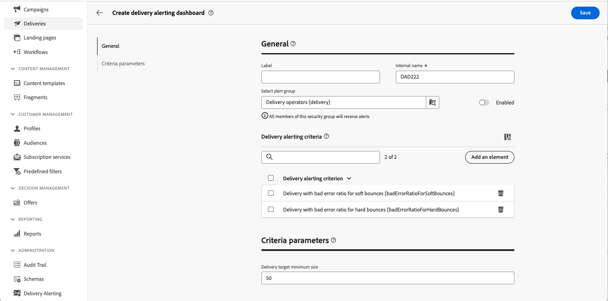
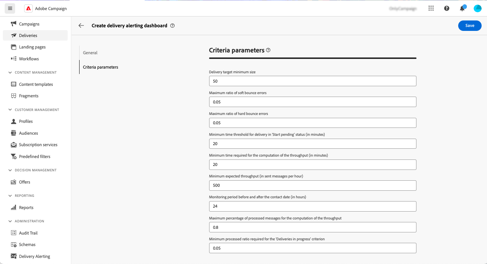

# Waarschuwingsdashboards {#delivery-alerting-dashboards}

>[!CONTEXTUALHELP]
>id="acw_delivery_alerting_dashboards"
>title="Waarschuwingsdashboards"
>abstract="De Alerting van de levering is een waakzaam beheersysteem dat groepen gebruikers toelaat om e-mailberichten met informatie over hun levering automatisch te ontvangen uitvoeren. Met de Dashboards voor leveringswaarschuwingen kunt u opgeven wie e-mailwaarschuwingen ontvangt, de waarschuwingscriteria voor het verzenden van deze waarschuwingen kiezen en configureren en de geschiedenis van alle verzonden berichten openen."

Met de Dashboards voor leveringswaarschuwingen kunt u opgeven wie e-mailwaarschuwingen ontvangt, de waarschuwingscriteria voor het verzenden van deze waarschuwingen kiezen en configureren en de geschiedenis van alle verzonden berichten openen. Zij zijn toegankelijk van het **Waarschuwende van de Levering** menu in de linkernavigatieruit, onder de **dashboards** tabel.

## Een leveringsdashboard maken {#dashboards}

>[!CONTEXTUALHELP]
>id="acw_delery_alerting_dashboard_create"
>title="Waarschuwingsdashboard voor levering maken"
>abstract="Als u een waarschuwingsdashboard voor de levering maakt, kunt u opgeven wie e-mailwaarschuwingen ontvangt, de waarschuwingscriteria kiezen en configureren die moeten worden gebruikt om deze waarschuwingen te verzenden, en de geschiedenis van alle verzonden berichten openen."

>[!CONTEXTUALHELP]
>id="acw_delivery_alerting_create_general"
>title="Algemene parameters voor leveringswaarschuwingen"
>abstract="Geef de algemene eigenschappen van het dashboard voor de aanlevering op. Het **Uitgezochte waakzame groep** gebied staat u toe om de **exploitantgroep** te specificeren om het alarm te ontvangen dat door dit dashboard wordt verzonden."

>[!CONTEXTUALHELP]
>id="acw_delivery_alerting_create_criteria_add"
>title="Beoordelingscriteria voor aflevering"
>abstract="Voeg in deze sectie criteria toe die u wilt gebruiken voor het verzenden van waarschuwingen van dit dashboard. Kies uit vooraf gedefinieerde criteria of maak uw eigen criteria om deze aan te passen aan specifieke behoeften."

>[!CONTEXTUALHELP]
>id="acw_delivery_alerting_create_criteria_parameters"
>title="Criteria"
>abstract="De criteria hebben standaardparameterwaarden die bepalen hoe zij moeten worden toegepast. In deze sectie kunt u deze waarden naar wens wijzigen."

Ga als volgt te werk om een bezorgdashboard te maken:

1. Navigeer aan het **Waarschuwende van de Levering** menu in de linkernavigatieruit, en klik **creeer leveringsdashboard**.

   

1. Noem uw dashboard op het **gebied van het Etiket**. Het **Interne naamgebied** is automatisch bevolkt en read-only.

1. Op het **Uitgezochte waakzame groep** gebied, specificeer de **exploitantgroep** om het alarm te ontvangen dat door dit dashboard wordt verzonden. Alle leden van de geselecteerde operatorgroep ontvangen de waarschuwingen.

   Leer meer over toestemmingen en exploitantgroepen in [ Adobe Campaign v8 (console) documentatie ](https://experienceleague.adobe.com/nl/docs/campaign/campaign-v8/admin/permissions/gs-permissions){target="_blank"} 

1. In de **sectie van de de alarmerende criteria van de Levering**, voeg criteria toe die u wilt gebruiken om alarm te verzenden. Kies uit vooraf gedefinieerde criteria of maak uw eigen criteria om deze aan te passen aan specifieke behoeften. [ Leer hoe te met criteria ](../msg/delivery-alerting-criteria.md) te werken

1. Criteria hebben standaardparameterwaarden die definiëren hoe deze moeten worden toegepast. U kunt deze waarden veranderen om uw behoeften van de **sectie van de Parameters van Criteria** aan te passen.

   

   Bijvoorbeeld, door gebrek, wordt de **parameter van het 0&rbrace; doel van de Levering minimumgrootte &lbrace;aan 50 geplaatst, betekenend dat een levering in het alarm zal worden inbegrepen dat door dit dashboard wordt verzonden slechts als het minstens 50 profielen richt.** U kunt deze parameter wijzigen als u leveringen wilt opnemen die betrekking hebben op minder dan 50 profielen.

   Vouw de onderstaande sectie uit voor meer informatie over elke parameter criteria:

   +++Beschikbare parameters

   * **het doel minimumgrootte van de Levering**: Bijvoorbeeld, als u 100 op dit gebied ingaat, wordt een bericht verzonden slechts voor leveringen met een doel gelijk aan of groter dan 100 ontvangers. Deze parameter geldt voor alle criteria.
   * **controleperiode vóór en na de contactdatum (in uren)**: Aantal uren vóór en na de huidige tijd. Alleen de leveringen met een contactdatum in dit tijdsbereik worden in aanmerking genomen. Deze parameter geldt voor alle criteria. De standaardwaarde voor dit veld is 24 uur.
   * **Maximale verhouding van zachte stuitfouten**: Een bericht wordt verzonden voor alle leveringen met een zachte stuiteringsfoutenverhouding groter dan de gespecificeerde waarde. De standaardwaarde voor dit veld is 0,05 (5%).
   * **Maximale verhouding van harde stuitfouten**: Een bericht wordt verzonden voor alle leveringen met een harde stuiteringsfoutenverhouding groter dan de gespecificeerde waarde. De standaardwaarde voor dit veld is 0,05 (5%).
   * **Minimale tijddrempel voor levering in &quot;Begin hangende&quot;status (in notulen)**: Een bericht wordt verzonden voor alle leveringen met een Begin hangende status voor langer dan de duur die op dit gebied wordt gespecificeerd, Begin in afwachting van status betekenend dat de berichten nog niet door het systeem in aanmerking zijn genomen.
   * **Minimale tijd die voor de berekening van de productie (in notulen) wordt vereist**: Slechts begonnen leveringen (met Bezig status) voor meer dan de gespecificeerde duur worden in aanmerking genomen voor de Leveringen met laag productiecriterium.
   * **Maximumpercentage van verwerkte berichten voor de berekening van de productie**: Slechts worden de leveringen met een percentage verwerkte berichten lager dan het gespecificeerde percentage in aanmerking genomen voor de Leveringen met laag productiecriterium.
   * **Minimum verwachte productie (in verzonden berichten per uur)**: Slechts worden de leveringen met een productie lager dan de gespecificeerde waarde in aanmerking genomen voor de Leveringen met laag productiecriterium.
   * **Minimale verwerkte verhouding die voor &quot;Bezig lopende Leveringen&quot;criterium** wordt vereist: Slechts worden de leveringen met een percentage verwerkte berichten hoger dan het gespecificeerde percentage in aanmerking genomen.

   +++

1. Standaard zijn waarschuwingsdashboards uitgeschakeld. Dit houdt in dat e-mailwaarschuwingen die aan dit dashboard zijn gekoppeld, niet worden verzonden. Om het dashboard toe te laten onmiddellijk, knevel **Toegelaten** optie in de **Algemene** sectie, naast het gebied van de waakzame groepsselectie.

   U kunt het dashboard ook opslaan en later inschakelen.

   

1. Om het alarmerende dashboard te bewaren, klik **sparen** knoop.

Het waarschuwingsdashboard wordt geopend met lege gegevens. Wanneer u bereid bent om het te activeren en berichten te verzenden, klik de **knoop van Montages** en knevel **Toegelaten** optie als u dit niet eerder hebt gedaan.

Telkens wanneer een levering voldoet aan de criteria die in dit dashboard zijn gedefinieerd, wordt een waarschuwingsbericht verzonden naar de opgegeven operatorgroep.

## Waarschuwingsdashboards beheren

>[!CONTEXTUALHELP]
>id="acw_delivery_alerting_dashboard_alerts"
>title="Verzonden leveringswaarschuwingen"
>abstract="In deze sectie kunt u informatie met betrekking tot de meest recente verzonden waarschuwingen visualiseren."

>[!CONTEXTUALHELP]
>id="acw_delivery_alerting_dashboard_history"
>title="Geschiedenis van leveringswaarschuwingen"
>abstract="De **ruit van de Geschiedenis** bevat alle alarm dat van dit dashboard wordt verzonden. Klik op een item om de bijbehorende waarschuwingen te openen die op dat moment worden verzonden."

Alle gecreeerde alarmerende dashboards zijn toegankelijk van het **Alarm van de Levering** menu, in het **&#x200B;**&#x200B;lusje van Dashboards.

U kunt een dashboard dupliceren of schrappen gebruikend **Meer acties** knoop die naast zijn naam wordt gevestigd.

Als u een gedetailleerde weergave van een dashboard wilt openen, klikt u in de lijst op de naam van het dashboard. Vanuit dit scherm kunt u de meest recente verzonden waarschuwing visualiseren. Alle verzonden waarschuwingen worden vermeld in het linkerdeelvenster. Klik op een item om de bijbehorende waarschuwingen te openen die op dat moment worden verzonden.

Om het dashboard uit te geven, klik de **knoop van Montages** in de hoger-juiste hoek en breng de gewenste veranderingen aan.