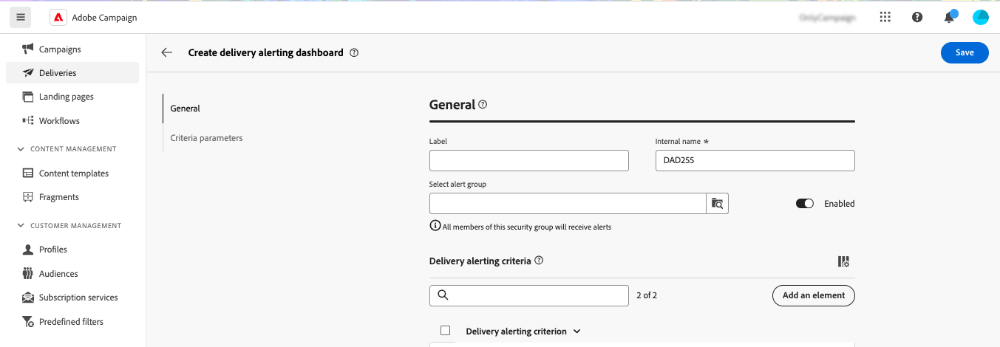

# Waarschuwingsdashboards {#delivery-alerting-dashboards}

>[!CONTEXTUALHELP]
>id="acw_delivery_alerting_dashboards"
>title="Waarschuwingsdashboards"
>abstract="De Alerting van de levering is een waakzaam beheersysteem dat groepen gebruikers toelaat om e-mailberichten met informatie over hun levering automatisch te ontvangen uitvoeren. Met de Dashboards voor leveringswaarschuwingen kunt u opgeven wie e-mailwaarschuwingen ontvangt, de waarschuwingscriteria voor het verzenden van deze waarschuwingen kiezen en configureren en de geschiedenis van alle verzonden berichten openen."

Met de Dashboards voor leveringswaarschuwingen kunt u opgeven wie e-mailwaarschuwingen ontvangt, de waarschuwingscriteria voor het verzenden van deze waarschuwingen kiezen en configureren en de geschiedenis van alle verzonden berichten openen. Ze zijn toegankelijk vanuit de **Leveringswaarschuwing** menu in het linkernavigatievenster, onder **Dashboards** tab.

## Een leveringsdashboard maken {#dashboards}

>[!CONTEXTUALHELP]
>id="acw_delery_alerting_dashboard_create"
>title="Waarschuwingsdashboard voor levering maken"
>abstract="Als u een waarschuwingsdashboard voor de levering maakt, kunt u opgeven wie e-mailwaarschuwingen ontvangt, de waarschuwingscriteria kiezen en configureren die moeten worden gebruikt om deze waarschuwingen te verzenden, en de geschiedenis van alle verzonden berichten openen."

>[!CONTEXTUALHELP]
>id="acw_delivery_alerting_create_general"
>title="Algemene parameters voor leveringswaarschuwingen"
>abstract="Geef de algemene eigenschappen van het dashboard voor de aanlevering op. De **Waarschuwingsgroep selecteren** kunt u het veld **groep met operatoren** om de waarschuwingen te ontvangen die door dit dashboard worden verzonden."

>[!CONTEXTUALHELP]
>id="acw_delivery_alerting_create_criteria_add"
>title="Beoordelingscriteria voor aflevering"
>abstract="Voeg in deze sectie criteria toe die u wilt gebruiken voor het verzenden van waarschuwingen van dit dashboard. Kies uit vooraf gedefinieerde criteria of maak uw eigen criteria om deze aan te passen aan specifieke behoeften."

>[!CONTEXTUALHELP]
>id="acw_delivery_alerting_create_criteria_parameters"
>title="Criteria"
>abstract="De criteria hebben standaardparameterwaarden die bepalen hoe zij moeten worden toegepast. In deze sectie kunt u deze waarden naar wens wijzigen."

Ga als volgt te werk om een bezorgdashboard te maken:

1. Ga naar de **Leveringswaarschuwing** in het linkernavigatievenster en klik op **Leveringsdashboard maken**.

   

1. Geef het dashboard een naam in het dialoogvenster **Label** veld. De **Interne naam** wordt automatisch ingevuld en heeft het kenmerk Alleen-lezen.

1. In de **Waarschuwingsgroep selecteren** veld, geeft u de **groep met operatoren** om de waarschuwingen te ontvangen die door dit dashboard worden verzonden. Alle leden van de geselecteerde operatorgroep ontvangen de waarschuwingen.

   Meer informatie over machtigingen en groepen operatoren in het dialoogvenster [Adobe Campaign v8 (console)-documentatie](https://experienceleague.adobe.com/en/docs/campaign/campaign-v8/admin/permissions/gs-permissions){target="_blank"}

1. In de **Beoordelingscriteria voor aflevering** toevoegen aan criteria die u wilt gebruiken voor het verzenden van waarschuwingen. Kies uit vooraf gedefinieerde criteria of maak uw eigen criteria om deze aan te passen aan specifieke behoeften. [Leer hoe u met criteria werkt](../msg/delivery-alerting-criteria.md)

1. De criteria hebben standaardparameterwaarden die bepalen hoe zij moeten worden toegepast. U kunt deze waarden naar wens wijzigen via het menu **Criteria** sectie.

   

   Standaard worden bijvoorbeeld de **Minimumgrootte van leveringsdoel** parameter criteria is ingesteld op 50 , wat betekent dat een levering alleen in de door dit dashboard verzonden waarschuwing zal worden opgenomen als deze betrekking heeft op ten minste 50 profielen . U kunt deze parameter wijzigen als u leveringen wilt opnemen die betrekking hebben op minder dan 50 profielen.

   Vouw de onderstaande sectie uit voor meer informatie over elke parameter criteria:

   +++Beschikbare parameters

   * **Minimumgrootte van leveringsdoel**: Als u bijvoorbeeld 100 invoert in dit veld, wordt alleen een melding verzonden voor leveringen met een doel dat gelijk is aan of groter is dan 100 ontvangers. Deze parameter geldt voor alle criteria.
   * **Monitoringperiode vóór en na de contactdatum (in uren)**: Aantal uren voor en na de huidige tijd. Alleen de leveringen met een contactdatum in dit tijdsbereik worden in aanmerking genomen. Deze parameter geldt voor alle criteria. De standaardwaarde voor dit veld is 24 uur.
   * **Maximale verhouding van zachte stuiterfouten**: Er wordt een melding verzonden voor alle leveringen met een soft bounce error ratio groter dan de opgegeven waarde. De standaardwaarde voor dit veld is 0,05 (5%).
   * **Maximale verhouding van harde stuitfouten**: Er wordt een melding verzonden voor alle leveringen met een harde stuiterfout-verhouding die groter is dan de opgegeven waarde. De standaardwaarde voor dit veld is 0,05 (5%).
   * **Minimumtijdsdrempel voor levering in de status &quot;Begin in behandeling&quot; (in minuten)**: Er wordt een melding verzonden voor alle leveringen met een status In afwachting van starten voor een langere periode dan in dit veld is opgegeven. Begin in afwachting van status, wat betekent dat het systeem nog geen rekening heeft gehouden met de berichten.
   * **Minimumtijd die vereist is voor de berekening van de doorvoer (in minuten)**: Alleen leveringen die zijn gestart (met de status In uitvoering) voor meer dan de opgegeven duur worden in aanmerking genomen voor de leveringen met het criterium lage doorvoer.
   * **Maximumpercentage verwerkte berichten voor de berekening van de productie**: Alleen leveringen met een percentage verwerkte berichten dat lager is dan het opgegeven percentage worden in aanmerking genomen voor leveringen met een laag doorvoercriterium.
   * **Minimale verwachte doorvoer (in verzonden berichten per uur)**: Alleen leveringen met een lagere doorvoer dan de opgegeven waarde worden in aanmerking genomen voor leveringen met een laag doorvoercriterium.
   * **Minimale verwerkingsratio vereist voor &quot;Lopende leveringen&quot;-criterium**: Alleen leveringen met een percentage verwerkte berichten dat hoger is dan het opgegeven percentage, worden in aanmerking genomen.

+++

1. Standaard zijn waarschuwingsdashboards uitgeschakeld. Dit houdt in dat e-mailwaarschuwingen die aan dit dashboard zijn gekoppeld, niet worden verzonden. Als u het dashboard direct wilt inschakelen, schakelt u het **Ingeschakeld** in de **Algemeen** naast het selectieveld van de waarschuwingsgroep.

   U kunt het dashboard ook opslaan en later inschakelen.

   

1. Als u het waarschuwingsdashboard wilt opslaan, klikt u op de knop **Opslaan** knop.

Het waarschuwingsdashboard wordt geopend met lege gegevens. Als u klaar bent om het te activeren en meldingen te verzenden, klikt u op de knop **Instellingen** en schakelt u de **Ingeschakeld** als u dat nog niet hebt gedaan.

Telkens wanneer een levering voldoet aan de criteria die in dit dashboard zijn gedefinieerd, wordt een waarschuwingsbericht verzonden naar de opgegeven operatorgroep.

## Waarschuwingsdashboards beheren

>[!CONTEXTUALHELP]
>id="acw_delivery_alerting_dashboard_alerts"
>title="Verzonden leveringswaarschuwingen"
>abstract="In deze sectie kunt u informatie met betrekking tot de meest recente verzonden waarschuwingen visualiseren."

>[!CONTEXTUALHELP]
>id="acw_delivery_alerting_dashboard_history"
>title="Geschiedenis van leveringswaarschuwingen"
>abstract="De **Historie** bevat alle waarschuwingen die van dit dashboard worden verzonden. Klik op een item om de bijbehorende waarschuwingen te openen die op dat moment worden verzonden."

Alle gemaakte waarschuwingsdashboards zijn toegankelijk vanuit de **Leveringswaarschuwing** in het menu **Dashboards** tab.

U kunt een dashboard dupliceren of verwijderen met het **Meer handelingen** naast de naam van de knop.

Als u een gedetailleerde weergave van een dashboard wilt openen, klikt u in de lijst op de naam van het dashboard. Vanuit dit scherm kunt u de meest recente verzonden waarschuwing visualiseren. Alle verzonden waarschuwingen worden vermeld in het linkerdeelvenster. Klik op een item om de bijbehorende waarschuwingen te openen die op dat moment worden verzonden.

Als u het dashboard wilt bewerken, klikt u op de knop **Instellingen** in de rechterbovenhoek en breng de gewenste wijzigingen aan.
