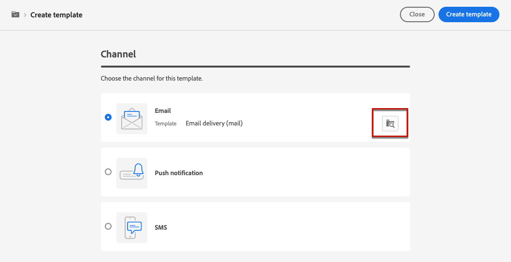
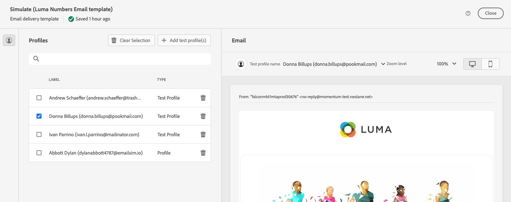

# Leveringssjablonen gebruiken {#work-with-delivery-templates}

>[!CONTEXTUALHELP]
>id="acw_delivery_template_for_campaign"
>title="Afleveringssjablonen"
>abstract="Om het ontwerpproces te versnellen en te verbeteren, creeer leveringsmalplaatjes om douaneinhoud en montages over uw campagnes opnieuw te gebruiken. Met deze functionaliteit wordt de creatieve vormgeving gestandaardiseerd, waardoor campagnes sneller kunnen worden uitgevoerd en gestart."

Om het ontwerpproces te versnellen en te verbeteren, creeer leveringsmalplaatjes om douaneinhoud en montages over uw campagnes opnieuw te gebruiken. Met deze functionaliteit wordt de creatieve vormgeving gestandaardiseerd, waardoor campagnes sneller kunnen worden uitgevoerd en gestart.

Een sjabloon bevat:

* De **omslag** en **uitvoeringsomslag** van het malplaatje. De map is de locatie waar de leveringssjabloon is opgeslagen. De uitvoeringsmap is de map waarin leveringen worden opgeslagen die op basis van deze sjabloon zijn gemaakt.
* [&#x200B; Typologies &#x200B;](../advanced-settings/delivery-settings.md#typology),
* Het adres van de afzender,
* Een [&#x200B; publiek &#x200B;](../audience/about-recipients.md), met inbegrip van [&#x200B; controlegroepen &#x200B;](../audience/control-group.md),
* Aangepaste [&#x200B; inhoud &#x200B;](../email/edit-content.md),
* [&#x200B; Gepersonaliseerde gebieden &#x200B;](../personalization/personalize.md) en [&#x200B; voorwaardelijke inhoud &#x200B;](../personalization/conditions.md),
* Verbindingen met [&#x200B; spiegelpagina &#x200B;](../email/mirror-page.md) en unsubscription [&#x200B; verbindingen &#x200B;](../email/message-tracking.md),
* Andere leveringseigenschappen, zoals middelgeldigheid, retry parameters, of quarantaine montages.

>[!NOTE]
>
>De malplaatjes van de levering verschillen van [&#x200B; inhoudsmalplaatjes &#x200B;](../content/create-email-templates.md), die u toestaan om slechts de inhoud van uw e-mail te hergebruiken en beginnen inhoud met één van de steekproef e-mailmalplaatjes te bouwen die uit-van-de-doos worden verstrekt.

## Leveringssjablonen openen en beheren {#access-manage-templates}

>[!CONTEXTUALHELP]
>id="acw_delivery_templates"
>title="Werken met leveringssjablonen"
>abstract="Gebruik leveringssjablonen om leveringsinstellingen te maken en op te slaan voor toekomstig gebruik in uw campagnes. Maak volledig nieuwe leveringssjablonen, dupliceer een bestaande sjabloon of converteer een levering naar een sjabloon."

Om tot de lijst van het inhoudsmalplaatje toegang te hebben, selecteer **[!UICONTROL Campaign Management]** > **[!UICONTROL Deliveries]** van het linkermenu, en doorblader aan de **Malplaatjes** tabel.

{zoomable="yes"}

Alle sjablonen die in de huidige omgeving zijn gemaakt, worden weergegeven.

U kunt inhoudssjablonen filteren op kanalen en mappen. U kunt geavanceerde filters ook instellen door een regel te maken met behulp van leveringskenmerken. [&#x200B; Leer meer over de vraagmodelaar &#x200B;](../audience/../query/query-modeler-overview.md)

{zoomable="yes"}

Als u een sjabloon wilt bewerken, klikt u op het gewenste item in de lijst. Hierna:

* Wijzig de inhoud, de eigenschappen, het publiek en alle aanbiedingen die eraan zijn gekoppeld.
* Test uw sjabloon. [Meer informatie](#test-template)

{zoomable="yes"}

Om [&#x200B; te schrappen of te dupliceren &#x200B;](#copy-an-existing-template) een malplaatje, selecteer de overeenkomstige actie van het **[!UICONTROL More actions]** menu, of van de **[!UICONTROL Templates]** lijst of van het scherm van de malplaatjeuitgave.

{zoomable="yes"}

>[!NOTE]
>
>Wanneer een sjabloon wordt bewerkt of verwijderd, hebben leveringen die met deze sjabloon zijn gemaakt, geen invloed op deze sjabloon.

## Een leveringssjabloon maken {#create-a-delivery-template}

Als u een leveringssjabloon wilt maken, kunt u:

* Dupliceer een bestaand malplaatje - [&#x200B; Leer meer &#x200B;](#copy-an-existing-template)
* Zet een bestaande levering in een malplaatje om - [&#x200B; leer meer &#x200B;](#convert-an-existing-delivery)
* Creeer een leveringsmalplaatje van kras - [&#x200B; Leer meer &#x200B;](#create-a-new-template)

### Een bestaande leveringssjabloon dupliceren {#copy-an-existing-template}

De campagne omvat ingebouwde malplaatjes voor elk kanaal: e-mail, duw, en SMS. De gemakkelijkste manier om een leveringsmalplaatje tot stand te brengen is een ingebouwde malplaatje te dupliceren en aan te passen.

>[!NOTE]
>
>U kunt ook elke aangepaste sjabloon dupliceren.

Voer de volgende stappen uit om een leveringssjabloon te dupliceren:

1. Blader naar het **lusje van Malplaatjes** van het **Levert** linkermenu. [Meer informatie](#access-manage-templates)
1. Klik op **[!UICONTROL More actions]** rechts van de gewenste sjabloonnaam en selecteer **[!UICONTROL Duplicate]** .

   U kunt ook een sjabloon in de lijst selecteren en deze optie kiezen in het scherm voor sjabloonedities.

1. Herhaal dit.

   {zoomable="yes"}

1. Het nieuwe sjabloondashboard wordt in het centrale scherm geopend. Bewerk de sjablooninstellingen naar wens.

   {zoomable="yes"}

1. Klik op de knop **[!UICONTROL Review]** om de sjabloon op te slaan en te bekijken. U kunt nog steeds alle instellingen bewerken, verwijderen en dupliceren.

   {zoomable="yes"}

1. Test indien nodig de rendering van de sjabloon. [Meer informatie](#test-template)

Het nieuwe malplaatje wordt toegevoegd aan de [**lijst van Malplaatjes** &#x200B;](#access-manage-templates). U kunt deze nu selecteren wanneer u een nieuwe levering maakt.

### Een levering converteren naar een sjabloon {#convert-an-existing-delivery}

Elke levering kan worden omgezet in een sjabloon voor toekomstige herhaalde leveringsacties.

Voer de volgende stappen uit om een levering als sjabloon op te slaan:

1. Blader naar het menu **[!UICONTROL Campaign management]** > **[!UICONTROL Deliveries]** .
1. Klik op het tabblad **[!UICONTROL Browse]** op de knop **[!UICONTROL More actions]** rechts van de gewenste leveringsnaam en selecteer **[!UICONTROL Copy as a template]** .

   {zoomable="yes"}

   U kunt ook een sjabloon in de lijst selecteren en deze optie kiezen in het scherm voor sjabloonedities.

1. Herhaal dit.

1. Het nieuwe sjabloondashboard wordt in het centrale scherm geopend. Bewerk de sjablooninstellingen naar wens.

1. Klik op de knop **[!UICONTROL Review]** om de sjabloon op te slaan en te bekijken. U kunt nog steeds alle instellingen bewerken, verwijderen en dupliceren.

1. Test indien nodig de rendering van de sjabloon. [Meer informatie](#test-template)

Het nieuwe malplaatje wordt toegevoegd aan de [**lijst van Malplaatjes** &#x200B;](#access-manage-templates). U kunt deze nu selecteren wanneer u een nieuwe levering maakt.

### Een nieuwe leveringssjabloon maken {#create-a-new-template}

>[!NOTE]
>
>Om configuratiefouten te vermijden, adviseert Adobe [&#x200B; het dupliceren van een ingebouwde malplaatje &#x200B;](#copy-an-existing-template) en het aanpassen van zijn eigenschappen eerder dan het creëren van een nieuw malplaatje.

Voer de volgende stappen uit om een volledig nieuwe leveringssjabloon te configureren:

1. Blader naar het **lusje van Malplaatjes** van het **Levert** linkermenu. [Meer informatie](#access-manage-templates)
1. Klik op de knop **[!UICONTROL Create template]**.

   {zoomable="yes"}

1. Selecteer het kanaal dat u voor uw sjabloon wilt gebruiken.
1. De ingebouwde leveringsmalplaatje voor dat kanaal wordt gebruikt door gebrek om u te helpen uw eigen malplaatje bouwen. Gebruik de toegewezen knop rechts van het geselecteerde kanaal om indien nodig een andere sjabloon te selecteren.

   {zoomable="yes"}

1. Klik nogmaals op de knop **[!UICONTROL Create template]** .

1. Bepaal de malplaatjeeigenschappen, [&#x200B; publiek &#x200B;](../audience/add-audience.md), en inhoud afhankelijk van het geselecteerde kanaal.

   >[!NOTE]
   >
   >Meer informatie over leveringskanalen en het ontwerpen van de inhoud in de volgende secties vindt u:
   >
   > * [E-mailkanaal](../email/create-email.md)
   > * [&#x200B; het berichtkanaal van de duw &#x200B;](../push/gs-push.md)
   > * [Sms-kanaal](../sms/create-sms.md)

1. Voor e-mailsjablonen kunt u bovendien geavanceerde instellingen, zoals typologische regels en doeltoewijzingen, gebruiken via de knop **[!UICONTROL Settings]** rechtsboven in het scherm. [Meer informatie](../advanced-settings/delivery-settings.md)

1. Klik op de knop **[!UICONTROL Review]** om de sjabloon op te slaan en te bekijken. U kunt nog steeds alle instellingen bewerken, verwijderen en dupliceren.

1. Test indien nodig de rendering van de sjabloon. [Meer informatie](#test-template)

Het nieuwe malplaatje wordt toegevoegd aan de [**lijst van Malplaatjes** &#x200B;](#access-manage-templates). U kunt deze nu selecteren wanneer u een nieuwe levering maakt.

## Een leveringssjabloon testen {#test-template}

U kunt de rendering van elke leveringssjabloon testen, ongeacht of deze van nul is gemaakt of van bestaande inhoud. Voer hiertoe de volgende stappen uit:

1. Blader naar het **lusje van Malplaatjes** door **[!UICONTROL Campaign management]** > **[!UICONTROL Deliveries]** menu en selecteer om het even welk malplaatje. [Meer informatie](#access-manage-templates)

1. Klik op de knop **[!UICONTROL Simulate content]** rechtsboven in het scherm.

   {zoomable="yes"}

1. Selecteer een of meer testprofielen om de weergave van uw e-mail te controleren. U kunt ook echte profielen selecteren in uw database. [&#x200B; leer meer over testprofielen &#x200B;](../audience/test-profiles.md)

1. Schakel tussen de verschillende profielen om een persoonlijke weergave van het bericht te krijgen op basis van het geselecteerde profiel. U kunt ook het zoomniveau aanpassen en de weergave voor bureaublad of mobiel kiezen.

[Meer informatie over het voorvertonen van inhoud](../preview-test/preview-content.md)

   {zoomable="yes"}

1. Sluit het venster om naar het scherm van de malplaatjeuitgave terug te keren.

>[!NOTE]
>
>U kunt geen rendering via e-mail gebruiken of proefdrukken verzenden in een leveringssjabloon.