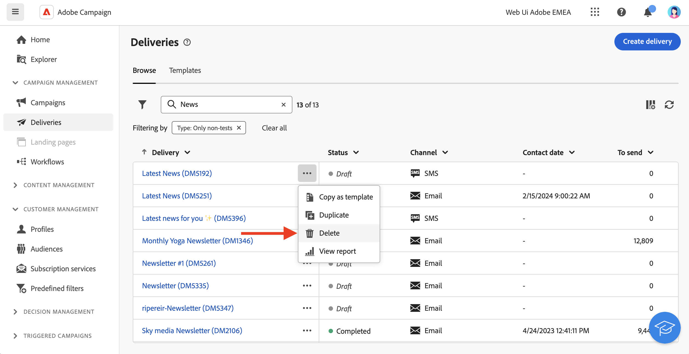

# Toegang tot leveringen {#work-with-deliveries}

>[!CONTEXTUALHELP]
>id="acw_deliveries_list"
>title="Leveringen"
>abstract="Een levering is een communicatie die naar een publiek op een specifiek kanaal wordt verzonden: e-mail, SMS, of Duw. In dit scherm kun je bestaande leveringen bewerken, dupliceren en verwijderen. U kunt ook rapporten bekijken voor voltooide leveringen. Klik op de **knop Bezorging** maken om een nieuwe levering toe te voegen."

## Toegang tot leveringen {#access}

>[!CONTEXTUALHELP]
>id="acw_deliveries_additional_target"
>title="Aanvullend doel"
>abstract="Deze regels kunnen alleen worden gewijzigd in de clientconsole."

Leveringen zijn toegankelijk via het **[!UICONTROL Deliveries]** menu in de linkernavigatie. Alle leveringen die zijn gemaakt vanuit de clientconsole of de webgebruikersinterface worden in deze lijst weergegeven. Vanuit dit scherm kunt u alle bestaande leveringen volgen, dupliceren of verwijderen, of nieuwe aanmaken.

Als u een levering wilt openen, klikt u op de naam in de lijst. De levering opent, die u toestaat om diverse acties uit te voeren zoals het uitgeven van zijn parameters, het controleren van zijn uitvoering of het controleren van zijn prestaties gebruikend specifieke rapporten.

>[!NOTE]
>
>Als u een levering opent die in de cliëntconsole wordt gecreeerd, kan de **[!UICONTROL Additional target]** sectie voor het publiek tonen. Dit betekent dat er meerdere doelen zijn geconfigureerd voor deze levering. Deze parameters kunnen alleen in de console worden gewijzigd.
>
>{zoomable="yes"}

## Een levering dupliceren {#delivery-duplicate}

U kunt een kopie maken van een bestaande levering, vanuit de leveringslijst of vanuit het leveringsdashboard.

Ga als volgt te werk om een levering uit de lijst met leveringen te dupliceren:

1. Klik op de knop met de drie puntjes aan de rechterkant, naast de naam van de levering die u wilt dupliceren.
1. Selecteer  **[!UICONTROL Duplicate]**.
1. Duplicatie bevestigen: het nieuwe bezorgdashboard opent in het centrale scherm.

Volg deze stappen om een levering vanaf het dashboard te dupliceren:

1. Open de levering en klik op de knop **[!UICONTROL ...More]** boven in het scherm.
1. Selecteer **[!UICONTROL Duplicate]**.
1. Herhaling bevestigen: de nieuwe levering vervangt de huidige levering in het centrale scherm.

## Een levering verwijderen {#delivery-delete}

De leveringen worden uit de leveringslijst geschrapt - hetzij van de hoofdlevering in de linkerspoorstaaf, hetzij van de leveringslijst van een campagne.

Ga als volgt te werk om een levering uit de lijst met leveringen te verwijderen:

1. Klik op de knop met de drie puntjes aan de rechterkant, naast de naam van de levering die u wilt dupliceren.
1. Selecteer  **[!UICONTROL Delete]**.
1. Bevestig de verwijdering.

Alle leveringen zijn beschikbaar in deze lijsten, maar leveringen die in een werkstroom zijn gemaakt, kunnen daar niet worden verwijderd. Als u een levering wilt verwijderen die in de context van een werkstroom is gemaakt, moet u de bezorgingsactiviteit uit de werkstroom verwijderen.

Ga als volgt te werk om een levering uit een werkstroom te verwijderen:

1. Selecteer de leveringsactiviteit.
1. Klik op het pictogram **[!UICONTROL Delete]** in het rechterdeelvenster.
1. Verwijderen bevestigen. Als de levering kindknopen heeft, kunt u verkiezen om hen ook te schrappen, of hen te houden.

