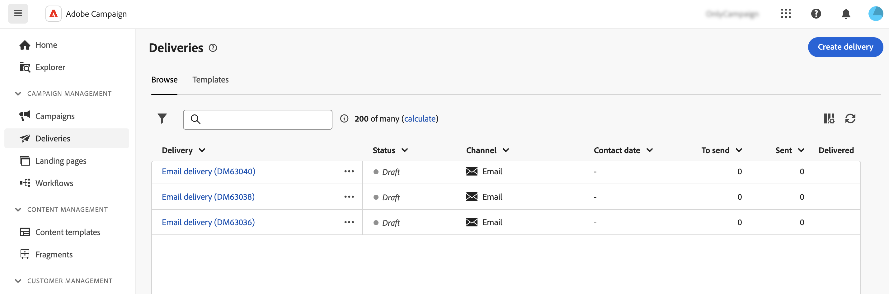

# Toegang tot leveringen {#work-with-deliveries}

>[!CONTEXTUALHELP]
>id="acw_deliveries_list"
>title="Leveringen"
>abstract="Een levering is een mededeling die naar een publiek op een specifiek kanaal wordt verzonden: e-mail, SMS, of Duw. In dit scherm kunt u bestaande leveringen bewerken, dupliceren en verwijderen. U kunt ook rapporten weergeven voor voltooide leveringen. Klik **creeer levering** knoop om een nieuwe levering toe te voegen."

## Toegang tot leveringen {#access}

>[!CONTEXTUALHELP]
>id="acw_deliveries_additional_target"
>title="Aanvullend doel"
>abstract="Deze regels kunnen slechts in de cliëntconsole worden veranderd."

Leveringen zijn toegankelijk via het menu **[!UICONTROL Deliveries]** aan de linkerkant. Alle die leveringen of van de cliëntconsole of het Gebruikersinterface van het Web worden gecreeerd verschijnen in deze lijst. Vanuit dit scherm kunt u alle bestaande leveringen controleren, deze dupliceren of verwijderen of nieuwe leveringen maken.

 worden getoond

Als u een levering wilt openen, klikt u in de lijst op de naam van de levering. De levering opent, toestaand u om diverse acties uit te voeren zoals het uitgeven van zijn parameters, het controleren van zijn uitvoering, of het controleren van zijn prestaties gebruikend specifieke rapporten.

Als u een levering opent die in de cliëntconsole wordt gecreeerd, kunnen twee nieuwe secties voor het publiek tonen. Deze parameters kunnen alleen in de console worden gewijzigd.

* **[!UICONTROL Additional target]**: geeft aan dat er meerdere doelen zijn geconfigureerd voor deze levering.

* **[!UICONTROL Additional proof target]**: geeft aan dat een dynamische voorwaarde is gedefinieerd voor proefdrukdoelen in deze levering.

{zoomable="yes"}

## Een levering dupliceren {#delivery-duplicate}

U kunt een kopie van een bestaande levering maken, vanuit de leveringslijst of vanaf het bezorgdashboard.

Voer de volgende stappen uit om een levering te dupliceren uit de lijst met leveringen:

1. Klik op de drie puntenknop rechts naast de naam van de levering die u wilt dupliceren.
1. Selecteer **[!UICONTROL Duplicate]**.
1. Herhaal dit. Het nieuwe leveringsdashboard wordt in het centrale scherm geopend.

Voer de volgende stappen uit om een levering te dupliceren vanaf het dashboard:

1. Open de levering en klik op de knop **[!UICONTROL ...More]** boven in het scherm.
1. Selecteer **[!UICONTROL Duplicate]**.
1. Herhaal dit. De nieuwe levering vervangt de huidige levering in het centrale scherm.

## Een levering verwijderen {#delivery-delete}

De leveringen worden geschrapt van de leveringslijst, hetzij van de hoofdlevering in het linkerspoor, hetzij van de leveringslijst van een campagne.

Voer de volgende stappen uit om een levering te verwijderen uit de lijst met leveringen:

1. Klik op de drie puntenknop rechts naast de naam van de levering die u wilt verwijderen.
1. Selecteer **[!UICONTROL Delete]**.
1. Verwijderen bevestigen.

Alle leveringen zijn beschikbaar in deze lijsten, maar leveringen die in een workflow zijn gemaakt, kunnen daar niet van worden verwijderd. Als u een levering wilt verwijderen die in de context van een workflow is gemaakt, verwijdert u de leveringsactiviteit uit de workflow.

Ga als volgt te werk om een levering uit een workflow te verwijderen:

1. Selecteer de leveringsactiviteit.
1. Klik op het pictogram **[!UICONTROL Delete]** in het rechterdeelvenster.
1. Verwijderen bevestigen. Als de levering kindknopen heeft, verkies om hen ook te schrappen of hen te houden.

