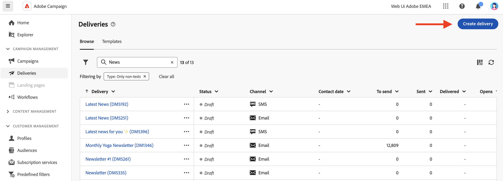
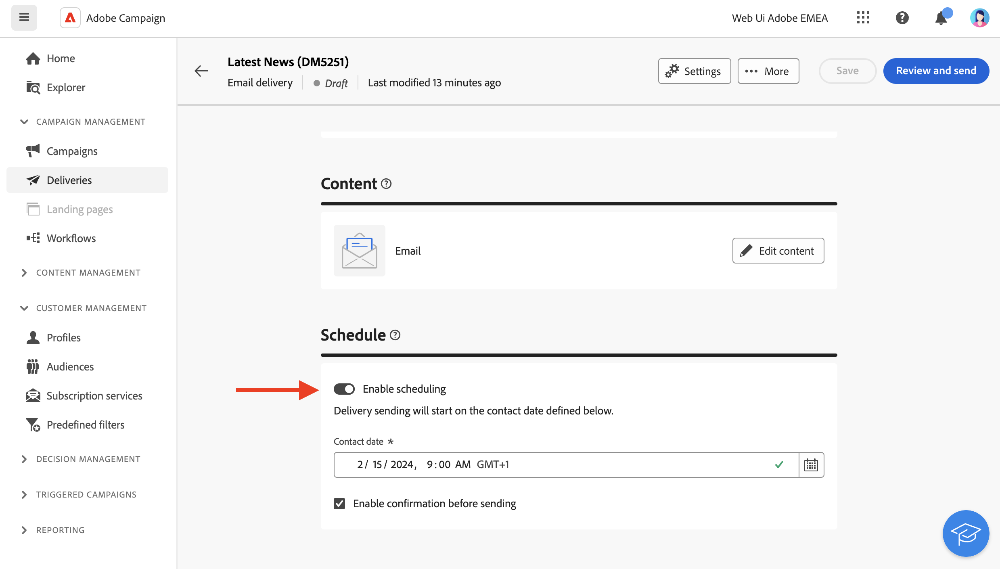

# Werken met leveringen {#work-with-deliveries}

>[!CONTEXTUALHELP]
>id="acw_deliveries_list"
>title="Leveringen"
>abstract="Een levering is een communicatie die naar een publiek op een specifiek kanaal wordt verzonden: e-mail, SMS, of Duw. In dit scherm kunt u bestaande leveringen bewerken, dupliceren en verwijderen. U kunt ook rapporten weergeven voor voltooide leveringen. Klik op de knop **Levering maken** om een nieuwe levering toe te voegen."

## Een levering maken {#create-delivery}

U kunt zelfstandige leveringen maken via de **[!UICONTROL Deliveries]** links menu, of levering maken in de context van een werkstroom, inbegrepen of niet in een campagne.

Blader op de onderstaande tabbladen voor meer informatie over het maken van een levering:

>[!BEGINTABS]

>[!TAB Een zelfstandige levering maken]

Voer de volgende stappen uit om een zelfstandige levering te maken:

1. Bladeren naar de **[!UICONTROL Deliveries]** en klik op de knop **[!UICONTROL Create delivery]** knop.

   

1. Kies een kanaal voor de levering. Meer informatie over leveringskanalen en hoe u in deze secties leveringsinhoud kunt definiëren:

   * [Email channel](../email/create-email.md)
   * [Push-meldingskanaal](../push/gs-push.md)
   * [SMS-kanaal](../sms/create-sms.md)

1. Bepaal het leveringspubliek, voor het belangrijkste doel en de controlegroep. Meer informatie over publiek in [deze sectie](../audience/about-recipients.md).
1. Bepaal de berichtinhoud.
1. (optioneel) Bepaal de levering [schema](#gs-schedule). Als geen programma wordt bepaald, worden de berichten verzonden onmiddellijk na het klikken van **[!UICONTROL Send]** knop.
1. Klik op de knop  **[!UICONTROL Review and send]** om uw instellingen te controleren.
1. Gebruik de  **[!UICONTROL Simulate content]** om uw levering, en verpersoonlijkingsmontages te testen. Meer informatie over berichtsimulatie vindt u in [deze sectie](../preview-test/preview-test.md).
1. Klik op de knop  **[!UICONTROL Prepare]** om de doelpopulatie te berekenen en de berichten te genereren. De voorbereidingsstap kan een paar minuten duren. Wanneer de voorbereiding volledig is, zijn de berichten klaar om te verzenden. Blader bij een fout naar de **Logboeken** om waarschuwingen en waarschuwingen te controleren.
1. Controleer de resultaten en klik op de knop  **[!UICONTROL Send]** om te beginnen met het verzenden van berichten.
1. Blader naar de **Rapporten** voor toegang tot belangrijke metriek. Meer informatie over leveringsrapporten vindt u in [deze sectie](../reporting/delivery-reports.md).

>[!TAB Levering maken in een workflow]

Ga als volgt te werk om een levering in een workflow te maken:

1. Maak een workflow of open een bestaande workflow. Meer informatie over workflows in [deze pagina](../workflows/gs-workflow-creation.md#gs-workflow-steps)
1. Een **[!UICONTROL Build audience]** en klik op de knop `+`knop.

   

   De **[!UICONTROL Build audience]** activiteit wordt nader omschreven in [deze sectie](../workflows/activities/build-audience.md).

1. Selecteer een leveringsactiviteit: **[!UICONTROL Email]**, **[!UICONTROL SMS]**, **[!UICONTROL Push notification (Android)]** of **[!UICONTROL Push notification (iOS)]**. Meer informatie over de activiteiten van het leveringskanaal in een workflow en over het definiëren van inhoud voor levering in deze [sectie](../workflows/activities/channels.md).
1. Start de workflow en controleer logbestanden.

U kunt ook leveringen in een campagne toevoegen zonder een workflow te maken. Om dit te bereiken, doorblader aan **[!UICONTROL Deliveries]** tabblad van uw campagne en klik op **[!UICONTROL Create delivery]** knop.

De stappen van de configuratie zijn gelijkaardig zoals voor standalone leveringen.

Voor meer informatie over hoe te om een campagne te vormen en leveringen te beheren die tot een campagne behoren, verwijs naar [deze sectie](../campaigns/gs-campaigns.md).

>[!ENDTABS]

## Aanpassing toevoegen {#personalization}

Berichten van Adobe Campaign kunnen op verschillende manieren worden gepersonaliseerd. [Meer informatie over personalisatiemogelijkheden](../personalization/gs-personalization.md).

Met Campagne kunt u dynamische inhoud maken en persoonlijke berichten verzenden. U kunt aanpassingsmogelijkheden combineren om uw berichten te verbeteren en een aangepaste gebruikerservaring te creëren.

U kunt de inhoud van het bericht aanpassen door:

* Dynamisch invoegen **personalisatievelden**

  De gebieden van de verpersoonlijking worden gebruikt voor verpersoonlijking op het eerste niveau van uw berichten. U kunt om het even welk gebied selecteren beschikbaar in het gegevensbestand van de verpersoonlijkingsredacteur. Voor een levering kunt u elk veld selecteren dat betrekking heeft op de ontvanger, het bericht of de levering. Deze verpersoonlijkingsattributen kunnen in de onderwerpregel of het lichaam van uw berichten worden opgenomen. [Meer informatie](../personalization/personalize.md)

* Vooraf gedefinieerde invoegen **inhoudsblokken**

  De campagne wordt geleverd met een reeks verpersoonlijkingsblokken die een specifieke rendering bevatten die u in uw leveringen kunt invoegen. U kunt bijvoorbeeld een logo, een wensbericht of een koppeling naar de spiegelpagina van het bericht toevoegen. Inhoudsblokken zijn beschikbaar bij een speciale vermelding in de personalisatie-editor. [Meer informatie](../personalization/personalize.md#ootb-content-blocks)

* Maken **voorwaardelijke inhoud**

  Vorm voorwaardelijke inhoud om dynamische verpersoonlijking toe te voegen die op het profiel van de ontvanger bijvoorbeeld wordt gebaseerd. Tekstblokken en/of afbeeldingen worden ingevoegd wanneer een bepaalde voorwaarde waar is. [Meer informatie](../personalization/conditions.md)

* Toevoegen **persoonlijke aanbiedingen**

  Voeg persoonlijke aanbiedingen in uw berichtinhoud in, afhankelijk van de locatie van de ontvanger, het huidige weer of de laatste kooporder. [Meer informatie](../content/offers.md)

## Geef een voorvertoning van uw leveringen weer en test deze

Nadat de inhoud van uw bericht is gedefinieerd, kunt u deze voorvertonen om de weergave van uw berichten te bepalen en de instellingen voor de personalisatie te controleren met testprofielen. [Meer informatie](../preview-test/preview-test.md)

## De verzending van de levering plannen {#gs-schedule}

>[!CONTEXTUALHELP]
>id="acw_deliveries_email_schedule"
>title="Een contactdatum en -tijd instellen"
>abstract="Bepaal de datum en de exacte tijd voor het verzenden van de levering. Door de meest geschikte tijd voor uw marketingbericht te kiezen, kunt u de open tarieven maximaliseren."

U kunt de datum en het exacte tijdstip voor het verzenden van uw berichten instellen. Door de meest geschikte tijd voor uw marketingbericht te kiezen, kunt u de open tarieven maximaliseren.

Als u de verzending van de levering wilt plannen, opent u de levering en bladert u naar de **[!UICONTROL Schedule]** sectie. Gebruik de **[!UICONTROL Enable scheduling]** om het te activeren en de gewenste datum en tijd voor verzending in te stellen. Nadat u de levering hebt verzonden, begint de daadwerkelijke verzending op de door u gedefinieerde contactdatum.

Standaard worden de **[!UICONTROL Enable confirmation before sending]** is ingeschakeld. Voor deze optie moet u de verzending bevestigen voordat de levering op de geplande datum en tijd wordt verzonden. Als u de levering automatisch op de geplande datum en tijd moet verzenden, kunt u deze optie onbruikbaar maken.

Meer informatie over het verzenden van een geplande levering in [deze sectie](../monitor/prepare-send.md#schedule-the-send).

## Logbestanden bijhouden en bijhouden {#gs-tracking-logs}

Het controleren van uw leveringen nadat deze zijn verzonden, is een belangrijke stap om ervoor te zorgen dat uw marketingcampagnes efficiënt zijn en uw klanten bereiken.

U kunt controleren na het verzenden van een levering, evenals begrijpen hoe de leveringsmislukkingen en quarantines worden beheerd.

Meer informatie over de mogelijkheden voor controle en bijhouden in [deze sectie](../reporting/gs-reports.md).

## Een levering dupliceren {#delivery-duplicate}

U kunt een kopie van een bestaande levering maken, vanuit de leveringslijst of vanaf het bezorgdashboard.

Voer de volgende stappen uit om een levering te dupliceren uit de lijst met leveringen:

1. Klik op de drie puntenknop rechts naast de naam van de levering die u wilt dupliceren.
1. Selecteren  **[!UICONTROL Duplicate]**.
1. Herhaling bevestigen: het nieuwe bezorgdashboard wordt in het centrale scherm geopend.

Voer de volgende stappen uit om een levering te dupliceren vanaf het dashboard:

1. Open de levering en klik op  **[!UICONTROL ...More]** op de bovenste sectie van het scherm.
1. Selecteer **[!UICONTROL Duplicate]**.
1. Herhaling bevestigen: de nieuwe levering vervangt de huidige levering in het centrale scherm.

## Een levering verwijderen {#delivery-delete}

De leveringen worden uit de leveringslijst geschrapt - hetzij van de hoofdlevering in de linkerspoorstaaf, hetzij van de leveringslijst van een campagne.

Voer de volgende stappen uit om een levering te verwijderen uit de lijst met leveringen:

1. Klik op de drie puntenknop rechts naast de naam van de levering die u wilt dupliceren.
1. Selecteren  **[!UICONTROL Delete]**.
1. Verwijderen bevestigen.

Alle leveringen zijn beschikbaar in deze lijsten, maar leveringen die in een workflow zijn gemaakt, kunnen daar niet van worden verwijderd. Als u een levering wilt verwijderen die in de context van een workflow is gemaakt, moet u de leveringsactiviteit uit de workflow verwijderen.

Ga als volgt te werk om een levering uit een workflow te verwijderen:

1. Selecteer de leveringsactiviteit.
1. Klik op de knop  **[!UICONTROL Delete]** in het rechterdeelvenster.
1. Verwijderen bevestigen. Als de levering kindknopen heeft, kunt u verkiezen om hen ook te schrappen, of hen te houden.

