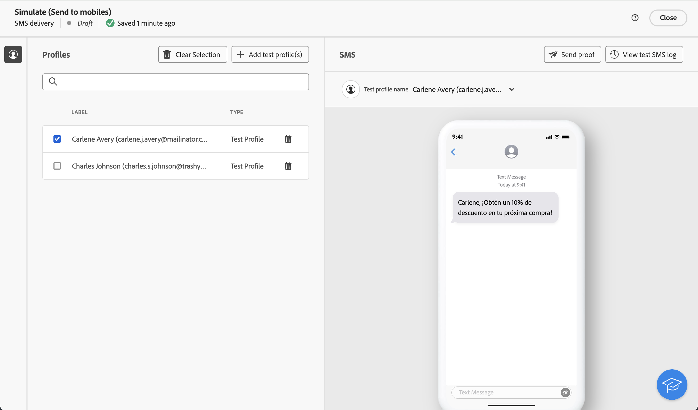

# Een meertalige levering configureren {#multilingual-delivery}

>[!CONTEXTUALHELP]
>id="acw_deliveries_email_multilingual"
>title="Talen toevoegen"
>abstract="Op dit tabblad vindt u een lijst met talen waarin de levering wordt verzonden. U kunt meer talen toevoegen door op de knop Taal toevoegen te klikken of door een andere taal via dit tabblad te dupliceren."

>[!CONTEXTUALHELP]
>id=&quot;acw_multilingual_file_upload&quot;
>title=&quot;Taalvarianten importeren&quot;
>abstract=&quot;Gebruik dit dialoogvenster om een taalvariant toe te voegen door een CSV-bestand te importeren. Het bestand vult automatisch alle beschikbare velden voor de geselecteerde taal in. U kunt het bestand slepen en neerzetten of het van uw computer kiezen voordat u het bevestigt.&quot;

In het Web UI van de Campagne, kunt u opstelling uw leveringen als meertalig, die u toestaat om berichten te verzenden die op de aangewezen taal van een profiel worden gebaseerd. Wanneer geen voorkeur wordt bepaald, wordt het bericht verzonden in de standaardtaal.

Bij een meertalige aflevering is het taalbeheer gebaseerd op varianten. Elke variant vertegenwoordigt één taal. Tijdens het creëren van de levering, kunt u veelvoudige taalvarianten toevoegen om het aantal vereiste talen in uw bericht aan te passen. U kunt de standaardtaal ook op elk gewenst moment wijzigen nadat u deze varianten hebt toegevoegd.

De meertalige mogelijkheid is momenteel beschikbaar voor e-mail, pushberichten, transactionele berichten en SMS.

>[!AVAILABILITY]
>
>Meertalige pushmeldingen, transactionele berichten en SMS zijn alleen beschikbaar voor een aantal organisaties (beperkte beschikbaarheid) en worden globaal geïmplementeerd in een toekomstige release. De upgrade van uw server naar 8.8.2 of hoger is vereist.

Voer de volgende stappen uit om meertalige leveringen in te stellen:

1. Voeg een taalvariant toe, [&#x200B; lees meer &#x200B;](#add-variant)
1. Bepaal de inhoud voor elke variant, [&#x200B; lees meer &#x200B;](#define-content)
1. Beheer taalvarianten, [&#x200B; lees meer &#x200B;](#manage-variant)

## Een taalvariant toevoegen{#add-variant}

Ga als volgt te werk om taalvarianten te maken:

1. Klik op het bezorgdashboard op het potloodpictogram om het scherm voor de editie van de leveringsinhoud te openen en klik vervolgens op **[!UICONTROL Add language]** .

   >[!IMPORTANT]
   >
   >De **[!UICONTROL Add language]** knoop is slechts beschikbaar als de doeldimensie het **2&rbrace; schema van de Taal &lbrace;bevat.** Meer over schema&#39;s en doeldimensies leren, gelieve te verwijzen naar de [&#x200B; gedetailleerde documentatie &#x200B;](../audience/targeting-dimensions.md).

   {zoomable="yes"}

1. Van **voeg taal** drop-down toe, selecteer de taal om toe te voegen, dan bevestig.

   De eerste taal die u toevoegt, wordt automatisch als de standaardtaal ingesteld en de bestaande inhoud wordt de standaardversie. Wanneer extra talen worden toegevoegd, wordt hun inhoud eerst gekopieerd uit de standaardtaal.

   {zoomable="yes"}

   >[!NOTE]
   >
   >De talen beschikbaar door deze lijst hangen van de waarden af die door het **attribuut van de Taal** &lbrace;zijn bepaald (waarden zoals: systeem, gebruiker, dbenum, enz.). Leer meer over opsommingsbeheer in deze [&#x200B; sectie &#x200B;](../administration/enumerations.md).

1. Herhaal deze bewerking om andere talen toe te voegen. In het deelvenster **[!UICONTROL Languages]** links ziet u de lijst met talen die u hebt gekozen, het aantal talen en de standaardtaal.

   Als u bijvoorbeeld Engels, Frans en Zweeds hebt gekozen, kunt u deze drie talen zien, zoals hieronder wordt getoond:

   {zoomable="yes"}

   Leren hoe te om taalvarianten te beheren, verwijs naar deze [&#x200B; sectie &#x200B;](#manage-variant).

## De inhoud voor elke variant definiëren{#define-content}

Wanneer talen zijn ingesteld, definieert u de inhoud van de levering voor elke taal.

1. Selecteer een taal in het deelvenster **[!UICONTROL Languages]** aan de linkerkant van het scherm voor de editie van de leveringsinhoud.

   {zoomable="yes"}

1. Bepaal de inhoud van uw bericht voor deze taal. Leer meer in deze [&#x200B; sectie &#x200B;](../msg/create-deliveries.md).

1. Herhaal deze bewerking voor elke taal.

<!--
>[!BEGINTABS]

>[!TAB Email delivery]

1. From the delivery content edition screen, choose a language and click the **[!UICONTROL Edit email body]** button. You can also hover over the email preview and select **[!UICONTROL Open email designer]**.

    {zoomable="yes"}

1. Define the content of your email for this language. [Read more](../email/get-started-email-designer.md#start-authoring)

1. Repeat this operation for each language.

>[!TAB SMS delivery]

1. From the delivery content edition screen, choose a language.

1. Edit the content of the SMS message for this language. [Read more](../sms/create-sms.md)

    {zoomable="yes"}

1. Repeat this operation for each language.

>[!ENDTABS]

-->

Klik op de knop **[!UICONTROL Simulate content]** en kies profielen om een voorvertoning van de levering weer te geven. Controleer of de juiste inhoud voor elk profiel wordt weergegeven.

{zoomable="yes"}

## Taalvarianten beheren{#manage-variant}

In het linkerpaneel, wordt alle informatie van de taalvariant getoond. Als u alle talen wilt verwijderen, klikt u op de knop Uitvouwen en klikt u op **[!UICONTROL Delete all variants]** .

{zoomable="yes"}

In de lijst met taalvarianten kunt u de volgende handelingen uitvoeren:

* **geeft** uit: verander de taal terwijl het houden van de bijbehorende inhoud.
* **Reeks als gebrek**: plaats de taal als gebrek. Wanneer voor een profiel geen taal is gedefinieerd, wordt het bericht verzonden in de standaardtaal.
* **Dupliceer**: dupliceer de inhoud die voor deze taal wordt bepaald en kies een verschillende variant.
* **Schrapping**: schrap de variant en zijn bijbehorende inhoud.

{zoomable="yes"}

