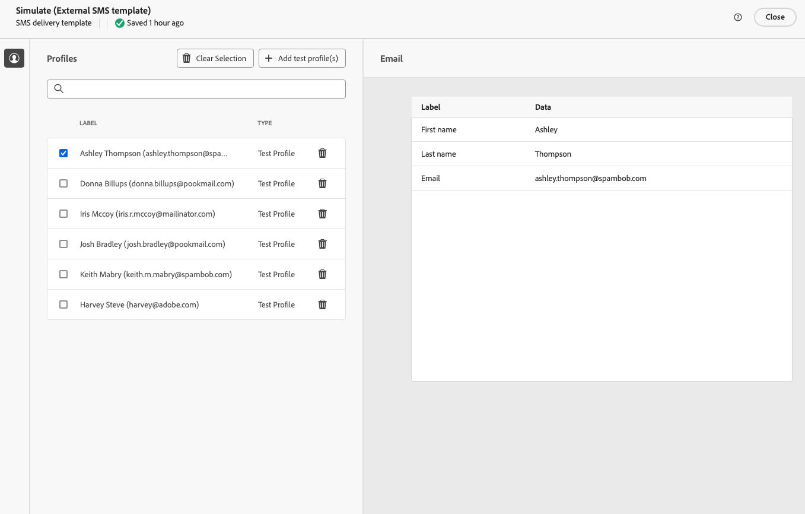

# Externe leveringen verzenden {#gs-direct-mail}

Met Adobe Campaign kunt u leveringen verwerken die buiten de campagne zijn gemaakt, zodat u via een extern systeem op grote schaal persoonlijke e-mails, SMS-berichten of pushberichten (iOS en Android) kunt verzenden.

<!--The supported channels are Email, Mobile (SMS), and Push (iOs and Android).-->

Bij het maken van een externe levering genereert Adobe Campaign automatisch een extractiebestand dat alle doelprofielen en geselecteerde gegevens bevat. Dit bestand wordt naar de server van uw keuze verzonden, die het verzendproces voor u zal afhandelen.

## Een toegewezen externe account maken {#routing-external-account}

Eerst moet u een specifieke externe account configureren die in uw externe leveringen wordt gebruikt. Het moet van het **[!UICONTROL Routing]** type zijn.

>[!NOTE]
>
>Leer hoe te om een verpletterende-type externe rekening in [ tot stand te brengen deze sectie ](../administration/external-account.md#routing).

Selecteer bijvoorbeeld het **[!UICONTROL Mobile (SMS)]** -kanaal voor de externe account. **[!UICONTROL External]** wordt standaard geselecteerd als de **[!UICONTROL Delivery mode]** .

{zoomable="yes"}

## De externe levering maken en verzenden {#create-external-delivery}

Zodra de specifieke externe rekening wordt gevormd, creeer de externe levering. Voer de onderstaande stappen uit.

1. Een levering maken. [ leer hoe ](create-deliveries.md)

   U hebt drie opties:

   * **in een werkschema**: Voeg een externe kanaalactiviteit (e-mail, SMS of duw) aan uw werkschema toe. Voor gedetailleerde instructies op hoe te om werkschema te vormen, verwijs naar [ deze pagina ](../workflows/gs-workflow-creation.md).
   * **in een campagne**: Zodra u een campagne hebt gecreeerd, kunt u een e-mail, SMS tot stand brengen of kanaal externe levering duwen. Voor meer informatie bij vestiging uw campagne, verwijs naar [ deze pagina ](../campaigns/gs-campaigns.md).
   * **stand-alone levering**: Sluit klanten direct en onmiddellijk met een individuele externe levering aan. [ leren hoe te om een levering ](../msg/gs-deliveries.md) tot stand te brengen

1. In de levering of leveringsmalplaatje [ montages ](../advanced-settings/delivery-settings.md), selecteer de externe rekening die u voor het kanaal van uw keus (in dit voorbeeld, het kanaal van SMS) creeerde en bewaar.

   {zoomable="yes"}

   >[!NOTE]
   >
   >Als u een levering creeert, zorg ervoor dat u a [ leveringsmalplaatje ](delivery-template.md) gebruikend een externe rekening van het **[!UICONTROL Routing]** type hebt geselecteerd, anders zult u niet de specifieke rekening kunnen selecteren u [ hierboven ](#routing-external-account) hebt gecreeerd.

1. Klik in de bezorgsectie **[!UICONTROL Content]** op **[!UICONTROL Edit content]** .

   {zoomable="yes"}

1. In tegenstelling tot een standaardlevering, ontwerpt u niet de inhoud van het bericht zelf. In plaats daarvan moet u de eigenschappen en kolommen definiëren van het bestand dat naar het externe systeem wordt verzonden.

   {zoomable="yes"}

   Volg de zelfde stappen zoals wanneer het ontwerpen van de inhoud van het extractiedossier door [ wordt geproduceerd direct-mailleveringen ](../direct-mail/content-direct-mail.md):

   * Definieer de eigenschappen van het extractiebestand. [Meer informatie](../direct-mail/content-direct-mail.md#properties)
   * Selecteer de kolommen met de informatie die naar dat bestand moet worden geëxporteerd. [Meer informatie](../direct-mail/content-direct-mail.md#content)

1. U kunt een voorvertoning van het bestand bekijken en proefdrukken verzenden <!--not in UI right now - to check--> . [ leer hoe ](../direct-mail/send-direct-mail.md#preview-dm)

   {zoomable="yes"}

1. Verzend de levering om het extractiebestand te genereren. [ leer hoe ](../direct-mail/send-direct-mail.md#send-dm)

Zodra uw levering wordt verzonden, wordt het extractiedossier automatisch geproduceerd en uitgevoerd naar de plaats die in de [ wordt gespecificeerd externe rekening ](../administration/external-account.md#create-ext-account) in de montages van het leveringsmalplaatje wordt geselecteerd.

U kunt de PKIs van de leveringspagina en gegevens van het **[!UICONTROL Logs]** menu volgen.
