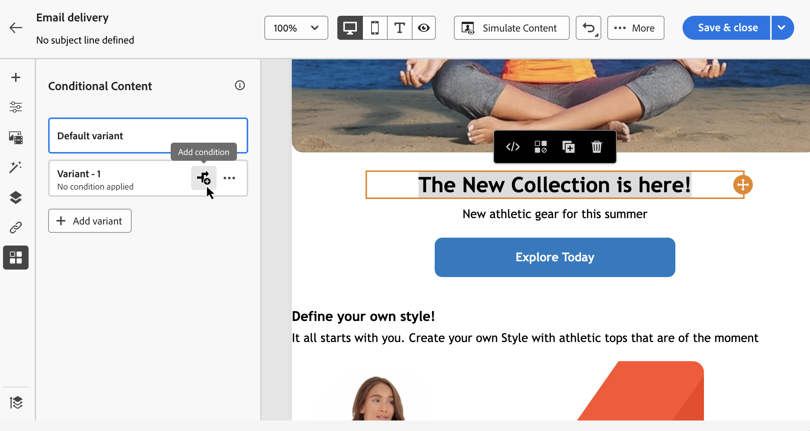

# Voorwaardelijke inhoud maken {#add-conditions}

>[!CONTEXTUALHELP]
>id="acw_conditional_content"
>title="Voorwaardelijke inhoud toevoegen"
>abstract="Configureer voorwaardelijke inhoudsvelden om geavanceerde dynamische personalisatie te maken op basis van de profielgegevens van de ontvanger. Tekstblokken, koppelingen, onderwerpregel en/of afbeeldingen worden vervangen in de inhoud van het bericht als aan een bepaalde voorwaarde is voldaan."

## Aan de slag met voorwaardelijke inhoud {#gs}

Voorwaardelijke inhoud is een krachtige functie waarmee dynamische personalisatie mogelijk wordt op basis van de profielgegevens van de ontvanger. Tekstblokken en afbeeldingen worden automatisch vervangen wanneer aan bepaalde voorwaarden wordt voldaan. Deze functie verbetert campagnes en biedt doelgerichte, gepersonaliseerde ervaringen aan uw publiek.

Door voorwaardelijke inhoudsgebieden te vormen, kunt u geavanceerde dynamische verpersoonlijking tot stand brengen die op het profiel van de ontvanger wordt gebaseerd. Tekstblokken, koppelingen, onderwerpregel en afbeeldingen worden bijvoorbeeld vervangen in de inhoud van het bericht als aan een bepaalde voorwaarde wordt voldaan. U kunt bijvoorbeeld &#39;Mr&#39; of &#39;Mevrouw&#39; weergeven op basis van de waarde van het genderveld in de database van Adobe Campaign of een andere link opnemen op basis van de voorkeurstaal van de ontvanger.

Om voorwaardelijke inhoud tot stand te brengen, vorm voorwaarden in de **uitdrukkingsredacteur** gebruikend specifieke hulpfuncties. Deze methode is beschikbaar voor alle leveringskanalen, op om het even welk gebied waar u tot de uitdrukkingsredacteur, zoals de onderwerpregel, e-mailverbindingen, en tekst/knoop inhoudcomponenten kunt toegang hebben. [&#x200B; Leer hoe te om tot de uitdrukkingsredacteur &#x200B;](gs-personalization.md#access) toegang te hebben.

Bovendien, gebruik de specifieke **voorwaardelijke inhoudsbouwer** wanneer het ontwerpen van een e-mail om veelvoudige varianten voor een element van uw e-maillichaam tot stand te brengen. [&#x200B; Leer hoe te om voorwaardelijke inhoud in e-mail &#x200B;](#condition-condition-builder) tot stand te brengen.

## Voorwaarden maken in de expressie-editor {#condition-perso-editor}

>[!CONTEXTUALHELP]
>id="acw_personalization_editor_conditions"
>title="Voorwaarden"
>abstract="Met dit menu kunt u hulpfuncties gebruiken om voorwaardelijke inhoud te definiëren."

Voer de volgende stappen uit om voorwaardelijke inhoud voor een levering te definiëren met de expressieeditor. In dit voorbeeld wordt voorwaardelijke inhoud gemaakt op basis van de taal van de ontvanger (Frans of Engels).

1. Open een levering en navigeer naar de sectie voor het bewerken van inhoud.

1. Zoek het veld waaraan u voorwaardelijke inhoud wilt toevoegen. Voeg bijvoorbeeld voorwaardelijke inhoud toe aan een SMS-bericht.

1. Klik op het pictogram **[!UICONTROL Open personalization dialog]** naast het veld om de expressie-editor te openen.

   {zoomable="yes"}

1. Blader in de verpersoonlijkingseditor naar het menu **[!UICONTROL Conditions]** aan de linkerkant.

1. Om uw voorwaarde te beginnen bouwen, klik &#39;+&#39; pictogram naast **als** functie. De volgende regel wordt toegevoegd aan het centrale scherm: `<% if (<FIELD>==<VALUE>) { %>Insert content here<% } %>`

   * Vervang `<FIELD>` door een verpersoonlijkingsveld, zoals de taal van de ontvanger: `recipient.language` .
   * Vervang `<VALUE>` door de waarde waaraan moet worden voldaan, zoals `'French'` .
   * Vervang `Insert content here` door de inhoud die moet worden weergegeven naar profielen die aan de opgegeven voorwaarde voldoen.

     {zoomable="yes"}{width="800" align="center"}

1. Geef de inhoud op die moet worden weergegeven als de ontvangers niet aan de voorwaarde voldoen. Gebruik een **anders** helperfunctie:

   1. Plaats uw curseur vóór de uitdrukking die markering `%>` sluit en klik `+` naast de **anders** functie.

   1. Vervang `Insert content here` door de inhoud die moet worden weergegeven naar profielen die niet voldoen aan de voorwaarde van de if-functie.

   {zoomable="yes"}{width="800" align="center"}

   Gebruik anders **als** hulpfunctie om voorwaarden met veelvoudige inhoudsvarianten te bouwen. De onderstaande expressie geeft bijvoorbeeld drie varianten van een bericht weer, afhankelijk van de taal van de ontvanger:

   {zoomable="yes"}{width="800" align="center"}

   >[!NOTE]
   >
   >Telkens wanneer een hulpfunctie wordt toegevoegd, worden het openen (`<%`) en het sluiten (`%>`) markeringen automatisch toegevoegd vóór en na de functie.
   >
   >Voorbeeld na het toevoegen van een hulpfunctie &quot;Else&quot; binnen een expressie:
   >
   >`<% if (<FIELD>==<VALUE>) { %>Insert content here<% } <% else { %> Insert content here<% } %>%>`
   >
   >Zorg ervoor dat u deze labels verwijdert om syntaxisfouten te voorkomen. In dit voorbeeld, is de gecorrigeerde uitdrukking na het verwijderen van **anders** functietags:
   >
   >`<% if (<FIELD>==<VALUE>) { %>Insert content here<% } else { %> Insert content here<% } %>`

1. Sla de inhoud op en controleer de rendering van de inhoud door deze te simuleren.

## Voorwaardelijke inhoud maken in e-mails {#condition-condition-builder}

Voorwaardelijke inhoud in e-mails kan op twee manieren worden gemaakt:
* In de uitdrukkingsredacteur door een voorwaarde met helperfuncties te bouwen.
* In een speciale, voorwaardelijke inhoudsontwikkelaar die toegankelijk is wanneer u een e-mail ontwerpt.

In de volgende sectie vindt u stapsgewijze instructies voor het maken van voorwaarden met behulp van de voorwaardelijke inhoud-functie voor e-mail Designer. De gedetailleerde informatie bij het creëren van voorwaarden die de uitdrukkingsredacteur gebruiken is beschikbaar [&#x200B; hier &#x200B;](#condition-perso-editor).

In dit voorbeeld wordt een e-mailbericht met meerdere varianten gemaakt op basis van de taal van de ontvangers. Voer de volgende stappen uit:

1. Maak of open een e-maillevering, bewerk de inhoud ervan en klik op de knop **[!UICONTROL Edit email body]** om de werkruimte voor het ontwerpen van e-mail te openen.

1. Selecteer een inhoudscomponent en klik op het pictogram **[!UICONTROL Enable conditional content]** .

   {zoomable="yes"}{width="800" align="center"}

1. Het deelvenster **[!UICONTROL Conditional Content]** wordt aan de linkerkant van het scherm geopend. In dit deelvenster maakt u meerdere varianten van de geselecteerde inhoudscomponent aan de hand van voorwaarden.

1. Vorm uw eerste variant. Houd de cursor boven **[!UICONTROL Variant - 1]** in het deelvenster **[!UICONTROL Conditional Content]** en klik op de knop **[!UICONTROL Add condition]** .

   {zoomable="yes"}{width="800" align="center"}

1. De vraagmodeler opent, toestaand u om een voorwaarde te bouwen door de het profielgegevens van de ontvanger te filtreren. [&#x200B; Leer hoe te met de vraagmodelaar &#x200B;](../query/query-modeler-overview.md) te werken.

   Klik op **[!UICONTROL Confirm]** als de voorwaarde voor de eerste variant van het bericht gereed is. In dit voorbeeld wordt een regel gemaakt die gericht is op ontvangers waarvan de taal &#39;Frans&#39; is.

   {zoomable="yes"}{width="800" align="center"}

1. De regel is nu gekoppeld aan de variant. Voor betere leesbaarheid klikt u op het menu Ovaal om de naam van de variant te wijzigen.

1. Vorm hoe de component zou moeten tonen als de regel wordt ontmoet wanneer het verzenden van het bericht. In dit voorbeeld geeft u de tekst in het Frans weer als dit de voorkeurstaal van de ontvanger is.

   {zoomable="yes"}{width="800" align="center"}

1. Voeg zoveel varianten toe als nodig zijn voor de inhoudscomponent. Schakel op elk gewenst moment tussen de varianten om te controleren hoe de inhoudscomponent wordt weergegeven op basis van hun voorwaardelijke regels.

   >[!NOTE]
   >Als bij het verzenden van het bericht aan geen van de regels in de varianten wordt voldaan, wordt de inhoud die in het deelvenster **[!UICONTROL Default variant]** is gedefinieerd, weergegeven in de inhoudscomponent. **[!UICONTROL Conditional Content]**

## Variabelen gebruiken voor voorwaardelijke inhoud {#variables-conditional}

U kunt variabelen gebruiken voor voorwaardelijke inhoud in de levering.

Leer meer over [&#x200B; toevoegend variabelen aan een levering &#x200B;](../advanced-settings/delivery-settings.md#variables-delivery).

Kies het element waar u voorwaardelijke inhoud wilt plaatsen.

{zoomable="yes"}

Om uw variabele te gebruiken, vorm de voorwaarde gebruikend de **[!UICONTROL Edit expression]** knoop, zoals hieronder getoond. In dit voorbeeld wordt deze afbeelding weergegeven wanneer de waarde van de variabele `launch` is.

{zoomable="yes"}

Maak bijvoorbeeld een andere variant met de waarde `reminder` , waarbij een andere afbeelding wordt weergegeven.