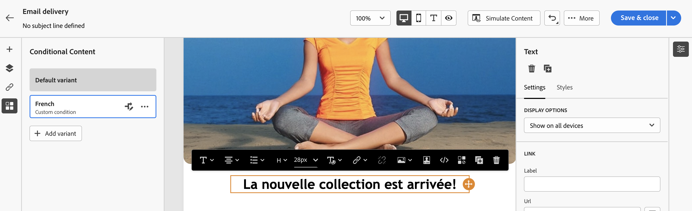

# Voorwaardelijke inhoud maken{#add-conditions}

>[!CONTEXTUALHELP]
>id="acw_conditional_content"
>title="Voorwaardelijke inhoud toevoegen"
>abstract="Configureer voorwaardelijke inhoudsvelden om geavanceerde dynamische personalisatie te maken op basis van de profielgegevens van de ontvanger. Tekstblokken, koppelingen, onderwerpregel en/of afbeeldingen worden vervangen in de inhoud van het bericht als aan een bepaalde voorwaarde is voldaan."

## Aan de slag met voorwaardelijke inhoud {#gs}

Voorwaardelijke inhoud is een krachtige functie waarmee u een dynamische personalisatie kunt maken op basis van het profiel van de ontvanger, waarbij tekstblokken en afbeeldingen automatisch worden vervangen wanneer aan bepaalde voorwaarden wordt voldaan. Met deze functie kunt u uw campagnes op een hoger niveau brengen en uw publiek een zeer doelgerichte, persoonlijke ervaring bieden.

Door voorwaardelijke inhoudsgebieden te vormen, kunt u geavanceerde dynamische verpersoonlijking tot stand brengen die op het profiel van de ontvanger bijvoorbeeld wordt gebaseerd. Tekstblokken, koppelingen, onderwerpregel en/of afbeeldingen worden vervangen in de inhoud van het bericht als aan een bepaalde voorwaarde is voldaan. U kunt bijvoorbeeld &#39;Mr&#39; of &#39;Mevrouw&#39; weergeven op basis van de waarde van het genderveld in de database van Adobe Campaign, of een andere link opnemen op basis van de voorkeurstaal van de ontvanger.

Als u voorwaardelijke inhoud wilt maken, moet u voorwaarden maken in het dialoogvenster **expressie-editor** specifieke hulpfuncties gebruiken. Deze methode is beschikbaar voor alle leveringskanalen, op om het even welk gebied waar u tot de uitdrukkingsredacteur, zoals de onderwerpregel, of e-mailverbindingen en tekst/knoop inhoudcomponenten kunt toegang hebben. [Leer hoe u toegang krijgt tot de expressie-editor](gs-personalization.md/#access)

<!--In addition to the expression editor, you can leverage a dedicated **conditional content builder** when designing an email that allows you to build conditions using profile attributes only. [Learn how to create conditional content in emails](#condition-condition-builder)-->

## Voorwaarden maken in de expressie-editor {#condition-perso-editor}

Voer de onderstaande stappen uit om voorwaardelijke inhoud voor een levering te definiëren met behulp van de expressieeditor. In dit voorbeeld willen we voorwaardelijke inhoud maken op basis van de taal van de ontvangers (Frans of Engels).

1. Open een levering en navigeer naar de sectie voor het bewerken van inhoud.

1. Zoek het veld waaraan u voorwaardelijke inhoud wilt toevoegen. U kunt bijvoorbeeld voorwaardelijke inhoud toevoegen aan een SMS-bericht.

1. Klik op de knop **[!UICONTROL Open personalization dialog]** pictogram naast het veld om de uitdrukkingseditor te openen.

   

1. Blader in de verpersoonlijkingseditor naar de **[!UICONTROL Helper functions]** links.

1. Als u wilt beginnen met het bouwen van uw voorwaarde, klikt u op het plusteken (+) naast de knop **Indien** functie. De volgende regel wordt toegevoegd aan het centrale scherm:`<% if (<FIELD>==<VALUE>) { %>Insert content here<% } %>`

   * Vervangen `<FIELD>` met een verpersoonlijkingsgebied, zoals de taal van de ontvanger: `recipient.language`.
   * Vervangen `<VALUE>` met de waarde waaraan moet worden voldaan. Bijvoorbeeld: `'French'`.
   * Vervangen `Ìnsert content here` met de inhoud die u wilt weergeven voor de profielen die aan de opgegeven voorwaarde voldoen.

     {width="800" align="center"}

1. Geef de inhoud op die moet worden weergegeven als de ontvangers niet aan de voorwaarde voldoen. Om dit te doen gebruik **else** helperfunctie:

   1. Plaats de cursor vóór de afsluitingstag voor de expressie `%>` en klik op de knop `+` naast de **Else** functie.

   1. Vervangen `Ìnsert content here` met de inhoud die u wilt weergeven voor de profielen die niet voldoen aan de voorwaarde van de if-functie.

   {width="800" align="center"}

   U kunt ook de opdracht **else if** de hulpfunctie om voorwaarden met veelvoudige inhoudvarianten te bouwen. De onderstaande expressie geeft bijvoorbeeld drie varianten van een bericht weer, afhankelijk van de taal van de ontvanger:

   {width="800" align="center"}

   >[!NOTE]
   >
   >Elke keer dat een hulpfunctie wordt toegevoegd, wordt het openen (`<%`) en sluiten (`%>`) automatisch worden toegevoegd voor en na de functie.
   >
   >Voorbeeld na het toevoegen van een hulpfunctie &quot;Else&quot; binnen een expressie: >
   >
   >`<% if (<FIELD>==<VALUE>) { %>Insert content here<% } <% else { %> Insert content here<% } %>%>`
   >
   >Verwijder deze tags om syntaxisfouten te voorkomen. In dit voorbeeld wordt de gecorrigeerde expressie na het verwijderen van de **else** functietags zijn:
   >
   >`<% if (<FIELD>==<VALUE>) { %>Insert content here<% } else { %> Insert content here<% } %>`

1. Zodra uw voorwaarde klaar is, kunt u uw inhoud opslaan en de rendering ervan controleren door uw inhoud te simuleren.

<!--SECTION REMOVED FOR LA > CONDITIONAL CONTENT NOT AVAILABLE ANYMORE FROM THE DEDICATED MENU IN THE EMAIL DESIGNER. ONLY THE EXPRESSION EDITOR IS AVAILABLE FOR NOW

## Create conditional content in emails {#condition-condition-builder}

Conditional content in emails can be created in two ways:
* In the expression editor by building a condition with helper functions,
* In a dedicated conditional content builder that is accessible when designing an email.

Detailed information on how to create conditions using the expression editor is available [here](#condition-perso-editor). The following section provides step-by-step instructions on how to create conditions using the email designer's conditional content capability. In this example, we want to create an email message with multiple variants based on the recipients' language. Follow these steps:

1. Create or open an email delivery, edit its content, and click the **[!UICONTROL Edit email body]** button to open the email designing workspace.

1. Select a content component and click the **[!UICONTROL Enable conditional content]** icon.

    {width="800" align="center"}

1. The **[!UICONTROL Conditional Content]** pane opens on the left-hand side of the screen. In this pane, you can create multiple variants of the selected content component using conditions.

1. Configure your first variant. Hover over **[!UICONTROL Variant - 1]** in the **[!UICONTROL Conditional Content]** pane and click the **[!UICONTROL Add condition]** icon.

1. A rule builder appears. Use profile attributes to create the condition for the first variant of the message and click **[!UICONTROL Confirm]**. In this example, we are creating a rule targeting recipients whose language is 'French'.

    {width="800" align="center"}

1. The rule is now associated to the variant. For better readability, we recommend renaming the variant by clicking the ellipsis menu.

1. Configure how the component should display if the rule is met when sending the message. In this example, we want to display the text in French if it is the recipient's preferred language.

    {width="800" align="center"}

1. Add as many variants as needed for the content component. You can switch between the variants at any time to check how the content component will display based on their conditional rules.

    >[!NOTE]
    >If none of the rules defined in the variants are met when sending the message, the content component will display the content defined in the **[!UICONTROL Default variant]** from the **[!UICONTROL Conditional Content]** pane.
-->