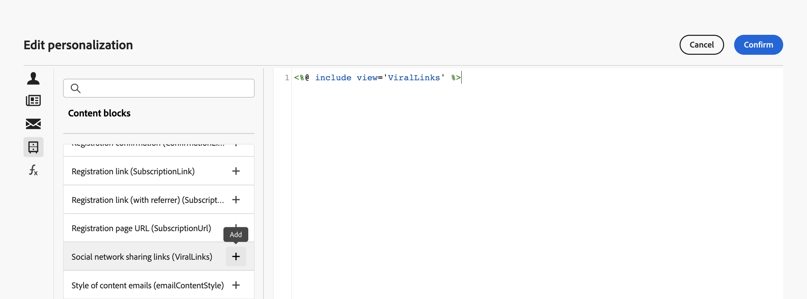

# Ingebouwde inhoudsblokken {#ootb-content-blocks}

Adobe Campaign biedt een lijst met vooraf geconfigureerde inhoudsblokken. Deze inhoudsblokken zijn dynamisch, gepersonaliseerd en hebben een specifieke rendering die u in uw leveringen kunt invoegen. U kunt bijvoorbeeld een logo, een begroetingsbericht of een koppeling naar een spiegelpagina toevoegen.

Ga als volgt te werk om een inhoudsblok toe te voegen aan een levering:

1. Open een levering en bewerk de inhoud ervan.

1. Zoek het veld waaraan u een inhoudsblok wilt toevoegen en klik op de knop **[!UICONTROL Open personalization dialog]** pictogram om de uitdrukkingsredacteur te openen.

   {width="800" align="center"}

1. Blader in de expressieeditor naar de **[!UICONTROL Content blocks]** links.

1. Als u een inhoudsblok wilt toevoegen, plaatst u de cursor op de gewenste locatie in de inhoud en klikt u op de knop &#39;+&#39; om het blok in te voegen.

   {width="800" align="center"}

Ingebouwde inhoudsblokken zijn:

* **[!UICONTROL Default opt-out banner]**
* **[!UICONTROL Enabled by Adobe Campaign]**: voegt het logo &quot;Enabled by Adobe Campaign&quot; in.
* **[!UICONTROL Formatting function for proper nouns]**: genereert de **[!UICONTROL toSmartCase]** De functie Javascript, die de eerste letter van elk woord in hoofdletters verandert.
* **[!UICONTROL Greetings]**: voegt begroetingen met de volledige naam van de ontvanger in, gevolgd door een komma. Voorbeeld: &quot;Hallo JanDoe,&quot;.
* **[!UICONTROL Insert Logo]**: voegt een logo in dat in de instantie-instellingen is gedefinieerd.
* **[!UICONTROL Link to mirror page]**: voegt een koppeling in naar de [spiegelpagina](../content/mirror-page.md). Standaardindeling is: &quot;Klik hier als je dit bericht niet juist kunt weergeven.&quot;
* **[!UICONTROL Mirror page URL]**: voegt de URL van de spiegelpagina in, waardoor de leveringsontwerpers de koppeling kunnen controleren.
* **[!UICONTROL Notification style]**
* **[!UICONTROL Offer acceptance URL in unitary mode]**: voegt een URL in waarmee een aanbieding kan worden ingesteld op **[!UICONTROL Accepted]**. (Dit blok is beschikbaar als de module van de Interactie wordt toegelaten)
* **[!UICONTROL Registration confirmation]**: voegt een koppeling in waarmee u het abonnement kunt bevestigen.
* **[!UICONTROL Registration link]**: voegt een abonnementkoppeling in. Deze koppeling wordt gedefinieerd in de instantie-instellingen. De standaardinhoud is: &quot;Klik hier om te registreren.&quot;
* **[!UICONTROL Registration link (with referrer)]**: voegt een abonnementkoppeling in, waarmee de bezoeker en de levering kunnen worden geïdentificeerd. Deze koppeling wordt gedefinieerd in de instantie-instellingen.
* **[!UICONTROL Registration page URL]**: voegt een abonnement-URL in
* Koppelingen voor delen van sociale netwerken
* **[!UICONTROL Style of content emails]** en **[!UICONTROL Notification style]**: genereren code waarmee een e-mailbericht wordt opgemaakt met vooraf gedefinieerde HTML-stijlen.
* **[!UICONTROL Unsubscription link]**: voegt een koppeling in waarmee u zich kunt afmelden bij alle leveringen (lijst van gewezen personen). De standaard gekoppelde inhoud is: &quot;U ontvangt dit bericht omdat u contact hebt gehad met ***uw organisatienaam*** of een gelieerde. Als u geen berichten meer wilt ontvangen van ***uw organisatienaam*** klik hier.&quot;

>[!NOTE]
>
>U kunt nieuwe blokken definiëren vanuit de Adobe Campaign v8-console waarmee u uw leveringen kunt optimaliseren. Meer informatie in [Campagne v8 (console)-documentatie](https://experienceleague.adobe.com/docs/campaign/campaign-v8/campaigns/send/personalize/personalization-blocks.html#create-custom-personalization-blocks){target="_blank"}.

