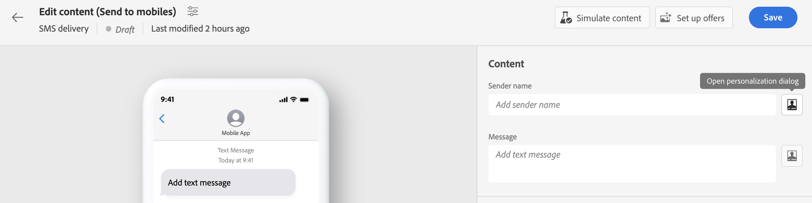

# Aan de slag met dynamische inhoud {#gs-dynamic-content}

>[!CONTEXTUALHELP]
>id="acw_targetdata_personalization_dashboard"
>title="Personalisatie"
>abstract="Met de expressieeditor kunt u alle gegevens selecteren, rangschikken, aanpassen en valideren om een aangepaste ervaring voor uw inhoud te maken. U kunt uw berichten aan elke ontvanger personaliseren door profielgegevens te gebruiken, en voorwaardelijke inhoud creëren om uw bericht aan elke ontvanger aan te passen en slechts de inhoud te tonen die relevant is. Daarnaast zijn er aanpassingsblokken beschikbaar om vooraf gedefinieerde, gepersonaliseerde inhoud toe te voegen aan uw leveringen."

Als marktleider, is het essentieel om klanten te richten die werkelijk in uw dienstenaanbod geinteresseerd zijn en hen in dienst te nemen door efficiënte en relevante inhoud te verstrekken. Gezien de uiteenlopende verscheidenheid aan ontvangers die u tegenkomt, kan het creëren van veelvoudige stukken van marketing inhoud om aan verschillende mensen aan te trekken tijdrovend en verkwistend zijn. Op deze manier wordt dynamische inhoud afgespeeld.

Met de dynamische inhoudsmogelijkheden van Adobe Campaign Web kunt u uw inhoud aanpassen op basis van de gegevens die u over uw ontvangers hebt verzameld. Door dynamische inhoud te gebruiken, zorgt u ervoor dat uw marketing inspanningen relevanter zijn, vermijdend marketing ongewenste of onnodige producten of de diensten. Deze aanpak maakt uw inhoud aantrekkelijker en vergroot de kans dat deze wordt gelezen. Bovendien kunt u uw inhoud aanpassen, zodat ontvangers het gevoel krijgen dat ze informatie van een persoon ontvangen in plaats van van van een computer.

## Hoe kan ik uw inhoud dynamisch maken? {#make-content-dyn}

U kunt de inhoud van uw bericht dynamisch maken door JavaScript-constructies in te voegen in de Campagne Web expression editor. Bij het verzenden van berichten worden deze expressies door Adobe Campaign geïnterpreteerd om de juiste inhoud aan elk van uw ontvangers te leveren:

* **Je berichten personaliseren** aan elke specifieke ontvanger door profielgegevens zoals hun voornaam, belangen, waar zij wonen, wat zij hebben gekocht, en nog veel meer te gebruiken. U kunt om het even welk gebied selecteren beschikbaar in het gegevensbestand van de verpersoonlijkingsredacteur met betrekking tot de ontvanger, het bericht of de levering. Deze verpersoonlijkingsattributen kunnen in de onderwerpregel of het lichaam van uw berichten worden opgenomen. Met de volgende syntaxis wordt de plaats van de ontvanger in de inhoud ingevoegd: &lt;%= receiving.location.city %>.

  {width="800" align="center"}

* **Voorwaardelijke inhoud maken** om uw leveringen aan elke ontvanger aan te passen en slechts de inhoud te tonen die voor een bepaalde klant relevant is die op de informatie wordt gebaseerd u over hen hebt. Hierdoor kunt u specifieke tekstblokken en/of afbeeldingen op basis van voorwaarden weergeven. U kunt bijvoorbeeld een e-mailbanner op basis van het abonnement van de ontvangers aanpassen aan een specifieke service.

  {width="800" align="center"}

* **Verpersoonlijkingsblokken gebruiken** om tijd en hefboomwerking gemakkelijk opnieuw te gebruiken gepersonaliseerde inhoud in uw berichten te besparen. De campagne wordt geleverd met een reeks verpersoonlijkingsblokken die een specifieke rendering bevatten die u in uw leveringen kunt invoegen. U kunt bijvoorbeeld een logo, een wensbericht of een koppeling naar de spiegelpagina van een e-mailbericht toevoegen. Inhoudsblokken zijn beschikbaar bij een speciale vermelding in de verpersoonlijkingseditor.

  {width="800" align="center"}

## De expressie-editor openen {#access}

Adobe Campaign V8 Web verstrekt een uitdrukkingsredacteur waar u kunt selecteren, rangschikken, aanpassen en bevestigen alle gegevens om een aangepaste ervaring voor uw inhoud tot stand te brengen. De expressie-editor is beschikbaar voor alle kanalen, in alle velden met de **[!UICONTROL Open personalization dialog]** -pictogram, zoals het veld voor de onderwerpregel, of e-mailkoppelingen en componenten voor tekst/knopinhoud.

Hier volgen enkele voorbeelden van hoe u toegang krijgt tot de expressieeditor, afhankelijk van de inhoud die u dynamisch wilt maken:

* *De uitdrukkingsredacteur van het de naamgebied van de Afzender toegang hebben*

  {width="800" align="center"}

* *De expressie-editor openen vanuit een e-mailtekstcomponent*

  {width="800" align="center"}

* *Expressieeditor openen via een koppeling in een e-mailbericht*

  {width="800" align="center"}

>[!NOTE]
>
>Naast de expressie-editor kunt u ook een speciale, voorwaardelijke inhoudsontwikkelaar gebruiken bij het ontwerpen van een e-mail. [Meer informatie over het maken van voorwaardelijke inhoud in e-mails](conditions.md)

## Laten we dieper duiken {#dive-deeper}

Nu u inzicht hebt in hoe te om uw inhoud dynamisch te maken, is het tijd om dieper in deze documentatiesecties te duiken beginnen met het werken met de eigenschap.

<table style="table-layout:fixed"><tr style="border: 0;">
<td>

<a href="personalize.md"><strong>Aanpassing toevoegen</strong></a>

</td>
<td>

<a href="conditions.md"><strong>Voorwaardelijke inhoud toevoegen</strong>

</td>
<td>

<a href="content-blocks.md"><strong>Ingebouwde inhoudsblokken toevoegen</strong></a>

</td>
</tr></table>
