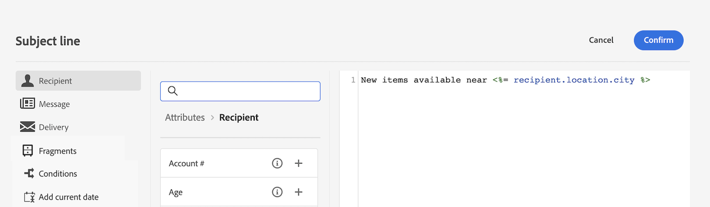

# Aan de slag met dynamische inhoud

Om optimaal te profiteren van elke marketingcampagne, biedt Adobe Campaign u een manier om aangepaste dynamische inhoud te leveren die klanten op hun niveau spreekt. Op basis van profielgegevens kunt u personalisatiefuncties gebruiken om een aangepaste ervaring voor verschillende groepen en personen te maken: u kunt uw berichten aan elke specifieke ontvanger aanpassen door de gegevens en de informatie leveraging u over hen hebt. Het kan hun voornaam zijn, belangen, waar ze wonen, wat ze hebben gekocht, en nog veel meer.

Met Campagne kunt u dynamische inhoud maken en persoonlijke berichten verzenden. U kunt aanpassingsmogelijkheden combineren om uw berichten te verbeteren en een aangepaste gebruikerservaring te creëren.

## Hoe kan ik uw inhoud dynamisch maken?

U kunt de inhoud van uw bericht dynamisch maken door in te voegen:

* **Velden aanpassen**: De gebieden van de verpersoonlijking worden gebruikt voor verpersoonlijking op het eerste niveau van uw berichten. U kunt om het even welk gebied selecteren beschikbaar in het gegevensbestand van de verpersoonlijkingsredacteur. Voor een levering, kunt u om het even welk gebied selecteren met betrekking tot de ontvanger, het bericht of de levering. Deze verpersoonlijkingsattributen kunnen in de onderwerpregel of het lichaam van uw berichten worden opgenomen.

   De volgende syntaxis voegt de plaats van de ontvanger in uw inhoud in: &lt;%= receiving.location.city %>.

   

* **Voorwaardelijke inhoud**: Configureer voorwaardelijke inhoud om inhoud toe te voegen op basis van bijvoorbeeld het profiel van de ontvanger. Tekstblokken en/of afbeeldingen worden ingevoegd wanneer een bepaalde voorwaarde waar is. U kunt de alternatieve versie van de inhoud definiëren als de voorwaarde niet true is.

* **Ingebouwde inhoudsblokken**: De campagne wordt geleverd met een reeks verpersoonlijkingsblokken die een specifieke rendering bevatten die u in uw leveringen kunt invoegen. U kunt bijvoorbeeld een logo, een wensbericht of een koppeling naar de spiegelpagina van een e-mailbericht toevoegen. Inhoudsblokken zijn beschikbaar bij een speciale vermelding in de verpersoonlijkingseditor.

   

## De expressie-editor openen {#access}

Adobe Campaign V8 Web verstrekt een uitdrukkingsredacteur waar u kunt selecteren, rangschikken, aanpassen en bevestigen alle gegevens om een aangepaste ervaring voor uw inhoud tot stand te brengen. De expressie-editor is beschikbaar voor alle kanalen, in alle velden met de **[!UICONTROL Open personalization dialog]** -pictogram, zoals het veld voor de onderwerpregel, of e-mailkoppelingen en componenten voor tekst/knopinhoud.

>[!NOTE]
>
>Naast de expressie-editor kunt u ook een speciale, voorwaardelijke inhoudsontwikkelaar gebruiken bij het ontwerpen van een e-mail. [Meer informatie over het maken van voorwaardelijke inhoud in e-mails](conditions.md)

*De uitdrukkingsredacteur van het de naamgebied van de Afzender toegang hebben*

*De expressie-editor openen vanuit een e-mailtekstcomponent*

*Expressieeditor openen via een koppeling in een e-mailbericht*

## Laten we dieper duiken

Nu u inzicht hebt in hoe te om uw inhoud dynamisch te maken, is het tijd om dieper in deze documentatiesecties te duiken beginnen met het werken met de eigenschap.

<table style="table-layout:fixed"><tr style="border: 0;">
<td>

<a href="personalize.md"><strong>Aanpassing toevoegen</strong></a>

</td>
<td>

<a href="conditions.md"><strong>Voorwaardelijke inhoud toevoegen</strong>

</td>
<td>

<a href="content-blocks.md"><strong>Ingebouwde inhoudsblokken toevoegen</strong></a>

</td>
</tr></table>
