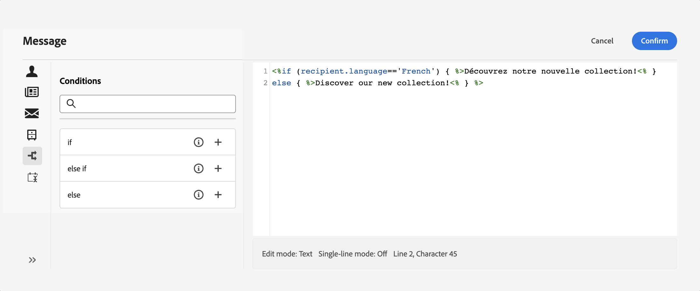

# Hoe kan ik uw inhoud dynamisch maken? {#gs-dynamic-content}

>[!CONTEXTUALHELP]
>id="acw_targetdata_personalization_dashboard"
>title="Personalization"
>abstract="Met de verpersoonlijkingseditor kunt u alle gegevens selecteren, rangschikken, aanpassen en valideren en zo een aangepaste ervaring voor uw inhoud creëren. U kunt uw berichten aan elke ontvanger personaliseren door profielgegevens te gebruiken, en voorwaardelijke inhoud tot stand te brengen om uw bericht aan elke ontvanger aan te passen en slechts de inhoud te tonen die relevant is."

Als marktleider, is het essentieel om klanten te richten die werkelijk in uw dienstenaanbod geinteresseerd zijn en hen in dienst te nemen door efficiënte en relevante inhoud te verstrekken. Gezien de uiteenlopende verscheidenheid aan ontvangers die u tegenkomt, kan het creëren van veelvoudige stukken van marketing inhoud om aan verschillende mensen aan te trekken tijdrovend en verkwistend zijn. Op deze manier wordt dynamische inhoud afgespeeld.

Met de dynamische inhoudsmogelijkheden van Adobe Campaign Web kunt u uw inhoud aanpassen op basis van de gegevens die u over uw ontvangers hebt verzameld. Door dynamische inhoud te gebruiken, zorgt u ervoor dat uw marketing inspanningen relevanter zijn, vermijdend marketing ongewenste of onnodige producten of de diensten. Deze aanpak maakt uw inhoud aantrekkelijker en vergroot de kans dat deze wordt gelezen. Bovendien kunt u uw inhoud aanpassen, zodat ontvangers het gevoel krijgen dat ze informatie van een persoon ontvangen in plaats van van van een computer.

## Hoe kan ik uw inhoud dynamisch maken? {#make-content-dyn}

U kunt uw berichtinhoud dynamisch maken door de constructies van JavaScript in de de uitdrukkingsredacteur van het Web van de Campagne op te nemen. Bij het verzenden van berichten worden deze expressies door Adobe Campaign geïnterpreteerd om de juiste inhoud aan elk van uw ontvangers te leveren:

* **Personaliseer uw berichten** aan elke specifieke ontvanger door profielgegevens zoals hun voornaam, interesses, waar zij leven, wat zij, en veel meer kochten. U kunt om het even welk gebied selecteren beschikbaar in het gegevensbestand van de verpersoonlijkingsredacteur met betrekking tot de ontvanger, het bericht of de levering. Deze verpersoonlijkingsattributen kunnen in de onderwerpregel of het lichaam van uw berichten worden opgenomen. Met de volgende syntaxis wordt de plaats van de ontvanger in de inhoud ingevoegd: &lt;%= receiving.location.city %>.

  {zoomable="yes"}{width="800" align="center"}

* **creeer voorwaardelijke inhoud** om uw leveringen aan elke ontvanger aan te passen en toon slechts de inhoud die voor een bepaalde klant relevant is die op de informatie wordt gebaseerd u over hen hebt. Hierdoor kunt u specifieke tekstblokken en/of afbeeldingen op basis van voorwaarden weergeven. U kunt bijvoorbeeld een e-mailbanner op basis van het abonnement van de ontvangers aanpassen aan een specifieke service.

  {zoomable="yes"}{width="800" align="center"}

➡️ [ ontdekt deze eigenschap in video ](#video)

## De expressie-editor openen {#access}

Adobe Campaign Web verstrekt een uitdrukkingsredacteur waar u kunt selecteren, rangschikken, aanpassen en bevestigen alle gegevens om een aangepaste ervaring voor uw inhoud tot stand te brengen. De expressie-editor is beschikbaar voor alle kanalen, in alle velden met het pictogram **[!UICONTROL Open personalization dialog]** , zoals het veld voor de onderwerpregel, of voor e-mailkoppelingen en componenten voor tekst/knopinhoud.

Hier volgen enkele voorbeelden van hoe u toegang krijgt tot de expressieeditor, afhankelijk van de inhoud die u dynamisch wilt maken:

* *Toegang hebbend tot de uitdrukkingsredacteur van het de naamgebied van de Afzender*

  {zoomable="yes"}{width="800" align="center"}

* *die tot de uitdrukkingsredacteur van een component van de e-mailtekst toegang hebben*

  {zoomable="yes"}{width="800" align="center"}

* *die tot de uitdrukkingsredacteur van een verbinding in e-mail toegang hebben*

  {zoomable="yes"}{width="800" align="center"}

>[!NOTE]
>
>Naast de expressie-editor kunt u ook een speciale, voorwaardelijke inhoudsontwikkelaar gebruiken bij het ontwerpen van een e-mail. [ Leer hoe te om voorwaardelijke inhoud in e-mails te bouwen ](conditions.md)

## Hoe kan ik-video {#video}

Leer hoe te om berichtinhoud dynamisch te maken door de uitdrukkingsredacteur te gebruiken om uw bericht aan te passen of voorwaardelijke inhoud toe te voegen.

>[!VIDEO](https://video.tv.adobe.com/v/3425795?quality=12)
