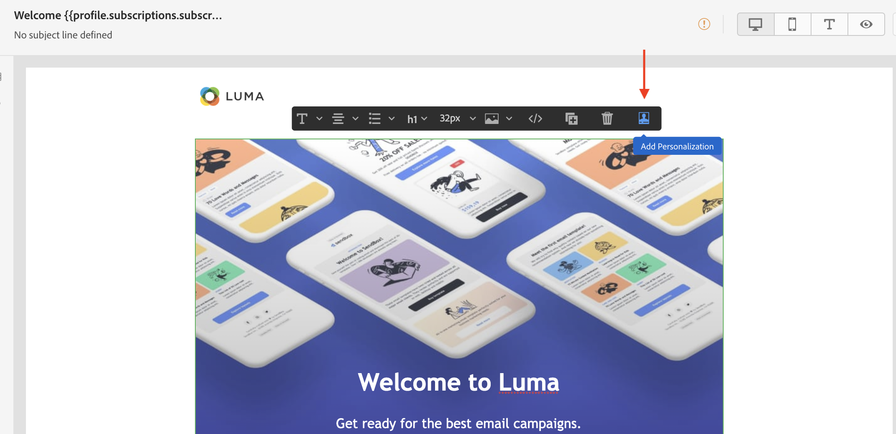

# Aan de slag met personalisatie{#add-personalization}

>[!NOTE]
>
>Screenshots zijn niet up-to-date.

## Je e-mails aanpassen {#personalize-emails}

Wanneer u een e-mailbericht maakt, kunt u personalisatie toevoegen aan de **[!UICONTROL Subject line]** veld van het bericht.

In de e-mailontwerper kunt u de inhoud personaliseren:

* In de **message**: Klik in een tekstblok en klik op de knop **Persoonlijk maken** pictogram in de contextafhankelijke werkbalk en selecteer **Verpersoonlijking invoegen** veld.

   

* Voor een **link**: Selecteer tekst of een afbeelding in een tekstblok. Klik op de knop **Koppeling invoegen** van de contextafhankelijke werkbalk. In het venster kunt u een verpersoonlijkingsblok toevoegen door op het **Aanpassing toevoegen** pictogram.

   

In beide gevallen, hebt u toegang tot de verpersoonlijkingsredacteur.

## Je aanbiedingen aanpassen {#personalize-offers}

U kunt tot de verpersoonlijkingsredacteur ook toegang hebben wanneer het toevoegen van tekst-type inhoud aan uw aanbiedingen&#39; vertegenwoordiging.

