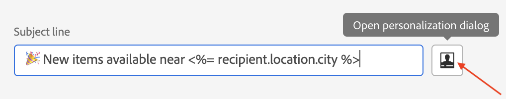

# Uw inhoud aanpassen{#add-personalization}

## De onderwerpregel van een bericht aanpassen {#personalize-subject-line}

Om verpersoonlijking in toe te voegen **[!UICONTROL Subject line]** Voer in het veld van het bericht de onderstaande stappen uit:

1. Open een levering en klik op **[!UICONTROL Edit content]**.
1. Klik op de knop **[!UICONTROL Open personalization dialog]** pictogram rechts van **[!UICONTROL Subject line]** veld voor e-mailberichten, of de **[!UICONTROL Title]** velden voor push/SMS-leveringen.

   {width="600"}

1. Voer de onderwerpregel of titel in en selecteer de personalisatiekenmerken die u wilt toevoegen.

1. Klikken **[!UICONTROL Confirm]** om te valideren. De personalisatiekenmerken worden toegevoegd aan de inhoud.

## Uw e-mailinhoud aanpassen {#personalize-emails}

Als u de e-mailinhoud wilt aanpassen, opent u het bericht in de e-mailontwerper en:

1. Klik in een tekstblok.
1. Selecteer in de contextafhankelijke werkbalk **[!UICONTROL Add personalization]**.

   

1. Voeg de naam van de ontvanger in de verpersoonlijkingseditor in en bevestig deze.

   

   Het personalisatiekenmerk wordt toegevoegd aan de e-mailinhoud.

   U kunt de inhoud simuleren om de rendering te controleren. [Meer informatie](../preview-test/preview-content.md)

   

1. Als u een inhoudsblok aan uw e-mail wilt toevoegen, voert u dezelfde stappen uit en selecteert u een inhoudsblok van het laatste pictogram:

   

1. Zodra opgenomen, wordt het inhoudsblok toegevoegd aan de e-mailinhoud Het wordt automatisch aangepast aan het ontvankelijke profiel wanneer de verpersoonlijking, bij de leveringsvoorbereidingsstap wordt geproduceerd.

   

## Koppelingen in e-mails aanpassen {#personalize-links}

Een **link**:

1. Selecteer een tekstblok of een afbeelding.
1. Selecteer in de contextafhankelijke werkbalk **Koppeling invoegen**.

   

1. Voer het koppelingslabel in en gebruik de **Koppeling invoegen** om de koppeling aan te passen.

   

1. Gebruik de verpersoonlijkingsredacteur om de verbinding te bepalen en te personaliseren, en te bevestigen.

   

## Je aanbiedingen aanpassen {#personalize-offers}

U kunt tot de verpersoonlijkingsredacteur ook toegang hebben wanneer het toevoegen van tekst-type inhoud aan uw aanbiedingen&#39; vertegenwoordiging. Meer informatie in [deze sectie](../content/offers.md).

