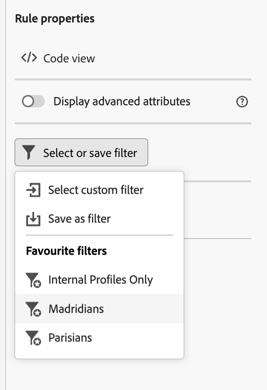

# Werken met vooraf gedefinieerde filters {#predefined-filters}

>[!CONTEXTUALHELP]
>id="acw_homepage_card3"
>title="Vooraf gedefinieerd filterbeheer"
>abstract="Campagne Web biedt u nu een gebruikersvriendelijke interface om vooraf gedefinieerde filters moeiteloos te beheren en aan te passen aan uw specifieke behoeften. Maak één keer en sla dit op voor toekomstig gebruik."

>[!CONTEXTUALHELP]
>id="acw_predefined-filters-dashboard"
>title="Vooraf gedefinieerde filters"
>abstract="Campagne Web biedt u nu een gebruikersvriendelijke interface om vooraf gedefinieerde filters moeiteloos te beheren en aan te passen aan uw specifieke behoeften. Maak één keer en sla dit op voor toekomstig gebruik."

Vooraf gedefinieerde filters zijn aangepaste filters die beschikbaar zijn voor toekomstig gebruik. Zij kunnen als kortere weg tijdens het filtreren verrichtingen met de regelbouwer worden gebruikt.

## Een vooraf gedefinieerd filter maken {#create-predefined-filter}

>[!CONTEXTUALHELP]
>id="acw_predefined-filters-creation"
>title="Een vooraf gedefinieerd filter maken"
>abstract="Voer een label in voor het vooraf gedefinieerde filter en selecteer de tabel waarop het van toepassing is. Open de aanvullende opties om een beschrijving toe te voegen en stel dit filter in als favoriet. Vervolgens gebruikt u de knop &#39;Regel maken&#39; om de filtervoorwaarden te definiëren."

Wanneer u een filter maakt met de regelbouwer, kunt u het opslaan voor toekomstig gebruik. Als het filter wordt opgeslagen als een aangepast filter, is het beschikbaar voor toekomstig gebruik. U kunt ook een vooraf gedefinieerd filter maken en bewerken via het toegewezen menu in de linkernavigatie.

Voer de onderstaande stappen uit om een aangepast filter op te slaan in de regelbuilder:

1. Open de regelbouwer en bepaal uw het filtreren voorwaarden. In het onderstaande voorbeeld filtert u ontvangers die in Madrid wonen.
1. Klik op de knop **Filter selecteren of opslaan** en selecteert u **Opslaan als filter**.

   

1. Selecteren **Een nieuw filter maken** en voert u een naam en een beschrijving voor dat filter in.

   

1. (optioneel) Schakel de optie **Opslaan als favoriet** als u dit vooraf gedefinieerde filter wilt zien in uw favorieten.

   

1. Klikken **Bevestigen** om uw wijzigingen op te slaan.

Uw aangepaste filter is nu beschikbaar in het dialoogvenster **Vooraf gedefinieerde filters** en toegankelijk voor alle campagnegebruikers.

## Een vooraf gedefinieerd filter gebruiken {#use-predefined-filter}

## Uw vooraf gedefinieerde filters beheren {#manage-predefined-filter}

