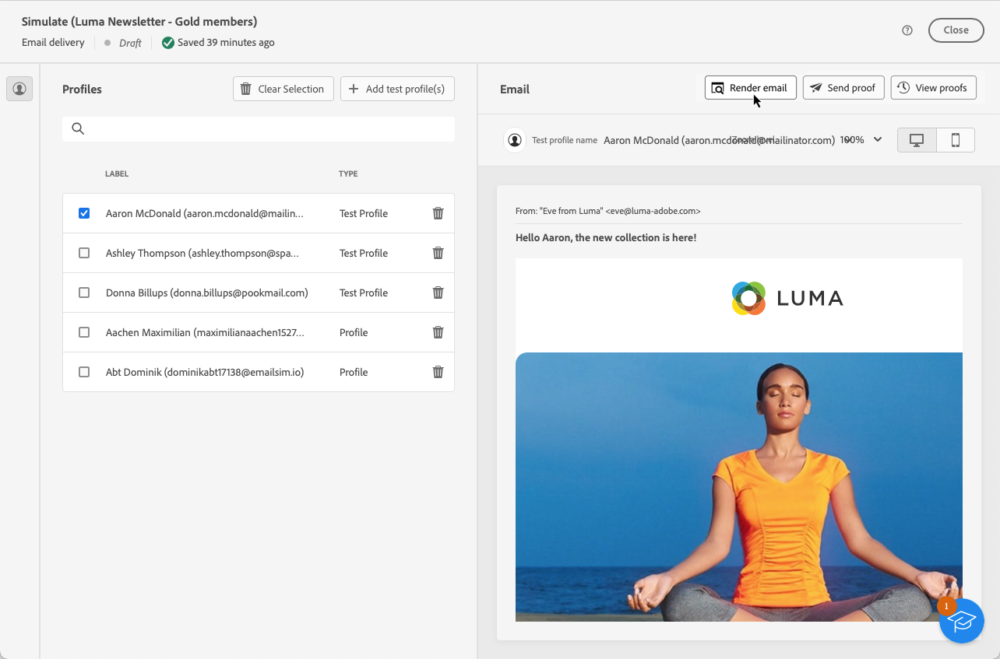

# De rendering van e-mail testen {#email-rendering}

Voordat u uw e-mail verzendt, moet u ervoor zorgen dat uw bericht op een optimale manier aan de ontvangers wordt weergegeven op verschillende webclients en -apparaten.

Hiervoor kunt u uw **Litmus** account [!DNL Adobe Campaign] om direct een voorvertoning van uw e-mailrendering in verschillende contexten weer te geven en de compatibiliteit in belangrijke desktops en toepassingen te controleren (webmail, berichtservice, mobiel, enz.).

>[!CAUTION]
>
>Als u e-mailrendering gebruikt in Campagne, wordt een test-e-mail verzonden naar een systeem van derden. Door uw rekening van Litmus met aan te sluiten [!DNL Campaign], erkent u dat Adobe niet verantwoordelijk is voor gegevens die u naar die derde kunt verzenden. Het beleid voor het bewaren van gegevens per e-mail is van toepassing op deze e-mailberichten, inclusief personalisatiegegevens die in deze testberichten kunnen worden opgenomen. Als u dergelijke gegevens wilt openen of verwijderen, moet u rechtstreeks contact opnemen met Litmus.

Voor toegang tot rendermogelijkheden via e-mail moet u:

* Een Litmus-account hebben
* Profielen en/of testprofielen selecteren - Meer informatie in [deze sectie](preview-content.md)

Voer vervolgens de onderstaande stappen uit.

1. In de [Inhoud bewerken](../email/edit-content.md) of in de [E-mailDesigner](../email/get-started-email-designer.md)klikt u op de knop **[!UICONTROL Simulate content]** knop.

1. Selecteer de knop **[!UICONTROL Render email]**.

   

1. Klikken **Sluit uw Litmus-account aan** in de rechterbovenhoek.

   

1. Voer uw gegevens in en meld u aan.

   

1. Klik op de knop **Test uitvoeren** om e-mailvoorvertoningen te genereren.

1. Controleer uw e-mailinhoud in populaire desktops, mobiele en webclients.

   

<!--
TO CHECK IF user is directed to Litmus or if the email rendering is shown directly in the Campaign UI.

CONTENT ABOVE COPIED FROM AJO

If not redirecting to Litmus:

To test the email rendering, follow these steps:

1. Access the email content creation screen, then click **[!UICONTROL Simulate content]**.

1. Click the **[!UICONTROL Render email]** button.

    The left pane provides various desktop, mobile and web-based email clients. Select the desired email client to display a preview of your email in the right pane. 

    

    >[!NOTE]
    >
    >The email clients list provides a sample of the major mail clients. Additional email clients are available from the filter button next to the top search bar.

 -->
