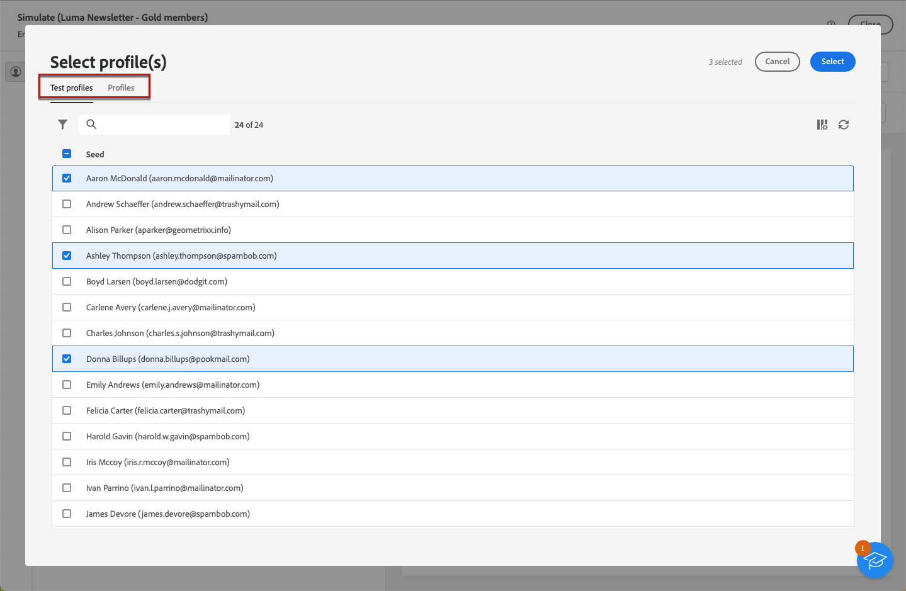

# Een voorvertoning weergeven van de inhoud van het bericht {#preview-content}

Gebruik de [!DNL Campaign] de mogelijkheid van de inhoudsimulatie om de inhoud van uw bericht voor te vertonen alvorens het te verzenden. Dit staat u toe om verpersoonlijking te controleren en te controleren hoe het aan uw ontvangers wordt getoond.

Volg onderstaande stappen om een voorvertoning van de inhoud van uw levering weer te geven.

1. Blader naar het scherm Inhoud bewerken van uw levering of naar het dialoogvenster [E-mailDesigner](../email/get-started-email-designer.md).

1. Klik op de knop **[!UICONTROL Simulate content]**.

   

1. Als u de profielen wilt selecteren waarmee u een voorvertoning van uw gepersonaliseerde inhoud wilt weergeven, gebruikt u:

   * **[!UICONTROL Add test profile(s)]** voor het bekijken van een voorbeeld van e-mail- en sms-berichten

   * **[!UICONTROL Add subscriber(s)]** voor het voorvertonen van pushberichten

1. U kunt testprofielen en -profielen combineren om een voorbeeld van uw e-mail- of sms-bericht te bekijken.

   * De **[!UICONTROL Test profiles]** op het tabblad worden alle adressen weergegeven die aanvullende en fictieve ontvangers in de database zijn.

     

     >[!NOTE]
     >
     >U kunt testprofielen maken op basis van de **[!UICONTROL Customer management]** > **[!UICONTROL Profiles]** -menu. [Meer informatie](../audience/test-profiles.md#create-test-profiles)

   * De **[!UICONTROL Profiles]** worden alle ontvangers weergegeven die in het tabblad **[!UICONTROL Profiles and Targets]** uit de [!DNL Campaign] console. Meer informatie in [Campagne v8-documentatie (clientconsole)](https://experienceleague.adobe.com/docs/campaign/campaign-v8/audience/view-profiles.html){target="_blank"}.

     >[!NOTE]
     >
     >U kunt profielen ook weergeven en beheren op het bijbehorende tabblad in de webinterface van Campagne. [Meer informatie](../audience/about-recipients.md)

1. Wanneer u door het testprofiel of de profiellijsten bladert, kunt u filters gebruiken om uw zoekopdracht te verfijnen.

   

   U kunt bijvoorbeeld een regel definiëren om alle testprofielen te zoeken die **[!UICONTROL Prospect]** status. Leer hoe u regels kunt toevoegen met de opdracht [querymodel](../query/query-modeler-overview.md).

1. Klikken **[!UICONTROL Select]** om uw selectie te bevestigen.

   Er wordt een voorvertoning van de inhoud van de levering weergegeven in het rechterdeelvenster van het dialoogvenster **[!UICONTROL Simulate]** scherm. Gepersonaliseerde elementen worden vervangen door de gegevens van het profiel dat in het linkerdeelvenster is geselecteerd.

   

1. Als u meerdere profielen hebt toegevoegd, kunt u tussen de profielen in de lijst schakelen om een voorvertoning van de bijbehorende leveringsinhoud weer te geven. U kunt ook meer testprofielen toevoegen en de selectie wissen met de desbetreffende knoppen in het linkerdeelvenster.

1. Voor e-mailleveringen kunt u de **[!UICONTROL Zoom level]** en bekijk een voorvertoning van uw inhoud op het bureaublad of mobiele apparaat met behulp van het toegewezen pictogram in de rechterbovenhoek.

1. Van de **[!UICONTROL Simulate]** scherm kunt u ook:
   * Verstuur testleveringen naar specifieke ontvangers voor validatie - [Meer informatie](test-deliveries.md)
   * Open de logboeken van de verzonden testleveringen - [Meer informatie](test-deliveries.md#access-test-deliveries)
   * Alleen voor e-mail: controleer de weergave van berichtinhoud in populaire e-mailclients - [Meer informatie](email-rendering.md)

