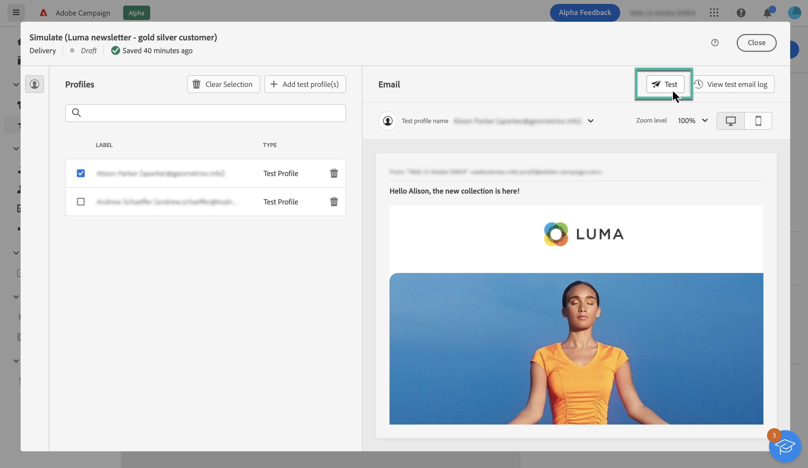
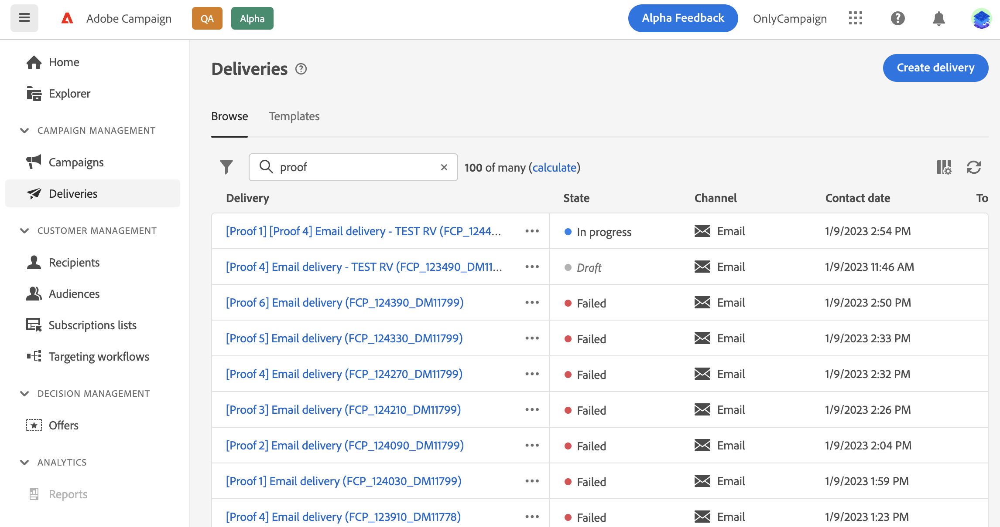

# Test-e-mails verzenden {#send-proofs}

Het verzenden van e-mails over tests is een belangrijke stap in het valideren van uw e-mailcampagne en het identificeren van mogelijke problemen. Door teste-mails te verzenden, kunt u verschillende elementen controleren, zoals koppelingen, opt-out-koppelingen, afbeeldingen en spiegelpagina&#39;s, en eventuele fouten opsporen.

U kunt teste-mails verzenden naar twee typen ontvangers:

* **Testprofielen**: teste-mails sturen naar zaadadressen, die aanvullende en fictieve ontvangers in de database zijn;

* **Vervanging van hoofddoel**: U kunt teste-mails verzenden naar een specifiek e-mailadres terwijl u een bestaand profiel imiteert. Zo kunt u het e-mailbericht net zo ervaren als de ontvangers, zodat u het bericht dat het profiel ontvangt, op de juiste wijze kunt weergeven.

## Selecteer de testontvangers {#recipients}

1. Open het scherm voor het simuleren van e-mailinhoud en klik op **[!UICONTROL Test]** knop.

   

1. Gebruik de **[!UICONTROL Mode]** vervolgkeuzelijst om het type ontvangers te kiezen dat de teste-mail ontvangt:

   * **Testprofielen**: de test-e-mail verzenden naar zaadadressen, die aanvullende en fictieve ontvangers in de database zijn;

   * **Vervanging van hoofddoel**: Stuur de test-e-mail naar een specifiek e-mailadres en imiteer een bestaand profiel. Zo kunt u het e-mailbericht net zo ervaren als de ontvangers, zodat u het bericht dat het profiel ontvangt, op de juiste wijze kunt weergeven.

   

   >[!NOTE]
   >
   >Standaard worden de **[!UICONTROL Test profiles]** is geselecteerd. Als u al profielen hebt geselecteerd om een voorvertoning van de e-mail weer te geven in het scherm voor het simuleren van de inhoud, worden deze profielen vooraf geselecteerd als testontvangers. U kunt uw selectie wissen en/of extra ontvangers toevoegen.

1. Kies de optie **[!UICONTROL Substitution from target]** Voer vervolgens de volgende stappen uit:

   1. Klik op de knop **[!UICONTROL Add address]** en geeft u het e-mailadres op dat de teste-mail ontvangt.

      U kunt elk e-mailadres invoeren. Op deze manier kunt u teste-mails sturen naar gebruikers, zelfs als zij geen gebruikers van Adobe Campaign V8 zijn.

   1. Selecteer het profiel in het doel dat u wilt gebruiken om de test-e-mail te verzenden. U kunt Adobe Campaign ook een willekeurig profiel van het doel laten selecteren.

   1. Bevestig de ontvanger en herhaal de bewerking om zoveel adressen toe te voegen als nodig is.

      

1. Nadat u de testontvangers hebt geselecteerd, kunt u de teste-mail verzenden. [Leer hoe u e-mailberichten over tests verzendt](#send)

   >[!NOTE]
   >
   >Als u het laatste e-mailbericht naar de ontvangers van de teste-mail wilt verzenden, schakelt u de optie **[!UICONTROL Include test population in the main target]** optie ingeschakeld.

## De test-e-mail verzenden {#send}

Als u het testbericht naar de geselecteerde ontvangers wilt verzenden, klikt u op **[!UICONTROL Send test email]** bevestig vervolgens de verzending.

U kunt zoveel teste-mails verzenden als u nodig hebt, totdat u de inhoud van uw levering hebt voltooid. Zodra dit wordt gedaan, kunt u e-mail naar het belangrijkste doel verzenden. [Leer hoe u uw e-mail voorbereidt en verzendt](../monitor/prepare-send.md)

## E-mails over verzonden testberichten openen {#access-proofs}

Zodra de teste-mails zijn verzonden, hebt u toegang tot toegewezen logbestanden via de **[!UICONTROL View test email log]** knop.

Met deze logboeken hebt u toegang tot alle teste-mails die voor de geselecteerde levering zijn verzonden en kunt u specifieke statistieken over het verzenden van deze mails visualiseren. [Leer hoe u leveringslogboeken kunt controleren](../monitor/delivery-logs.md)

U kunt de verzonden teste-mails ook vanuit de lijst met leveringen openen, net als elke levering.

