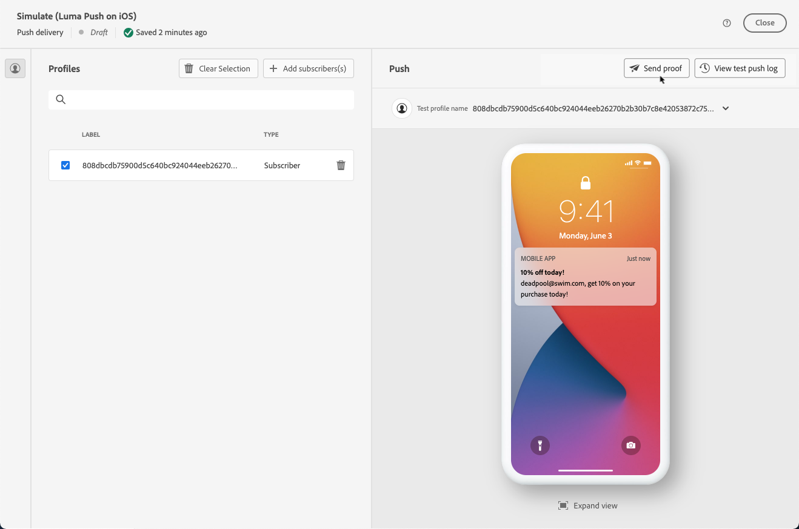

# Testleveringen verzenden {#send-test-deliveries}

**[!UICONTROL Adobe Campaign]** Hiermee kunt u een bericht testen voordat u het naar het hoofdpubliek stuurt.

Het verzenden van testleveringen is een belangrijke stap in het valideren van uw campagne en het identificeren van mogelijke problemen.

De ontvangers van een test kunnen diverse elementen controleren zoals verbindingen, opt-out verbindingen, beelden, of spiegelpagina&#39;s, evenals om het even welke fouten in het teruggeven, de inhoud, verpersoonlijkingsmontages en leveringsconfiguratie ontdekken.

## Selecteer de testontvangers {#test-recipients}

Afhankelijk van het kanaal dat u gebruikt, kunnen testberichten naar drie soorten ontvangers worden verzonden:

* [Testprofielen](#test-profiles) - Verzenden **e-mails en SMS testen** aan zaadadressen, die extra en fictieve ontvangers in het gegevensbestand zijn.

  Ze kunnen worden gemaakt in de [!DNL Campaign] in de **[!UICONTROL Resources]** > **[!UICONTROL Campaign Management]** > **[!UICONTROL Seed addresses]** map. Meer informatie in [Campagne v8 (console)-documentatie](https://experienceleague.adobe.com/docs/campaign/campaign-v8/audience/add-profiles/test-profiles.html){target="_blank"}

* [Vervangen van hoofddoel](#substitution-profiles) - Verzenden **e-mails en SMS testen** naar een specifiek e-mailadres of telefoonnummer wanneer u een bestaand profiel imiteert.

  Op deze manier kunt u het bericht net zo ervaren als de ontvangers, zodat u een nauwkeurige weergave krijgt van de inhoud die het profiel zal ontvangen.

* [Abonnees](#subscribers) - Verzenden **pushmeldingen testen** aan fictieve abonnees die aan het gegevensbestand worden toegevoegd.

  Net als testprofielen kunnen ze worden gemaakt in het dialoogvenster [!DNL Campaign] in de **[!UICONTROL Resources]** > **[!UICONTROL Campaign Management]** > **[!UICONTROL Seed addresses]** map. Meer informatie in [Campagne v8 (console)-documentatie](https://experienceleague.adobe.com/docs/campaign/campaign-v8/audience/add-profiles/test-profiles.html){target="_blank"}

Als u de ontvangers van een testlevering wilt selecteren, volgt u de onderstaande stappen op basis van het type profielen dat u wilt gebruiken.

### Test profiles {#test-profiles}

1. Blader naar het scherm Inhoud bewerken van uw e-mail- of SMS-verzending en klik vervolgens op de knop **[!UICONTROL Simulate content]** knop.

1. Klik op de knop **[!UICONTROL Test]**.

   >[!NOTE]
   >
   >Als u al profielen hebt geselecteerd voor [voorvertoning van uw levering](preview-content.md), worden deze weergegeven in het linkervenster.

   

1. Van de **[!UICONTROL Mode]** vervolgkeuzelijst kiest u **Testprofielen** om fictieve ontvangers te richten die de test e-mail of levering van SMS zullen ontvangen.

1. Als u al profielen hebt geselecteerd voor [voorvertoning van het bericht](preview-content.md) in het scherm van de inhoudsimulatie, worden die profielen pre-geselecteerd als testontvangers. U kunt uw selectie wissen en/of extra ontvangers toevoegen met de opdracht **[!UICONTROL Add test profile(s)]** knop.

   

   >[!NOTE]
   >
   >Standaard worden de **[!UICONTROL Use test profiles]** is geselecteerd.

1. Om het definitieve bericht aan de ontvangers van de testlevering ook te verzenden, selecteer **[!UICONTROL Include test population in the main target]** optie.

1. Nadat de testprofielen zijn geselecteerd, kunt u [verzendt de testlevering](#send-test).

### Vervangende profielen {#substitution-profiles}

Een test-e-mail of -SMS verzenden naar een specifiek e-mailadres of telefoonnummer terwijl gegevens uit een bestaand profiel van het deelvenster [!DNL Campaign] database, gebruik vervangende profielen.

1. Alvorens een test te verzenden, zorg ervoor u een publiek voor u levering bepaalt. [Meer informatie](../audience/about-audiences.md)

1. Blader naar het scherm Inhoud bewerken van uw e-mail- of SMS-verzending en klik vervolgens op de knop **[!UICONTROL Simulate content]** knop.

1. Klik op de knop **[!UICONTROL Test]**.

   >[!NOTE]
   >
   >Als u al profielen hebt geselecteerd voor [voorvertoning van uw levering](preview-content.md), worden deze weergegeven in het linkervenster.

   

1. Van de **[!UICONTROL Mode]** vervolgkeuzelijst kiest u **Vervangen van hoofddoel** om een test naar een specifiek e-mailadres of telefoonnummer te verzenden terwijl de gegevens van een bestaand profiel worden weergegeven.

1. Klik op de knop **[!UICONTROL Add address]** en geeft u het e-mailadres of telefoonnummer op dat de testlevering ontvangt.

   U kunt elk e-mailadres of telefoonnummer invoeren. Hierdoor kunt u testleveringen naar alle ontvangers verzenden, zelfs als deze geen gebruikers van [!DNL Adobe Campaign].

1. Selecteer het profiel in de database dat u als vervanging wilt gebruiken. U kunt ook [!DNL Adobe Campaign] Selecteer een willekeurig profiel. De profielgegevens van het geselecteerde profiel worden in de testlevering weergegeven.

1. Bevestig de ontvanger en herhaal de bewerking om zoveel e-mailadressen of telefoonnummers toe te voegen als nodig is.

   

1. Om het definitieve bericht aan de ontvangers van de testlevering ook te verzenden, selecteer **[!UICONTROL Include test population in the main target]** optie.

1. Als de vervangende profielen zijn geselecteerd, kunt u [verzendt de testlevering](#send-test).

### Abonnees {#subscribers}

Als u werkt met pushberichten, kunnen testleveringen alleen naar abonnees worden verzonden. Volg onderstaande stappen om deze te selecteren.

1. Blader naar het scherm Inhoud bewerken van uw levering en klik vervolgens op de knop **[!UICONTROL Simulate content]** knop.

1. Klik op de knop **[!UICONTROL Test]**.

   

1. Als u al abonnees hebt geselecteerd op [voorvertoning van levering](preview-content.md) in het scherm van de inhoudsimulatie, worden die profielen pre-geselecteerd als testabonnees. U kunt uw selectie wissen en/of extra abonnees toevoegen met behulp van de toegewezen knop.

   

1. Als u het laatste pushbericht ook naar de testabonnees wilt verzenden, selecteert u de optie **[!UICONTROL Include test population in the main target]** optie.

1. Als de abonnees zijn geselecteerd, kunt u [verzendt de testlevering](#send-test).

## De testlevering verzenden {#send-test}

Volg onderstaande stappen om de testlevering naar de geselecteerde ontvangers te verzenden.

1. Klik op de knop **[!UICONTROL Send test]**.

1. Bevestig de verzendende.

   

1. Verzend zoveel tests als nodig zijn tot u de inhoud van uw levering hebt voltooid.

Als u klaar bent, kunt u de levering voorbereiden en naar het hoofddoel verzenden. Leer hoe in de speciale secties hieronder:

* [Uw e-mail verzenden](../monitor/prepare-send.md)
* [Uw pushmelding verzenden](../push/send-push.md#send-push)
* [Verstuur je SMS-verzending](../sms/send-sms.md#send-sms)

## Toegang verzonden testleveringen {#access-proofs}

Zodra de testleveringen zijn verzonden, kunt u toegang krijgen tot toegewezen logbestanden van de **[!UICONTROL View test log]** knop.

Deze logboeken staan u toe om tot alle tests toegang te hebben die voor de geselecteerde levering worden verzonden, en om specifieke statistieken met betrekking tot hun verzending te visualiseren. [Leer hoe u leveringslogboeken kunt controleren](../monitor/delivery-logs.md)

U kunt tot verzonden tests van ook toegang hebben [leveringslijst](../msg/gs-messages.md), zoals elke levering.

