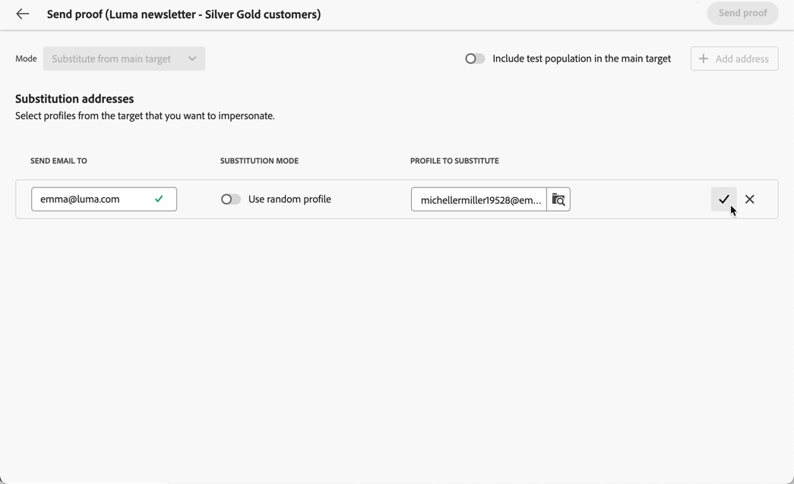
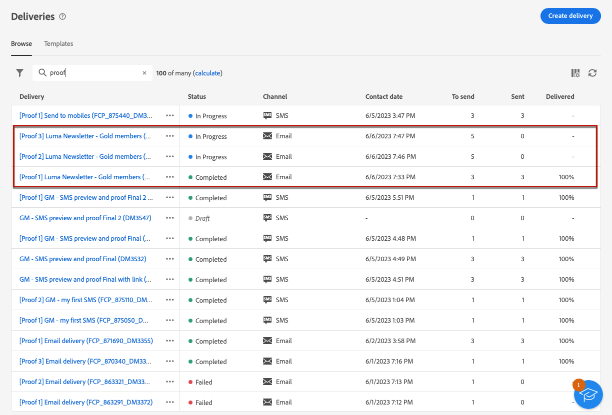

# Proefdrukken verzenden {#send-test-deliveries}

>[!CONTEXTUALHELP]
>id="acw_email_preview_mode"
>title="Voorvertoningsmodus"
>abstract="Geef een voorvertoning van het bericht weer en test het bericht door de testpopulatie op te nemen in het hoofddoel."

>[!CONTEXTUALHELP]
>id="acw_deliveries_additional_proof_target"
>title="Aanvullend proefdrukdoel"
>abstract="Deze regels kunnen slechts in de cliëntconsole worden veranderd."

Nadat de inhoud van uw bericht is gedefinieerd, kunt u deze voorvertonen en testen door proefdrukken naar testprofielen te verzenden. Als u gepersonaliseerde inhoud hebt ingevoegd, kunt u met behulp van testprofielgegevens controleren hoe deze inhoud in het bericht wordt weergegeven.

Om mogelijke fouten in de berichtinhoud of verpersoonlijkingsmontages te ontdekken, verzend proefdrukken naar testprofielen alvorens hen naar het doelpubliek te verzenden. Telkens wanneer een wijziging wordt aangebracht, moet een bewijs worden verzonden om de meest recente inhoud te valideren. Het verzenden van proefdrukken is een belangrijke stap in het valideren van uw campagne en het identificeren van mogelijke problemen. De proefontvangers kunnen verschillende elementen controleren, zoals verbindingen, opt-out verbindingen, beelden, of spiegelpagina&#39;s, evenals om het even welke fouten in de het teruggeven, inhoud, verpersoonlijkingsmontages, en leveringsconfiguratie ontdekken.

## Inhoud met testprofielen simuleren {#simulate-content-test-deliveries}

>[!CONTEXTUALHELP]
>id="acw_email_preview_option_test_target"
>title="Testpopulatie"
>abstract="Selecteer een testpopulatiemodus."

Voordat u een proefdruk verzendt, moet u een doelgroep voor de levering definiëren. [Meer informatie](../audience/add-audience.md)

Uw berichtinhoud testen:

1. Bewerk de inhoud van de levering.
1. Klik op de knop **[!UICONTROL Simulate content]**.
1. Klik op de knop **[!UICONTROL Send proof]** om proefdrukken te verzenden.

   {zoomable="yes"}

1. Selecteer de ontvangers van de proefdruk.

   Afhankelijk van het berichtkanaal, kunnen de proeven naar de volgende soorten ontvangers worden verzonden:

   * Voor SMS en e-mails, kunt u [ testprofielen ](#test-profiles) gebruiken, die specifieke extra ontvangers in het gegevensbestand zijn. U kunt de [ substitutie van belangrijkste doel ](#substitution-profiles) wijze ook gebruiken, die de proef naar een e-mailtestadres of een telefoonaantal verzendt, en verpersoonlijkingsgegevens van een bestaand profiel gebruikt. Op deze manier kunt u het bericht net zo ervaren als de ontvangers, zodat u een nauwkeurige weergave krijgt van de inhoud die het profiel zal ontvangen.

   * Voor duw berichten, kunt u [ abonnees ](#subscribers) gebruiken, die fictieve abonnees zijn die aan het gegevensbestand worden toegevoegd. Ze worden gemaakt in de [!DNL Campaign] -console. Leer meer in [ Campagne v8 (cliëntconsole) documentatie ](https://experienceleague.adobe.com/docs/campaign/campaign-v8/audience/add-profiles/test-profiles.html){target="_blank"}

   De gedetailleerde configuratie voor elke wijze is beschikbaar hieronder.

## Testprofielen gebruiken {#test-profiles}

>[!CONTEXTUALHELP]
>id="acw_deliveries_simulate_test_mode"
>title="Doel van het bewijs"
>abstract="U kunt een tweede bestand uploaden als &#39;doel van de proefdruk&#39; als u de levering wilt testen voordat u het hoofddoel bereikt."

>[!CONTEXTUALHELP]
>id="acw_deliveries_simulate_test_upload"
>title="Profielen uploaden"
>abstract="U kunt een tweede bestand met aanvullende profielen uploaden als u de levering wilt testen met een andere set dan de set die u voor het hoofddoel hebt gebruikt."

>[!CONTEXTUALHELP]
>id="acw_deliveries_simulate_test_sample"
>title="Sjabloonbestand"
>abstract="De opmaak van het bestand moet gelijk zijn aan die van het oorspronkelijke bestand.  Gesteunde dossierformaten: txt, csv. Maximale bestandsgrootte: 15 MB. Eerste regel gebruiken als kolomkop."

>[!CONTEXTUALHELP]
>id="acw_sms_preview_option_app_target"
>title="Testprofielen opnemen in het hoofdpubliek"
>abstract="Schakel deze optie in om het laatste bericht ook naar de ontvangers van de proefdrukken te verzenden."

Testprofielen zijn aanvullende ontvangers in de database. Deze worden gemaakt via het menu **[!UICONTROL Customer management]** > **[!UICONTROL Profiles]** . [Meer informatie](../audience/test-profiles.md#create-test-profiles)

De stappen voor het verzenden van proefdrukken naar testprofielen worden hieronder beschreven.

1. Klik vanuit de inhoud van de levering op de knop **[!UICONTROL Simulate content]** en **[!UICONTROL Send proof]** .

1. Kies in de vervolgkeuzelijst **[!UICONTROL Mode]** de optie **[!UICONTROL Test profiles]** voor het activeren van fictieve ontvangers die de proefdruk of SMS-levering zullen ontvangen.

   {zoomable="yes"}

1. Als u reeds profielen aan [ voorproef het bericht ](preview-content.md) in het scherm van de inhoudsimulatie hebt geselecteerd, worden die profielen pre-geselecteerd als proefontvangers. Met de knop **[!UICONTROL Add test profile(s)]** kunt u de selectie wissen en/of extra ontvangers toevoegen.

1. Wanneer u door het testprofiel of de profiellijsten bladert, kunt u filters gebruiken om uw zoekopdracht te verfijnen. U kunt bijvoorbeeld een regel definiëren om alle testprofielen met de status **[!UICONTROL Prospect]** te zoeken. Leer hoe te om regels toe te voegen gebruikend [ vraagmodeler ](../query/query-modeler-overview.md).

   {zoomable="yes"}

1. Selecteer de optie **[!UICONTROL Include test population in the main target]** om het laatste bericht ook naar de ontvangers van de proefdruk te verzenden.

   {zoomable="yes"}

1. Zodra de testprofielen worden geselecteerd, kunt u [ de proef ](#send-test) verzenden.

## Vervangende profielgegevens {#substitution-profiles}

Gebruik profielvervanging om proefdrukken naar een specifiek e-mailadres of telefoonnummer te verzenden, terwijl de gegevens van een bestaand profiel van de [!DNL Adobe Campaign] -database worden weergegeven. Deze modus kan alleen worden geselecteerd als het publiek van de levering is gedefinieerd.

Voer de volgende stappen uit om profielgegevens van het hoofddoel te vervangen:

1. Klik vanuit de inhoud van de levering op de knop **[!UICONTROL Simulate content]** en **[!UICONTROL Send proof]** .

1. Kies in de vervolgkeuzelijst **[!UICONTROL Mode]** de optie **[!UICONTROL Substitute from main target]** om een proef naar een specifiek e-mailadres of telefoonnummer te verzenden terwijl gegevens uit een bestaand profiel worden weergegeven.

   >[!CAUTION]
   >
   >Als u geen [ publiek ](../audience/about-recipients.md) voor uw levering hebt geselecteerd, zal de **[!UICONTROL Substitute from main target]** optie uit grijs worden en u zult geen substitutieprofielen kunnen selecteren. Bovendien, zelfs als een doelpubliek wordt geselecteerd, voor terugkomende typeleveringen, zal deze optie nog grijs worden aangezien de belangrijkste levering een malplaatje is.

1. Klik op de knop **[!UICONTROL Add address]** en geef het e-mailadres of telefoonnummer op waarop de proefdruk wordt uitgevoerd.

   {zoomable="yes"} toe

   >[!NOTE]
   >
   >U kunt elk e-mailadres of telefoonnummer invoeren. Op deze manier kunt u proefdrukken naar alle ontvangers verzenden, zelfs als deze geen gebruikers van [!DNL Adobe Campaign] zijn.

1. Selecteer het profiel in het doel dat u voor de levering hebt gedefinieerd om als vervangend profiel te gebruiken. U kunt [!DNL Adobe Campaign] ook een willekeurig profiel van het doel laten selecteren. De profielgegevens van het geselecteerde profiel worden weergegeven in de proefdruk.

1. Bevestig de ontvanger en herhaal de bewerking om zoveel e-mailadressen of telefoonnummers toe te voegen als nodig is.

   {zoomable="yes"}

1. Selecteer de optie **[!UICONTROL Include test population in the main target]** om het laatste bericht ook naar de ontvangers van de proefdruk te verzenden.

1. Zodra de substitutieprofielen worden geselecteerd, kunt u [ de proef ](#send-test) verzenden.

## Proefdrukken verzenden naar app-abonnees {#subscribers}

Bij het ontwerpen met pushberichten kunnen proefdrukken alleen naar uw app-abonnees worden verzonden. Volg onderstaande stappen om deze te selecteren.

1. Klik op de knop **[!UICONTROL Simulate content]** en de knop **[!UICONTROL Send proof]** vanuit de inhoud van de pushbestelling.

   {zoomable="yes"}

1. Als u reeds abonnees aan [ voorproef de levering ](preview-content.md) in het scherm van de inhoudsimulatie hebt geselecteerd, worden die profielen pre-geselecteerd als testabonnees.

   U kunt uw selectie wissen en/of extra abonnees toevoegen met behulp van de toegewezen knop.

   {zoomable="yes"} toe

1. Als u het laatste pushbericht ook naar de testabonnees wilt verzenden, selecteert u de optie **[!UICONTROL Include test population in the main target]** .

1. Zodra de abonnees worden geselecteerd, kunt u [ de proef ](#send-test) verzenden.

## De proefdruk verzenden {#send-test}

Volg onderstaande stappen om de proefdruk naar de geselecteerde ontvangers te verzenden.

1. Klik op de knop **[!UICONTROL Send proof]**.

1. Bevestig de verzendende.

   {zoomable="yes"}

1. Verzend zoveel proefdrukken als nodig zijn tot u de inhoud van uw levering hebt voltooid.

Als u klaar bent, kunt u de levering voorbereiden en naar het hoofddoel verzenden. Leer hoe in de speciale secties hieronder:

* [Uw e-mail verzenden](../monitor/prepare-send.md)
* [Uw pushmelding verzenden](../push/send-push.md#send-push)
* [Verstuur je SMS-verzending](../sms/send-sms.md#send-sms)

## Toegang verzonden proefdrukken {#access-test-deliveries}

Nadat de proefdrukken zijn verzonden, kunt u hun logbestanden openen via het scherm **[!UICONTROL Simulate content]** .

Deze logboeken staan u toe om tot alle proeven toegang te hebben die voor de geselecteerde levering worden verzonden en specifieke statistieken met betrekking tot hun verzending visualiseren. [ Leer hoe te om leveringslogboeken te controleren ](../monitor/delivery-logs.md)

{zoomable="yes"}

U kunt tot verzonden proeven van de [ leveringslijst ](../msg/gs-messages.md), als om het even welke levering ook toegang hebben.

{zoomable="yes"}