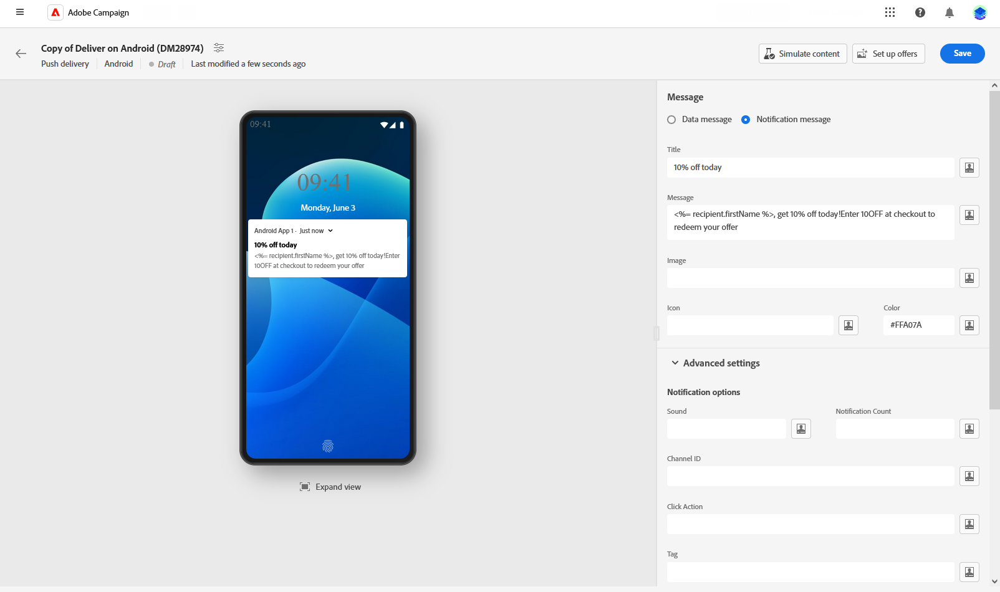
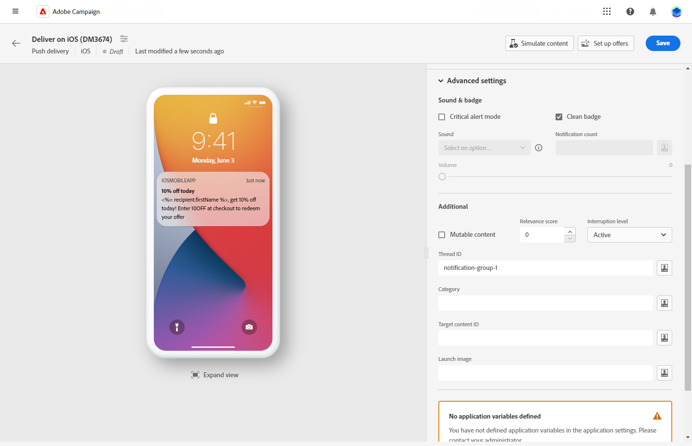

# Een pushaanbieding ontwerpen {#content-push}

>[!CONTEXTUALHELP]
>id="acw_deliveries_push_android_content"
>title="Android-inhoud doordrukken"
>abstract="Definieer de inhoud van uw pushmelding voor Android-apparaten. Klik op de knop **Inhoud bewerken** knop."

>[!CONTEXTUALHELP]
>id="acw_deliveries_push_ios_content"
>title="IOS-inhoud doordrukken"
>abstract="Definieer de inhoud van uw pushmelding voor iOS-apparaten. Klik op de knop **Inhoud bewerken** knop."

## De inhoud van het bericht definiëren {#push-message}

>[!CONTEXTUALHELP]
>id="acw_deliveries_push_ios_msg"
>title="IOS-bericht induwen"
>abstract="Definieer de inhoud van uw pushmelding voor iOS-apparaten. Klik op de knop **Titel** en **Bericht** velden. Gebruik de redacteur van de Uitdrukking om gegevens aan te passen, en dynamische inhoud toe te voegen. Blader voor meer aangepaste configuratie naar de **Geavanceerde instellingen** sectie."

>[!CONTEXTUALHELP]
>id="acw_deliveries_push_android_msg"
>title="Android-bericht induwen"
>abstract="Definieer de inhoud van uw pushmelding voor Android-apparaten. Klik op de knop **Titel** en **Bericht** velden. Gebruik de uitdrukkingsredacteur om gegevens aan te passen en dynamische inhoud toe te voegen. Als u uw pushmelding verder wilt aanpassen, kunt u een afbeelding kiezen die u aan uw pushmelding wilt toevoegen, het pictogram van het bericht dat u op de apparaten van uw profielen wilt weergeven en de kleur van het bericht. Blader voor meer aangepaste configuratie naar de **Geavanceerde instellingen** sectie."

>[!CONTEXTUALHELP]
>id="acw_deliveries_push_ios_silent"
>title="Stil bericht voor iOS"
>abstract="In de modus Silent Push kan een melding &quot;silent&quot; worden verzonden naar een mobiele toepassing. De gebruiker wordt niet op de hoogte gebracht van de aankomst van de melding. Deze wordt rechtstreeks naar de toepassing overgedragen."

Nadat u de pushservice hebt gemaakt, kunt u de inhoud ervan definiëren. Parameters en instellingen zijn afhankelijk van het mobiele besturingssysteem: Android of iOS. Blader op de onderstaande tabbladen om te leren hoe u uw bericht voor elk besturingssysteem kunt samenstellen.

>[!BEGINTABS]

>[!TAB Android]

Met Firebase Cloud Messaging kunt u kiezen uit twee typen berichten:

* De **[!UICONTROL Data message]** wordt afgehandeld door de clienttoepassing. Deze berichten worden rechtstreeks verzonden naar de mobiele toepassing, die een Android-melding op het apparaat genereert en weergeeft. Gegevensberichten bevatten alleen aangepaste toepassingsvariabelen.

  Als u de inhoud wilt definiëren, gegevens wilt aanpassen en dynamische inhoud wilt toevoegen, klikt u op de knop **[!UICONTROL Message]** en gebruikt u de expressie-editor. U kunt tot deze redacteur toegang hebben om uw berichten aan te passen.
In de **[!UICONTROL Application variables]** worden toepassingsvariabelen automatisch toegevoegd. Met deze variabelen kunt u berichtgedrag definiëren. U kunt bijvoorbeeld een specifiek toepassingsscherm configureren dat wordt weergegeven wanneer de gebruiker het bericht activeert.

  {zoomable="yes"}

* De **[!UICONTROL Notification message]**, automatisch afgehandeld door de FCM SDK. FCM geeft automatisch het bericht weer op de apparaten van uw gebruikers namens de client-app. Meldingsberichten bevatten een vooraf gedefinieerde set parameters en opties, maar kunnen nog steeds verder worden aangepast met aangepaste toepassingsvariabelen.

  Klik op de knop **[!UICONTROL Title]** en **[!UICONTROL Message]** velden. Gebruik de uitdrukkingsredacteur om inhoud te bepalen, gegevens te personaliseren en dynamische inhoud toe te voegen.

  Als u uw pushmelding verder wilt aanpassen, kunt u een afbeelding kiezen die u aan uw pushmelding wilt toevoegen, het pictogram van het bericht dat u op de apparaten van uw profielen wilt weergeven en de kleur van het bericht.

  {zoomable="yes"}

>[!TAB iOS]

Klik op de knop **[!UICONTROL Title]** en **[!UICONTROL Message]** velden. Gebruik de uitdrukkingsredacteur om inhoud te bepalen, gegevens te personaliseren en dynamische inhoud toe te voegen.

U kunt een **[!UICONTROL Subtitle]**, waarde van de ondertitelparameter van de iOS-berichtlading. Zie deze sectie.

In de modus Silent Push kan een melding &quot;silent&quot; worden verzonden naar een mobiele toepassing. De gebruiker wordt niet op de hoogte gebracht van de aankomst van de melding. Deze wordt rechtstreeks naar de toepassing overgedragen.

{zoomable="yes"}

>[!ENDTABS]

## Geavanceerde instellingen voor pushmeldingen {#push-advanced}

>[!CONTEXTUALHELP]
>id="acw_deliveries_push_advanced_settings"
>title="Geavanceerde instellingen voor pushberichten"
>abstract="Definieer geavanceerde instellingen voor uw pushmelding, zoals de prioriteit, het aantal meldingen dat eraan is gekoppeld, toepassingsvariabelen en meer."

>[!CONTEXTUALHELP]
>id="acw_deliveries_push_advanced_settings_critical"
>title="Modus Kritieke waarschuwing"
>abstract="Schakel deze optie in om geluid aan uw melding toe te voegen, zelfs wanneer de telefoon van de gebruiker is ingesteld op de focusmodus of wanneer het apparaat wordt gedempt. Dit zorgt ervoor dat gebruikers in elk geval op de hoogte worden gesteld van belangrijke waarschuwingen."

>[!CONTEXTUALHELP]
>id="acw_deliveries_push_advanced_settings_count"
>title="Aantal meldingen"
>abstract="Gebruik deze optie om het aantal ongelezen meldingen in te stellen dat rechtstreeks op het app-pictogram moet worden weergegeven. Hierdoor kan de gebruiker snel zien hoeveel meldingen in behandeling zijn."

>[!CONTEXTUALHELP]
>id="acw_deliveries_push_advanced_settings_mutable"
>title="Mabelinhoud"
>abstract="Gebruik deze optie als u wilt dat de mobiele toepassing media-inhoud kan downloaden die aan het bericht is gekoppeld."

>[!CONTEXTUALHELP]
>id="acw_deliveries_push_advanced_settings_score"
>title="Relevantiescore"
>abstract="Plaats een relevantiescore van 0 tot 100 om de orde van berichten in de berichtsamenvatting voorrang te geven. Hogere scores duiden op belangrijkere meldingen."

>[!CONTEXTUALHELP]
>id="acw_deliveries_push_advanced_settings_app_variables"
>title="Toepassingsvariabelen"
>abstract="Gebruik toepassingsvariabelen om berichtgedrag te bepalen. Deze variabelen kunnen volledig worden aangepast en worden opgenomen in de berichtlading die naar het mobiele apparaat wordt verzonden."

>[!CONTEXTUALHELP]
>id="acw_deliveries_push_advanced_settings_category"
>title="Categorie-id"
>abstract="Geef de naam op van de categorie-id die aan het bericht is gekoppeld. Hierdoor kunnen actieknoppen worden weergegeven, zodat de gebruiker verschillende taken rechtstreeks vanuit het bericht kan uitvoeren zonder de toepassing te openen."

Geavanceerde opties zijn afhankelijk van het mobiele besturingssysteem: Android of iOS. Blader op de onderstaande tabbladen voor meer informatie over het definiëren van opties voor uw bericht voor elk besturingssysteem.

>[!BEGINTABS]

>[!TAB Android]

{zoomable="yes"}

| Parameter | Beschrijving |
|---------|---------|
| **[!UICONTROL Sound]** | Stel het geluid in dat moet worden afgespeeld wanneer het apparaat het bericht ontvangt. |
| **[!UICONTROL Notification Count]** | Stel het aantal nieuwe ongelezen gegevens in dat rechtstreeks op het toepassingspictogram moet worden weergegeven. Hierdoor kan de gebruiker snel zien hoeveel meldingen in behandeling zijn. |
| **[!UICONTROL Channel ID]** | Stel de kanaal-id van uw melding in. De app moet een kanaal met deze kanaal-id maken voordat meldingen met deze kanaal-id worden ontvangen. |
| **[!UICONTROL Click action]** | Bepaal de actie verbonden aan een gebruiker klikt op uw bericht. Dit bepaalt het gedrag wanneer de gebruiker met het bericht communiceert, zoals het openen van een specifiek scherm of het uitvoeren van een specifieke actie in uw app. |
| **[!UICONTROL Tag]** | Stel een id in die wordt gebruikt om bestaande meldingen in de meldingslade te vervangen. Dit helpt de accumulatie van meerdere meldingen te voorkomen en zorgt ervoor dat alleen de meest recente relevante kennisgeving wordt weergegeven. |
| **[!UICONTROL Priority]** | Stel het prioriteitsniveau van uw melding in. Dit kan standaard, minimaal, laag of hoog zijn. Het prioriteitsniveau bepaalt het belang en de urgentie van de melding, en beïnvloedt hoe deze wordt weergegeven en of bepaalde systeeminstellingen kunnen worden omzeild. Raadpleeg voor meer informatie hierover [FCM-documentatie](https://firebase.google.com/docs/reference/fcm/rest/v1/projects.messages#notificationpriority). |
| **[!UICONTROL Visibility]** | Stel het zichtbaarheidsniveau van uw melding in. Dit kan openbaar, privé of geheim zijn. Het zichtbaarheidsniveau bepaalt hoeveel van de inhoud van het bericht wordt weergegeven op het vergrendelingsscherm en andere gevoelige gebieden. Raadpleeg voor meer informatie de [FCM-documentatie](https://firebase.google.com/docs/reference/fcm/rest/v1/projects.messages#visibility). |
| **[!UICONTROL Sticky]** | Wanneer geactiveerd, blijft het bericht zichtbaar zelfs nadat de gebruiker erop klikt.  Indien gedeactiveerd, wordt het bericht automatisch verworpen wanneer de gebruiker met het in wisselwerking staat. Dankzij het plakgedrag blijven belangrijke meldingen langer op het scherm staan. |
| **[!UICONTROL Application variables]** | Hiermee kunt u gedrag voor meldingen definiëren. Deze variabelen kunnen volledig worden aangepast en worden opgenomen in de berichtlading die naar het mobiele apparaat wordt verzonden. |

>[!TAB iOS]

{zoomable="yes"}

| Parameter | Beschrijving |
|---------|---------|
| **[!UICONTROL Critical alert mode]** | Schakel deze optie in om geluid aan uw melding toe te voegen, zelfs wanneer de telefoon van de gebruiker is ingesteld op de focusmodus of wanneer het apparaat wordt gedempt. Dit zorgt ervoor dat belangrijke alarm door de gebruiker wordt opgemerkt. Als deze optie is geselecteerd, kunt u het volume van het bericht aanpassen met de balk Volume. Een getal tussen 0 en 100 boven de balk geeft uw instellingen weer. |
| **[!UICONTROL Clean Badge]** | Schakel deze optie in om de waarde van de badge die op het toepassingspictogram wordt weergegeven, te vernieuwen. Het zorgt ervoor dat de badge het aantal nieuwe ongelezen informatie nauwkeurig weerspiegelt. |
| **[!UICONTROL Notification count]** | Stel een nummer in dat rechtstreeks op het toepassingspictogram wordt weergegeven en dat het aantal nieuwe ongelezen gegevens aangeeft. Dit biedt een snelle visuele referentie voor de gebruiker. |
| **[!UICONTROL Volume]** | Volume van het geluid van 0 tot 100. |
| **[!UICONTROL Mutable content]** | Schakel deze optie in als u wilt dat de mobiele toepassing media-inhoud kan downloaden die aan het bericht is gekoppeld. Zie [Apple Developer documentatie](https://developer.apple.com/library/content/documentation/NetworkingInternet/Conceptual/RemoteNotificationsPG/ModifyingNotifications.html) voor meer informatie hierover. |
| **[!UICONTROL Relevance score]** | Plaats een relevantiescore van 0 tot 100 om de orde van berichten in de berichtsamenvatting voorrang te geven. Hogere scores duiden op belangrijkere meldingen. |
| **[!UICONTROL Interruption level]** | <ul> <li>**[!UICONTROL Active]**: Standaard ingesteld, geeft het systeem de melding direct weer, licht het scherm omhoog en kan een geluid worden afgespeeld. Meldingen doorbreken niet door de focusmodi.</li><li>**[!UICONTROL Passive]**: Het systeem voegt het bericht toe aan de meldingslijst zonder het scherm te belichten of een geluid af te spelen. Meldingen doorbreken niet door de focusmodi.</li><li>**[!UICONTROL Time sensitive]**: Het systeem presenteert de melding direct, licht het scherm op, kan een geluid afspelen en de modus Focus doorbreken. Voor dit niveau is geen speciale toestemming van Apple vereist.</li> <li>**[!UICONTROL Critical]**: Het systeem presenteert de melding direct, licht het scherm op en laat de modi voor demtschakelaar of focus over. Voor dit niveau is een speciale machtiging van Apple vereist.</ul> |
| **[!UICONTROL Thread-id]** | Identifier die wordt gebruikt om gerelateerde meldingen te groeperen. De berichten met zelfde draadidentiteitskaart worden georganiseerd als één enkel gesprek of draad in de berichtlijst. |
| **[!UICONTROL Category]** | Geef de naam op van de categorie-id die aan het bericht is gekoppeld. Hierdoor kunnen actieknoppen worden weergegeven, zodat de gebruiker verschillende taken rechtstreeks vanuit het bericht kan uitvoeren zonder de toepassing te openen. |
| **[!UICONTROL Target content ID]** | Identifier die wordt gebruikt om aan te geven welk toepassingsvenster naar voren moet worden gebracht wanneer het bericht wordt geopend. |
| **[!UICONTROL Launch image]** | Geef de naam op van het afbeeldingsbestand dat moet worden weergegeven wanneer de gebruiker de toepassing start via het bericht. De geselecteerde afbeelding wordt weergegeven in plaats van het gewone startscherm van uw toepassing. |
| **[!UICONTROL Application variables]** | Hiermee kunt u gedrag voor meldingen definiëren. Deze variabelen kunnen volledig worden aangepast en worden opgenomen in de berichtlading die naar het mobiele apparaat wordt verzonden. |

>[!ENDTABS]

<!--Sounds must be included in the application and defined when the service is created. Refer to this section.-->
