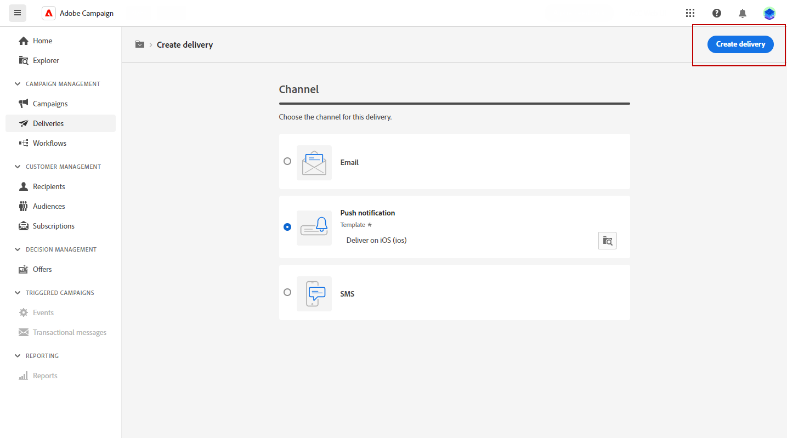
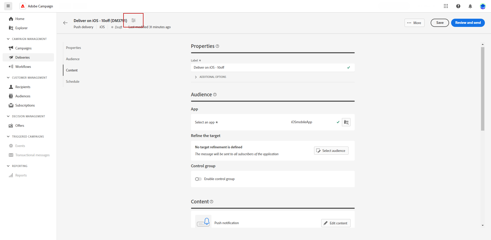

# Een pushmelding maken {#create-push}

>[!CONTEXTUALHELP]
>id="acw_deliveries_push_audience"
>title="Het pushpubliek definiëren"
>abstract="Selecteer het beste publiek voor uw pushbericht."

>[!CONTEXTUALHELP]
>id="acw_push_notification_template"
>title="Sjabloon voor pushmelding"
>abstract="Selecteer een sjabloon voor pushmeldingen om de pushlevering te starten."

>[!CONTEXTUALHELP]
>id="acw_deliveries_push_properties"
>title="Eigenschappen van push-levering"
>abstract="Beheer de eigenschappen voor de levering van de push."

U kunt een zelfstandige levering van pushberichten maken of een pushmelding maken in de context van een campagneworkflow. In de onderstaande stappen wordt de procedure beschreven voor een zelfstandige (one-shot) pushlevering. Als u in de context van een campagnewerkstroom werkt, zijn de aanmaakstappen details in [deze sectie](../workflows/activities/channels.md#create-a-delivery-in-a-campaign-workflow).

Ga als volgt te werk om een nieuwe zelfstandige pushaanbieding te maken:

1. Bladeren naar de **[!UICONTROL Deliveries]** op de linkerspoorstaaf en klik op  **[!UICONTROL Create delivery]** knop.

1. Onder de **[!UICONTROL Channel]** sectie, kiest u **Pushmelding** als het kanaal en selecteer een sjabloon, afhankelijk van het gekozen besturingssysteem van het apparaat: Android of iOS. [Meer informatie over sjablonen](../msg/delivery-template.md)

1. Klik op de knop **[!UICONTROL Create delivery]** ter bevestiging.

   

1. Voer een **[!UICONTROL Label]** voor levering en toegang tot **[!UICONTROL Additional options]** vervolgkeuzelijst.

   +++Configureer de volgende instellingen op basis van uw vereisten.
   * **[!UICONTROL Internal name]**: Wijs een unieke id toe aan de levering.
   * **[!UICONTROL Folder]**: Sla de levering op in een specifieke map.
   * **[!UICONTROL Delivery code]**: Organiseer uw leveringen met uw eigen naamgevingsconventie.
   * **[!UICONTROL Description]**: Geef een beschrijving voor de levering.
   * **[!UICONTROL Nature]**: Geef de aard van de e-mail op voor classificatiedoeleinden.
+++

1. Van de **[!UICONTROL Audience]** selecteert u de toepassing die u voor deze levering wilt gebruiken.

1. Klik op de knop **[!UICONTROL Select audience]** om een bestaand publiek als doel in te stellen of uw eigen publiek te maken. [Meer informatie](../audience/about-recipients.md)

   Merk op dat uw pushmelding standaard wordt verzonden naar alle abonnees van de toepassing.

   

1. Schakel de **[!UICONTROL Enable control]** groepoptie om een controlegroep te plaatsen om het effect van uw levering te meten toelatend u om het gedrag van de bevolking te vergelijken die het bericht met het gedrag van contacten ontving die niet. [Meer informatie](../audience/control-group.md)

1. Klikken **[!UICONTROL Edit content]** om de inhoud van uw pushmelding te ontwerpen. [Meer informatie](content-push.md)

   

   Vanuit dit scherm kunt u ook [simuleren, inhoud](../preview-test/preview-test.md) en [aanbiedingen instellen](../content/offers.md).

1. Als u de levering wilt plannen op een bepaalde datum en tijd, schakelt u de optie **[!UICONTROL Enable scheduling]** -optie. Nadat u de levering in werking stelt, zal het bericht automatisch op de nauwkeurige datum en de tijd worden verzonden die u voor de ontvanger hebt bepaald. Meer informatie over de planning van de levering in [deze sectie](../msg/gs-messages.md#gs-schedule)

   

1. Klikken **[!UICONTROL Configure delivery settings]** voor toegang tot geavanceerde opties met betrekking tot uw leveringsmalplaatje. [Meer informatie](../advanced-settings/delivery-settings.md)

   
