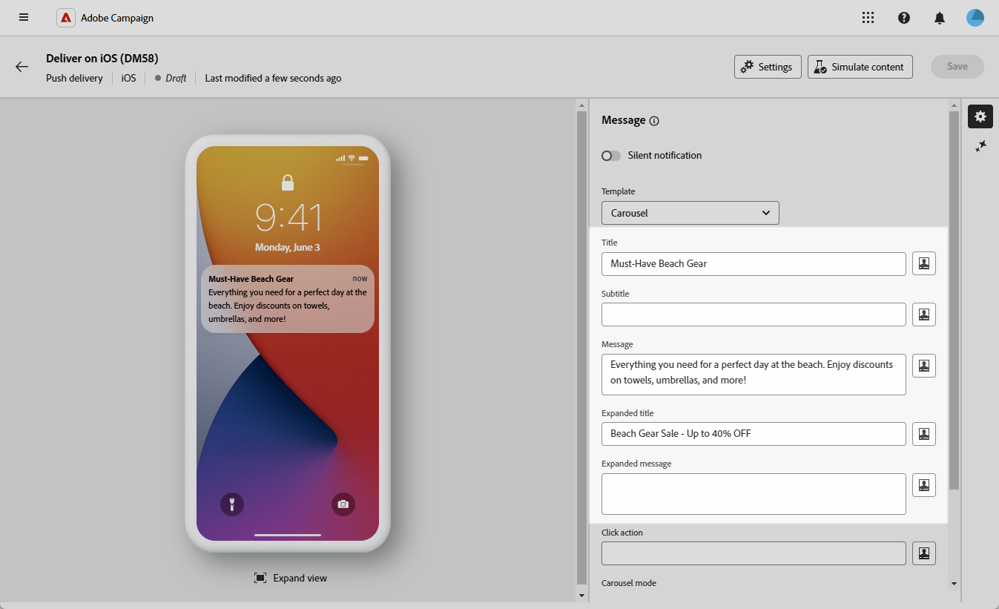

# Ontwerpen als een rijke push-service voor iOS {#rich-push}

>[!IMPORTANT]
>
>Alvorens een Rich Push Bericht te ontwerpen, moet u eerst uw V2 schakelaar vormen. Verwijs naar [ deze pagina ](https://experienceleague.adobe.com/en/docs/campaign-classic/using/sending-messages/sending-push-notifications/configure-the-mobile-app/configuring-the-mobile-application) voor de gedetailleerde procedure.

## De inhoud van het bericht definiëren {#push-message}

Nadat u de pushservice hebt gemaakt, kunt u de inhoud definiëren met een van de volgende sjablonen:

* **Gebrek** staat u toe om berichten met een eenvoudig pictogram en een begeleidend beeld te verzenden.

* **Basis** kan tekst, beelden, en knopen in uw berichten omvatten.

* **Carrousel** laat u toe om berichten met tekst en veelvoudige beelden te verzenden die de gebruikers door kunnen vegen.

* **Tijdopnemer** omvat een levende tellertijdopnemer in uw berichten.

Navigeer door de lusjes hieronder om meer te leren over hoe te om deze malplaatjes aan te passen.

>[!BEGINTABS]

>[!TAB  Gebrek ]

1. Selecteer **[!UICONTROL Default]** in de vervolgkeuzelijst **[!UICONTROL Template]** .

   

1. Voer in het veld **[!UICONTROL Title]** het label in van de titel die u wilt weergeven in de lijst met meldingen die beschikbaar is in het meldingscentrum.

   Dit gebied staat u toe om de waarde van de **titel** parameter van de het berichtlading van iOS te bepalen.

1. Naar keuze, voeg a **[!UICONTROL Subtitle]** toe, die aan de **ondertitel** parameter van de het berichtlading van iOS beantwoordt.

1. Voer de inhoud van het bericht in het veld **[!UICONTROL Message]** in.

1. Gebruik de uitdrukkingsredacteur om inhoud te bepalen, gegevens te personaliseren en dynamische inhoud toe te voegen. [Meer informatie](../personalization/personalize.md)

   

1. Als u uw pushmelding verder wilt aanpassen, kunt u een **[!UICONTROL Launch image]** URL kiezen om aan uw pushmelding toe te voegen.

1. Navigeer in de vervolgkeuzelijst **[!UICONTROL Advanced settings]** naar het tabblad **[!UICONTROL Sound and Badge]** om aanvullende instellingen aan te passen, zoals opties voor geluid en badge voor uw meldingen. [Meer informatie](#sound-badge)

   

1. Voor verdere aanpassing verkent u de **[!UICONTROL Additional]** -opties die beschikbaar zijn voor uw pushberichten. [Meer informatie](#push-advanced)

   

1. Via het menu **[!UICONTROL Application variables]** wordt de koppeling **[!UICONTROL Application variables]** automatisch toegevoegd. Met deze instructies kunt u bijvoorbeeld het berichtgedrag definiëren. U kunt dan een specifiek toepassingsscherm configureren dat wordt weergegeven wanneer de gebruiker het bericht activeert.

Nadat u de inhoud van uw bericht hebt gedefinieerd, kunt u testabonnees gebruiken om het bericht voor te vertonen en te testen.

>[!TAB  Basis ]

1. Selecteer **[!UICONTROL Basic]** in de vervolgkeuzelijst **[!UICONTROL Template]** .

   

1. Als u uw bericht wilt samenstellen, voert u de tekst in in de velden **[!UICONTROL Title]** , **[!UICONTROL Expanded title]** , **[!UICONTROL Message]** en **[!UICONTROL Expanded message]** .

   De tekst **[!UICONTROL Message]** wordt weergegeven in de samengevouwen weergave terwijl de tekst **[!UICONTROL Expanded message]** wordt weergegeven wanneer het bericht wordt uitgevouwen.

   

1. Gebruik de uitdrukkingsredacteur om inhoud te bepalen, gegevens te personaliseren en dynamische inhoud toe te voegen. [Meer informatie](../personalization/personalize.md)

1. Naar keuze, voeg a **[!UICONTROL Subtitle]** toe, die aan de **ondertitel** parameter van de het berichtlading van iOS beantwoordt.

1. Voeg de URL toe die de **[!UICONTROL Click action]** definieert die is gekoppeld aan een gebruiker en klik op uw melding. Dit bepaalt het gedrag wanneer de gebruiker met het bericht communiceert, zoals het openen van een specifiek scherm of het uitvoeren van een specifieke actie in uw app.

1. Als u uw pushmelding verder wilt aanpassen, kunt u een **[!UICONTROL Launch image]** URL kiezen om aan uw pushmelding toe te voegen.

1. Navigeer in de vervolgkeuzelijst **[!UICONTROL Advanced settings]** naar het tabblad **[!UICONTROL Sound and Badge]** om aanvullende instellingen aan te passen, zoals opties voor geluid en badge voor uw meldingen. [Meer informatie](#sound-badge)

   

1. Voer in het menu **[!UICONTROL Color options]** hexadecimale kleurcodes in voor de **[!UICONTROL Notification background color]** , **[!UICONTROL Notification background color]** en **[!UICONTROL Message text color]** .

   

1. Voor verdere aanpassing verkent u de **[!UICONTROL Additional]** -opties die beschikbaar zijn voor uw pushberichten. [Meer informatie](#push-advanced)

1. Via het menu **[!UICONTROL Application variables]** wordt de koppeling **[!UICONTROL Application variables]** automatisch toegevoegd. Met deze instructies kunt u bijvoorbeeld het berichtgedrag definiëren. U kunt dan een specifiek toepassingsscherm configureren dat wordt weergegeven wanneer de gebruiker het bericht activeert.

Nadat u de inhoud van uw bericht hebt gedefinieerd, kunt u testabonnees gebruiken om het bericht voor te vertonen en te testen.

>[!TAB  Carousel ]

1. Selecteer **[!UICONTROL Carousel]** in de vervolgkeuzelijst **[!UICONTROL Template]** .

   

1. Als u uw bericht wilt samenstellen, voert u de tekst in in de velden **[!UICONTROL Title]** , **[!UICONTROL Expanded title]** , **[!UICONTROL Message]** en **[!UICONTROL Expanded message]** .

   De tekst **[!UICONTROL Message]** wordt weergegeven in de samengevouwen weergave terwijl de tekst **[!UICONTROL Expanded message]** wordt weergegeven wanneer het bericht wordt uitgevouwen.

   

1. Gebruik de uitdrukkingsredacteur om inhoud te bepalen, gegevens te personaliseren en dynamische inhoud toe te voegen. [Meer informatie](../personalization/personalize.md)

1. Naar keuze, voeg a **[!UICONTROL Subtitle]** toe, die aan de **ondertitel** parameter van de het berichtlading van iOS beantwoordt.

1. Voeg de URL toe die de **[!UICONTROL Click action]** definieert die is gekoppeld aan een gebruiker en klik op uw melding. Dit bepaalt het gedrag wanneer de gebruiker met het bericht communiceert, zoals het openen van een specifiek scherm of het uitvoeren van een specifieke actie in uw app.

1. Kies hoe de **[!UICONTROL Carousel]** wordt uitgevoerd:

   * **[!UICONTROL Auto]**: doorloopt afbeeldingen automatisch als dia&#39;s en gaat u met vooraf gedefinieerde intervallen verder.
   * **[!UICONTROL Manual]**: hiermee kunnen gebruikers handmatig tussen dia&#39;s vegen om door de afbeeldingen te navigeren.

1. Klik op **[!UICONTROL Add image]** en voer de **[!UICONTROL Image]** URL, **[!UICONTROL Text]** en **[!UICONTROL Action URI]** in.

   Zorg ervoor dat u minimaal drie en maximaal vijf afbeeldingen opneemt.

   

1. Verwerk de volgorde van de afbeeldingen met de pijl-omlaag en de pijl-omhoog.

1. Navigeer in de vervolgkeuzelijst **[!UICONTROL Advanced settings]** naar het tabblad **[!UICONTROL Sound and Badge]** om aanvullende instellingen aan te passen, zoals opties voor geluid en badge voor uw meldingen. [Meer informatie](#sound-badge)

1. Voer in het menu **[!UICONTROL Color options]** hexadecimale kleurcodes in voor de **[!UICONTROL Notification background color]** , **[!UICONTROL Notification background color]** en **[!UICONTROL Message text color]** .

   

1. Voor verdere aanpassing verkent u de **[!UICONTROL Additional]** -opties die beschikbaar zijn voor uw pushberichten. [Meer informatie](#push-advanced)

1. Via het menu **[!UICONTROL Application variables]** wordt de koppeling **[!UICONTROL Application variables]** automatisch toegevoegd. Met deze instructies kunt u bijvoorbeeld het berichtgedrag definiëren. U kunt dan een specifiek toepassingsscherm configureren dat wordt weergegeven wanneer de gebruiker het bericht activeert.

Nadat u de inhoud van uw bericht hebt gedefinieerd, kunt u testabonnees gebruiken om het bericht voor te vertonen en te testen.

>[!TAB  Tijdopnemer ]

1. Selecteer **[!UICONTROL Timer]** in de vervolgkeuzelijst **[!UICONTROL Notification type]** .

   

1. Als u uw bericht wilt samenstellen, voert u de tekst in in de velden **[!UICONTROL Title]** , **[!UICONTROL Expanded title]** , **[!UICONTROL Message]** en **[!UICONTROL Expanded message]** .

   De tekst **[!UICONTROL Message]** wordt weergegeven in de samengevouwen weergave terwijl de tekst **[!UICONTROL Expanded message]** wordt weergegeven wanneer het bericht wordt uitgevouwen.

   

1. Gebruik de uitdrukkingsredacteur om inhoud te bepalen, gegevens te personaliseren en dynamische inhoud toe te voegen. [Meer informatie](../personalization/personalize.md)

1. Naar keuze, voeg a **[!UICONTROL Subtitle]** toe, die aan de **ondertitel** parameter van de het berichtlading van iOS beantwoordt.

1. Voeg de URL toe die de **[!UICONTROL Click action]** definieert die is gekoppeld aan een gebruiker en klik op uw melding. Dit bepaalt het gedrag wanneer de gebruiker met het bericht communiceert, zoals het openen van een specifiek scherm of het uitvoeren van een specifieke actie in uw app.

1. Als u uw pushmelding verder wilt aanpassen, kunt u een **[!UICONTROL Launch image]** URL kiezen om aan uw pushmelding toe te voegen.

1. Stel de **[!UICONTROL Timer duration]** in seconden of de **[!UICONTROL Timer end timestamp]** in op een specifieke tijdstempel voor de epoche.

   

1. Voer de tekst en afbeelding in die worden weergegeven nadat de timer is verlopen in de velden **[!UICONTROL Alternate title]** , **[!UICONTROL Alternate message]** en **[!UICONTROL Alternate launch image]** .

   

1. Navigeer in de vervolgkeuzelijst **[!UICONTROL Advanced settings]** naar het tabblad **[!UICONTROL Sound and Badge]** om aanvullende instellingen aan te passen, zoals opties voor geluid en badge voor uw meldingen. [Meer informatie](#sound-badge)

1. Voer in het menu **[!UICONTROL Color options]** hexadecimale kleurcodes in voor de **[!UICONTROL Notification background color]** , **[!UICONTROL Notification background color]** en **[!UICONTROL Message text color]** .

1. Voor verdere aanpassing verkent u de **[!UICONTROL Additional]** -opties die beschikbaar zijn voor uw pushberichten. [Meer informatie](#push-advanced)

1. Via het menu **[!UICONTROL Application variables]** wordt de koppeling **[!UICONTROL Application variables]** automatisch toegevoegd. Met deze instructies kunt u bijvoorbeeld het berichtgedrag definiëren. U kunt dan een specifiek toepassingsscherm configureren dat wordt weergegeven wanneer de gebruiker het bericht activeert.

Nadat u de inhoud van uw bericht hebt gedefinieerd, kunt u testabonnees gebruiken om het bericht voor te vertonen en te testen.

>[!ENDTABS]

## Geavanceerde instellingen voor pushmeldingen {#push-advanced}

### Opties voor geluid en badges {#sound-badge}

| Parameter | Beschrijving |
|---------|---------|
| **[!UICONTROL Critical alert mode]** | Schakel deze optie in om geluid toe te voegen aan uw melding, zelfs als de telefoon van de gebruiker is ingesteld in de focusmodus of als de iPhone is gedempt. |
| **[!UICONTROL Clean Badge]** | Schakel deze optie in om de waarde van de badge te vernieuwen. |
| **[!UICONTROL Sound]** | Stel het geluid in dat moet worden afgespeeld wanneer het apparaat het bericht ontvangt. |
| **[!UICONTROL Notification count]** | Stel een getal in dat wordt gebruikt om het aantal nieuwe ongelezen gegevens direct op het toepassingspictogram weer te geven. |
| **[!UICONTROL Volume]** | Stel het volume van uw geluid in tussen 0 en 100. Geluiden moeten in de toepassing worden opgenomen en worden gedefinieerd wanneer de service wordt gemaakt. |

### Kleuropties {#color}

| Parameter | Beschrijving |
|---------|---------|
| **[!UICONTROL Notification background color]** | Stel de kleur van de achtergrond voor meldingen in met uw Hex-kleurcodes. |
| **[!UICONTROL Title color]** | Stel de kleur van de titel in met uw Hex-kleurcodes. |
| **[!UICONTROL Message text color]** | Stel de kleur van de tekst in met uw Hex-kleurcodes. |

### Geavanceerde opties {#notification-options}

| Parameter | Beschrijving |
|---------|---------|
| **[!UICONTROL Mutable content]** | Schakel deze optie in als u wilt dat de mobiele toepassing media-inhoud kan downloaden. |
| **[!UICONTROL Relevance score]** | Stel een relevantiescore in van 0 tot 100. Het systeem gebruikt dit om de berichten in het berichtoverzicht te sorteren. |
| **[!UICONTROL Interruption level]** | <ul><li>Actief: standaard ingesteld, stelt het systeem het bericht onmiddellijk voor, licht het scherm op en kan een geluid afspelen. Meldingen doorbreken niet door de focusmodi.</li><li>Passief: het systeem voegt het bericht toe aan de meldingslijst zonder het scherm te belichten of een geluid af te spelen. Meldingen doorbreken niet door de focusmodi.</li><li> Tijdgevoelig: het systeem geeft de melding direct weer, licht het scherm op, kan een geluid afspelen en de modus Focus doorbreken. Voor dit niveau is geen speciale toestemming van Apple vereist.</li><li>Kritiek: Het systeem stelt onmiddellijk het bericht voor, licht omhoog het scherm, en mijdt de modusschakelaar of de nadrukwijzen over. Voor dit niveau is een speciale machtiging van Apple vereist.</li></ul> |
| **[!UICONTROL Thread-id]** | Stel de id in die wordt gebruikt om gerelateerde meldingen te groeperen. |
| **[!UICONTROL Category]** | Stel de naam in van de rubriek-id waarin de knoppen voor handelingen worden weergegeven. Met deze meldingen kan de gebruiker sneller verschillende taken uitvoeren als reactie op een melding zonder de applicatie te openen of erin te moeten navigeren. |
| **[!UICONTROL Target content ID]** | Stel een id in die wordt gebruikt om aan te geven welk toepassingsvenster moet worden weergegeven wanneer het bericht wordt geopend. |
