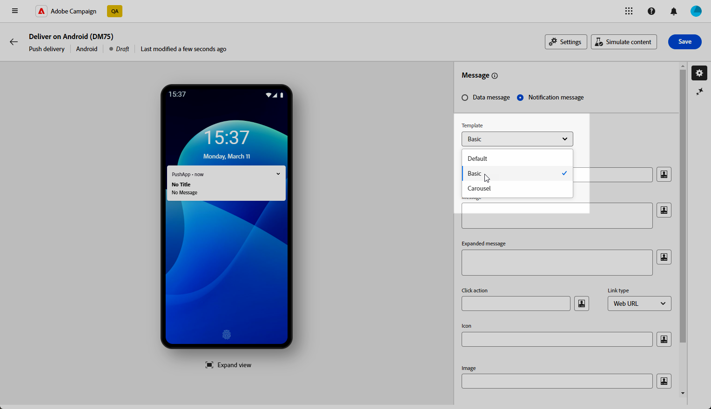
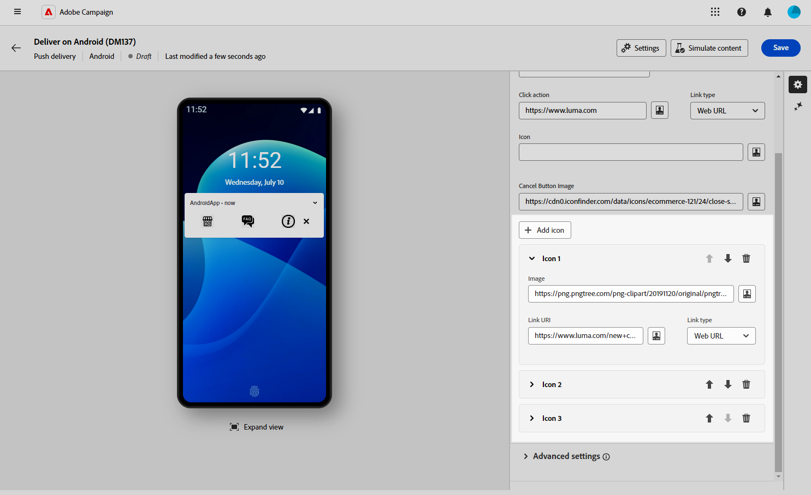
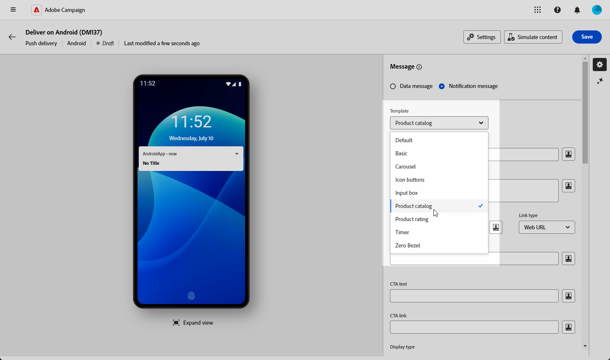
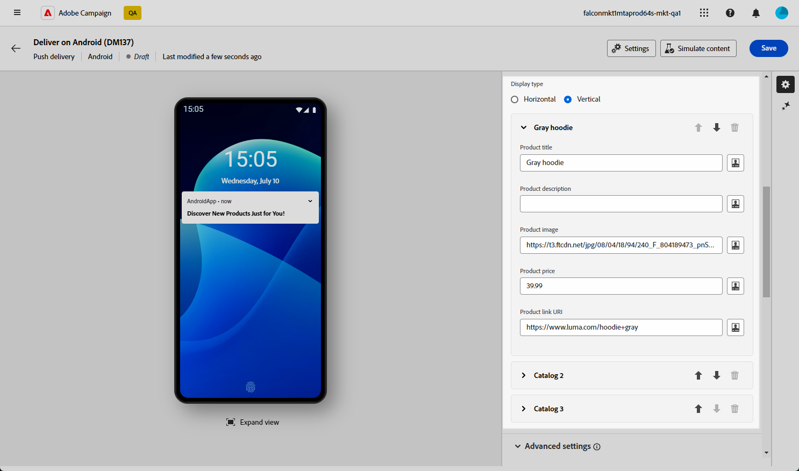
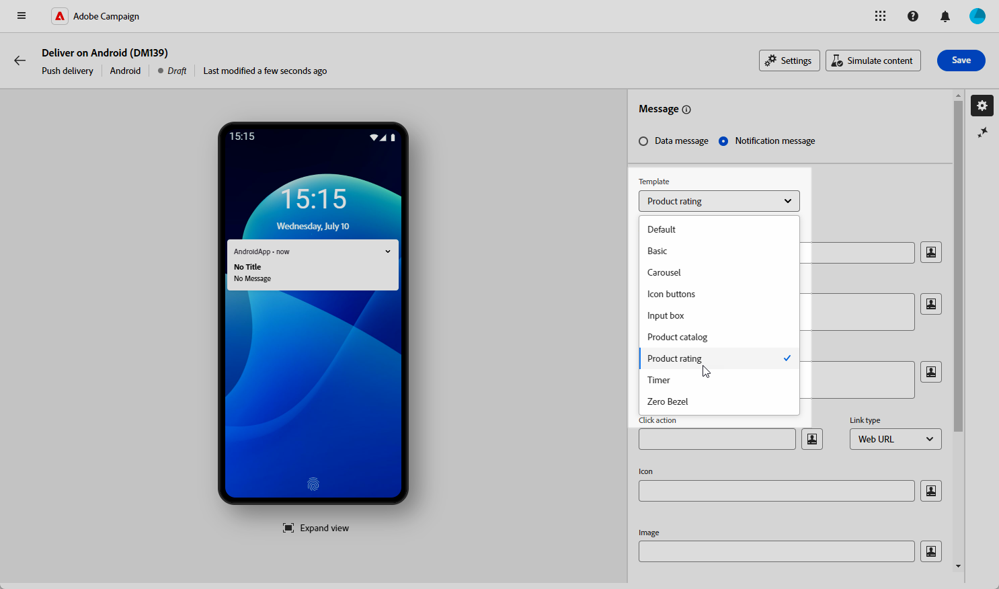
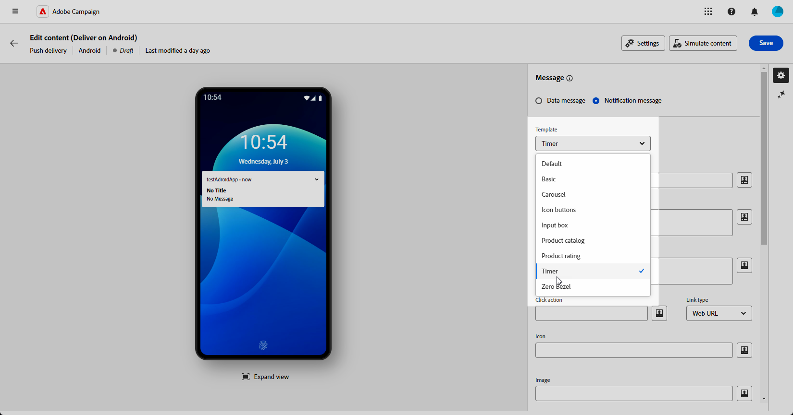

# Ontwerpen als een rijke push-service voor Android {#rich-push}

>[!CONTEXTUALHELP]
>id="acw_deliveries_push_remind_later"
>title="Later herinneren, knop"
>abstract="**herinnert later** knoop opnieuw verstrekt de optie om een herinnering te plannen. Voor het veld Tijdstempel is een waarde vereist die een tijdperk in seconden vertegenwoordigt."

>[!IMPORTANT]
>
>* Voor deze functie is een update naar Campagne v8.6.3 <!--or v8.7.2--> vereist. Leer meer in de console van de Cliënt van de Campagne v8 [&#x200B; versienota&#39;s &#x200B;](https://experienceleague.adobe.com/en/docs/campaign/campaign-v8/releases/release-notes){target="_blank"}.
>
>* Alvorens een Rich Push Bericht te ontwerpen, moet u eerst uw V2 schakelaar vormen. Verwijs naar [&#x200B; deze pagina &#x200B;](https://experienceleague.adobe.com/en/docs/campaign-classic/using/sending-messages/sending-push-notifications/configure-the-mobile-app/configuring-the-mobile-application-android#configuring-external-account-android){target="_blank"} voor de gedetailleerde procedure.

Met Firebase Cloud Messaging kunt u kiezen uit twee typen berichten:

* **[!UICONTROL Data message]** wordt afgehandeld door de clienttoepassing. Deze berichten worden rechtstreeks verzonden naar de mobiele toepassing, die een Android-melding op het apparaat genereert en weergeeft. Gegevensberichten bevatten alleen aangepaste toepassingsvariabelen.

* De **[!UICONTROL Notification message]** , die automatisch wordt afgehandeld door de FCM SDK. FCM geeft automatisch het bericht weer op de apparaten van uw gebruikers namens de client-app. Meldingsberichten bevatten een vooraf gedefinieerde set parameters en opties, maar kunnen nog steeds verder worden aangepast met aangepaste toepassingsvariabelen.

{zoomable="yes"}

## De inhoud van het bericht definiëren {#push-message}

Nadat u de pushservice hebt gemaakt, kunt u de inhoud definiëren met een van de volgende sjablonen:

* **Gebrek** staat u toe om berichten met een eenvoudig pictogram en een begeleidend beeld te verzenden.

* **Basis** kan tekst, beelden, en knopen in uw berichten omvatten.

* **Carrousel** laat u toe om berichten met tekst en veelvoudige beelden te verzenden die de gebruikers door kunnen vegen.

* **de knopen van het Pictogram** staat u toe om berichten met een pictogram en een overeenkomstig beeld te verzenden.

* **doos van de Input** verzamelt gebruikersinput en koppelt direct door het bericht terug.

* **de catalogus van het Product** toont een verscheidenheid van productbeelden.

* **de classificatie van het Product** staat gebruikers toe om terug te geven en producten te schatten.

* **Tijdopnemer** omvat een levende tellertijdopnemer in uw berichten.

* **Zero Bezel** gebruikt de volledige achtergrondoppervlakte voor een beeld, met tekst die foutloos wordt bedekt.

Navigeer door de lusjes hieronder om meer te leren over hoe te om deze malplaatjes aan te passen.

>[!BEGINTABS]

>[!TAB  Gebrek ]

1. Selecteer **[!UICONTROL Template]** in de vervolgkeuzelijst **[!UICONTROL Default]** .

   

1. Als u uw bericht wilt samenstellen, voert u de tekst in de velden **[!UICONTROL Title]** en **[!UICONTROL Message]** in.

   

1. Gebruik de uitdrukkingsredacteur om inhoud te bepalen, gegevens te personaliseren en dynamische inhoud toe te voegen. [Meer informatie](../personalization/personalize.md)

1. Definieer de **[!UICONTROL Click action]** die aan een gebruiker is gekoppeld en klik op uw melding. Dit bepaalt het gedrag wanneer de gebruiker met het bericht communiceert, zoals het openen van een specifiek scherm of het uitvoeren van een specifieke actie in uw app.

1. Als u uw pushmelding verder wilt aanpassen, kunt u een **[!UICONTROL Image]** URL kiezen om aan uw pushmelding toe te voegen en de meldingen **[!UICONTROL Icon]** om deze weer te geven op de apparaten van uw profielen.

   

1. Configureer de **[!UICONTROL Advanced settings]** van uw pushmelding. [Meer informatie](#push-advanced)

Nadat u de inhoud van uw bericht hebt gedefinieerd, kunt u testabonnees gebruiken om het bericht voor te vertonen en te testen.

>[!TAB  Basis ]

1. Selecteer **[!UICONTROL Template]** in de vervolgkeuzelijst **[!UICONTROL Basic]** .

   

1. Als u uw bericht wilt samenstellen, voert u de tekst in de velden **[!UICONTROL Title]** , **[!UICONTROL Message]** en **[!UICONTROL Expanded message]** in.

   De tekst **[!UICONTROL Message]** wordt weergegeven in de samengevouwen weergave terwijl de tekst **[!UICONTROL Expanded message]** wordt weergegeven wanneer het bericht wordt uitgevouwen.

   

1. Gebruik de uitdrukkingsredacteur om inhoud te bepalen, gegevens te personaliseren en dynamische inhoud toe te voegen. [Meer informatie](../personalization/personalize.md)

1. Voeg de URL toe die de **[!UICONTROL Click action]** definieert die is gekoppeld aan een gebruiker en klik op uw melding. Dit bepaalt het gedrag wanneer de gebruiker met het bericht communiceert, zoals het openen van een specifiek scherm of het uitvoeren van een specifieke actie in uw app.

1. Selecteer de **[!UICONTROL Link type]** URL die u aan het veld **[!UICONTROL Click action]** hebt toegevoegd:

   * **[!UICONTROL Web URL]**: URL&#39;s leiden gebruikers naar online-inhoud. Als ze klikken, wordt de standaardwebbrowser van het apparaat gevraagd om de opgegeven URL te openen en ernaar te navigeren.

   * **[!UICONTROL Deeplink]**: Diepe koppelingen zijn URL&#39;s die gebruikers naar specifieke secties in een app sturen, zelfs als de app is gesloten. Wanneer op deze knop wordt geklikt, wordt een dialoogvenster weergegeven waarin gebruikers kunnen kiezen uit verschillende apps waarmee de koppeling kan worden afgehandeld.

   * **[!UICONTROL Open App]**: Open App URL&#39;s waarmee u rechtstreeks verbinding kunt maken met inhoud binnen een toepassing. Het laat uw toepassing toe om zich als standaardmanager voor een specifiek type van verbinding te vestigen, die de dialoog overslaat.

   Voor meer informatie over hoe te om de Verbindingen van de Toepassing van Android te behandelen, verwijs naar {de documentatie van de Ontwikkelaars van 0} Android [.](https://developer.android.com/training/app-links)

   

1. Als u uw pushmelding verder wilt aanpassen, kunt u een **[!UICONTROL Image]** URL kiezen om aan uw pushmelding toe te voegen en de meldingen **[!UICONTROL Icon]** om deze weer te geven op de apparaten van uw profielen.

1. Klik op **[!UICONTROL Add button]** en vul de volgende velden in:

   * **[!UICONTROL Label]**: Tekst die op de knop wordt weergegeven.
   * **[!UICONTROL Link URI]**: geef de URI op die moet worden uitgevoerd wanneer u op de knop klikt.
   * **[!UICONTROL Link type]**: type koppeling **[!UICONTROL Web URL]** , **[!UICONTROL Deeplink]** of **[!UICONTROL Open App]** .

   U kunt maximaal drie knoppen opnemen in uw pushmelding. Als u voor **[!UICONTROL Remind later button]** kiest, kunt u slechts maximaal twee knoppen opnemen.

   

1. Klik op **[!UICONTROL Add remind later]** om een optie voor herinnering later toe te voegen aan uw pushmelding. Voer een **[!UICONTROL Label]** en **[!UICONTROL Timestamp]** in.

   Het veld Tijdstempel verwacht een waarde die in seconden een tijdperk vertegenwoordigt.

   

1. Configureer de **[!UICONTROL Advanced settings]** van uw pushmelding. [Meer informatie](#push-advanced)

Nadat u de inhoud van uw bericht hebt gedefinieerd, kunt u testabonnees gebruiken om het bericht voor te vertonen en te testen.

>[!TAB  Carousel ]

1. Selecteer **[!UICONTROL Template]** in de vervolgkeuzelijst **[!UICONTROL Carousel]** .

   

1. Als u uw bericht wilt samenstellen, voert u de tekst in de velden **[!UICONTROL Title]** , **[!UICONTROL Message]** en **[!UICONTROL Expanded message]** in.

   De tekst **[!UICONTROL Message]** wordt weergegeven in de samengevouwen weergave terwijl de tekst **[!UICONTROL Expanded message]** wordt weergegeven wanneer het bericht wordt uitgevouwen.

   

1. Gebruik de uitdrukkingsredacteur om inhoud te bepalen, gegevens te personaliseren en dynamische inhoud toe te voegen. [Meer informatie](../personalization/personalize.md)

1. Voeg de URL toe die de **[!UICONTROL Click action]** definieert die is gekoppeld aan een gebruiker en klik op uw melding. Dit bepaalt het gedrag wanneer de gebruiker met het bericht communiceert, zoals het openen van een specifiek scherm of het uitvoeren van een specifieke actie in uw app.

1. Selecteer de **[!UICONTROL Link type]** URL die u aan het veld **[!UICONTROL Click action]** hebt toegevoegd:

   * **[!UICONTROL Web UR]**&#x200B;L: URL&#39;s leiden gebruikers naar online-inhoud. Als ze klikken, wordt de standaardwebbrowser van het apparaat gevraagd om de opgegeven URL te openen en ernaar te navigeren.

   * **[!UICONTROL Deeplink]**: Diepe koppelingen zijn URL&#39;s die gebruikers naar specifieke secties in een app sturen, zelfs als de app is gesloten. Wanneer op deze knop wordt geklikt, wordt een dialoogvenster weergegeven waarin gebruikers kunnen kiezen uit verschillende apps waarmee de koppeling kan worden afgehandeld.

   * **[!UICONTROL Open App]**: Open App URL&#39;s waarmee u rechtstreeks verbinding kunt maken met inhoud binnen een toepassing. Het laat uw toepassing toe om zich als standaardmanager voor een specifiek type van verbinding te vestigen, die de dialoog overslaat.

   Voor meer informatie over hoe te om de Verbindingen van de Toepassing van Android te behandelen, verwijs naar {de documentatie van de Ontwikkelaars van 0} Android [.](https://developer.android.com/training/app-links)

   

1. Als u uw pushmelding verder wilt aanpassen, kunt u de berichttekst **[!UICONTROL Icon]** kiezen om weer te geven op de apparaten van uw profielen.

1. Kies hoe de **[!UICONTROL Carousel]** wordt uitgevoerd:

   * **[!UICONTROL Auto]**: doorloopt afbeeldingen automatisch als dia&#39;s en gaat u met vooraf gedefinieerde intervallen verder.
   * **[!UICONTROL Manual]**: hiermee kunnen gebruikers handmatig tussen dia&#39;s vegen om door de afbeeldingen te navigeren.

     Schakel de optie **[!UICONTROL Filmstrip]** in om voorvertoningen van de vorige en volgende afbeeldingen naast de hoofddia op te nemen.

1. Klik op **[!UICONTROL Add image]** en voer de URL en tekst van de afbeelding in.

   Zorg ervoor dat u minimaal drie en maximaal vijf afbeeldingen opneemt.

   

1. Verwerk de volgorde van de afbeeldingen met de pijl-omlaag en de pijl-omhoog.

1. Configureer de **[!UICONTROL Advanced settings]** van uw pushmelding. [Meer informatie](#push-advanced)

Nadat u de inhoud van uw bericht hebt gedefinieerd, kunt u testabonnees gebruiken om het bericht voor te vertonen en te testen.

>[!TAB  de knopen van het Pictogram ]

1. Selecteer **[!UICONTROL Template]** in de vervolgkeuzelijst **[!UICONTROL Icon buttons]** .

   

1. Voeg de URL toe die de **[!UICONTROL Click action]** definieert die is gekoppeld aan een gebruiker en klik op uw melding. Dit bepaalt het gedrag wanneer de gebruiker met het bericht communiceert, zoals het openen van een specifiek scherm of het uitvoeren van een specifieke actie in uw app.

1. Selecteer de **[!UICONTROL Link type]** URL die u aan het veld **[!UICONTROL Click action]** hebt toegevoegd:

   * **[!UICONTROL Web URL]**: URL&#39;s leiden gebruikers naar online-inhoud. Als ze klikken, wordt de standaardwebbrowser van het apparaat gevraagd om de opgegeven URL te openen en ernaar te navigeren.

   * **[!UICONTROL Deeplink]**: Diepe koppelingen zijn URL&#39;s die gebruikers naar specifieke secties in een app sturen, zelfs als de app is gesloten. Wanneer op deze knop wordt geklikt, wordt een dialoogvenster weergegeven waarin gebruikers kunnen kiezen uit verschillende apps waarmee de koppeling kan worden afgehandeld.

   * **[!UICONTROL Open App]**: Open App URL&#39;s waarmee u rechtstreeks verbinding kunt maken met inhoud binnen een toepassing. Het laat uw toepassing toe om zich als standaardmanager voor een specifiek type van verbinding te vestigen, die de dialoog overslaat.

   Voor meer informatie over hoe te om de Verbindingen van de Toepassing van Android te behandelen, verwijs naar {de documentatie van de Ontwikkelaars van 0} Android [.](https://developer.android.com/training/app-links)

   

1. Als u uw pushmelding verder wilt aanpassen, kunt u de berichttekst **[!UICONTROL Icon]** kiezen om weer te geven op de apparaten van uw profielen.

1. Voeg de URL van de **[!UICONTROL Cancel button image]** toe.

1. Klik **[!UICONTROL Add icon]** en ga uw **beeld URL** in, **[!UICONTROL Link URI]** en kies uw **[!UICONTROL Link type]**.

   Zorg ervoor dat u minimaal drie pictogrammen en maximaal vijf pictogrammen toevoegt.

   

1. Verwerk de volgorde van de afbeeldingen met de pijl-omlaag en de pijl-omhoog.

1. Configureer de **[!UICONTROL Advanced settings]** van uw pushmelding. [Meer informatie](#push-advanced)

   

Nadat u de inhoud van uw bericht hebt gedefinieerd, kunt u testabonnees gebruiken om het bericht voor te vertonen en te testen.

>[!TAB  doos van de Input ]

1. Selecteer **[!UICONTROL Notification type]** in de vervolgkeuzelijst **[!UICONTROL Input box]** .

   

1. Als u uw bericht wilt samenstellen, voert u de tekst in de velden **[!UICONTROL Title]** , **[!UICONTROL Message]** en **[!UICONTROL Expanded message]** in.

   De tekst **[!UICONTROL Message]** wordt weergegeven in de samengevouwen weergave terwijl de tekst **[!UICONTROL Expanded message]** wordt weergegeven wanneer het bericht wordt uitgevouwen.

   

1. Gebruik dynamische verpersoonlijkingsgebieden om inhoud te bepalen, gegevens te personaliseren en dynamische inhoud toe te voegen. [Meer informatie](../personalization/personalize.md)

1. Voeg de URL toe die de **[!UICONTROL Click action]** definieert die is gekoppeld aan een gebruiker en klik op uw melding. Dit bepaalt het gedrag wanneer de gebruiker met het bericht communiceert, zoals het openen van een specifiek scherm of het uitvoeren van een specifieke actie in uw app.

1. Selecteer de **[!UICONTROL Link type]** URL die u aan het veld **[!UICONTROL Click action]** hebt toegevoegd:

   * **[!UICONTROL Web URL]**: URL&#39;s leiden gebruikers naar online-inhoud. Als ze klikken, wordt de standaardwebbrowser van het apparaat gevraagd om de opgegeven URL te openen en ernaar te navigeren.

   * **[!UICONTROL Deeplink]**: Diepe koppelingen zijn URL&#39;s die gebruikers naar specifieke secties in een app sturen, zelfs als de app is gesloten. Wanneer op deze knop wordt geklikt, wordt een dialoogvenster weergegeven waarin gebruikers kunnen kiezen uit verschillende apps waarmee de koppeling kan worden afgehandeld.

   * **[!UICONTROL Open App]**: Open App URL&#39;s waarmee u rechtstreeks verbinding kunt maken met inhoud binnen een toepassing. Het laat uw toepassing toe om zich als standaardmanager voor een specifiek type van verbinding te vestigen, die de dialoog overslaat.

   Voor meer informatie over hoe te om de Verbindingen van de Toepassing van Android te behandelen, verwijs naar {de documentatie van de Ontwikkelaars van 0} Android [.](https://developer.android.com/training/app-links)

1. Als u uw pushmelding verder wilt aanpassen, kunt u een **[!UICONTROL Image]** URL kiezen om aan uw pushmelding toe te voegen en de meldingen **[!UICONTROL Icon]** om deze weer te geven op de apparaten van uw profielen.

1. Vul-binnen de volgende opties voor uw **doos van de Input**:

   * **[!UICONTROL Input receiver name]**: voer de naam of id in voor de ontvanger van de invoer.
   * **[!UICONTROL Input text]**: Ga de tekst voor het **vakje van de Input** in.
   * **[!UICONTROL Feedback text]**: voer de tekst in die u na een antwoord wilt weergeven.
   * **[!UICONTROL Feedback image]**: voeg de URL toe voor de afbeelding die wordt weergegeven na een reactie.

   

1. Configureer de **[!UICONTROL Advanced settings]** van uw pushmelding. [Meer informatie](#push-advanced)

Nadat u de inhoud van uw bericht hebt gedefinieerd, kunt u testabonnees gebruiken om het bericht voor te vertonen en te testen.

>[!TAB  de catalogus van het Product ]

1. Selecteer **[!UICONTROL Notification type]** in de vervolgkeuzelijst **[!UICONTROL Product catalog]** .

   

1. Als u uw bericht wilt samenstellen, voert u de tekst in de velden **[!UICONTROL Title]** en **[!UICONTROL Message]** in.

   

1. Gebruik dynamische verpersoonlijkingsgebieden om inhoud te bepalen, gegevens te personaliseren en dynamische inhoud toe te voegen. [Meer informatie](../personalization/personalize.md)

1. Voeg de URL toe die de **[!UICONTROL Click action]** definieert die is gekoppeld aan een gebruiker en klik op uw melding. Dit bepaalt het gedrag wanneer de gebruiker met het bericht communiceert, zoals het openen van een specifiek scherm of het uitvoeren van een specifieke actie in uw app.

1. Selecteer de **[!UICONTROL Link type]** URL die u aan het veld **[!UICONTROL Click action]** hebt toegevoegd:

   * **[!UICONTROL Web URL]**: URL&#39;s leiden gebruikers naar online-inhoud. Als ze klikken, wordt de standaardwebbrowser van het apparaat gevraagd om de opgegeven URL te openen en ernaar te navigeren.

   * **[!UICONTROL Deeplink]**: Diepe koppelingen zijn URL&#39;s die gebruikers naar specifieke secties in een app sturen, zelfs als de app is gesloten. Wanneer op deze knop wordt geklikt, wordt een dialoogvenster weergegeven waarin gebruikers kunnen kiezen uit verschillende apps waarmee de koppeling kan worden afgehandeld.

   * **[!UICONTROL Open App]**: Open App URL&#39;s waarmee u rechtstreeks verbinding kunt maken met inhoud binnen een toepassing. Het laat uw toepassing toe om zich als standaardmanager voor een specifiek type van verbinding te vestigen, die de dialoog overslaat.

   Voor meer informatie over hoe te om de Verbindingen van de Toepassing van Android te behandelen, verwijs naar {de documentatie van de Ontwikkelaars van 0} Android [.](https://developer.android.com/training/app-links)

1. Als u uw pushmelding verder wilt aanpassen, kunt u de berichttekst **[!UICONTROL Icon]** kiezen om weer te geven op de apparaten van uw profielen.

1. Ga uw **klik-aan-actie tekst** en **beeld** in.

1. Kies de optie **[!UICONTROL Display type]** tussen Horizontaal of Verticaal.

1. Vul de gegevens van uw **[!UICONTROL Catalog]** -items in.

   Zorg ervoor dat u minimaal drie en maximaal vijf objecten opneemt.

   

1. Verwerk de volgorde van de afbeeldingen met de pijl-omlaag en de pijl-omhoog.

1. Configureer de **[!UICONTROL Advanced settings]** van uw pushmelding. [Meer informatie](#push-advanced)

Nadat u de inhoud van uw bericht hebt gedefinieerd, kunt u testabonnees gebruiken om het bericht voor te vertonen en te testen.

>[!TAB  Rating van het Product ]

1. Selecteer **[!UICONTROL Notification type]** in de vervolgkeuzelijst **[!UICONTROL Product rating]** .

   

1. Als u uw bericht wilt samenstellen, voert u de tekst in de velden **[!UICONTROL Title]** , **[!UICONTROL Message]** en **[!UICONTROL Expanded message]** in.

   De tekst **[!UICONTROL Message]** wordt weergegeven in de samengevouwen weergave terwijl de tekst **[!UICONTROL Expanded message]** wordt weergegeven wanneer het bericht wordt uitgevouwen.

   

1. Voeg de URL toe die de **[!UICONTROL Click action]** definieert die is gekoppeld aan een gebruiker en klik op uw melding. Dit bepaalt het gedrag wanneer de gebruiker met het bericht communiceert, zoals het openen van een specifiek scherm of het uitvoeren van een specifieke actie in uw app.

1. Selecteer de **[!UICONTROL Link type]** URL die u aan het veld **[!UICONTROL Click action]** hebt toegevoegd:

   * **[!UICONTROL Web URL]**: URL&#39;s leiden gebruikers naar online-inhoud. Als ze klikken, wordt de standaardwebbrowser van het apparaat gevraagd om de opgegeven URL te openen en ernaar te navigeren.

   * **[!UICONTROL Deeplink]**: Diepe koppelingen zijn URL&#39;s die gebruikers naar specifieke secties in een app sturen, zelfs als de app is gesloten. Wanneer op deze knop wordt geklikt, wordt een dialoogvenster weergegeven waarin gebruikers kunnen kiezen uit verschillende apps waarmee de koppeling kan worden afgehandeld.

   * **[!UICONTROL Open App]**: Open App URL&#39;s waarmee u rechtstreeks verbinding kunt maken met inhoud binnen een toepassing. Het laat uw toepassing toe om zich als standaardmanager voor een specifiek type van verbinding te vestigen, die de dialoog overslaat.

   Voor meer informatie over hoe te om de Verbindingen van de Toepassing van Android te behandelen, verwijs naar {de documentatie van de Ontwikkelaars van 0} Android [.](https://developer.android.com/training/app-links)

1. Als u uw pushmelding verder wilt aanpassen, kunt u een **[!UICONTROL Image]** URL kiezen om aan uw pushmelding toe te voegen en de meldingen **[!UICONTROL Icon]** om deze weer te geven op de apparaten van uw profielen.

1. Voeg uw URL&#39;s **[!UICONTROL Rating icon in unselected state]** en **[!UICONTROL Rating icon in selected state]** toe.

   

1. Klik op **[!UICONTROL Add rating]** en voer de **[!UICONTROL Link URI]** en **[!UICONTROL Link type]** in.

   Zorg ervoor dat u minimaal drie en maximaal vijf classificaties opgeeft.

   

1. Verwerk de volgorde van de afbeeldingen met de pijl-omlaag en de pijl-omhoog.

1. Configureer de **[!UICONTROL Advanced settings]** van uw pushmelding. [Meer informatie](#push-advanced)

Nadat u de inhoud van uw bericht hebt gedefinieerd, kunt u testabonnees gebruiken om het bericht voor te vertonen en te testen.

>[!TAB  Tijdopnemer ]

1. Selecteer **[!UICONTROL Notification type]** in de vervolgkeuzelijst **[!UICONTROL Timer]** .

   

1. Als u uw bericht wilt samenstellen, voert u de tekst in de velden **[!UICONTROL Title]** en **[!UICONTROL Message]** in.

   Gebruik dynamische verpersoonlijkingsgebieden om inhoud te bepalen, gegevens te personaliseren en dynamische inhoud toe te voegen. [Meer informatie](../personalization/personalize.md)

   

1. Voeg de URL toe die de **[!UICONTROL Click action]** definieert die is gekoppeld aan een gebruiker en klik op uw melding. Dit bepaalt het gedrag wanneer de gebruiker met het bericht communiceert, zoals het openen van een specifiek scherm of het uitvoeren van een specifieke actie in uw app.

1. Selecteer de **[!UICONTROL Link type]** URL die u aan het veld **[!UICONTROL Click action]** hebt toegevoegd:

   * **[!UICONTROL Web URL]**: URL&#39;s leiden gebruikers naar online-inhoud. Als ze klikken, wordt de standaardwebbrowser van het apparaat gevraagd om de opgegeven URL te openen en ernaar te navigeren.

   * **[!UICONTROL Deeplink]**: Diepe koppelingen zijn URL&#39;s die gebruikers naar specifieke secties in een app sturen, zelfs als de app is gesloten. Wanneer op deze knop wordt geklikt, wordt een dialoogvenster weergegeven waarin gebruikers kunnen kiezen uit verschillende apps waarmee de koppeling kan worden afgehandeld.

   * **[!UICONTROL Open App]**: Open App URL&#39;s waarmee u rechtstreeks verbinding kunt maken met inhoud binnen een toepassing. Het laat uw toepassing toe om zich als standaardmanager voor een specifiek type van verbinding te vestigen, die de dialoog overslaat.

   Voor meer informatie over hoe te om de Verbindingen van de Toepassing van Android te behandelen, verwijs naar {de documentatie van de Ontwikkelaars van 0} Android [.](https://developer.android.com/training/app-links)

   

1. Als u uw pushmelding verder wilt aanpassen, kunt u een **[!UICONTROL Image]** URL kiezen om aan uw pushmelding toe te voegen en de meldingen **[!UICONTROL Icon]** om deze weer te geven op de apparaten van uw profielen.

1. Stel de **[!UICONTROL Timer duration]** in seconden of de **[!UICONTROL Timer end timestamp]** in op een specifieke tijdstempel voor de epoche.

   

1. Voer de tekst en afbeelding in die worden weergegeven nadat de timer is verlopen in de velden **[!UICONTROL Alternate title]** , **[!UICONTROL Alternate message]** , **[!UICONTROL Alternate expanded message]** en **[!UICONTROL Alternate launch image]** .

   

1. Configureer de **[!UICONTROL Advanced settings]** van uw pushmelding. [Meer informatie](#push-advanced)

Nadat u de inhoud van uw bericht hebt gedefinieerd, kunt u testabonnees gebruiken om het bericht voor te vertonen en te testen.

>[!TAB  Nul schuine rand ]

1. Selecteer **[!UICONTROL Notification type]** in de vervolgkeuzelijst **[!UICONTROL Zero bezel]** .

   

1. Als u uw bericht wilt samenstellen, voert u de tekst in de velden **[!UICONTROL Title]** , **[!UICONTROL Message]** en **[!UICONTROL Expanded message]** in.

   De tekst **[!UICONTROL Message]** wordt weergegeven in de samengevouwen weergave terwijl de tekst **[!UICONTROL Expanded message]** wordt weergegeven wanneer het bericht wordt uitgevouwen.

   

1. Gebruik dynamische verpersoonlijkingsgebieden om inhoud te bepalen, gegevens te personaliseren en dynamische inhoud toe te voegen. [Meer informatie](../personalization/personalize.md)

1. Voeg de URL toe die de **[!UICONTROL Click action]** definieert die is gekoppeld aan een gebruiker en klik op uw melding. Dit bepaalt het gedrag wanneer de gebruiker met het bericht communiceert, zoals het openen van een specifiek scherm of het uitvoeren van een specifieke actie in uw app.

1. Selecteer de **[!UICONTROL Link type]** URL die u aan het veld **[!UICONTROL Click action]** hebt toegevoegd:

   * **[!UICONTROL Web URL]**: URL&#39;s leiden gebruikers naar online-inhoud. Als ze klikken, wordt de standaardwebbrowser van het apparaat gevraagd om de opgegeven URL te openen en ernaar te navigeren.

   * **[!UICONTROL Deeplink]**: Diepe koppelingen zijn URL&#39;s die gebruikers naar specifieke secties in een app sturen, zelfs als de app is gesloten. Wanneer op deze knop wordt geklikt, wordt een dialoogvenster weergegeven waarin gebruikers kunnen kiezen uit verschillende apps waarmee de koppeling kan worden afgehandeld.

   * **[!UICONTROL Open App]**: Open App URL&#39;s waarmee u rechtstreeks verbinding kunt maken met inhoud binnen een toepassing. Het laat uw toepassing toe om zich als standaardmanager voor een specifiek type van verbinding te vestigen, die de dialoog overslaat.

   Voor meer informatie over hoe te om de Verbindingen van de Toepassing van Android te behandelen, verwijs naar {de documentatie van de Ontwikkelaars van 0} Android [.](https://developer.android.com/training/app-links)

1. Als u uw pushmelding verder wilt aanpassen, kunt u een **[!UICONTROL Image]** URL kiezen om aan uw pushmelding toe te voegen en de meldingen **[!UICONTROL Icon]** om deze weer te geven op de apparaten van uw profielen.

   

1. Kies uw **[!UICONTROL Collapsed notification style]** voor uw melding of de melding voornamelijk een afbeelding of tekst weergeeft.

1. Configureer de **[!UICONTROL Advanced settings]** van uw pushmelding. [Meer informatie](#push-advanced)

Nadat u de inhoud van uw bericht hebt gedefinieerd, kunt u testabonnees gebruiken om het bericht voor te vertonen en te testen.

>[!ENDTABS]

## Geavanceerde instellingen voor pushmeldingen {#push-advanced}

{zoomable="yes"}

| Parameter | Beschrijving |
|---------|---------|
| **[!UICONTROL Icon color]** | Stel de kleur van het pictogram in met uw Hex-kleurcodes. |
| **[!UICONTROL Title color]** | Stel de kleur van de titel in met uw Hex-kleurcodes. |
| **[!UICONTROL Message text color]** | Stel de kleur van de berichttekst in met uw Hex-kleurcodes. |
| **[!UICONTROL Timer color]** | Stel de kleur van de Timer in met uw Hex-kleurcodes. |
| **[!UICONTROL Notification background color]** | Stel de kleur van de achtergrond voor meldingen in met uw Hex-kleurcodes. |
| **[!UICONTROL Sound]** | Stel het geluid in dat moet worden afgespeeld wanneer het apparaat het bericht ontvangt. |
| **[!UICONTROL Notification Count]** | Stel het aantal nieuwe ongelezen gegevens in dat rechtstreeks op het toepassingspictogram moet worden weergegeven. Hierdoor kan de gebruiker snel zien hoeveel meldingen in behandeling zijn. |
| **[!UICONTROL Channel ID]** | Stel de kanaal-id van uw melding in. De app moet een kanaal met deze kanaal-id maken voordat meldingen met deze kanaal-id worden ontvangen. |
| **[!UICONTROL Tag]** | Stel een id in die wordt gebruikt om bestaande meldingen in de meldingslade te vervangen. Dit helpt de accumulatie van meerdere meldingen te voorkomen en zorgt ervoor dat alleen de meest recente relevante kennisgeving wordt weergegeven. |
| **[!UICONTROL Priority]** | Stel het prioriteitsniveau van uw melding in. Dit kan standaard, minimaal, laag of hoog zijn. Het prioriteitsniveau bepaalt het belang en de urgentie van de melding, en beïnvloedt hoe deze wordt weergegeven en of bepaalde systeeminstellingen kunnen worden omzeild. Voor meer op dit, verwijs naar [&#x200B; documentatie FCM &#x200B;](https://firebase.google.com/docs/reference/fcm/rest/v1/projects.messages#notificationpriority). |
| **[!UICONTROL Visibility]** | Stel het zichtbaarheidsniveau van uw melding in. Dit kan openbaar, privé of geheim zijn. Het zichtbaarheidsniveau bepaalt hoeveel van de inhoud van het bericht wordt weergegeven op het vergrendelingsscherm en andere gevoelige gebieden. Voor meer informatie, verwijs naar de [&#x200B; documentatie FCM &#x200B;](https://firebase.google.com/docs/reference/fcm/rest/v1/projects.messages#visibility). |
| **[!UICONTROL Sticky notification]** | Wanneer geactiveerd, blijft het bericht zichtbaar zelfs nadat de gebruiker erop klikt.   als gedeactiveerd, wordt het bericht automatisch verworpen wanneer de gebruiker met het in wisselwerking staat. Dankzij het plakgedrag blijven belangrijke meldingen langer op het scherm staan. |
| **[!UICONTROL Application variables]** | Hiermee kunt u gedrag voor meldingen definiëren. Deze variabelen kunnen volledig worden aangepast en worden opgenomen in de berichtlading die naar het mobiele apparaat wordt verzonden. |