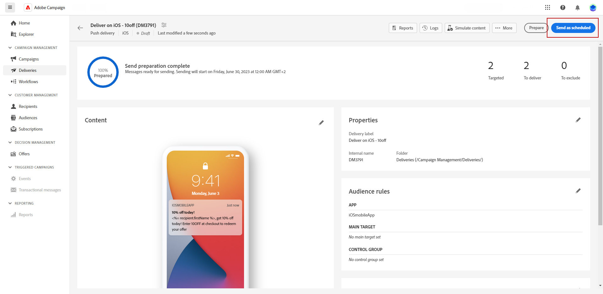

# Een voorbeeld bekijken en een pushmelding verzenden {#send-push}

## Geef een voorvertoning van de pushmelding weer {#preview-push}

Nadat u de inhoud van uw bericht hebt gedefinieerd, kunt u testprofielen gebruiken om een voorbeeld van het bericht te bekijken en het bericht te testen. Als u gepersonaliseerde inhoud hebt opgenomen, kunt u onderzoeken hoe deze inhoud in het bericht wordt getoond door de gegevens van het testprofiel te gebruiken. Dit staat u toe om ervoor te zorgen dat het bericht correct wordt teruggegeven en dat de gepersonaliseerde elementen correct worden opgenomen.

1. Vanaf de pagina met inhoud voor levering kunt u **[!UICONTROL Simulate content]** om een voorvertoning van uw persoonlijke inhoud weer te geven.

   

1. Klikken **[!UICONTROL Add test profile(s)]** om een of meerdere testprofielen of profielen te selecteren.

1. Als uw testprofielen zijn geselecteerd, klikt u op **[!UICONTROL Select]**.

   

1. In het rechterdeelvenster ziet u een voorbeeld van het e-mailbericht waarin gepersonaliseerde elementen dynamisch worden vervangen door gegevens uit het geselecteerde profiel.

U kunt nu uw pushmelding bekijken en verzenden naar uw publiek.

## De levering van pushberichten testen {#test-send-sms}

Gebruiken **Adobe Campaign**, kunt u pushmeldingen testen voordat u ze naar het hoofdpubliek stuurt. Deze stap is belangrijk voor het valideren van uw levering en het identificeren van eventuele problemen.
De ontvangers van de test kunnen elementen zoals verbindingen, beelden, en verpersoonlijkingsmontages herzien, die optimale prestaties verzekeren en om het even welke fouten ontdekken. Met dit proces kunt u uw pushmeldingen verfijnen en optimaliseren voordat u het grote publiek bereikt.

 In deze video ziet u hoe u pushmeldingen voor de test verzendt [page](../preview-test/proofs.md).

## Verzend uw pushmelding {#preview-send-push}

1. Nadat u de inhoud van uw pushmelding hebt aangepast, klikt u op **[!UICONTROL Review & send]** van uw **[!UICONTROL Delivery]** pagina.

   

1. Klikken **[!UICONTROL Prepare]**en toezicht houden op de geboekte vooruitgang en de verstrekte statistieken.

   Als er fouten optreden, raadpleegt u het menu Logs voor meer informatie over de fout.

   

1. De berichten verzenden door op **[!UICONTROL Send]** om door te gaan met het definitieve verzendingsproces.

1. Bevestig de verzendactie door op de knop **[!UICONTROL Send]** of **[!UICONTROL Send as scheduled]** knop.

   

Zodra uw levering wordt verzonden, kunt u uw KPIs (Zeer belangrijke Indicator van Prestaties) gegevens van uw leveringspagina en gegevens van het menu van Logs volgen.

U kunt nu de impact van uw bericht meten met ingebouwde rapporten. [Meer informatie](../reporting/push-report.md)
