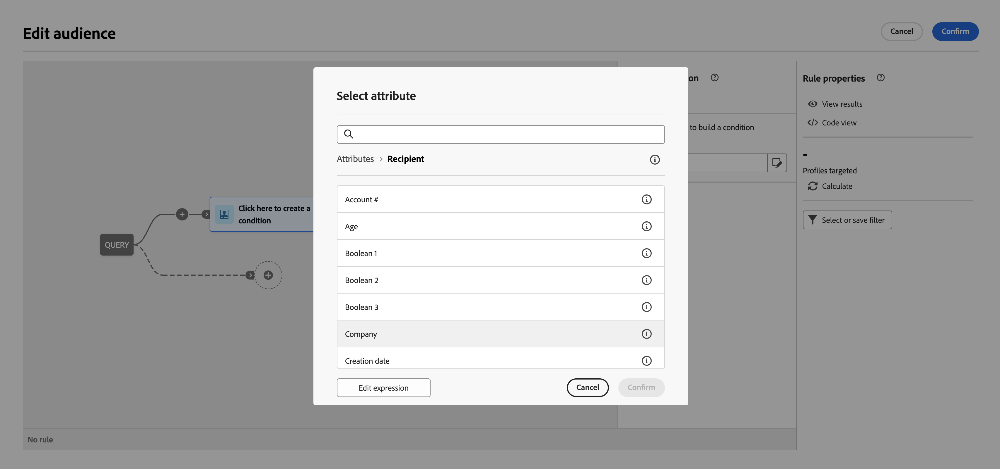

# Uw eerste query samenstellen {#build-query}

Om te beginnen bouwend een vraag, heb toegang tot de vraagmodeler van de plaats van uw keus, afhankelijk van de actie u wilt uitvoeren. Het Query-model wordt geopend met een leeg canvas. Klik op de knop **+** knoop om de eerste knoop van uw vraag te vormen.

U kunt twee typen elementen toevoegen:

* **Componenten filteren** (De voorwaarde van de Douane, Uitgezochte publiek, Vooraf bepaald filter) staat u toe om uw eigen regels te bouwen, een publiek of een vooraf bepaald filter te selecteren om uw vraag te verfijnen. [Leer hoe u met filtercomponenten werkt](#filtering)

  Voorbeeld:

  *Ontvangers die zich hebben geabonneerd op de nieuwsbrief &#39;Sport&#39;*. *Ontvangers in New York*, *Ontvangers in San Francisco*

* **Groepoperatoren** (EN, OF, BEHALVE) staat u toe om het filtreren componenten in het diagram te groeperen om uw behoeften aan te passen. [Leer werken met operatoren](#filtering)

  Voorbeeld:

  *Ontvangers die zich hebben geabonneerd op de nieuwsbrief &quot;Sport&quot;**EN**die in New York wonen **OF**San Francisco*.

## Filtercomponenten toevoegen {#filtering}

Door componenten te filteren kunt u de query verfijnen door:

* **Aangepaste voorwaarden**: Filter uw query door uw eigen voorwaarde te maken met kenmerken uit de database en geavanceerde expressies.
* **Soorten publiek**: Filter de query met een bestaand publiek.
* **Vooraf gedefinieerd filter**: Filter de query met behulp van bestaande vooraf gedefinieerde filters.

### Een aangepaste voorwaarde configureren

>[!CONTEXTUALHELP]
>id="acw_orchestration_querymodeler_customcondition"
>title="Aangepaste voorwaarde"
>abstract="Aangepaste voorwaarde"

Voer de volgende stappen uit om de query te filteren met behulp van een aangepaste voorwaarde:

1. Klik op de knop **+** op de gewenste knoop en selecteer **[!UICONTROL Custom condition]**. Het deelvenster Eigenschappen voor aangepaste voorwaarde wordt aan de rechterkant geopend.

1. In de **Kenmerk** Selecteer in de database het kenmerk dat u wilt gebruiken om de voorwaarde te maken. De lijst met kenmerken bevat alle kenmerken van uw Campagne-database, inclusief kenmerken die aan uw tabel zijn gekoppeld.

   

   >[!NOTE]
   >
   >Met de knop Uitdrukking bewerken kunt u de editor voor de Campagne-webexpressie gebruiken om handmatig een expressie te definiëren met behulp van velden uit de database en hulpfuncties.

1. Selecteer in de vervolgkeuzelijst de operator die u wilt toepassen. Er zijn verschillende operatoren beschikbaar voor gebruik. De operatoren in de vervolgkeuzelijst zijn afhankelijk van het gegevenstype van het kenmerk.

   +++Lijst met beschikbare operatoren

   | Operator | Doel | Voorbeeld |
   |  ---  |  ---  |  ---  |
   | Gelijk aan | Retourneert een resultaat dat identiek is aan de gegevens die zijn ingevoerd in de tweede kolom Waarde. | Achternaam (@lastName) gelijk aan &#39;Jones&#39; retourneert alleen ontvangers met als achternaam Jones. |
   | Niet gelijk aan | Retourneert alle waarden die niet identiek zijn aan de ingevoerde waarde. | Taal (@taal) gelijk aan &#39;Engels&#39; |
   | Groter dan | Retourneert een waarde die groter is dan de ingevoerde waarde. | Leeftijd (@leeftijd) groter dan 50</strong>alle waarden boven &quot;50&quot;, d.w.z. &quot;51&quot;, &quot;52&quot; enz. |
   | Minder dan | Retourneert een waarde die kleiner is dan de ingevoerde waarde. | Aanmaakdatum (@created) vóór &#39;DaysAgo(100)&#39;</strong>, worden alle ontvangers geretourneerd die minder dan 100 dagen geleden zijn gemaakt. |
   | Groter dan of gelijk aan | Retourneert alle waarden die gelijk zijn aan of groter zijn dan de ingevoerde waarde. | Leeftijd (@leeftijd) groter dan of gelijk aan &#39;30&#39;</strong>, worden alle ontvangers vanaf 30 jaar geretourneerd. |
   | Kleiner dan of gelijk aan | Retourneert alle waarden die gelijk zijn aan of lager zijn dan de ingevoerde waarde. | Leeftijd (@leeftijd) kleiner dan of gelijk aan &#39;60&#39;</strong>, worden alle ontvangers vanaf 60 jaar geretourneerd. |
   | Opgenomen in | Retourneert resultaten die zijn opgenomen in de aangegeven waarden. Deze waarden moeten door een komma worden gescheiden. | De geboortedatum (@geboortedatum) is opgenomen in &quot;12/10/1979,12/10/1984&quot; en retourneert de tussen deze data geboren ontvangers. |
   | Niet in | Werkt zoals is opgenomen in operator. Hier, willen wij ontvangers uitsluiten die op de ingegane waarden worden gebaseerd. | Geboortedatum (@geboortedatum) is niet opgenomen in &quot;10-12-1979,12-10-1984&quot;. Anders dan in het vorige voorbeeld worden ontvangers die binnen deze datums geboren zijn, niet geretourneerd. |
   | Is leeg | In dit geval komt het resultaat dat we zoeken overeen met een lege waarde in de tweede kolom Waarde. | Mobiele (@mobilePhone) is leeg en retourneert alle ontvangers die geen mobiel nummer hebben. |
   | Is niet leeg | Werkt in omgekeerde volgorde naar de operator Is leeg. Het is niet nodig gegevens in te voeren in de tweede kolom Waarde. | E-mail (@email) is niet leeg. |
   | Begint met | Retourneert de resultaten die beginnen met de ingevoerde waarde. | Account # (@account) begint met &#39;32010&#39;. |
   | Begint niet met | Retourneert de resultaten die niet beginnen met de ingevoerde waarde. | Account # (@account) begint niet met &#39;20&#39; |
   | Bevat | Retourneert de resultaten die ten minste de ingevoerde waarde bevatten. | E-maildomein (@domein) bevat &#39;mail&#39;</strong>, worden alle domeinnamen geretourneerd die &#39;mail&#39; bevatten. Het domein &#39;gmail.com&#39; wordt dus ook geretourneerd. |
   | Bevat niet | Retourneert resultaten die niet de ingevoerde waarde bevatten. | E-maildomein (@domain) bevat geen &#39;vo&#39;</strong>. In dit geval worden domeinnamen die &#39;vo&#39; bevatten, niet geretourneerd. De domeinnaam voila.fr wordt niet weergegeven in de resultaten. |
   | leuk | Net als de Contains-operator. Hiermee kunt u een jokerteken % in de waarde invoegen. | Achternaam (@lastName) zoals &#39;Jon%s&#39;. Hier wordt het jokerteken gebruikt als een joker om de naam Jones te vinden, mocht de operator de ontbrekende letter tussen de &#39;n&#39; en &#39;s&#39; vergeten hebben. |
   | Niet leuk | Net als de Contains-operator. Hiermee kunt u een jokerteken % in de waarde invoegen. | Achternaam (@lastName) houdt niet van &#39;Smi%h&#39;. Hier worden de ontvangers met de achternaam &#39;Smi%h&#39; niet geretourneerd. |

+++

1. In de **Waarde** -veld, definieert u de verwachte waarde. U kunt de uitdrukkingsredacteur van het Web van de gebruiksCampagne ook manueel om een uitdrukking te bepalen gebruikend gebieden van het gegevensbestand en hulpfuncties. Om dit te doen, klik **Expressie bewerken** knop.

   *Voorbeeld van query met alle profielen van 21 jaar of ouder:*

   

**Aangepaste voorwaarden voor verafgelegen tabellen (1-1 en 1-N koppelingen)**

Aan de hand van aangepaste voorwaarden kunt u zoeken in verafgelegen tabellen die zijn gekoppeld aan de tabel Ontvangers.

Voor een **1-1 link** met een andere gegevensbestandbron, selecteer de waarde direct van de gerichte lijst.

+++voorbeeld van Query

Hier is de zoekopdracht gericht op ontvangers waarvan het land of de regio in bepaalde waarden is opgenomen (vk en ons)

+++

Voor een **1-N link** met een andere gegevensbestandmiddel, kunt u subconditions op de gebieden van dit tweede middel bepalen.

U kunt bijvoorbeeld de operator Exists selecteren bij de profielaankopen om alle profielen waarvoor aankopen bestaan, als doel in te stellen. Voeg vervolgens een aangepaste voorwaarde toe aan de uitgaande overgang en maak een filter dat aan uw behoeften voldoet.

+++voorbeeld van Query

Hier richt de query zich op ontvangers die aankopen hebben gedaan met betrekking tot het BrewMaster-product, voor een totale hoeveelheid van ten minste 100$.

+++

### Een publiek selecteren

>[!CONTEXTUALHELP]
>id="acw_orchestration_querymodeler_selectaudience"
>title="Doelgroep selecteren"
>abstract="Doelgroep selecteren"

Voer de volgende stappen uit om uw query te filteren op een bestaand publiek:

1. Klik op de knop **+** op het gewenste knooppunt en kies **[!UICONTROL Select audience]**.

1. De **Doelgroep selecteren** eigenschappenvenster wordt aan de rechterkant geopend. Kies het publiek dat u wilt gebruiken om uw query te filteren.

   *Voorbeeld met zoekopdrachten waarin alle profielen worden geretourneerd die tot het publiek van het &quot;Festival Goers&quot; behoren:*

   

### Een vooraf gedefinieerd filter gebruiken

>[!CONTEXTUALHELP]
>id="acw_orchestration_querymodeler_predefinedfilter"
>title="Vooraf gedefinieerd filter"
>abstract="Vooraf gedefinieerd filter"

Voer de volgende stappen uit om de query te filteren met een vooraf gedefinieerd filter:

1. Klik op de knop **+** op de gewenste knoop en selecteer **[!UICONTROL Predefined filter]**.

1. De **Vooraf gedefinieerd filter** eigenschappenvenster wordt aan de rechterkant geopend. Selecteer een vooraf gedefinieerd filter in de lijst met aangepaste filters of uit favorieten.

   *Voorbeeld van query met alle profielen die overeenkomen met het vooraf gedefinieerde filter &quot;Inactieve klanten&quot;:*

   

## Filtercomponenten combineren met operatoren {#operators}

>[!CONTEXTUALHELP]
>id="acw_orchestration_querymodeler_group"
>title="Groep"
>abstract="Groep"

Telkens als u een nieuwe het filtreren component aan uw vraag toevoegt, is het automatisch verbonden met de andere component door een exploitant AND. Dit betekent dat de resultaten van zowel de het filtreren componenten in de vraagresultaten worden gecombineerd.

In dit voorbeeld, hebben wij een nieuwe publiek-type het filtreren componenten op de tweede overgang toegevoegd. De component is verbonden met de vooraf bepaalde voorwaarde van het filtertype met een exploitant AND, betekenend dat de vraagresultaten ontvangers omvatten die door de &quot;Madridians&quot;vooraf bepaalde filter EN die tot het &quot;aantal van de Korting jagers&quot;publiek worden gericht.

Als u de operator wilt wijzigen die wordt gebruikt om filtervoorwaarden aan elkaar te koppelen, klikt u erop en selecteert u de gewenste operator in het deelvenster Groep dat aan de rechterkant wordt geopend.

Beschikbare operatoren zijn:

* **EN (Doorsnede)**: Combineert resultaten die overeenkomen met alle filtercomponenten in de uitgaande overgangen.
* **OF (Verenigen)**: Deze groep bevat resultaten die overeenkomen met ten minste een van de filtercomponenten in de uitgaande overgangen.
* **BEHALVE (Uitsluiting)**: Hiermee sluit u resultaten uit die overeenkomen met alle filtercomponenten in de uitgaande overgang.

## Uw query controleren en valideren

>[!CONTEXTUALHELP]
>id="acw_orchestration_querymodeler_ruleproperties"
>title="Eigenschappen van Rule"
>abstract="Eigenschappen van Rule"

Nadat u de query op het canvas hebt gemaakt, kunt u deze controleren met de opdracht **Eigenschappen van Rule** aan de rechterkant. Beschikbare bewerkingen zijn:

* **Resultaten weergeven:** Hiermee geeft u de gegevens weer die het resultaat zijn van de query.
* **Codeweergave**: Geeft een op code gebaseerde versie van de query in SQL weer.
* **Berekenen**: Updates en geeft het aantal records weer dat wordt bedoeld door uw query.
* **Filter selecteren of opslaan**: Kies een bestaand vooraf gedefinieerd filter dat u op het canvas wilt gebruiken of sla uw query op als een vooraf gedefinieerd filter voor toekomstig hergebruik. [Leer hoe u met vooraf gedefinieerde filters werkt](../get-started/predefined-filters.md)

  >[!IMPORTANT]
  >
  >Selecteer een vooraf gedefinieerd filter in het deelvenster Eigenschappen regel om de query die in het canvas is gemaakt te vervangen door het geselecteerde filter.
