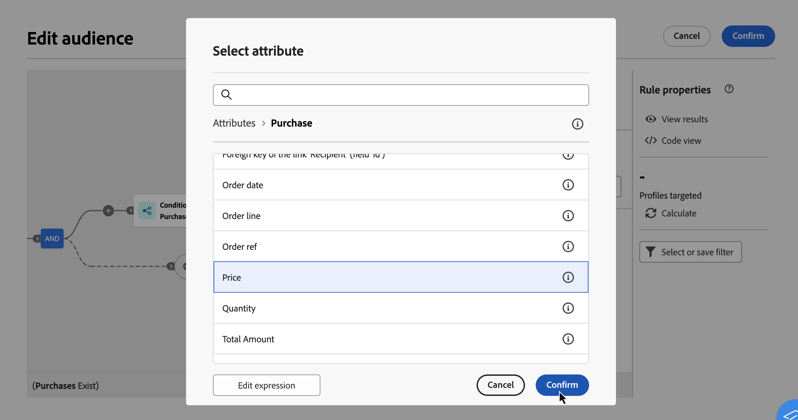
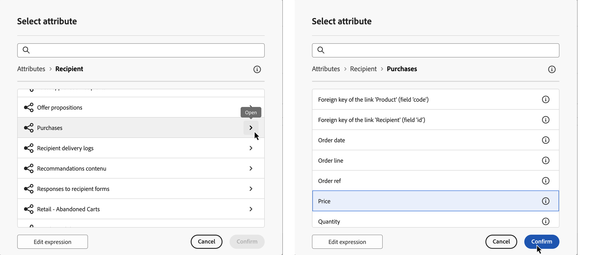
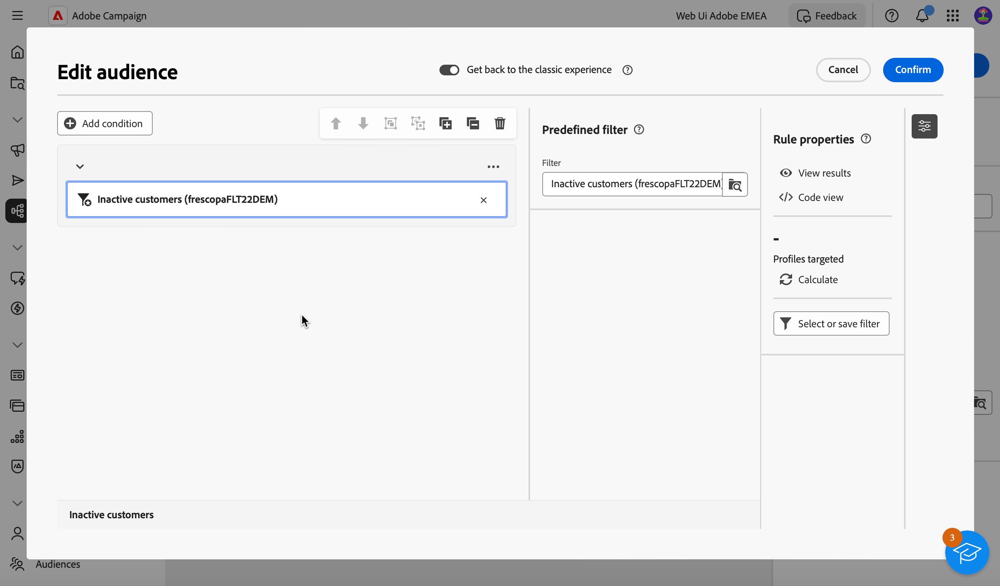

# Uw eerste query samenstellen {#build-query}

Om te beginnen bouwend een vraag, heb toegang tot de vraagmodeler van de plaats van uw keus, afhankelijk van de actie u wilt uitvoeren. De querymodelfunctie wordt geopend met een leeg canvas. Klik **+** knoop om de eerste knoop van uw vraag te vormen.

>[!IMPORTANT]
>
>Er is een gloednieuwe interface beschikbaar voor het Query-model. De Nieuwe regelbouwer staat u toe om uw vraag met meer gemak dankzij zijn vereenvoudigde interface te bouwen. Druk op de schakelknop in de rechterbovenhoek om naar deze ervaring over te schakelen. U kunt naar de klassieke modelleerling van de Vraag terugkeren wanneer u wilt door eenvoudig de knevel terug te duwen om de nieuwe interface onbruikbaar te maken. U kunt de zelfde principes toepassen zoals vraagmodeler in deze nieuwe interface.
>&#x200B;>{zoomable="yes"}

U kunt twee typen elementen toevoegen:

* **het Filtreren componenten** (De voorwaarde van de Douane, Uitgezochte publiek, Vooraf bepaald filter) staat u toe om uw eigen regels te bouwen, een publiek te selecteren, of een vooraf bepaald filter te gebruiken om uw vraag te raffineren. Zij worden toegevoegd bij het begin van uw vraag en op gestippelde overgangen. [&#x200B; leren hoe te met het filtreren componenten &#x200B;](#filtering) te werken

  Voorbeeld: *Ontvangers die aan &quot;Sports&quot;nieuwsbrief* intekenden, *Ontvangers die in New York* leven, *Ontvangers die in San Francisco* leven

>[!BEGINTABS]

>[!TAB  Klassieke vraagmodeler ]

{zoomable="yes"}

>[!TAB  Nieuwe Bouwer van de Regel ]

{zoomable="yes"}

>[!ENDTABS]

* **de exploitanten van de Groep** (EN, OF, BEHALVE) staan u toe om het filtreren componenten in het diagram te groeperen. Ze worden toegevoegd op bestaande overgangen vóór een filtercomponent. [&#x200B; Leer hoe te met exploitanten &#x200B;](#filtering) te werken

  Voorbeeld: *Ontvangers die Super VIP **EN** VIP zijn om **OF** de Demo van VIP te belonen, **BEHALVE** ontvangers onder 21 jaar en boven 45.

>[!BEGINTABS]

>[!TAB  Klassieke vraagmodeler ]

{zoomable="yes"}

>[!TAB  Nieuwe regelbouwer ]

{zoomable="yes"}

>[!ENDTABS]

## Verdeling van waarden in een query {#distribution-values-query}

De verdeling van waarden toont het percentage van elke waarde van een gebied binnen een lijst, die op de huidige vraagparameters wordt gebaseerd. Het weten van de verdeling van waarden binnen een vraaghulp verfijnen segmentatie.

U opent deze optie door in de query op de selectieknop voor kenmerken te klikken, zoals hieronder wordt weergegeven. Klik vervolgens op het pictogram **[!UICONTROL Information]** naast het geselecteerde kenmerk. U kunt de knop **[!UICONTROL Distribution of values]** openen.

{zoomable="yes"}

>[!NOTE]
>
>* Voor velden met veel waarden worden alleen de eerste 20 waarden weergegeven. In dergelijke gevallen verschijnt er een waarschuwing **[!UICONTROL Partial load]** .
>* De optie **[!UICONTROL Distribution of values]** is toegankelijk in elke kenmerkkiezer. [&#x200B; leer hoe te om attributen &#x200B;](../get-started/attributes.md) te selecteren
>* U kunt voorwaarden op de resultaten toevoegen door de **[ !AGeavanceerde filters]** te gebruiken. [&#x200B; leer hier meer &#x200B;](../get-started/work-with-folders.md#filter-the-values).

## Filtercomponenten toevoegen {#filtering}

Door componenten te filteren kunt u de query verfijnen door:

* **[de voorwaarden van de Douane](#custom-condition)**: Filter uw vraag door uw eigen voorwaarde met attributen van het gegevensbestand en geavanceerde uitdrukkingen te bouwen.
* **[Soorten publiek](#audiences)**: Filter uw vraag gebruikend een bestaand publiek.
* **[vooraf bepaalde filter](#predefined-filters)**: Filter uw vraag gebruikend bestaande vooraf bepaalde filters.

### Een aangepaste voorwaarde configureren {#custom-condition}

>[!CONTEXTUALHELP]
>id="acw_orchestration_querymodeler_customcondition"
>title="Aangepaste voorwaarde"
>abstract="De voorwaarden van de douane zijn het filtreren componenten die u toestaan om uw vraag te filtreren door uw eigen voorwaarde met attributen van het gegevensbestand en geavanceerde uitdrukkingen te bouwen."

Voer de volgende stappen uit om de query te filteren met behulp van een aangepaste voorwaarde:

1. Klik op de knop **+** op het gewenste knooppunt en selecteer **[!UICONTROL Custom condition]** . Het deelvenster Eigenschappen voor aangepaste voorwaarde wordt aan de rechterkant geopend.

1. Op het **gebied van Attributen**, selecteer de attributen van het gegevensbestand dat u wilt gebruiken om uw voorwaarde tot stand te brengen. De lijst met kenmerken bevat alle kenmerken van uw campagnecedatabase, inclusief kenmerken van gekoppelde tabellen. [&#x200B; leer hoe te om attributen te selecteren en hen toe te voegen aan favorieten &#x200B;](../get-started/attributes.md)

   {zoomable="yes"}

   >[!NOTE]
   >
   >De **geeft uitdrukking** knoop uit staat u toe om de de uitdrukkingsredacteur van het Web van de Campagne te gebruiken om een uitdrukking manueel te bepalen gebruikend gebieden van het gegevensbestand en hulpfuncties. [&#x200B; Leer hoe te om uitdrukkingen uit te geven &#x200B;](expression-editor.md)

1. Selecteer in de vervolgkeuzelijst de operator die u wilt toepassen. Er zijn verschillende operatoren beschikbaar voor gebruik. De operatoren in de vervolgkeuzelijst zijn afhankelijk van het gegevenstype van het kenmerk.

   +++Lijst met beschikbare operatoren

   | Operator | Doel | Voorbeeld |
   |---|---|---|
   | Gelijk aan | Retourneert een resultaat dat identiek is aan de gegevens die zijn ingevoerd in de tweede kolom Waarde. | Achternaam (@lastName) gelijk aan &#39;Jones&#39; retourneert alleen ontvangers met als achternaam Jones. |
   | Niet gelijk aan | Retourneert alle waarden die niet identiek zijn aan de ingevoerde waarde. | Taal (@taal) is niet gelijk aan &#39;Engels&#39;. |
   | Groter dan | Retourneert een waarde die groter is dan de ingevoerde waarde. | Leeftijd (@age) groter dan 50 zal alle waarden groter dan &quot;50&quot;terugkeren, zoals &quot;51&quot;, &quot;52&quot;. |
   | Minder dan | Retourneert een waarde die kleiner is dan de ingevoerde waarde. | Aanmaakdatum (@created) voordat &#39;DaysAgo(100)&#39; alle ontvangers retourneert die minder dan 100 dagen geleden zijn gemaakt. |
   | Groter dan of gelijk aan | Retourneert alle waarden die gelijk zijn aan of groter zijn dan de ingevoerde waarde. | Leeftijd (@age) groter dan of gelijk aan &#39;30&#39; retourneert alle ontvangers van 30 jaar of ouder. |
   | Kleiner dan of gelijk aan | Retourneert alle waarden die gelijk zijn aan of lager zijn dan de ingevoerde waarde. | Leeftijd (@age) kleiner dan of gelijk aan &#39;60&#39; retourneert alle ontvangers van 60 jaar of ouder. |
   | Opgenomen in | Retourneert resultaten die zijn opgenomen in de aangegeven waarden. Deze waarden moeten door een komma worden gescheiden. | De geboortedatum (@geboortedatum) is opgenomen in &#39;12-10-1979.12-10-1984&#39; en retourneert de tussen deze data geboren ontvangers. |
   | Niet in | Werkt zoals is opgenomen in operator. Hier worden ontvangers uitgesloten op basis van de ingevoerde waarden. | Geboortedatum (@geboortedatum) is niet opgenomen in &quot;10-12-1979,12-10-1984&quot;. Ontvangers die binnen deze datums zijn geboren, worden niet geretourneerd. |
   | Is leeg | Retourneert resultaten die overeenkomen met een lege waarde in de tweede kolom Waarde. | Mobiele (@mobilePhone) is leeg en retourneert alle ontvangers die geen mobiel nummer hebben. |
   | Is niet leeg | Werkt in omgekeerde volgorde naar de operator Is leeg. Het is niet nodig gegevens in te voeren in de tweede kolom Waarde. | E-mail (@email) is niet leeg. |
   | Begint met | Retourneert resultaten die beginnen met de ingevoerde waarde. | Account # (@account) begint met &#39;32010&#39;. |
   | Begint niet met | Retourneert resultaten die niet beginnen met de ingevoerde waarde. | Account # (@account) begint niet met &#39;20&#39;. |
   | Bevat | Retourneert resultaten die ten minste de ingevoerde waarde bevatten. | Het e-maildomein (@domain) bevat &#39;mail&#39; en retourneert alle domeinnamen die &#39;mail&#39; bevatten, zoals &#39;gmail.com&#39;. |
   | Bevat niet | Retourneert resultaten die niet de ingevoerde waarde bevatten. | E-maildomein (@domein) bevat geen &#39;vo&#39;. Domeinnamen die &#39;vo&#39; bevatten, zoals &#39;voila.fr&#39;, worden niet weergegeven in de resultaten. |
   | leuk | Net als bij de operator Bevat kunt u een jokerteken % in de waarde invoegen. | Achternaam (@lastName) zoals &#39;Jon%s&#39;. Het jokerteken fungeert als een &#39;joker&#39; om namen als &#39;Jones&#39; te zoeken. |
   | Niet leuk | Net als bij de operator Bevat kunt u een jokerteken % in de waarde invoegen. | Achternaam (@lastName) houdt niet van &#39;Smi%h&#39;. Ontvangers met de achternaam Smith worden niet geretourneerd. |

   +++

1. Op het **gebied van de Waarde**, bepaal de verwachte waarde. U kunt de de uitdrukkingsredacteur van het Web van de Campagne ook gebruiken om een uitdrukking manueel te bepalen gebruikend gebieden van het gegevensbestand en hulpfuncties. Om dit te doen, klik **geef uitdrukking** knoop uit. [&#x200B; Leer hoe te om uitdrukkingen uit te geven &#x200B;](expression-editor.md)

   *het voorbeeld van de Vraag die alle profielen terugkeren die 21 of meer zijn:*

>[!BEGINTABS]

>[!TAB  Klassieke vraagmodeler ]

{zoomable="yes"}

>[!TAB  Nieuwe regelbouwer ]

{zoomable="yes"}

>[!ENDTABS]

Voor datumtekstkenmerken zijn vooraf gedefinieerde waarden beschikbaar met de optie **[!UICONTROL Presets]** .

>[!BEGINTABS]

>[!TAB  Klassieke vraagmodeler ]

{zoomable="yes"}

>[!TAB  Nieuwe regelbouwer ]

{zoomable="yes"}

>[!ENDTABS]

#### Aangepaste voorwaarden voor gekoppelde tabellen (1-1 en 1-N koppelingen){#links}

De voorwaarden van de douane staan u toe om lijsten te vragen verbonden aan de lijst die momenteel door uw regel wordt gebruikt. Dit omvat lijsten met een 1-1 kardinaliteitsverbinding, of inzamelingstabellen (verbinding 1-N).

Voor a **1-1 verbinding**, navigeer aan de verbonden lijst, selecteer de gewenste attributen en bepaal de verwachte waarde.

U kunt een lijstverbinding in de **plukker van de Waarde** ook direct selecteren en bevestigen. In dat geval moeten de waarden die beschikbaar zijn voor de geselecteerde tabel, worden geselecteerd met een speciale kiezer, zoals in het onderstaande voorbeeld wordt getoond.

+++voorbeeld van Query

Hier, richt de vraag zich merken het waarvan etiket &quot;loopt&quot;.

1. Navigeer binnen de **Merk** lijst en selecteer het **3&rbrace; attribuut van het Etiket &lbrace;.**

   {zoomable="yes"}{width="85%" align="center"}

1. Definieer de verwachte waarde voor het kenmerk.

   {zoomable="yes"}{width="85%" align="center"}

Hier volgt een queryvoorbeeld waarin een tabelkoppeling rechtstreeks is geselecteerd. Beschikbare waarden voor deze tabel moeten worden geselecteerd in een speciale kiezer.

{zoomable="yes"}{width="85%" align="center"}

+++

Voor a **1-N verbinding**, kunt u sub-voorwaarden bepalen om uw vraag te verfijnen, zoals aangetoond in het hieronder voorbeeld.

+++voorbeeld van Query

Hier richt de query zich op ontvangers die aankopen hebben gedaan met betrekking tot het BrewMaster-product, voor een totale hoeveelheid van ten minste 100$.

1. Selecteer **Aankopen** lijst en bevestig.

   {zoomable="yes"}{width="50%" align="center"}

1. Een uitgaande overgang wordt toegevoegd, toestaand u om ondervoorwaarden tot stand te brengen.

   {zoomable="yes"}{width="85%" align="center"}

1. Selecteer de **Prijs** attributen en doelaankopen van 1000$ of meer

   {zoomable="yes"}{width="85%" align="center"}

1. Voeg subvoorwaarden toe die aan uw behoeften voldoen. Hier hebben we een voorwaarde toegevoegd aan de doelprofielen die een BrewMaster-product hebben aangeschaft.

   {zoomable="yes"}{width="85%" align="center"}

+++

#### Werken met geaggregeerde gegevens {#aggregate}

Met aangepaste omstandigheden kunt u gezamenlijke bewerkingen uitvoeren. Hiervoor moet u rechtstreeks een kenmerk in een verzamelingstabel selecteren:

1. Navigeer binnen de gewenste inzamelingstabel en selecteer de attributen waarop u een gezamenlijke verrichting wilt uitvoeren.

   {zoomable="yes"}{width="85%" align="center"}

1. In de eigenschappen ruit, knevel op de **Samengevoegde gegevens** optie en selecteer de gewenste gezamenlijke functie.

>[!BEGINTABS]

>[!TAB  Klassieke vraagmodeler ]

{zoomable="yes"}{width="85%" align="center"}

>[!TAB  Nieuwe regelbouwer ]

{zoomable="yes"}{width="85%" align="center"}

>[!ENDTABS]

### Een publiek selecteren {#audiences}

>[!CONTEXTUALHELP]
>id="acw_orchestration_querymodeler_selectaudience"
>title="Doelgroep selecteren"
>abstract="Door de **Uitgezochte publiek** optie te gebruiken, kunt u het publiek kiezen dat u wilt gebruiken om uw vraag te filtreren."

Voer de volgende stappen uit om uw query te filteren op een bestaand publiek:

>[!BEGINTABS]

>[!TAB  Klassieke vraagmodeler ]

1. Klik op de knop **+** op het gewenste knooppunt en kies **[!UICONTROL Select audience]** .

1. De **Uitgezochte publiek** eigenschappen ruit opent op de rechterkant. Kies het publiek dat u wilt gebruiken om uw query te filteren.

   *voorbeeld van de vraag die alle profielen terugkeert die tot het &quot;publiek van de Goers van het Festival&quot;behoren:*

   {zoomable="yes"}

>[!TAB  Nieuwe regelbouwer ]

1. Klik **uitbreiden** knoop naast de **[!UICONTROL Add condition]** knoop en kies **[!UICONTROL Select audience]**.

1. De **Uitgezochte publiek** eigenschappen ruit opent op de rechterkant. Kies het publiek dat u wilt gebruiken om uw query te filteren.

   *voorbeeld van de Vraag die alle profielen terugkeren die tot het &quot;publiek van de Werken van de Koffie&quot;behoren:*

   {zoomable="yes"}

>[!ENDTABS]

### Een vooraf gedefinieerd filter gebruiken {#predefined-filters}

>[!CONTEXTUALHELP]
>id="acw_orchestration_querymodeler_predefinedfilter"
>title="Vooraf gedefinieerd filter"
>abstract="Door de **Vooraf bepaalde filteroptie** te gebruiken, kunt u een vooraf bepaald filter van de lijst van douanefilters of van favorieten selecteren."

Voer de volgende stappen uit om de query te filteren met een vooraf gedefinieerd filter:

>[!BEGINTABS]

>[!TAB  Klassieke vraagmodeler ]

1. Klik op de knop **+** op het gewenste knooppunt en selecteer **[!UICONTROL Predefined filter]** .

1. De **Vooraf bepaalde filter** eigenschappen ruit opent op de rechterkant. Selecteer een vooraf gedefinieerd filter in de lijst met aangepaste filters of uit favorieten.

   *voorbeeld van de Vraag die alle profielen terugkeren die aan de &quot;Inactieve klanten&quot;vooraf bepaalde filter beantwoorden:*

   {zoomable="yes"}

>[!TAB  Nieuwe regelbouwer ]

1. Klik **uitbreiden** knoop naast de **[!UICONTROL Add condition]** knoop en selecteren **[!UICONTROL Predefined filter]**.

1. De **Vooraf bepaalde filter** eigenschappen ruit opent op de rechterkant. Selecteer een vooraf gedefinieerd filter in de lijst met aangepaste filters of uit favorieten.

   *voorbeeld van de Vraag die alle profielen terugkeren die aan de &quot;Inactieve klanten&quot;vooraf bepaalde filter beantwoorden:*

   {zoomable="yes"}

>[!ENDTABS]

### Componenten kopiëren en plakken {#copy}

Met de querymodelfunctie kunt u een of meer filtercomponenten kopiëren en deze aan het einde van een overgang plakken. Deze bewerking kan worden uitgevoerd binnen het huidige querycanvas of op elk canvas in uw instantie.

>[!NOTE]
>
>De gekopieerde selectie blijft behouden zolang u in uw exemplaar werkt. Als u zich afmeldt en weer aanmeldt, is uw selectie niet meer beschikbaar voor plakken.

>[!IMPORTANT]
>
>Het is momenteel onmogelijk om componenten in de Nieuwe de bouwerervaring van de Regel te kopiëren en te kleven. Als u deze volgende stappen wilt volgen, klikt u op de schakeloptie **[!UICONTROL Get back to the classic experience]** bovenaan om het klassieke querymodel te gebruiken.

Voer de volgende stappen uit om filtercomponenten te kopiëren en te plakken:

1. Selecteer de filtercomponent die u wilt kopiëren door erop in het vraagcanvas te klikken. Als u meerdere componenten wilt selecteren, gebruikt u het gereedschap Meerdere selecties dat beschikbaar is in de werkbalk rechtsboven op het canvas.

1. Klik op de knop **[!UICONTROL Copy]** in het deelvenster Eigenschappen van de component of in het blauwe lint onder aan het scherm als u meerdere componenten hebt geselecteerd.

   | Eén component kopiëren | Meerdere componenten kopiëren |
   |  ---  |  ---  |
   | {zoomable="yes"}{width="200" align="center" zoomable="yes"} | {zoomable="yes"}{width="200" align="center" zoomable="yes"} |

1. Om de component(en) te kleven, klik + knoop aan het eind van de gewenste overgang en selecteer **Deeg in punten**.

   {zoomable="yes"}

## Componenten slepen en neerzetten {#drag-and-drop}

>[!IMPORTANT]
>
>Deze eigenschap is slechts beschikbaar voor de nieuwe ervaring van de regelbouwer.

Wanneer u componenten aan uw vraag toevoegt, kunt u hen bewegen omhoog en neer gebruikend de belemmering en dalingseigenschap.

Links van elke component kunt u op de stippen klikken en deze ingedrukt houden om de component omhoog en omlaag te slepen, afhankelijk van waar u de componenten wilt plaatsen en groeperen.

{zoomable="yes"}

## Filtercomponenten combineren met operatoren {#operators}

>[!CONTEXTUALHELP]
>id="acw_orchestration_querymodeler_group"
>title="Groep"
>abstract="In dit deelvenster kunt u de operator wijzigen die wordt gebruikt om filtervoorwaarden aan elkaar te koppelen."

Telkens als u een nieuwe het filtreren component aan uw vraag toevoegt, wordt het automatisch verbonden met de andere component door een **EN** exploitant. Dit betekent dat de resultaten van de twee filtercomponenten worden gecombineerd.

In dit voorbeeld, hebben wij een nieuwe publiek-type het filtreren componenten op de tweede overgang toegevoegd. De component is verbonden met de vooraf bepaalde filtervoorwaarde met een **EN** exploitant, betekenend dat de vraagresultaten ontvangers omvatten die door de &quot;Abonnees van de Nieuwsbrief - MADRID&quot;vooraf bepaalde filter EN die tot het &quot;publiek van de Aankopen (Al tijd) behoren.

>[!BEGINTABS]

>[!TAB  Klassieke vraagmodeler ]

{zoomable="yes"}

Om de exploitant te veranderen die wordt gebruikt om het filtreren voorwaarden samen te verbinden, klik op het en selecteer de gewenste exploitant in de **ruit van de Groep** die op de rechterkant opent.

Beschikbare operatoren zijn:

* **EN (Doorsnede)**: Combineert resultaten die alle het filtreren componenten in de uitgaande overgangen aanpassen.
* **OF (Unie)**: Omvat resultaten die minstens één van de het filtreren componenten in de uitgaande overgangen aanpassen.
* **BEHALVE (Uitsluiting)**: Sluit resultaten uit die alle het filtreren componenten in de uitgaande overgang aanpassen.

{zoomable="yes"}

Daarnaast kunt u tussenliggende groepen componenten maken door componenten te groeperen in dezelfde groep en deze aan elkaar te koppelen. Op die manier wordt de operator AND standaard ingesteld, kunt u deze wijzigen in de gewenste operator.

>[!TAB  Nieuwe regelbouwer ]

{zoomable="yes"}

Als u de operator wilt wijzigen die wordt gebruikt om filtervoorwaarden aan elkaar te koppelen, klikt u erop, verandert deze in OR, EXCEPT en vervolgens terug naar AND en selecteert u de gewenste operator.

Beschikbare operatoren zijn:

* **EN (Doorsnede)**: Combineert resultaten die alle het filtreren componenten in de uitgaande overgangen aanpassen.
* **OF (Unie)**: Omvat resultaten die minstens één van de het filtreren componenten in de uitgaande overgangen aanpassen.
* **BEHALVE (Uitsluiting)**: Sluit resultaten uit die alle het filtreren componenten in de uitgaande overgang aanpassen.

{zoomable="yes"}

>[!ENDTABS]

In het onderstaande voorbeeld hebben we een tussengroep opgericht die resultaten opneemt van het publiek &quot;VIP to bonus&quot; of &quot;Super VIP&quot;.

>[!BEGINTABS]

>[!TAB  Klassieke vraagmodeler ]

{zoomable="yes"}

>[!TAB  Nieuwe regelbouwer ]

{zoomable="yes"}

>[!ENDTABS]

## Uw query controleren en valideren

>[!CONTEXTUALHELP]
>id="acw_orchestration_querymodeler_ruleproperties"
>title="Eigenschappen van Rule"
>abstract="Zodra u uw vraag in het canvas hebt gebouwd, kunt u het controleren gebruikend de **eigenschappen van de Regel** ruit die op de rechterkant wordt gevestigd.  Dit ruit staat u toe om de resulterende gegevens te tonen, een SQL codeversie van de vraag terug te winnen, en het aantal gerichte verslagen te controleren.  gebruik **Uitgezocht of sparen filter** knoop om uw vraag als vooraf bepaald filter te bewaren, of de canvasinhoud met een bestaand filter te vervangen."

Zodra u uw vraag in het canvas hebt gebouwd, kunt u het controleren gebruikend de **eigenschappen van de Regel** ruit die op de rechterkant wordt gevestigd Deze ruit toont wanneer het bouwen van een vraag om een publiek tot stand te brengen. Beschikbare bewerkingen zijn:

* **resultaten van de Mening:** toont de gegevens die uit uw vraag voortvloeien.
* **mening van de Code**: Toont een op code-gebaseerde versie van de vraag in SQL.
* **berekent**: Updates en toont het aantal verslagen die door uw vraag worden gericht.
* **Uitgezocht of sparen filter**: Kies een bestaand vooraf bepaald filter om in het canvas te gebruiken, of sparen uw vraag als vooraf bepaald filter voor toekomstig hergebruik. [&#x200B; Leer hoe te met vooraf bepaalde filters &#x200B;](../get-started/predefined-filters.md) te werken

  >[!IMPORTANT]
  >
  >Selecteer een vooraf gedefinieerd filter in het deelvenster Eigenschappen regel om de query die in het canvas is gemaakt te vervangen door het geselecteerde filter.

Wanneer het gebruiken van de nieuwe ervaring van de regelbouwer, kunt u de doelbevolking op elke voorwaarde en groep direct tonen:

* Klik **berekenen het voorwaarde** pictogram op de gewenste voorwaarde of de groep om het aantal verslagen gegevens te verwerken en te tonen die door uw vraag worden bedoeld.
* Klik op het resultaatnummer om de gedetailleerde lijst met records weer te geven.

{zoomable="yes"}

Wanneer uw vraag klaar is, klik de **[!UICONTROL Confirm]** knoop in de hoger-juiste hoek om het te bewaren.

>[!BEGINTABS]

>[!TAB  Klassieke vraagmodeler ]

U kunt uw query op elk gewenst moment wijzigen door deze te openen. Houd in mening dat het bij het openen van een bestaande vraag, het in een vereenvoudigde mening zonder de zichtbaarheid van **+** knopen toont. Als u nieuwe elementen aan de query wilt toevoegen, selecteert u een component of operator op het canvas om de knoppen **+** weer te geven.

{zoomable="yes"}

>[!TAB  Nieuwe Bouwer van de Regel ]

U kunt uw query op elk gewenst moment wijzigen door deze te openen. Klik hiertoe op de knop **[!UICONTROL Add condition]** in de linkerbovenhoek.

{zoomable="yes"}

>[!ENDTABS]
