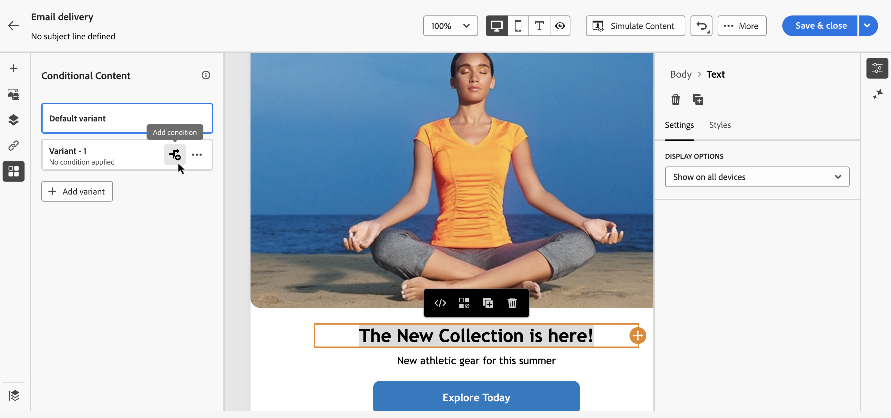

# Werken met de querymodelfunctie {#segment-builder}

>[!CONTEXTUALHELP]
>id="acw_homepage_learning_card5"
>title="New Query modeler"
>abstract="Het Web van Adobe Campaign kenmerkt een vraagmodeler die het proces van het filtreren van gegevensbestanden vereenvoudigt om specifieke doelstellingen te selecteren die op diverse criteria worden gebaseerd. Dit omvat het gebruik van geavanceerde expressies en operatoren. De vraagmodeler is beschikbaar in elke context waar u regels aan filtergegevens moet bepalen."

>[!CONTEXTUALHELP]
>id="acw_orchestration_querymodeler_querymessage"
>title="Query-modelleraar"
>abstract="Bepaal het filtreren criteria voor ontvangers of om het even welke andere gericht afmeting van het gegevensbestand. Profiteer van uw Adobe Experience Platform-publiek om uw doelgroep verder te verfijnen en de impact van uw campagne te maximaliseren."

>[!CONTEXTUALHELP]
>id="acw_deliveries_refine_target"
>title="Doel verfijnen"
>abstract="Deze regels kunnen slechts in de cliëntconsole worden veranderd."

De gebruikersinterface van het Web van Adobe Campaign kenmerkt een vraagmodeler die het proces vereenvoudigt om het gegevensbestand te filtreren dat op diverse criteria wordt gebaseerd. Het verzekert volledige verenigbaarheid met de vragen die in de cliëntconsole worden gecreeerd, die een naadloze overgang aan het Webgebruikersinterface vergemakkelijkt.

Bovendien, kan de vraagmodeler zeer complexe en lange vragen efficiënt beheren, die grotere flexibiliteit en precisie aanbieden. Bovendien ondersteunt het programma vooraf gedefinieerde filters binnen voorwaarden, waarmee u query&#39;s eenvoudig kunt verfijnen en geavanceerde expressies en operatoren kunt gebruiken voor uitgebreide doelgerichte en segmentatiestrategieën voor het publiek.

## Heb toegang tot de vraagmodeller

De querymodeler is beschikbaar in elke context waarin u regels moet definiëren om gegevens te filteren.

| Gebruik | Voorbeeld |
|  ---  |  ---  |
| **bepaalt publiek**: Specificeer de bevolking u in uw berichten of werkschema&#39;s wilt richten, en creeer moeiteloos nieuw publiek dat aan uw behoeften wordt aangepast. [ Leer hoe te om publiek te bouwen ](../audience/one-time-audience.md) |  |
| **pas werkschemaactiviteiten** aan: pas regels binnen werkschemaactiviteiten, zoals **Gesplitst** en **Verzoening** toe, om op uw specifieke vereisten te richten. [ Leer meer op werkschemaactiviteiten ](../workflows/activities/about-activities.md) |  |
| **vooraf bepaalde filters**: Creeer vooraf bepaalde filters die als kortere weg tijdens diverse het filtreren verrichtingen dienen, of u met gegevenslijsten werkt of het publiek voor een levering vormt. [ Leer hoe te met vooraf bepaalde filters ](../get-started/predefined-filters.md) te werken |  |
| **de rapporten van de Filter gegevens**: Voeg regel toe om de gegevens te filtreren die in rapporten worden getoond. [ Leer hoe te met rapporten ](../reporting/gs-reports.md) te werken |  |
| **pas lijsten** aan: Creeer douaneregels om de gegevens te filtreren die in lijsten zoals ontvangers, leveringenlijsten enz. worden getoond. [ Leer hoe te om lijsten ](../get-started/list-filters.md#list-built-in-filters) te filtreren |  |
| **bouwt voorwaardelijke inhoud**: maak e-mailinhoud dynamisch door voorwaarden te creëren die bepalen welke inhoud aan verschillende ontvangers zou moeten worden getoond, die gepersonaliseerd en relevant overseinen verzekeren. [ Leer hoe te om voorwaardelijke inhoud te bouwen ](../personalization/conditions.md) |  |

>[!NOTE]
>
>Wanneer u een object opent dat is gemaakt in de clientconsole waarop regels zijn toegepast, zoals een publiek of een vooraf gedefinieerd filter, wordt de sectie **[!UICONTROL Refine target]** mogelijk weergegeven. Dit betekent dat de extra parameters zijn gevormd om het regeldoel te verfijnen. Deze parameters kunnen alleen in de console worden gewijzigd.
>
>

## Query-modellerinterface {#interface}

>[!CONTEXTUALHELP]
>id="acw_rule_builder_switch_button"
>title="Nieuwe gebruikerservaring"
>abstract="Gebruik deze knevel om tussen de klassieke vraagmodeler en de nieuwe ervaring van de regelbouwer te schakelen."

De vraagmodeler verstrekt een centraal canvas waar u uw vraag bouwt, en een juiste ruit die informatie over uw vraag verstrekt.

### Het centrale canvas {#canvas}

Het centrale canvas van de vraagmodeler is waar u toevoegt en de verschillende componenten combineert die uw vraag opbouwen. [ Leer hoe te om een vraag ](build-query.md) te bouwen

De werkbalk in de rechterbovenhoek van het canvas bevat opties waarmee u de querycomponenten eenvoudig kunt manipuleren en op het canvas kunt navigeren:

* **Veelvoudige selectiemodus**: Selecteer veelvoudige het filtreren componenten om hen bij de plaats van uw keus te kopiëren en te kleven.
* **Roteren**: Wissel het canvas verticaal.
* **Passend aan het scherm**: Pas het het gezoemniveau van het canvas aan uw scherm aan.
* **Gezoem uit** / **Gezoem binnen**: Gezoem uit of in het canvas.
* **kaart van de Vertoning**: Opent een momentopname van het canvas die u toont wordt gevestigd.

### Het deelvenster Eigenschappen van regel {#rule-properties}

Aan de rechterkant bevat het deelvenster **[!UICONTROL Rule properties]** informatie over de query. Het staat u toe om diverse handelingen uit te voeren om de vraag te controleren en ervoor te zorgen het uw behoeften aanpast. Dit deelvenster wordt weergegeven wanneer u een query samenstelt om een publiek te maken. [ leer hoe te om uw vraag te controleren en te bevestigen ](build-query.md#check-and-validate-your-query)
