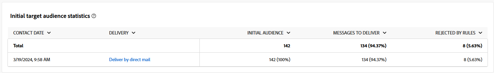
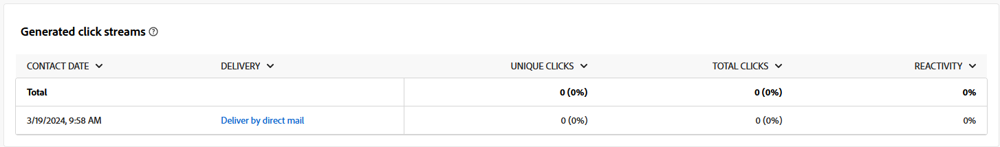

# Campagnerapporten voor het kanaal Direct mail {#campaign-reports-direct-mail}

Elk campagnerapport is verdeeld in verschillende widgets waarin het succes en de fouten van uw campagne worden beschreven. Voor het kanaal van de Post, zijn de rapporten en de metriek gedetailleerd hieronder. Leer hoe te om tot uw campagnerapporten in [ toegang te hebben deze pagina ](campaign-reports.md).

## Leveringsoverzicht {#delivery-summary-direct}

### Overzicht van levering {#delivery-overview-direct}

>[!CONTEXTUALHELP]
>id="acw_campaign_reporting_delivery_overview_direct_mail"
>title="Overzicht van levering"
>abstract="Het **Overzicht van de Levering** stelt zeer belangrijke prestatiesmetriek (KPIs) voor die diepgaande inzichten in de interactie van uw bezoekers met elke directe postlevering aanbieden. De meetgegevens worden hieronder beschreven."

In **[!UICONTROL Delivery Overview]** vindt u belangrijke prestatiemetriek (KPI&#39;s) met diepgaande inzichten in de interactie van uw bezoekers met elke direct-maillevering. De meetgegevens worden hieronder beschreven.

+++ Meer informatie over overzichtsmetriek voor levering.

* **[!UICONTROL Messages to deliver]**: Het totale aantal berichten dat tijdens de voorbereiding van de levering wordt verwerkt.

* **[!UICONTROL Delivered]**: Het aantal berichten dat is verzonden in verhouding tot het totale aantal verzonden berichten.

* **[!UICONTROL Errors]**: Totaal aantal fouten gecumuleerd tijdens levering en automatische retourverwerking in verhouding tot het totale aantal verzonden berichten.

* **[!UICONTROL Total clicks]**: Het totale aantal verschillende ontvangers dat minstens één keer in een levering heeft geklikt.

+++

### Eerste doelstatistieken {#delivery-summary-direct-initial-target}

>[!CONTEXTUALHELP]
>id="acw_campaign_reporting_target_audience_direct_mail"
>title="Eerste doelstatistieken"
>abstract="De ontvankelijke gegevens en berichtinformatie worden getoond in de **Aanvankelijke lijst van het doelpubliek**, die de analyse van de leveringsvoorbereiding weerspiegelt."

In de tabel **[!UICONTROL Initial target audience statistics]** worden gegevens weergegeven die relatief zijn ten opzichte van de ontvangers. De metriek worden berekend tijdens levering voorbereiding en toon: het aanvankelijke publiek, het aantal te verzenden berichten, het aantal uitgesloten ontvangers.

+++Meer informatie over de cijfers voor de aanvankelijke doelpubliek.

* **[!UICONTROL Initial audience]**: het totale aantal beoogde ontvangers.

* **[!UICONTROL Message to deliver]**: Het totale aantal berichten dat na de voorbereiding van de levering moet worden geleverd.

* **[!UICONTROL Rejected by rules]**: Het totale aantal adressen dat tijdens de analyse wordt genegeerd wanneer het toepassen van regels: adres ontbreekt, quarantined, op lijst van gewezen personen, enz.

+++

### Uitvoeringsstatistieken {#delivery-summary-direct-exec-stats}

>[!CONTEXTUALHELP]
>id="acw_campaign_reporting_execution_statistics_direct_mail"
>title="Leveringsstatistieken"
>abstract="De **statistieken van de Uitvoering** lijst specificeert het succes van uw Directe postlevering, en fouten die voorkwamen."

De tabel **[!UICONTROL Execution statistics]** geeft een overzicht van het succes van elke directe verzending via e-mail. Hieronder vindt u gedetailleerde gegevens.

+++ Meer informatie over de statistieken van de Levering metriek.

* **[!UICONTROL Message to deliver]**: Het totale aantal berichten dat na de voorbereiding van de levering moet worden geleverd.

* **[!UICONTROL Success]**: Het aantal berichten dat met succes is verwerkt in verhouding tot het aantal te leveren berichten.

* **[!UICONTROL Errors]**: Het totale aantal fouten dat tijdens leveringen is gecumuleerd en de automatische oplaadbewerking in verhouding tot het aantal te leveren berichten.

* **[!UICONTROL New quarantines]**: Het totale aantal adressen dat in quarantaine wordt geplaatst na een mislukte levering (onbekend, ongeldig domein) in verhouding tot het aantal te leveren berichten.

+++

### Gegenereerde klikstromen {#click-streams}

>[!CONTEXTUALHELP]
>id="acw_campaign_reporting_clicks_direct_mail"
>title="Gegenereerde klikstromen"
>abstract="De **Gegenereerde klikstromen** lijst toont de beschikbare gegevens met betrekking tot hoe uw ontvangers met uw levering interactie hadden."

De **Gegenereerde klikstromen** lijst illustreert de redenen die gebruikersprofielen, uitgesloten van de gerichte profielen, het bericht ontvingen.

+++Klik op Metrische gegevens voor gegenereerde streams voor meer informatie.

* **[!UICONTROL Unique clicks]**: Het totale aantal verschillende ontvangers dat minstens één keer in een levering heeft geklikt.

* **[!UICONTROL Total clicks]**: Het totale aantal klikken op koppelingen in leveringen.

* **[!UICONTROL Reactivity]**: Verhouding van het aantal beoogde ontvangers dat op een levering heeft geklikt, in verhouding tot het geschatte aantal beoogde ontvangers dat een levering heeft geopend.

+++
