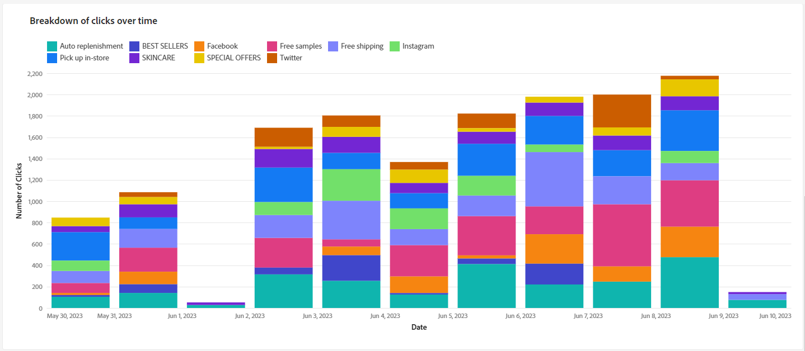

# Campagnerapporten voor het e-mailkanaal {#campaign-reports-email-channel}

Elk campagnerapport is verdeeld in verschillende widgets waarin het succes en de fouten van uw campagne worden beschreven. Voor het e-mailkanaal worden de rapporten en metriek hieronder beschreven. Leer hoe te om tot uw campagnerapporten in [&#x200B; toegang te hebben deze pagina &#x200B;](campaign-reports.md).

## Leveringsoverzicht {#delivery-summary-email}

>[!CONTEXTUALHELP]
>id="acw_campaign_reporting_deliveries_overview"
>title="Overzicht van levering"
>abstract="Het **Overzicht van de Levering** verstrekt zeer belangrijke prestatiesindicatoren (KPIs) die gedetailleerde informatie over geven hoe uw bezoekers met uw e-maillevering in dienst nemen."

### Overzicht van levering {#delivery-summary-email-ovv}

Het **[!UICONTROL Delivery Overview]** -rapport bevat prestatie-indicatoren (KPI&#39;s) die gedetailleerde informatie geven over de manier waarop bezoekers uw e-maillevering uitvoeren. De cijfers worden hieronder beschreven.

{zoomable="yes"}

+++Meer weten over de cijfers van het e-mailcampagnerapport?

* **[!UICONTROL Messages to deliver]**: Het totale aantal berichten dat tijdens de voorbereiding van de levering wordt verwerkt.

* **[!UICONTROL Delivered]**: Het aantal berichten dat is verzonden in verhouding tot het totale aantal verzonden berichten.

* **[!UICONTROL Bounces]**: Totaal aantal fouten gecumuleerd tijdens levering en automatische retourverwerking in verhouding tot het totale aantal verzonden berichten.

* **[!UICONTROL Total opens]**: Het totale aantal ontvangers waarvoor een bericht is geopend, ten minste één keer.

* **[!UICONTROL Total clicks]**: Het totale aantal verschillende ontvangers dat minstens één keer in een levering heeft geklikt.

+++

### Eerste doelstatistieken {#delivery-summary-email-initial-target}

>[!CONTEXTUALHELP]
>id="acw_campaign_reporting_deliveries_target"
>title="Eerste doelstatistieken"
>abstract="De aanvankelijke lijst van de doelpublieksstatistieken toont gegevens met betrekking tot uw ontvangers."

In de tabel **[!UICONTROL Initial target audience statistics]** worden gegevens weergegeven die relatief zijn ten opzichte van de ontvangers. De cijfers worden hieronder beschreven.

{zoomable="yes"}

+++Meer weten over de cijfers van het e-mailcampagnerapport?

* **[!UICONTROL Initial audience]**: het totale aantal beoogde ontvangers.

* **[!UICONTROL Message to deliver]**: Het totale aantal berichten dat na de voorbereiding van de levering moet worden geleverd.

* **[!UICONTROL Rejected by rules]**: Het totale aantal adressen dat tijdens de analyse wordt genegeerd wanneer het toepassen van regels: adres ontbreekt, quarantined, op lijst van gewezen personen, enz.

+++

### Uitvoeringsstatistieken {#delivery-summary-email-exec-stats}

>[!CONTEXTUALHELP]
>id="acw_campaign_reporting_email_exec_stats"
>title="Uitvoeringsstatistieken"
>abstract="De **statistieken van de Uitvoering** lijst specificeert het succes van uw levering: berichten om te leveren, succes, fouten, en nieuwe quarantines."

In de tabel **[!UICONTROL Execution statistics]** wordt aangegeven hoe succesvol de levering is. De cijfers worden hieronder beschreven.

{zoomable="yes"} detailleert

+++Meer weten over de cijfers van het e-mailcampagnerapport?

* **[!UICONTROL Message to deliver]**: Het totale aantal berichten dat na de voorbereiding van de levering moet worden geleverd.

* **[!UICONTROL Success]**: Het aantal berichten dat met succes is verwerkt in verhouding tot het aantal te leveren berichten.

* **[!UICONTROL Errors]**: Het totale aantal fouten dat tijdens leveringen is gecumuleerd en de automatische oplaadbewerking in verhouding tot het aantal te leveren berichten.

* **[!UICONTROL New quarantines]**: Het totale aantal adressen dat in quarantaine wordt geplaatst na een mislukte levering (onbekend, ongeldig domein) in verhouding tot het aantal te leveren berichten.

  De e-mailfoutentypes zijn vermeld in de [&#x200B; Adobe Campaign v8 (cliëntconsole) documentatie &#x200B;](https://experienceleague.adobe.com/docs/campaign/campaign-v8/send/failures/delivery-failures.html?lang=nl-NL#email-error-types){target="_blank"}.

+++

### Reactiestatistieken {#delivery-summary-email-reaction-stats}

>[!CONTEXTUALHELP]
>id="acw_campaign_reporting_email_reaction_stats"
>title="Reactiestatistieken"
>abstract="De **statistieken van de Reactie** lijst toont de beschikbare gegevens voor ontvankelijke activiteit voor uw levering: aantal opent, abonnementen, unsubscriptions, klikt om paginakoppeling te weerspiegelen."

De tabel **[!UICONTROL Reaction statistics]** bevat de beschikbare gegevens voor de activiteit van de ontvanger voor de levering. De cijfers worden hieronder beschreven.

{zoomable="yes"} bevatten

+++Meer weten over de cijfers van het e-mailcampagnerapport?

* **[!UICONTROL Unique opens]**: Het totale aantal ontvangers waarvoor een bericht is geopend, ten minste één keer.

* **[!UICONTROL Total Opens]**: aantal verschillende beoogde ontvangers voor dit domein die een bericht minstens één keer hebben geopend.

* **[!UICONTROL Unsubscriptions]**: Aantal ontvangers die op abonnementen voor de betrokken periode hebben geklikt.

* **[!UICONTROL Mirror page]**: Aantal ontvangers dat op de koppeling naar de spiegelpagina heeft geklikt.

* **[!UICONTROL Forwards]**: Aantal ontvangers dat heeft geklikt en het e-mailbericht heeft doorgestuurd.
+++

### Gegenereerde klikstromen {#delivery-summary-email-click-streams}

>[!CONTEXTUALHELP]
>id="acw_campaign_reporting_email_click_streams"
>title="Gegenereerde klikstromen"
>abstract="De **Gegenereerde klikstromen** lijst toont de beschikbare gegevens met betrekking tot hoe uw ontvangers met uw levering interactie hadden."

In de tabel **[!UICONTROL Generated click streams]** worden gegevens weergegeven die relatief zijn ten opzichte van de manier waarop de ontvangers met de levering hebben gewerkt. De cijfers worden hieronder beschreven.

{zoomable="yes"}

+++Meer weten over de cijfers van het e-mailcampagnerapport?

* **[!UICONTROL Unique clicks]**: Het totale aantal unieke ontvangers dat minstens één keer in een levering heeft geklikt.

* **[!UICONTROL Total Clicks]**: Het totale aantal klikken op koppelingen in leveringen.

* **[!UICONTROL Reactivity]**: Verhouding van het aantal beoogde ontvangers dat op een levering heeft geklikt, in verhouding tot het geschatte aantal beoogde ontvangers dat een levering heeft geopend.

+++

## Niet-te leveren items {#non-deliverables-email}

### Uitsplitsing van fouten per type {#delivery-summary-email-breakdown-per-type}

>[!CONTEXTUALHELP]
>id="acw_campaign_reporting_error_type"
>title="Uitsplitsing van fouten per type"
>abstract="De **Uitsplitsing van fouten per type** lijst en grafiek bevatten de beschikbare gegevens voor elk aangetroffen foutentype: gebruiker onbekend, brievenbus volledig, ongeldig domein, en meer."

De tabel en grafiek van **[!UICONTROL Breakdown of errors per type]** bevatten de beschikbare gegevens voor mogelijke fouten die voor elk type domein worden aangetroffen. De cijfers worden hieronder beschreven.

De fouten die in dit rapport worden weergegeven, activeren het quarantaineproces. Voor meer op quarantainebeheer, verwijs naar [&#x200B; Campagne v8 (cliëntconsole) documentatie &#x200B;](https://experienceleague.adobe.com/docs/campaign/campaign-v8/campaigns/send/failures/delivery-failures.html?lang=nl-NL){target="_blank"}.

{zoomable="yes"}

+++Meer weten over de cijfers van het e-mailcampagnerapport?

* **[!UICONTROL User unknown]**: Fouttype dat tijdens de levering wordt gegenereerd om aan te geven dat het e-mailadres ongeldig is.

* **[!UICONTROL Invalid domain]**: Fouttype dat wordt gegenereerd bij het verzenden van een levering om aan te geven dat het domein van het e-mailadres onjuist is of niet bestaat.

* **[!UICONTROL Mailbox full]**: Fouttype dat wordt gegenereerd na vijf leveringspogingen om aan te geven dat het Postvak IN van de ontvangers te veel berichten bevat.

* **[!UICONTROL Account disabled]**: Fouttype dat wordt gegenereerd bij het verzenden van een levering om aan te geven dat het adres niet langer bestaat.

* **[!UICONTROL Refused]**: Het type van fout produceerde wanneer een adres door IAP (Internet Access Provider) wordt verworpen, bijvoorbeeld na de toepassing van een veiligheidsregel (anti-spamsoftware).

* **[!UICONTROL Unreachable]**: Het type van fout dat in het koord van de berichtdistributie voorkomt: incident op het relais SMTP, domein tijdelijk onbereikbaar, etc.

* **[!UICONTROL Not connected]**: Fouttype om aan te geven dat de mobiele telefoon van de ontvanger op het moment van verzending wordt uitgeschakeld of losgekoppeld van het netwerk.

+++

### Uitsplitsing van fouten per domein {#delivery-summary-email-breakdown-per-domain}

>[!CONTEXTUALHELP]
>id="acw_campaign_reporting_error_domain"
>title="Uitsplitsing van fouten per domein"
>abstract="De **Uitsplitsing van fouten per domein** lijst en grafiek tonen de beschikbare gegevens voor elk die foutentype afhankelijk van elk domein wordt ontmoet."

De tabel en grafiek van **[!UICONTROL Breakdown of errors per domain]** bevatten de beschikbare gegevens voor mogelijke fouten die met elk domein worden aangetroffen. Metrische gegevens komen veel voor in de tabel **[!UICONTROL Breakdown of errors per type]** en de grafiek die hierboven is beschreven.

## Trackingsindicatoren {#tracking-indicators-email}

### Leveringsstatistieken {#delivery-summary-email-statistics}

>[!CONTEXTUALHELP]
>id="acw_delivery_campaign_delivery_statistics_summary"
>title="Leveringsstatistieken"
>abstract="De **statistieken van de Levering** grafiek detailleert het succes van uw levering, en fouten die voorkwamen."

De metriek van **[!UICONTROL Delivery statistics]** verstrekt zeer belangrijke prestatiesindicatoren (KPIs) die gedetailleerde informatie over gegevens beschikbaar voor verzonden e-mail geven. De cijfers worden hieronder beschreven.

{zoomable="yes"}

+++Meer weten over de cijfers van het e-mailcampagnerapport?

* **[!UICONTROL Message(s) to deliver]**: Het aantal berichten dat met succes is verwerkt in verhouding tot het aantal te leveren berichten.

* **[!UICONTROL Unique opens]**: Het totale aantal ontvangers waarvoor een bericht is geopend, ten minste één keer.

* **[!UICONTROL Total Opens]**: aantal verschillende beoogde ontvangers voor dit domein die een bericht minstens één keer hebben geopend.

* **[!UICONTROL Clicks on the opt-out link]**: Het aantal klikken op de koppeling voor het opzeggen van abonnementen.

* **[!UICONTROL Clicks on the mirror link]**: Het aantal klikken op de koppeling naar de spiegelpagina.

* **[!UICONTROL Estimation of forwards]**: schatting van het aantal e-mails dat door de beoogde ontvangers is doorgestuurd.
+++

### Openen en klikken op dalingssnelheid {#delivery-summary-open-rate}

>[!CONTEXTUALHELP]
>id="acw_campaign_reporting_open_clickthrough"
>title="Open- en doorklikfrequentie"
>abstract="De **Open en klik-door tarief** lijst toont gegevens met betrekking tot uw ontvangers overeenkomst met uw levering."

In de tabel **[!UICONTROL Open and click-trough rate]** worden gegevens weergegeven die relatief zijn ten opzichte van de ontvangers. De cijfers worden hieronder beschreven.

{zoomable="yes"}

+++ Meer weten over de cijfers van e-mailcampagnerapporten?

* **[!UICONTROL Sent]**: Het totale aantal verzonden berichten.

* **[!UICONTROL Complaints]**: aantal en percentage berichten voor dit domein die door de ontvanger als ongewenst zijn gemeld.

* **[!UICONTROL Unique Opens]**: aantal en percentage verschillende beoogde ontvangers voor dit domein die een bericht minstens één keer hebben geopend.

* **[!UICONTROL Unique Clicks]**: aantal en percentage verschillende doelontvangers die minstens één keer in dezelfde levering hebben geklikt.

* **[!UICONTROL Raw reactivity]**: percentage van het aantal ontvangers dat ten minste één keer op een levering heeft geklikt in vergelijking met het aantal ontvangers dat een levering ten minste één keer heeft geopend.

+++

## URL&#39;s en klikpaden {#url-email}

>[!CONTEXTUALHELP]
>id="acw_campaign_reporting_urls_clickstreams"
>title="URL&#39;s en klikpaden"
>abstract="**URLs en klik stromen** rapport verstrekt zeer belangrijke prestatiesindicatoren (KPIs) die gedetailleerde informatie over URLs geven die het meest tijdens een levering werden geklikt."

Het rapport **[!UICONTROL URLs and click streams]** bevat prestatie-indicatoren (KPI&#39;s) die gedetailleerde informatie geven over de URL&#39;s waarop het meest is geklikt tijdens een levering. De cijfers worden hieronder beschreven.

{zoomable="yes"}

+++ Meer weten over de cijfers van e-mailcampagnerapporten?

* **[!UICONTROL Reactivity]**: Verhouding van het aantal beoogde ontvangers dat op een levering heeft geklikt, in verhouding tot het geschatte aantal beoogde ontvangers dat een levering heeft geopend.

* **[!UICONTROL Unique clicks]**: Het totale aantal verschillende ontvangers dat minstens één keer in een levering heeft geklikt.

* **[!UICONTROL Total Clicks]**: Het totale aantal klikken op koppelingen in leveringen.

* **[!UICONTROL Platform average]**: Dit gemiddelde tarief, dat onder elk tarief wordt getoond (reactiviteit, verschillende kliks, en gecumuleerde kliks), wordt berekend voor leveringen die over de voorafgaande zes maanden worden verzonden. Alleen leveringen met dezelfde typologie en op hetzelfde kanaal worden in aanmerking genomen. Proefdrukken zijn uitgesloten.

+++

### De tien meest bezochte koppelingen bovenaan {#top10-campaign-report-email}

>[!CONTEXTUALHELP]
>id="acw_campaign_reporting_urls_clickstreams_top10"
>title="De tien meest bezochte koppelingen bovenaan"
>abstract="De **Hoogste 10 bezochte verbindingen** grafiek en de lijst bevatten de beschikbare gegevens voor ontvankelijk gedrag per verbinding."

De **[!UICONTROL Top 10 most visited links]** -grafiek en -tabel bevatten de beschikbare gegevens voor het gedrag van ontvangers per koppeling. De cijfers worden hieronder beschreven.

{zoomable="yes"}

+++Meer weten over de cijfers van het e-mailcampagnerapport?

* **[!UICONTROL Clicks]**: Het totale aantal klikken op koppelingen in leveringen.

* **[!UICONTROL Percentage]**: percentage gebruikers dat interactie had met de levering.

+++

### Uitsplitsing van klikken in de tijd {#campaign-report-email-breakdown-clicks}

>[!CONTEXTUALHELP]
>id="acw_delivery_campaign_urls_click_breakdown"
>title="Uitsplitsing van klikken in de tijd"
>abstract="De **Uitsplitsing van kliks in tijd** grafiek toont de beschikbare gegevens voor ontvankelijk gedrag per verbinding."

De grafiek **[!UICONTROL Breakdown of clicks over time]** bevat de beschikbare gegevens voor het gedrag van ontvangers per koppeling.

{zoomable="yes"}

## Gebruikersactiviteiten {#user-activities-email}

>[!CONTEXTUALHELP]
>id="acw_campaign_reporting_user_activities"
>title="Gebruikersactiviteiten"
>abstract="De **grafiek van de activiteiten van de Gebruiker** toont de uitsplitsing van opent en klikt in de vorm van een grafiek."

Het **[!UICONTROL User activities]** rapport toont de uitsplitsing van opent en klikt in de vorm van een grafiek. De cijfers voor dit rapport worden hieronder beschreven.

{zoomable="yes"}{align="center"}

+++ Meer weten over de cijfers van het e-mailleveringsrapport?

* **[!UICONTROL Clicks]**: Het totale aantal klikken op koppelingen in leveringen.

* **[!UICONTROL Opens]**: aantal verschillende beoogde ontvangers voor dit domein die een bericht minstens één keer hebben geopend.

+++