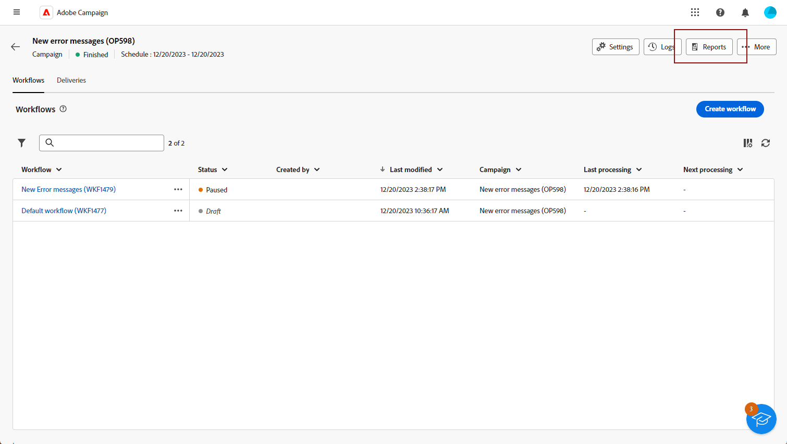

# Aan de slag met campagnerapporten {#campaign-reports}

<!-- CAN BE REMOVED___
>[!CONTEXTUALHELP]
>id="acw_campaign_reporting_sending"
>title="Reporting Sending"
>abstract="The Sending tab within your report provides in-depth insights into your visitors' interactions with your deliveries and any potential errors they may have encountered."

>[!CONTEXTUALHELP]
>id="acw_campaign_reporting_tracking"
>title="Reporting tracking"
>abstract="The Tracking tab within your report offers valuable data, including recipient behavior per link, breakdown of opens and clicks, as well as detailed information about the most frequently clicked URLs during a delivery."
-->

De **Campagneverslagen** Geef een uitgebreid overzicht van uw **campagne**, met alle relevante informatie over de verschillende betrokken leveringen. Deze rapporten bieden een grondige analyse van de prestaties van elke levering, per kanaal: succespercentages, betrokkenheid van het publiek en andere essentiële maatstaven. Hiermee kunt u de algehele doeltreffendheid en impact van uw campagne evalueren.

De volledige lijst van rapporten en bijbehorende metriek voor elk kanaal is beschikbaar in de volgende pagina&#39;s:

* [E-mailcampagnekanaal](campaign-reports-email.md)
* [SMS-campagnekanaal](campaign-reports-sms.md)
* [Push-campagekanaal](campaign-reports-push.md)

## Het rapportdashboard beheren {#manage-reports}

Voer de volgende stappen uit om uw campagnerapporten te openen en te beheren:

1. Ga naar de **[!UICONTROL Campaigns]** -menu. Klik op de knop **Rapporten** van het dashboard van uw campagne.

   {zoomable=&quot;yes&quot;}

   U kunt ook de drie stippen gebruiken **Meer handelingen** naast de naam van de campagne in de lijst met campagnes en selecteer **[!UICONTROL View report]**.

   {zoomable=&quot;yes&quot;}

1. Selecteer in het linkermenu een rapport in de lijst en navigeer door de tab om de gegevens van elk kanaal weer te geven.

   {zoomable=&quot;yes&quot;}

1. Van uw dashboard, klik **[!UICONTROL Select deliveries]** als u één specifieke levering wilt richten inbegrepen in uw campagne.

1. In de **[!UICONTROL Delivery throughput]** een **Start** en **[!UICONTROL End time]** specifieke gegevens als doel in te stellen.

   {zoomable=&quot;yes&quot;}

1. Van de **[!UICONTROL Pick folder]** veld, selecteert u of u de leveringen of de campagne vanuit een specifieke map wilt activeren.

   U kunt ook **[!UICONTROL Add rules]** beginnen vragen te bouwen aan betere filter het melden gegevens. [Leer hoe te om de vraagmodeler te gebruiken](../query/query-modeler-overview.md)

   {zoomable=&quot;yes&quot;}

1. Van de **[!UICONTROL URLs and click streams]** kunt u ook de optie **[!UICONTROL Top visited Links]** of de **[!UICONTROL Time period]**.

   De **[!UICONTROL View by]** kunt u filteren op URL&#39;s, labels of categorieën.
