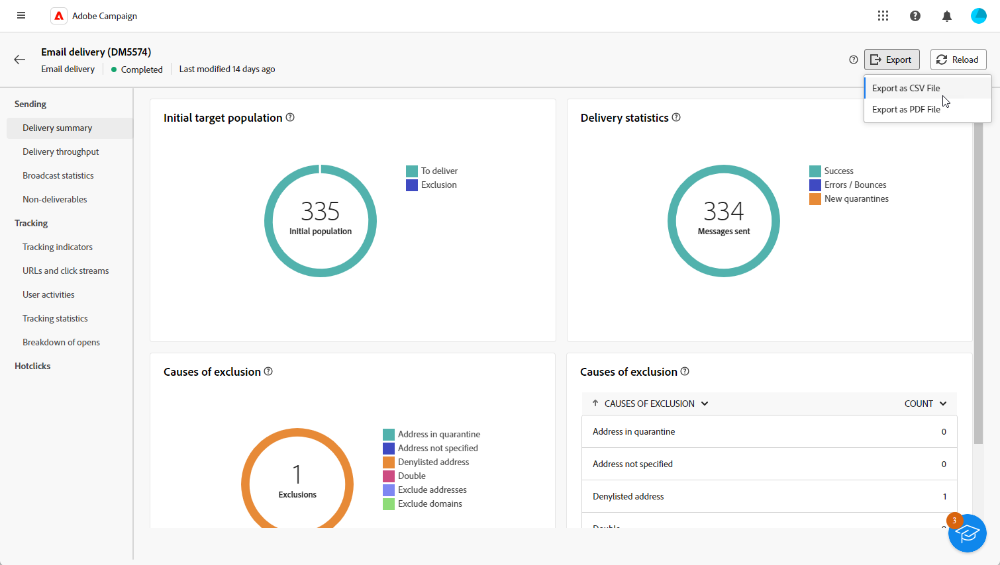

# Aan de slag met leveringsrapporten {#reports}

>[!CONTEXTUALHELP]
>id="acw_campaign_reporting_deliveries_selection"
>title="Geaggregeerde rapportage voor leveringen"
>abstract="Selecteer ten minste twee leveringen voor de weergave van een samengevoegd gegevensrapport."

>[!CONTEXTUALHELP]
>id="acw_reporting_email_exportation"
>title="Exporteren"
>abstract="Klik op de knop **Exporteren** om deze gegevens te exporteren naar PDF- of CSV-indelingen, zodat u ze kunt delen of afdrukken."

De **Afleveringsrapporten** biedt diepgaande inzichten en gegevens die uitsluitend zijn gericht op uw **leveringen** over elk kanaal. Deze rapporten verstrekken gedetailleerde informatie over de prestaties, de doeltreffendheid, en de resultaten van uw individuele leveringen, die u van een uitvoerig overzicht voorzien.

De volledige lijst van rapporten en bijbehorende metriek voor elk kanaal is beschikbaar in de volgende pagina&#39;s:

* [E-mailleveringsrapporten](email-report.md)
* [Verzendrapporten via SMS](sms-report.md)
* [Rapporten over levering verzenden](push-report.md)

## Het rapportdashboard beheren {#manage-reports}

Adobe Campaign biedt verschillende typen rapporten die voor elke levering toegankelijk zijn. Met deze rapporten kunt u de impact en prestaties van uw berichten in een ingebouwd dashboard meten en visualiseren.

Voer de volgende stappen uit om rapporten weer te geven en te beheren:

1. Als u een rapport voor een specifieke levering wilt genereren, navigeert u naar de **[!UICONTROL Deliveries]** en selecteert u de levering waarvoor u een melding wilt maken.

1. Van uw **[!UICONTROL Delivery]** dashboard, klik **[!UICONTROL Reports]**.

   

   U kunt ook de drie stippen gebruiken **Meer handelingen** naast de naam van de levering in de lijst met leveringen en selecteer **[!UICONTROL View report]**.

   

1. Selecteer in het linkermenu een rapport in de lijst.

   

1. Als uw levering terugkomt, selecteer een specifieke levering aan rapport door te klikken **[!UICONTROL Select deliveries]**.

   U kunt ook een tijdsperiode op uw rapport toepassen door de optie **[!UICONTROL Contact date]**.

   

1. Van de **[!UICONTROL URLs and click streams]** kunt u ook de optie **[!UICONTROL Top visited Links]** of de **[!UICONTROL Time period]**.

   De **[!UICONTROL View by]** kunt u filteren op URL&#39;s, labels of categorieën.

   

## Uw rapporten exporteren {#export-reports}

U kunt uw verschillende rapporten gemakkelijk naar PDF of formaat CSV uitvoeren, dat u toelaat om hen te delen, te manipuleren of te drukken.

1. Klik in uw rapport op **[!UICONTROL Export]** en selecteert u **[!UICONTROL Export as PDF file]** of **[!UICONTROL Export as CSV file]**.

   

1. Zoek de map waarin u het bestand wilt opslaan, geef het bestand een andere naam, indien nodig, en klik op **[!UICONTROL Save]**.

Uw rapport is nu beschikbaar voor weergave of delen in een PDF- of CSV-bestand.

