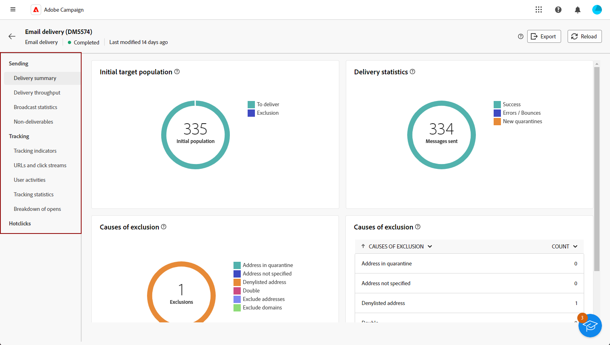

# Aan de slag met leveringsrapporten {#reports}

>[!CONTEXTUALHELP]
>id="acw_campaign_reporting_deliveries_selection"
>title="Geaggregeerde rapportage voor leveringen"
>abstract="Selecteer ten minste twee leveringen voor de weergave van een samengevoegd gegevensrapport."

De **rapporten van de Levering** verstrekken diepgaande inzichten en gegevens uitsluitend die op uw **leveringen** over elk kanaal worden geconcentreerd. Deze rapporten verstrekken gedetailleerde informatie over de prestaties, de doeltreffendheid, en de resultaten van uw individuele leveringen, die u van een uitvoerig overzicht voorzien.

De volledige lijst van rapporten en bijbehorende metriek voor elk kanaal is beschikbaar in de volgende pagina&#39;s:

* [E-mailleveringsrapporten](email-report.md)
* [Verzendrapporten via SMS](sms-report.md)
* [Rapporten over levering verzenden](push-report.md)
* [Rapporten voor direct e-mailbezorging](direct-mail.md)

## Het rapportdashboard beheren {#manage-reports}

Adobe Campaign biedt verschillende typen rapporten die voor elke levering toegankelijk zijn. Met deze rapporten kunt u de impact en prestaties van uw berichten in een ingebouwd dashboard meten en visualiseren.

Voer de volgende stappen uit om rapporten weer te geven en te beheren:

1. Als u een rapport voor een bepaalde levering wilt genereren, navigeert u naar het menu **[!UICONTROL Deliveries]** en selecteert u de levering waarover u wilt rapporteren.

1. Klik op het dashboard van **[!UICONTROL Delivery]** **[!UICONTROL Reports]** .

   {zoomable="yes"}

   Alternatief, kunt u de drie stippen **Meer acties** knoop naast de leveringsnaam in de leveringslijst gebruiken en selecteren **[!UICONTROL View report]**.

   {zoomable="yes"}

1. Selecteer in het linkermenu een rapport in de lijst.

   {zoomable="yes"}

1. Als de levering terugkeert, selecteert u een specifieke levering om over te rapporteren door op **[!UICONTROL Select deliveries]** te klikken.

   U kunt ook een tijdsperiode toepassen op uw rapport door **[!UICONTROL Contact date]** te selecteren.

   {zoomable="yes"}

1. In het menu **[!UICONTROL URLs and click streams]** kunt u ook de **[!UICONTROL Top visited Links]** of de **[!UICONTROL Time period]** kiezen.

   Met de opties van **[!UICONTROL View by]** kunt u filteren op URL&#39;s, labels of categorieën.

   {zoomable="yes"}
