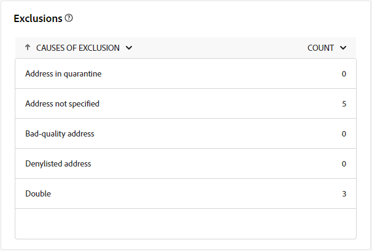

# Extern leveringsverslag {#direct-mail-report}

Het **Externe leveringsrapport** verstrekt uitvoerige inzichten en gegevens specifiek voor uw externe levering. Het omvat gedetailleerde informatie over de prestaties, de doeltreffendheid, en de resultaten van individuele leveringen, die een volledig overzicht aanbieden.

Het volgende rapport wordt beschreven in de context van direct mail. Het is ook beschikbaar voor vraagcentrum en douane externe kanalen.

## Leveringsoverzicht {#delivery-summary-direct-mail}

### Overzicht van levering {#delivery-overview-direct-mail}

>[!CONTEXTUALHELP]
>id="acw_delivery_reporting_delivery_overview_direct_mail"
>title="Overzicht van levering"
>abstract="Het **Overzicht van de Levering** stelt zeer belangrijke prestatiesmetriek (KPIs) voor die diepgaande inzichten in de interactie van uw bezoekers met elke directe postlevering aanbieden. De meetgegevens worden hieronder beschreven."

In **[!UICONTROL Delivery Overview]** vindt u gedetailleerde informatie over de interactie tussen bezoekers met elke direct-maillevering, waarbij essentiële prestatiemetriek (KPI&#39;s) worden weergegeven. De meetgegevens worden hieronder beschreven.

{zoomable="yes"}{align="center"}

+++Meer weten over de maatstaven van het leveringsoverzicht?

* **[!UICONTROL Messages to deliver]**: Het totale aantal berichten dat tijdens de voorbereiding van de levering wordt verwerkt.
* **[!UICONTROL Targeted]**: Aantal gebruikersprofielen dat als doelprofielen voor direct-mailberichten wordt gekwalificeerd.
* **[!UICONTROL To exclude]**: Aantal gebruikersprofielen dat is uitgesloten van de doelprofielen en dat geen directe-mailberichten ontvangt.
+++

### Oorspronkelijke doelpopulatie {#direct-mail-delivery-targeted-population}

>[!CONTEXTUALHELP]
>id="acw_delivery_reporting_initial_target_direct_mail"
>title="Oorspronkelijke doelpopulatie"
>abstract="De **Aanvankelijke doelpopulatie** grafiek toont gegevens met betrekking tot uw ontvangers en berichten, die op de resultaten van de leveringsvoorbereiding worden gebaseerd."

In de grafiek van **[!UICONTROL Initial target population]** worden gegevens weergegeven die betrekking hebben op ontvangers. De metriek worden berekend tijdens levering voorbereiding en omvat het aanvankelijke publiek, het aantal te verzenden berichten, en het aantal uitgesloten ontvangers.

{zoomable="yes"}

Plaats de muis boven een deel van de grafiek om het exacte getal weer te geven.

{zoomable="yes"}

+++Meer weten over de cijfers van rapporten voor Direct-mail-levering?

* **[!UICONTROL Initial audience]**: het totale aantal beoogde ontvangers.
* **[!UICONTROL To deliver]**: Het totale aantal berichten dat na de voorbereiding van de levering moet worden geleverd.
* **[!UICONTROL Exclusion]**: Het totale aantal ontvangers dat is uitgesloten van de doelpopulatie.
+++

### Leveringsstatistieken {#direct-mail-delivery-stats}

>[!CONTEXTUALHELP]
>id="acw_delivery_reporting_delivery_statistics_summary_direct_mail"
>title="Leveringsstatistieken"
>abstract="De **grafiek van de Statistieken van de Levering** detailleert het succes van uw Directe postlevering, en fouten die voorkwamen."

De grafiek van **[!UICONTROL Delivery statistics]** geeft een overzicht van de prestaties van de levering en biedt gedetailleerde meetgegevens om succes en doeltreffendheid te meten.

{zoomable="yes"}

+++Meer weten over de cijfers in het campagnerapport voor Direct mail?

* **[!UICONTROL Message sent]**: Het totale aantal berichten dat na de voorbereiding van de levering moet worden geleverd.
* **[!UICONTROL Success]**: Het aantal berichten dat met succes is verwerkt in verhouding tot het aantal te leveren berichten.
* **[!UICONTROL Errors]**: Het totale aantal fouten dat tijdens leveringen en automatische oplaadbewerkingen is geaccumuleerd in vergelijking met het aantal te leveren berichten.
* **[!UICONTROL New quarantines]**: Het totale aantal adressen dat na mislukte levering in quarantaine is geplaatst (bv. onbekende gebruiker, ongeldig domein) vergeleken met het aantal te leveren berichten.
+++

### Oorzaken van uitsluiting {#direct-mail-delivery-exclusions}

>[!CONTEXTUALHELP]
>id="acw_delivery_reporting_causes_exclusion_direct_mail"
>title="Uitsluitingsoorzaken"
>abstract="De **Oorzaken van uitsluiting** grafiek illustreert de distributie van verworpen berichten tijdens de voorbereiding voor levering, die door elke regel wordt gecategoriseerd."

De grafiek **[!UICONTROL Causes of exclusion]** geeft een overzicht van de redenen voor het afwijzen van berichten tijdens de voorbereiding van de levering. Deze uitsplitsing wordt volgens verschillende regels georganiseerd en biedt een gedetailleerd overzicht van de factoren die bijdragen tot uitsluiting van berichten. De regels van de uitsluiting zijn gedetailleerd in de [ Campagne v8 (console) documentatie ](https://experienceleague.adobe.com/docs/campaign/campaign-v8/send/failures/delivery-failures.html#email-error-types){_blank}.

{zoomable="yes"}{align="center" zoomable="yes"}

+++Meer weten over oorzaken van uitsluitingsmetingen?

* **[!UICONTROL Address in quarantine]**: Fouttype dat wordt gegenereerd wanneer een adres in quarantaine wordt geplaatst.
* **[!UICONTROL Address not specified]**: Fouttype dat wordt gegenereerd wanneer een adres niet bestaat.
* **[!UICONTROL Bad quality address]**: Fouttype dat wordt gegenereerd wanneer de kwaliteitsbeoordeling van het postadres te laag is.
* **[!UICONTROL Denylisted address]**: Fouttype dat is gegenereerd toen de ontvanger tijdens de levering werd gevoegd op lijst van gewenste personen.
* **[!UICONTROL Double]**: Fouttype dat is gegenereerd toen de ontvanger werd uitgesloten vanwege niet-unieke sleutelwaarden.
* **[!UICONTROL Control group]**: Het adres van de ontvanger maakt deel uit van de controlegroep.
* **[!UICONTROL Target limited in size]**: De maximale leveringsgrootte is bereikt voor de ontvanger.
+++

### Uitsluitingen {#direct-mail-exclusions}

>[!CONTEXTUALHELP]
>id="acw_delivery_reporting_exclusions_direct_mail"
>title="Uitsluitingen"
>abstract="De tabel **[!UICONTROL Exclusions]** bevat een gedetailleerde uitsplitsing, per regel, van berichten die tijdens de voorbereiding van de levering zijn afgewezen."

De tabel **[!UICONTROL Exclusions]** bevat een gedetailleerde uitsplitsing, gecategoriseerd op basis van specifieke regels, van berichten die tijdens de voorbereiding van de levering zijn geweigerd. Deze uitsplitsing geeft een duidelijk inzicht in de redenen achter berichtenuitsluitingen.

{zoomable="yes"}{align="center" zoomable="yes"}

Beschikbare metriek zijn het zelfde als voor [ hierboven beschreven Oorzaken van uitsluiting ](#direct-mail-delivery-exclusions).