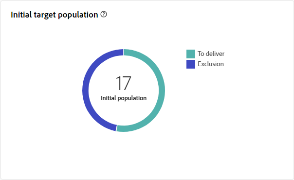

# Rapport voor verzending via e-mail {#direct-mail-report}

Het **Directe rapport van de postlevering** biedt uitvoerige inzichten en gegevens specifiek voor uw Directe postlevering aan. Het biedt gedetailleerde informatie over de prestaties, effectiviteit en resultaten van uw afzonderlijke leveringen, zodat u een uitgebreid overzicht krijgt.

## Leveringsoverzicht {#delivery-summary-direct-mail}

### Overzicht van levering {#delivery-overview-direct-mail}

>[!CONTEXTUALHELP]
>id="acw_delivery_reporting_delivery_overview_direct_mail"
>title="Overzicht van levering"
>abstract="Het **Overzicht van de Levering** stelt zeer belangrijke prestatiesmetriek (KPIs) voor die diepgaande inzichten in de interactie van uw bezoekers met elke directe postlevering aanbieden. De meetgegevens worden hieronder beschreven."

In **[!UICONTROL Delivery Overview]** vindt u gedetailleerde informatie over de manier waarop uw bezoekers omgaan met elke direct-maillevering. Zo ziet u essentiële prestatiemetriek (KPI&#39;s).  De meetgegevens worden hieronder beschreven.

{zoomable="yes"}{align="center"}

+++ Meer informatie over overzichtsmetriek voor levering.

* **[!UICONTROL Messages to deliver]**: Het totale aantal berichten dat tijdens de voorbereiding van de levering wordt verwerkt.

* **[!UICONTROL Targeted]**: Aantal gebruikersprofielen dat voldoet aan de doelprofielen voor uw e-mailberichten.

* **[!UICONTROL To exclude]**: Aantal gebruikersprofielen dat is uitgesloten van de doelprofielen en dat uw e-mailberichten niet ontvangt.
+++

### Oorspronkelijke doelpopulatie {#direct-mail-delivery-targeted-population}

>[!CONTEXTUALHELP]
>id="acw_delivery_reporting_initial_target_direct_mail"
>title="Oorspronkelijke doelpopulatie"
>abstract="De **Aanvankelijke doelpopulatie** grafiek toont gegevens met betrekking tot uw ontvangers en berichten, die op de resultaten van de leveringsvoorbereiding worden gebaseerd."

In de grafiek van **[!UICONTROL Initial target population]** worden gegevens weergegeven die relatief zijn ten opzichte van de ontvangers. De metriek worden berekend tijdens levering voorbereiding en toon: het aanvankelijke publiek, het aantal te verzenden berichten, het aantal uitgesloten ontvangers.

{zoomable="yes"}

Plaats de muis boven een gedeelte van de grafiek om het exacte getal weer te geven.

{zoomable="yes"}

+++ Meer informatie over de cijfers van rapporten voor Direct-mail-levering.

* **[!UICONTROL Initial audience]**: het totale aantal beoogde ontvangers.

* **[!UICONTROL To deliver]**: Het totale aantal berichten dat na de voorbereiding van de levering moet worden geleverd.

* **[!UICONTROL Exclusion]**: Het totale aantal ontvangers dat is uitgesloten van de doelpopulatie.
+++

### Leveringsstatistieken {#direct-mail-delivery-stats}

>[!CONTEXTUALHELP]
>id="acw_delivery_reporting_delivery_statistics_summary_direct_mail"
>title="Leveringsstatistieken"
>abstract="De **grafiek van de Statistieken van de Levering** detailleert het succes van uw Directe postlevering, en fouten die voorkwamen."

De grafiek van **[!UICONTROL Delivery statistics]** biedt een uitgebreid overzicht van uw prestaties van de levering, die gedetailleerde metriek aanbieden om succes en doeltreffendheid te meten.

{zoomable="yes"}

+++ Meer informatie over de gegevens van het campagnerapport voor Direct mail.

* **[!UICONTROL Message sent]**: Het totale aantal berichten dat na de voorbereiding van de levering moet worden geleverd.

* **[!UICONTROL Success]**: Het aantal berichten dat met succes is verwerkt in verhouding tot het aantal te leveren berichten.

* **[!UICONTROL Errors]**: Het totale aantal fouten dat tijdens leveringen is gecumuleerd en de automatische oplaadbewerking in verhouding tot het aantal te leveren berichten.

* **[!UICONTROL New quarantines]**: Het totale aantal adressen dat in quarantaine wordt geplaatst na een mislukte levering (onbekend, ongeldig domein) in verhouding tot het aantal te leveren berichten.

+++

### Oorzaken van uitsluiting {#direct-mail-delivery-exclusions}

>[!CONTEXTUALHELP]
>id="acw_delivery_reporting_causes_exclusion_direct_mail"
>title="Uitsluitingsoorzaken"
>abstract="De **Oorzaken van uitsluiting** grafiek illustreert de distributie van verworpen berichten tijdens de voorbereiding voor levering, die door elke regel wordt gecategoriseerd."

De grafiek van **[!UICONTROL Causes of exclusion]** verstrekt een gedetailleerde specificatie van de redenen achter berichten die tijdens het proces van leveringsvoorbereiding worden verworpen. Deze uitsplitsing is volgens verschillende regels georganiseerd en biedt een volledig beeld van de factoren die bijdragen tot uitsluiting van berichten. De regels van de uitsluiting zijn gedetailleerd in de [ Campagne v8 (console) documentatie ](https://experienceleague.adobe.com/docs/campaign/campaign-v8/send/failures/delivery-failures.html#email-error-types) {_blank}.

{zoomable="yes"}{align="center" zoomable="yes"}

+++Meer informatie over oorzaken van uitsluitingsmetingen.

* **[!UICONTROL Address in quarantine]**: Fouttype dat wordt gegenereerd wanneer het adres in quarantaine wordt geplaatst.

* **[!UICONTROL Address not specified]**: Fouttype dat wordt gegenereerd bij het verzenden van een levering om aan te geven dat het adres niet bestaat.

* **[!UICONTROL Bad quality address]**: Fouttype dat wordt gegenereerd wanneer de kwaliteitsbeoordeling van het postadres te laag is.

* **[!UICONTROL Denylisted address]**: Het type van fout produceerde toen de ontvanger werd gevoegd op lijst van gewenste personen toen de levering werd uitgevoerd.

* **[!UICONTROL Double]**: Fouttype dat is gegenereerd toen de ontvanger werd uitgesloten, omdat de toetswaarden niet uniek waren.

* **[!UICONTROL Control group]**: Het adres van de ontvanger maakt deel uit van de controlegroep.

* **[!UICONTROL Target limited in size]**: De maximale leveringsgrootte is bereikt voor de ontvanger.

+++

### Uitsluitingen {#direct-mail-exclusions}

>[!CONTEXTUALHELP]
>id="acw_delivery_reporting_exclusions_direct_mail"
>title="Uitsluitingen"
>abstract="De tabel **[!UICONTROL Exclusions]** bevat een gedetailleerde uitsplitsing, per regel, van berichten die tijdens de voorbereiding van de levering zijn afgewezen."

De tabel **[!UICONTROL Exclusions]** bevat een diepgaande uitsplitsing, gecategoriseerd op basis van specifieke regels, van berichten die tijdens de voorbereidingsfase van de levering zijn afgewezen. Deze uitgebreide uitsplitsing maakt het mogelijk een duidelijk inzicht te krijgen in de redenen waarom deze berichten van het leveringsproces worden uitgesloten.

{zoomable="yes"}{align="center" zoomable="yes"}

Beschikbare metriek zijn het zelfde als voor [ hierboven beschreven Oorzaken van uitsluiting ](#direct-mail-delivery-exclusions).
