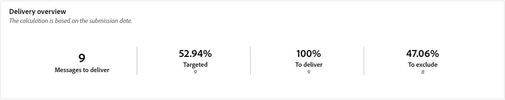

# Rapport voor verzending via e-mail {#direct-mail-report}

De **Rapport voor verzending via e-mail** biedt uitgebreide inzichten en gegevens die specifiek zijn voor uw Direct-maillevering. Het biedt gedetailleerde informatie over de prestaties, effectiviteit en resultaten van uw afzonderlijke leveringen, zodat u een uitgebreid overzicht krijgt.

## Leveringsoverzicht {#delivery-summary-direct-mail}

### Overzicht van levering {#delivery-overview-direct-mail}

>[!CONTEXTUALHELP]
>id="acw_delivery_reporting_delivery_overview_direct_mail"
>title="Overzicht van levering"
>abstract="De **Overzicht van levering** biedt belangrijke prestatiemetriek (KPIs) die diepgaande inzichten van de interactie van uw bezoekers met elke directe postlevering aanbieden. De meetgegevens worden hieronder beschreven."

De **[!UICONTROL Delivery Overview]** biedt gedetailleerde inzichten in de interactie tussen uw bezoekers en elke levering via e-mail, met essentiële prestatiemetriek (KPI&#39;s).  De meetgegevens worden hieronder beschreven.

{zoomable=&quot;yes&quot;}{align="center"}

+++ Meer informatie over overzichtsmetriek voor levering.

* **[!UICONTROL Messages to deliver]**: Het totale aantal berichten dat tijdens de voorbereiding van de levering wordt verwerkt.

* **[!UICONTROL Targeted]**: Aantal gebruikersprofielen dat als doelprofielen voor uw direct-mailberichten in aanmerking komt.

* **[!UICONTROL To exclude]**: Aantal gebruikersprofielen dat is uitgesloten van de doelprofielen en dat uw e-mailberichten niet ontvangt.
+++

### Oorspronkelijke doelpopulatie {#direct-mail-delivery-targeted-population}

>[!CONTEXTUALHELP]
>id="acw_delivery_reporting_initial_target_direct_mail"
>title="Oorspronkelijke doelpopulatie"
>abstract="De **Oorspronkelijke doelpopulatie** de grafiek toont gegevens met betrekking tot uw ontvangers en berichten, die op de resultaten van de leveringsvoorbereiding worden gebaseerd."

De **[!UICONTROL Initial target population]** de grafiek toont gegevens met betrekking tot uw ontvangers. De metriek worden berekend tijdens levering voorbereiding en toon: het aanvankelijke publiek, het aantal te verzenden berichten, het aantal uitgesloten ontvangers.

{zoomable=&quot;yes&quot;}

Plaats de muis boven een gedeelte van de grafiek om het exacte getal weer te geven.

{zoomable=&quot;yes&quot;}

+++ Meer informatie over de cijfers van rapporten voor Direct-mail-levering.

* **[!UICONTROL Initial audience]**: Totaal aantal beoogde ontvangers.

* **[!UICONTROL To deliver]**: Totaal aantal berichten dat na de voorbereiding van de levering moet worden bezorgd.

* **[!UICONTROL Exclusion]**: Totaal aantal van de doelpopulatie uitgesloten ontvangers.
+++

### Leveringsstatistieken {#direct-mail-delivery-stats}

>[!CONTEXTUALHELP]
>id="acw_delivery_reporting_delivery_statistics_summary_direct_mail"
>title="Leveringsstatistieken"
>abstract="De **Leveringsstatistieken** een grafiek geeft het succes van de levering van Direct-mail en de fouten die zijn opgetreden weer."

De **[!UICONTROL Delivery statistics]** een grafiek geeft een uitgebreid overzicht van de prestaties van uw levering en biedt gedetailleerde meetgegevens om het succes en de doeltreffendheid te meten.

{zoomable=&quot;yes&quot;}

+++ Meer informatie over de gegevens van het campagnerapport voor Direct mail.

* **[!UICONTROL Message sent]**: Totaal aantal berichten dat na de voorbereiding van de levering moet worden bezorgd.

* **[!UICONTROL Success]**: Het aantal berichten dat met succes is verwerkt in verhouding tot het aantal te leveren berichten.

* **[!UICONTROL Errors]**: Totaal aantal fouten bij leveringen en automatische oplevering in verhouding tot het aantal te leveren berichten.

* **[!UICONTROL New quarantines]**: Het totale aantal adressen dat in quarantaine wordt geplaatst na een mislukte levering (onbekend, ongeldig domein) in verhouding tot het aantal te leveren berichten.

+++

### Oorzaken van uitsluiting {#direct-mail-delivery-exclusions}

>[!CONTEXTUALHELP]
>id="acw_delivery_reporting_causes_exclusion_direct_mail"
>title="Uitsluitingsoorzaken"
>abstract="De **Oorzaken van uitsluiting** de grafiek illustreert de distributie van verworpen berichten tijdens de voorbereiding voor levering, die door elke regel wordt gecategoriseerd."

De **[!UICONTROL Causes of exclusion]** grafiek geeft een gedetailleerd overzicht van de redenen waarom berichten tijdens de voorbereiding van de levering worden afgewezen. Deze uitsplitsing is volgens verschillende regels georganiseerd en biedt een volledig beeld van de factoren die bijdragen tot uitsluiting van berichten. De uitsluitingsregels worden nader toegelicht in de [Campagne v8 (console)-documentatie](https://experienceleague.adobe.com/docs/campaign/campaign-v8/send/failures/delivery-failures.html#email-error-types){_blank}.

{zoomable=&quot;yes&quot;}{align="center" zoomable="yes"}

+++Meer informatie over oorzaken van uitsluitingsmetingen.

* **[!UICONTROL Address in quarantine]**: Fouttype dat wordt gegenereerd wanneer het adres in quarantaine wordt geplaatst.

* **[!UICONTROL Address not specified]**: Fouttype dat wordt gegenereerd bij het verzenden van een levering om aan te geven dat het adres niet bestaat.

* **[!UICONTROL Bad quality address]**: Fouttype dat wordt gegenereerd wanneer de kwaliteitsbeoordeling van het postadres te laag is.

* **[!UICONTROL Denylisted address]**: Het type van Fout produceerde toen de ontvanger werd gevoegd op lijst van gewenste personen toen de levering werd uitgevoerd.

* **[!UICONTROL Double]**: Fouttype dat is gegenereerd toen de ontvanger werd uitgesloten, omdat de sleutelwaarden niet uniek waren.

* **[!UICONTROL Control group]**: Het adres van de ontvanger maakt deel uit van de controlegroep.

* **[!UICONTROL Target limited in size]**: De maximale leveringsgrootte is bereikt voor de ontvanger.

+++

### Uitsluitingen {#direct-mail-exclusions}

>[!CONTEXTUALHELP]
>id="acw_delivery_reporting_exclusions_direct_mail"
>title="Uitsluitingen"
>abstract="De **[!UICONTROL Exclusions]** de lijst toont een gedetailleerde uitsplitsing, door regel, van berichten die tijdens het leveringsvoorbereidingsproces werden verworpen."

De **[!UICONTROL Exclusions]** de tabel bevat een diepgaande uitsplitsing, gecategoriseerd volgens specifieke regels, van berichten die tijdens de voorbereidingsfase van de levering zijn afgewezen. Deze uitgebreide uitsplitsing maakt het mogelijk een duidelijk inzicht te krijgen in de redenen waarom deze berichten van het leveringsproces worden uitgesloten.

{zoomable=&quot;yes&quot;}{align="center" zoomable="yes"}

De beschikbare cijfers zijn gelijk aan die voor de [Oorzaken van uitsluiting](#direct-mail-delivery-exclusions) hierboven beschreven.
