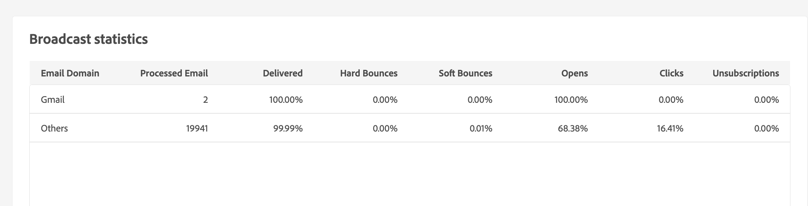
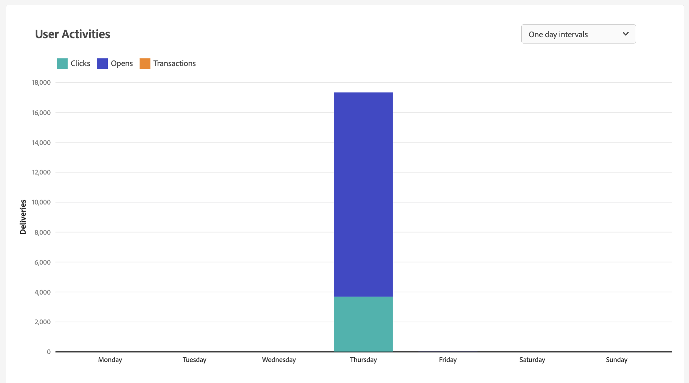

# E-mailleveringsrapport {#email-report}

## Verzenden

* **Overzicht van levering**: Dit rapport bevat alle belangrijke informatie over de levering. Doelpopulatie, Uitsluitingsoorzaken, Leveringsstatistieken

  

* **Leveringsdoorvoer**: Dit verslag bevat informatie over de leveringsproductie voor een bepaalde periode. Om de snelheid te meten waarbij de berichten worden geleverd, zijn de criteria het aantal berichten die per uur worden verzonden en de grootte van de berichten (in beetjes per seconde). In het onderstaande voorbeeld ziet u in de eerste grafiek de geslaagde leveringen in blauw en het aantal onjuiste leveringen in oranje.

  

* **Uitzendstatistieken**: Dit rapport toont de uitsplitsing naar internetdomein van alle verwerkte en verzonden berichten, van harde en zachte geluiden, opent, klikt en afmeldt.

  

* **Niet-te leveren producten en bedragen**: Dit verslag geeft een overzicht van de niet-te leveren posten en een uitsplitsing van de bedragen per internetdomein.

  

## Tracking

* **Traceringsindicatoren**: Dit rapport combineert de belangrijkste indicatoren voor het volgen van het gedrag van ontvangers bij het ontvangen van de levering. Het geeft toegang tot levering en ontvangststatistieken, open en klikthrough tarieven, geproduceerde klikstromen, Web het volgen en het delen van activiteiten aan sociale netwerken.

  

* **URL&#39;s en klik op streams**: Dit rapport bevat de lijst met bezochte pagina&#39;s na een levering.

  

* **Gebruikersactiviteiten**: Dit rapport toont de uitsplitsing van opent en klikt per half uur, uur of dag, in de vorm van een grafiek.

  

* **Statistieken bijhouden**: Dit rapport bevat statistieken over het openen en klikken.

  

* **Indeling van openen**: In dit rapport wordt de uitsplitsing van de openingen per besturingssysteem, apparaat en browser voor de betrokken periode weergegeven. Voor elke categorie worden twee grafieken gebruikt. De eerste toont statistieken betreffende opent op een computer en mobiele apparaten. In het tweede voorbeeld worden alleen statistieken weergegeven over het openen op mobiele apparaten.

  

## Hotclicks

Dit rapport toont de berichtinhoud (HTML en/of tekst) met, op elke verbinding, het percentage klikt op verbindingen. De belemmeringen van de verpersoonlijking unsubscription verbindingen, spiegelpaginakoppelingen en aanbiedingsverbindingen worden in de totale gecumuleerde kliks in aanmerking genomen maar niet getoond in het rapport.

