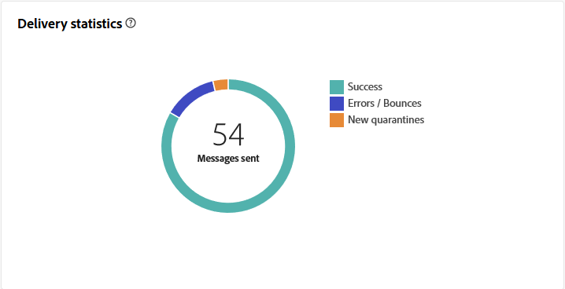
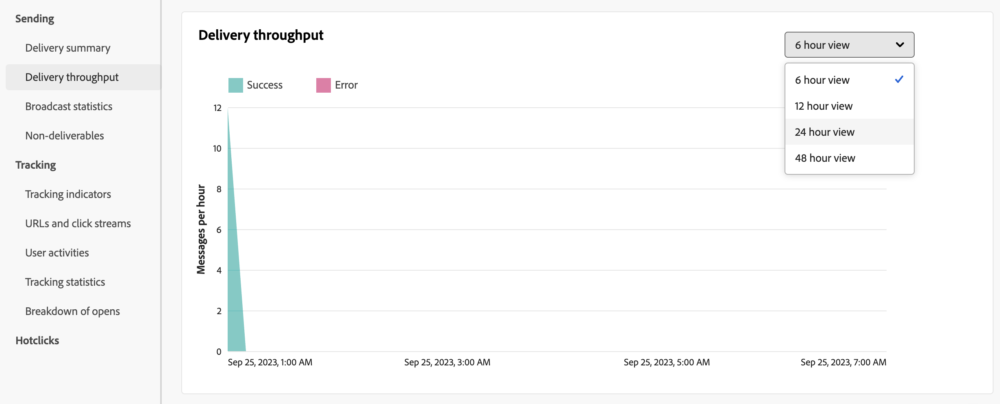

# E-mailleveringsrapport {#email-report}

Het **E-mailleveringsrapport** biedt uitvoerige inzichten en gegevens specifiek voor het e-mailkanaal aan. Het biedt gedetailleerde informatie over de prestaties, effectiviteit en resultaten van uw afzonderlijke leveringen, zodat u een uitgebreid overzicht krijgt.

## Leveringsoverzicht {#delivery-summary-email}

>[!CONTEXTUALHELP]
>id="acw_delivery_reporting_sending_email"
>title="Rapportage verzenden"
>abstract="Het **Verzendende** lusje binnen uw rapport verstrekt diepgaande inzichten in de interactie van uw bezoekers met uw leveringen en om het even welke potentiële fouten zij kunnen hebben ontmoet."

### Oorspronkelijke doelpopulatie {#email-delivery-targeted-population}

>[!CONTEXTUALHELP]
>id="acw_delivery_reporting_initial_target"
>title="Oorspronkelijke doelpopulatie"
>abstract="De **Aanvankelijke doelpopulatie** grafiek toont gegevens met betrekking tot uw ontvangers en berichten, die op de resultaten van de leveringsvoorbereiding worden gebaseerd."

In de grafiek van **[!UICONTROL Initial target population]** worden gegevens weergegeven die relatief zijn ten opzichte van de ontvangers. De metriek worden berekend tijdens levering voorbereiding en toon: het aanvankelijke publiek, het aantal te verzenden berichten, het aantal uitgesloten ontvangers.

{zoomable="yes"} toont

Plaats de muis boven een gedeelte van de grafiek om het exacte getal weer te geven.

{zoomable="yes"} te tonen

+++ Meer weten over de cijfers van het e-mailleveringsrapport?

* **[!UICONTROL Initial audience]**: het totale aantal beoogde ontvangers.

* **[!UICONTROL To deliver]**: Het totale aantal berichten dat na de voorbereiding van de levering moet worden geleverd.

* **[!UICONTROL Exclusion]**: Het totale aantal ontvangers dat is uitgesloten van de doelpopulatie.
+++

### Leveringsstatistieken {#email-delivery-stats}

>[!CONTEXTUALHELP]
>id="acw_delivery_reporting_delivery_statistics_summary"
>title="Leveringsstatistieken"
>abstract="De **statistieken van de Levering** grafiek detailleert het succes van uw levering, en fouten die voorkwamen."

In de grafiek van **[!UICONTROL Delivery statistics]** wordt aangegeven hoe succesvol de levering is. De cijfers worden hieronder beschreven.

{zoomable="yes"}

+++Meer weten over de cijfers van het e-mailcampagnerapport?

* **[!UICONTROL Message sent]**: Het totale aantal berichten dat na de voorbereiding van de levering moet worden geleverd.

* **[!UICONTROL Success]**: Het aantal berichten dat met succes is verwerkt in verhouding tot het aantal te leveren berichten.

* **[!UICONTROL Errors]**: Het totale aantal fouten dat tijdens leveringen is gecumuleerd en de automatische oplaadbewerking in verhouding tot het aantal te leveren berichten.

* **[!UICONTROL New quarantines]**: Het totale aantal adressen dat in quarantaine wordt geplaatst na een mislukte levering (onbekend, ongeldig domein) in verhouding tot het aantal te leveren berichten.

+++

### Oorzaken van uitsluiting  {#email-delivery-exclusions}

>[!CONTEXTUALHELP]
>id="acw_delivery_reporting_exclusion"
>title="Uitsluitingsoorzaken"
>abstract="De **Oorzaken van uitsluiting** grafiek en de lijst tonen de onderbreking per regel van berichten die tijdens de leveringsvoorbereiding worden verworpen."

In de grafiek en tabel van **[!UICONTROL Causes of exclusion]** wordt de uitsplitsing per regel weergegeven van berichten die tijdens de voorbereiding van de levering zijn geweigerd. De regels van de uitsluiting zijn gedetailleerd in de [ Campagne v8 (console) documentatie ](https://experienceleague.adobe.com/docs/campaign/campaign-v8/send/failures/delivery-failures.html?lang=nl-NL#email-error-types){_blank}.

{zoomable="yes"}{align="center" zoomable="yes"}

+++ Meer weten over de cijfers van het e-mailleveringsrapport?

* **[!UICONTROL User unknown]**: Fouttype dat tijdens de levering wordt gegenereerd om aan te geven dat het e-mailadres ongeldig is.

* **[!UICONTROL Invalid domain]**: Fouttype dat wordt gegenereerd bij het verzenden van een levering om aan te geven dat het domein van het e-mailadres onjuist is of niet bestaat.

* **[!UICONTROL Mailbox full]**: Fouttype dat wordt gegenereerd na vijf leveringspogingen om aan te geven dat het Postvak IN van de ontvangers te veel berichten bevat.

* **[!UICONTROL Account disabled]**: Fouttype dat wordt gegenereerd bij het verzenden van een levering om aan te geven dat het adres niet langer bestaat.

* **[!UICONTROL Refused]**: Het type van fout produceerde wanneer een adres door IAP (Internet Access Provider) wordt verworpen, bijvoorbeeld na de toepassing van een veiligheidsregel (anti-spamsoftware).

* **[!UICONTROL Unreachable]**: Het type van fout dat in het koord van de berichtdistributie voorkomt: incident op het relais SMTP, domein tijdelijk onbereikbaar, etc.

* **[!UICONTROL Not connected]**: Fouttype om aan te geven dat de mobiele telefoon van de ontvanger op het moment van verzending wordt uitgeschakeld of losgekoppeld van het netwerk.

+++

## Leveringsdoorvoer {#delivery-throughtput}

>[!CONTEXTUALHELP]
>id="acw_delivery_reporting_throughput_email"
>title="Leveringsdoorvoer"
>abstract="Het **rapport van de productie van de Levering** stelt gedetailleerde informatie betreffende de leveringsproductie van het volledige platform binnen een gespecificeerd timeframe voor."

Dit rapport bevat gedetailleerde informatie over de leveringstijd van het gehele platform binnen een opgegeven tijdsbestek. Primaire metrisch die wordt gebruikt om de snelheid van berichtlevering te meten is het aantal berichten per uur worden verzonden.

{zoomable="yes"}{align="center" zoomable="yes"}

## Uitzendstatistieken {#broadcast-statistics}

>[!CONTEXTUALHELP]
>id="acw_delivery_reporting_broadcast_statistics"
>title="Uitzendstatistieken"
>abstract="Het **statistische** rapport van de Uitzending bevat de beschikbare gegevens voor mogelijke fouten die met elk domein worden ontmoet."

De tabel **[!UICONTROL Broadcast statistics]** bevat de beschikbare gegevens voor mogelijke fouten die met elk domein worden aangetroffen. De cijfers worden hieronder beschreven.

{zoomable="yes"}{align="center" zoomable="yes"}

+++ Meer weten over de cijfers van het e-mailleveringsrapport?

* **[!UICONTROL Processed emails]**: Het totale aantal berichten dat door de leveringsserver wordt verwerkt.

* **[!UICONTROL Delivered]**: percentage van het aantal berichten dat correct is verwerkt in verhouding tot het totale aantal verwerkte berichten.

* **[!UICONTROL Hard bounces]**: percentage van het aantal &#39;harde&#39; berichten, permanente fouten, zoals een onjuist e-mailadres, in vergelijking met het totale aantal verwerkte berichten.

* **[!UICONTROL Soft bounces]**: percentage van het aantal &#39;zachte&#39; grenzen, tijdelijke fouten zoals een volledig postvak, in vergelijking met het totale aantal verwerkte berichten

* **[!UICONTROL Opens]**: percentage van het aantal beoogde ontvangers dat een bericht ten minste één keer heeft geopend in vergelijking met het aantal berichten dat met succes is verwerkt.

* **[!UICONTROL Clicks]**: percentage van het aantal personen dat ten minste één keer op een levering heeft geklikt in verhouding tot het aantal berichten dat met succes is verwerkt.

* **[!UICONTROL Unsubscriptions]**: percentage van het aantal klikken op een koppeling zonder abonnement in verhouding tot het aantal berichten dat met succes is verwerkt.
+++

## Niet-te leveren items {#non-deliverables-email}

### Uitsplitsing van fouten per type {#email-delivery-breakdown-type}

>[!CONTEXTUALHELP]
>id="acw_delivery_reporting_error_type"
>title="Uitsplitsing van fouten per type"
>abstract="De **Uitsplitsing van fouten per type** grafiek bevat de beschikbare gegevens voor elk aangetroffen foutentype: onbekend gebruiker, brievenbus volledig, ongeldig domein, en meer."

>[!CONTEXTUALHELP]
>id="acw_delivery_reporting_error_type_table"
>title="Uitsplitsing van fouten per type"
>abstract="De **Uitsplitsing van fouten per type** lijst verstrekt een uitvoerige uitsplitsing van het voorkomen van elk foutentype."

De tabel en grafiek van **[!UICONTROL Breakdown of errors per type]** bevatten de beschikbare gegevens voor het fouttype. De cijfers worden hieronder beschreven.

De fouten die in dit rapport worden weergegeven, activeren het quarantaineproces. Voor meer op quarantainebeheer, verwijs naar [ Campagne v8 (cliëntconsole) documentatie ](https://experienceleague.adobe.com/docs/campaign/campaign-v8/campaigns/send/failures/delivery-failures.html?lang=nl-NL){target="_blank"}.

{zoomable="yes"}{align="left" zoomable="yes"}

+++ Meer weten over de cijfers van het e-mailleveringsrapport?

* **[!UICONTROL User unknown]**: Fouttype dat tijdens de levering wordt gegenereerd om aan te geven dat het e-mailadres ongeldig is.

* **[!UICONTROL Invalid domain]**: Fouttype dat wordt gegenereerd bij het verzenden van een levering om aan te geven dat het domein van het e-mailadres onjuist is of niet bestaat.

* **[!UICONTROL Mailbox full]**: Fouttype dat wordt gegenereerd na vijf leveringspogingen om aan te geven dat het Postvak IN van de ontvangers te veel berichten bevat.

* **[!UICONTROL Account disabled]**: Fouttype dat wordt gegenereerd bij het verzenden van een levering om aan te geven dat het adres niet langer bestaat.

* **[!UICONTROL Refused]**: Het type van fout produceerde wanneer een adres door IAP (Internet Access Provider) wordt verworpen, bijvoorbeeld na de toepassing van een veiligheidsregel (anti-spamsoftware).

* **[!UICONTROL Unreachable]**: Het type van fout dat in het koord van de berichtdistributie voorkomt: incident op het relais SMTP, domein tijdelijk onbereikbaar, etc.

* **[!UICONTROL Not connected]**: Fouttype om aan te geven dat de mobiele telefoon van de ontvanger op het moment van verzending wordt uitgeschakeld of losgekoppeld van het netwerk.

+++

### Uitsplitsing van fouten per domein {#email-delivery-breakdown-domain}

>[!CONTEXTUALHELP]
>id="acw_delivery_reporting_error_domain"
>title="Uitsplitsing van fouten per domein"
>abstract="De **Uitsplitsing van fouten per domein** grafiek toont de beschikbare gegevens voor elk die foutentype afhankelijk van elk domein wordt ontmoet."

>[!CONTEXTUALHELP]
>id="acw_delivery_reporting_error_domain_table"
>title="Uitsplitsing van fouten per domein"
>abstract="De **Uitsplitsing van fouten per domein** lijst verstrekt een uitvoerige uitsplitsing van het voorkomen van elke fout afhankelijk van het gebruikte domein."

In de tabel en grafiek van **[!UICONTROL Breakdown of errors per domain]** worden de beschikbare gegevens weergegeven voor mogelijke fouten die met elk domein worden aangetroffen.

{zoomable="yes"}{align="left" zoomable="yes"}

Klik op het pictogram naast de naam van elk domein om details weer te geven.

{zoomable="yes"}{align="left" zoomable="yes"}

De metriek beschikbaar is het zelfde als voor [ Uitsplitsing van fouten door type ](#email-delivery-breakdown-type) hierboven beschreven.

## Trackingsindicatoren {#tracking-indicators-email}

>[!CONTEXTUALHELP]
>id="acw_delivery_reporting_tracking_email"
>title="Reeksspatiëring rapporteren"
>abstract="Het **Volgen** lusje binnen uw rapport biedt waardevolle gegevens, met inbegrip van ontvankelijk gedrag per verbinding aan, opent en klikt de onderbreking, evenals gedetailleerde informatie over meest vaak klikte URLs tijdens een levering."

### Leveringsstatistieken  {#email-tracking-delivery-stats}

>[!CONTEXTUALHELP]
>id="acw_delivery_reporting_delivery_statistics_indicators"
>title=" Leveringsstatistieken"
>abstract="Het **Statistieken van de Levering** rapport verstrekt zeer belangrijke prestatiesindicatoren (KPIs) die gedetailleerde informatie over gegevens beschikbaar voor verzonden e-mail geven: succes, opent, klikt, en meer."

Het **[!UICONTROL Delivery statistics]** -rapport bevat prestatie-indicatoren (KPI&#39;s) die gedetailleerde informatie geven over gegevens die beschikbaar zijn voor verzonden e-mails. De cijfers worden hieronder beschreven.

{zoomable="yes"}{align="center"}

+++ Meer weten over de cijfers van het e-mailleveringsrapport?

* **[!UICONTROL Success]**: Het aantal berichten dat met succes is verwerkt in verhouding tot het aantal te leveren berichten.

* **[!UICONTROL Distinct opens]**: Het totale aantal ontvangers waarvoor een bericht is geopend, ten minste één keer.

* **[!UICONTROL Opens]**: aantal verschillende beoogde ontvangers voor dit domein die een bericht minstens één keer hebben geopend.

* **[!UICONTROL Clicks on the opt-out link]**: Het aantal klikken op de koppeling voor het opzeggen van abonnementen.

* **[!UICONTROL Clicks on the mirror link]**: Het aantal klikken op de koppeling naar de spiegelpagina.

* **[!UICONTROL Estimation of forwards]**: schatting van het aantal e-mails dat door de beoogde ontvangers is doorgestuurd.
+++

### Open- en doorklikfrequentie {#email-tracking-click-through}

>[!CONTEXTUALHELP]
>id="acw_delivery_reporting_open_clickthrough"
>title="Open- en doorklikfrequentie"
>abstract="De **Open en klik-door tarief** lijst toont gegevens met betrekking tot uw ontvangers overeenkomst met uw levering."

In de tabel **[!UICONTROL Open and click-through rate]** worden gegevens weergegeven die relatief zijn ten opzichte van de ontvangers. De cijfers worden hieronder beschreven.

{zoomable="yes"}{align="center"}

+++ Meer weten over de cijfers van het e-mailleveringsrapport?

* **[!UICONTROL Sent]**: Het totale aantal verzonden berichten.

* **[!UICONTROL Complaints]**: aantal berichten voor dit domein dat door de ontvanger als ongewenst is gerapporteerd.

* **[!UICONTROL Opens]**: aantal verschillende beoogde ontvangers voor dit domein die een bericht minstens één keer hebben geopend.

* **[!UICONTROL Clicks]**: Aantal verschillende doelontvangers die minstens één keer in dezelfde levering hebben geklikt.

* **[!UICONTROL Raw reactivity]**: percentage van het aantal ontvangers dat ten minste één keer op een levering heeft geklikt in vergelijking met het aantal ontvangers dat een levering ten minste één keer heeft geopend.
+++

## URL&#39;s en klikpaden {#url-email}

>[!CONTEXTUALHELP]
>id="acw_delivery_reporting_urls_clickstreams"
>title="URL&#39;s en klikpaden"
>abstract="**URLs en klik stromen** rapport verstrekt zeer belangrijke prestatiesindicatoren (KPIs) die gedetailleerde informatie over URLs geven die het meest tijdens een levering werden geklikt."

Het rapport **[!UICONTROL URLs and click streams]** bevat prestatie-indicatoren (KPI&#39;s) die gedetailleerde informatie geven over de URL&#39;s waarop het meest is geklikt tijdens een levering.

{zoomable="yes"}{align="center"}

+++ Meer weten over de cijfers van het e-mailleveringsrapport?

* **[!UICONTROL Reactivity]**: Verhouding van het aantal beoogde ontvangers dat op een levering heeft geklikt, in verhouding tot het geschatte aantal beoogde ontvangers dat een levering heeft geopend.

* **[!UICONTROL Distinct clicks]**: Het totale aantal verschillende ontvangers dat minstens één keer in een levering heeft geklikt.

* **[!UICONTROL Clicks]**: Het totale aantal klikken op koppelingen in leveringen.

* **[!UICONTROL Platform average]**: Dit gemiddelde tarief, dat onder elk tarief wordt getoond (reactiviteit, verschillende kliks, en gecumuleerde kliks), wordt berekend voor leveringen die over de voorafgaande zes maanden worden verzonden. Alleen leveringen met dezelfde typologie en op hetzelfde kanaal worden in aanmerking genomen. Proefdrukken zijn uitgesloten.

+++

### De tien meest bezochte koppelingen bovenaan {#email-tracking-top10}

>[!CONTEXTUALHELP]
>id="acw_delivery_reporting_urls_clickstreams_top10"
>title="De tien meest bezochte koppelingen bovenaan"
>abstract="De **Hoogste 10 bezochte verbindingen** grafiek en de lijst bevatten de beschikbare gegevens voor ontvankelijk gedrag per verbinding."

De **[!UICONTROL Top 10 most visited links]** -grafiek en -tabel bevatten de beschikbare gegevens voor het gedrag van ontvangers per koppeling.

{zoomable="yes"}{align="center"}

+++ Meer weten over de cijfers van het e-mailleveringsrapport?

* **[!UICONTROL Clicks]**: Het totale aantal klikken op koppelingen in leveringen.

* **[!UICONTROL Percentage]**: percentage gebruikers dat interactie had met de levering.

+++

### Uitsplitsing van klikken in de tijd {#email-tracking-breakdown-over-time}

>[!CONTEXTUALHELP]
>id="acw_delivery_reporting_urls_click_breakdown"
>title="Uitsplitsing van klikken in de tijd"
>abstract="De **Uitsplitsing van kliks in tijd** grafiek toont de beschikbare gegevens voor ontvankelijk gedrag per verbinding."

De grafiek **[!UICONTROL Breakdown of clicks over time]** bevat de beschikbare gegevens voor het gedrag van ontvangers per koppeling.

{zoomable="yes"}{align="center"}

## Gebruikersactiviteiten {#user-activities-email}

>[!CONTEXTUALHELP]
>id="acw_delivery_reporting_user_activities"
>title="Gebruikersactiviteiten"
>abstract="De **grafiek van de activiteiten van de Gebruiker** toont de uitsplitsing van opent en klikt in de vorm van een grafiek. U kunt de tijdsperiode kiezen waarin de gegevens moeten worden opgenomen: laatste dag, afgelopen uur of 30 minuten."

Het **[!UICONTROL User activities]** rapport toont de uitsplitsing van opent en klikt in de vorm van een grafiek. U kunt de tijdsperiode kiezen waarin de gegevens moeten worden opgenomen: laatste dag, afgelopen uur of 30 minuten.

{zoomable="yes"}{align="center"}

+++ Meer weten over de cijfers van het e-mailleveringsrapport?

* **[!UICONTROL Clicks]**: Het totale aantal klikken op koppelingen in leveringen.

* **[!UICONTROL Opens]**: aantal verschillende beoogde ontvangers voor dit domein die een bericht minstens één keer hebben geopend.

+++

## Statistieken bijhouden {#tracking-statistics}

>[!CONTEXTUALHELP]
>id="acw_delivery_reporting_statistics"
>title="Statistieken bijhouden"
>abstract="De **het Volgen grafiek van Statistieken** verstrekt statistieken over opent en klikt. U kunt het specifieke tijdkader selecteren voor het opgeven van gegevens."

De grafiek van **[!UICONTROL Tracking Statistics]** verstrekt statistieken over opent en klikt. U kunt het specifieke tijdkader selecteren voor het opgeven van gegevens.

{zoomable="yes"}{align="center"}

+++ Meer weten over de cijfers van het e-mailleveringsrapport?

* **[!UICONTROL Clicks]**: Het totale aantal klikken op koppelingen in leveringen.

* **[!UICONTROL Opens]**: aantal verschillende beoogde ontvangers voor dit domein die een bericht minstens één keer hebben geopend.

+++

## Indeling van openen {#breakdown-opens}

### Onderverdeling van openen per apparaat {#breakdown-opens-devices}

>[!CONTEXTUALHELP]
>id="acw_delivery_reporting_breakdown_device"
>title="Uitsplitsing per apparaat"
>abstract="Het **Uitsplitsing door apparaat** rapport toont de onderbreking van opent door apparaat voor de periode. Voor elke categorie worden twee grafieken gebruikt. De eerste toont statistieken betreffende opent op een computer en mobiele apparaten. Het tweede toont het nauwkeurige aantal en het percentage voor elk apparatentype."

Het **Uitsplitsing door apparaat** rapport toont de onderbreking van opent door apparaat voor de periode: personal computers, de apparaten van Android, de apparaten van Apple, of anderen.

Voor elke categorie worden twee grafieken gebruikt. De eerste toont statistieken betreffende opent op een computer en mobiele apparaten. Het tweede toont het nauwkeurige aantal en het percentage voor elk apparatentype.

{zoomable="yes"}{align="center"}

### Opsplitsing van openen door besturingssysteem {#breakdown-opens-os}

>[!CONTEXTUALHELP]
>id="acw_delivery_reporting_breakdown_os"
>title="Uitsplitsing naar besturingssysteem"
>abstract="Het **Uitsplitsing door OS** rapport toont de uitsplitsing van opent door werkend systeem voor de betrokken periode. In het eerste diagram worden statistieken over de mogelijkheden van een computer en een mobiel apparaat weergegeven. In het tweede voorbeeld worden het exacte aantal en percentage voor elk besturingssysteem weergegeven."

Het **Uitsplitsing door OS** rapport toont de uitsplitsing van opent door werkend systeem voor de periode: De systemen van vensters, de systemen van Android, de systemen van iOS, of anderen.

Voor elke categorie worden twee grafieken gebruikt. De eerste toont statistieken betreffende opent op een computer en mobiele werkende systemen. In het tweede voorbeeld worden het exacte aantal en het exacte percentage voor elk besturingssysteem weergegeven.

{zoomable="yes"}{align="center"}

### Indeling van opent via browser {#breakdown-opens-browser}

>[!CONTEXTUALHELP]
>id="acw_delivery_reporting_breakdown_browser"
>title="Onderverdeling per browser"
>abstract="De **Onderverdeling door browser** toont de onderbreking van opent door browser voor de periode. In het eerste diagram worden statistieken over de mogelijkheden van een computer en een mobiel apparaat weergegeven. Het tweede toont het nauwkeurige aantal en het percentage voor elke browser."

Het **Uitsplitsing door browser** rapport toont de onderbreking van opent door browser: Chrome, Safari, Internet Explorer, en meer.

Voor elke categorie worden twee grafieken gebruikt. De eerste toont statistieken betreffende opent op een computer en mobiele werkende systemen. Het tweede toont het nauwkeurige aantal en het percentage voor elke browser.

{zoomable="yes"}{align="center"}

## Hotclicks {#hotclicks}

>[!CONTEXTUALHELP]
>id="acw_delivery_reporting_hotclicks"
>title="Hotclicks-rapport"
>abstract="Het **Hotclick** rapport stelt de e-mailinhoud (HTML en/of tekst) met, op elke verbinding, het percentage van klikken op verbindingen voor. De blokken van de verpersoonlijking, unsubscription verbindingen, de verbindingen van de spiegel, en aanbiedingsverbindingen worden in de totale gecumuleerde klikken in aanmerking genomen, maar niet getoond in het rapport."

Dit rapport toont de berichtinhoud (HTML en/of tekst) met, op elke verbinding, het percentage kliks op verbindingen. De blokken van de verpersoonlijking, unsubscription verbindingen, de verbindingen van de spiegel, en aanbiedingsverbindingen worden in de totale gecumuleerde klikken in aanmerking genomen, maar niet getoond in het rapport.

{zoomable="yes"}