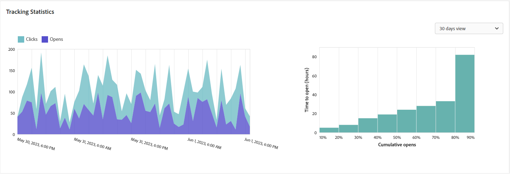

# E-mailleveringsrapport {#email-report}

De **E-mailleveringsrapport** biedt uitgebreide inzichten en gegevens die specifiek zijn voor het e-mailkanaal. Het biedt gedetailleerde informatie over de prestaties, effectiviteit en resultaten van uw afzonderlijke leveringen, zodat u een uitgebreid overzicht krijgt.

## Leveringsoverzicht {#delivery-summary-email}

>[!CONTEXTUALHELP]
>id="acw_delivery_reporting_sending_email"
>title="Rapportage verzenden"
>abstract="De **Verzenden** in uw rapport biedt diepgaande inzichten in de interactie van uw bezoekers met uw leveringen en eventuele fouten die deze hebben aangetroffen."

### Oorspronkelijke doelpopulatie {#email-delivery-targeted-population}

>[!CONTEXTUALHELP]
>id="acw_delivery_reporting_initial_target"
>title="Oorspronkelijke doelpopulatie"
>abstract="De **Oorspronkelijke doelpopulatie** de grafiek toont gegevens met betrekking tot uw ontvangers en berichten, die op de resultaten van de leveringsvoorbereiding worden gebaseerd."

De **[!UICONTROL Initial target population]** de grafiek toont gegevens met betrekking tot uw ontvangers. De metriek worden berekend tijdens levering voorbereiding en toon: het aanvankelijke publiek, het aantal te verzenden berichten, het aantal uitgesloten ontvangers.

{zoomable=&quot;yes&quot;}{width="50%" align="left" zoomable="yes"}

Plaats de muis boven een gedeelte van de grafiek om het exacte getal weer te geven.

{zoomable=&quot;yes&quot;}{width="50%" align="left" zoomable="yes"}

+++Meer informatie over de afmetingen van het e-mailleveringsrapport.

* **[!UICONTROL Initial audience]**: Totaal aantal beoogde ontvangers.

* **[!UICONTROL To deliver]**: Totaal aantal berichten dat na de voorbereiding van de levering moet worden bezorgd.

* **[!UICONTROL Exclusion]**: Totaal aantal van de doelpopulatie uitgesloten ontvangers.
+++

### Leveringsstatistieken {#email-delivery-stats}

>[!CONTEXTUALHELP]
>id="acw_delivery_reporting_delivery_statistics_summary"
>title="Leveringsstatistieken"
>abstract="De **Leveringsstatistieken** de grafiek geeft het succes van uw levering, en fouten die voorkwamen."

De **[!UICONTROL Delivery statistics]** grafiek geeft het succes van uw levering aan. De cijfers worden hieronder beschreven.

{zoomable=&quot;yes&quot;}{width="50%" align="left" zoomable="yes"}

+++Meer informatie over de afmetingen van het campagnerapport voor e-mail.

* **[!UICONTROL Message sent]**: Totaal aantal berichten dat na de voorbereiding van de levering moet worden bezorgd.

* **[!UICONTROL Success]**: Het aantal berichten dat met succes is verwerkt in verhouding tot het aantal te leveren berichten.

* **[!UICONTROL Errors]**: Totaal aantal fouten bij leveringen en automatische oplevering in verhouding tot het aantal te leveren berichten.

* **[!UICONTROL New quarantines]**: Het totale aantal adressen dat in quarantaine wordt geplaatst na een mislukte levering (onbekend, ongeldig domein) in verhouding tot het aantal te leveren berichten.

+++

### Oorzaken van uitsluiting  {#email-delivery-exclusions}

>[!CONTEXTUALHELP]
>id="acw_delivery_reporting_exclusion"
>title="Uitsluitingsoorzaken"
>abstract="De **Oorzaken van uitsluiting** de grafiek en de tabel geven de uitsplitsing per regel weer van berichten die tijdens de voorbereiding van de levering zijn afgewezen."

De **[!UICONTROL Causes of exclusion]** de grafiek en de tabel geven de uitsplitsing per regel weer van berichten die tijdens de voorbereiding van de levering zijn afgewezen. De uitsluitingsregels worden nader toegelicht in de [Campagne v8 (console)-documentatie](https://experienceleague.adobe.com/docs/campaign/campaign-v8/send/failures/delivery-failures.html#email-error-types){_blank}.

{zoomable=&quot;yes&quot;}{align="center" zoomable="yes"}

+++Meer informatie over de afmetingen van het e-mailleveringsrapport.

* **[!UICONTROL User unknown]**: Fouttype dat tijdens de levering wordt gegenereerd om aan te geven dat het e-mailadres ongeldig is.

* **[!UICONTROL Invalid domain]**: Fouttype dat wordt gegenereerd bij het verzenden van een levering om aan te geven dat het domein van het e-mailadres onjuist is of niet bestaat.

* **[!UICONTROL Mailbox full]**: Fouttype dat wordt gegenereerd na vijf leveringspogingen om aan te geven dat het postvak van de ontvanger te veel berichten bevat.

* **[!UICONTROL Account disabled]**: Fouttype dat wordt gegenereerd bij het verzenden van een levering om aan te geven dat het adres niet langer bestaat.

* **[!UICONTROL Refused]**: Fouttype dat wordt gegenereerd wanneer een adres wordt afgewezen door de IAP (Internet Access Provider), bijvoorbeeld na toepassing van een beveiligingsregel (anti-spamsoftware).

* **[!UICONTROL Unreachable]**: Het type van fout dat in het koord van de berichtdistributie voorkomt: incident op het relais SMTP, domein tijdelijk onbereikbaar etc.

* **[!UICONTROL Not connected]**: Fouttype om aan te geven dat de mobiele telefoon van de ontvanger op het moment van verzending wordt uitgeschakeld of losgekoppeld van het netwerk.

+++

## Leveringsdoorvoer {#delivery-throughtput}

>[!CONTEXTUALHELP]
>id="acw_delivery_reporting_throughput_email"
>title="Leveringsdoorvoer"
>abstract="De **Leveringsdoorvoer** het rapport bevat gedetailleerde informatie over de leveringstijd van het gehele platform binnen een bepaald tijdsbestek."

Dit rapport bevat gedetailleerde informatie over de leveringstijd van het gehele platform binnen een opgegeven tijdsbestek. Primaire metrisch die wordt gebruikt om de snelheid van berichtlevering te meten is het aantal berichten per uur worden verzonden.

{zoomable=&quot;yes&quot;}{align="center" zoomable="yes"}

## Uitzendstatistieken {#broadcast-statistics}

>[!CONTEXTUALHELP]
>id="acw_delivery_reporting_broadcast_statistics"
>title="Uitzendstatistieken"
>abstract="De **Uitzendstatistieken** bevat de beschikbare gegevens voor mogelijke fouten die met elk domein worden aangetroffen."

De **[!UICONTROL Broadcast statistics]** de tabel bevat de beschikbare gegevens voor mogelijke fouten die met elk domein zijn aangetroffen. De cijfers worden hieronder beschreven.

{zoomable=&quot;yes&quot;}{align="center" zoomable="yes"}

+++Meer informatie over de afmetingen van het e-mailleveringsrapport.

* **[!UICONTROL Processed emails]**: Het totale aantal berichten dat door de leveringsserver wordt verwerkt.

* **[!UICONTROL Delivered]**: Percentage van het aantal succesvol verwerkte berichten vergeleken met het totale aantal verwerkte berichten.

* **[!UICONTROL Hard bounces]**: Percentage van het aantal &#39;harde&#39; grenzen, permanente fouten, zoals een onjuist e-mailadres, in vergelijking met het totale aantal verwerkte berichten.

* **[!UICONTROL Soft bounces]**: Percentage van het aantal &quot;zachte&quot; grenzen, tijdelijke fouten zoals een volledig postvak, vergeleken met het totale aantal verwerkte berichten

* **[!UICONTROL Opens]**: Percentage van het aantal beoogde ontvangers die een bericht ten minste eenmaal hebben geopend in vergelijking met het aantal berichten dat met succes is verwerkt.

* **[!UICONTROL Clicks]**: Percentage van het aantal personen dat ten minste eenmaal op een levering heeft geklikt in verhouding tot het aantal berichten dat met succes is verwerkt.

* **[!UICONTROL Unsubscriptions]**: Percentage van het aantal klikken op een koppeling zonder abonnement in verhouding tot het aantal berichten dat met succes is verwerkt.
+++

## Niet-te leveren items {#non-deliverables-email}

### Uitsplitsing van fouten per type {#email-delivery-breakdown-type}

>[!CONTEXTUALHELP]
>id="acw_delivery_reporting_error_type"
>title="Uitsplitsing van fouten per type"
>abstract="De **Uitsplitsing van fouten per type** de lijst en de grafiek bevatten de beschikbare gegevens voor elk aangetroffen foutentype: onbekende gebruiker, brievenbus volledig, ongeldig domein, en meer."

De **[!UICONTROL Breakdown of errors per type]** tabel en grafiek bevatten de beschikbare gegevens voor het fouttype. De cijfers worden hieronder beschreven.

De fouten die in dit rapport worden weergegeven, activeren het quarantaineproces. Voor meer informatie over quarantainebeheer raadpleegt u [Campagne v8-documentatie (clientconsole)](https://experienceleague.adobe.com/docs/campaign/campaign-v8/campaigns/send/failures/delivery-failures.html){target="_blank"}.

{zoomable=&quot;yes&quot;}{align="left" zoomable="yes"}

+++Meer informatie over de afmetingen van het e-mailleveringsrapport.

* **[!UICONTROL User unknown]**: Fouttype dat tijdens de levering wordt gegenereerd om aan te geven dat het e-mailadres ongeldig is.

* **[!UICONTROL Invalid domain]**: Fouttype dat wordt gegenereerd bij het verzenden van een levering om aan te geven dat het domein van het e-mailadres onjuist is of niet bestaat.

* **[!UICONTROL Mailbox full]**: Fouttype dat wordt gegenereerd na vijf leveringspogingen om aan te geven dat het postvak van de ontvanger te veel berichten bevat.

* **[!UICONTROL Account disabled]**: Fouttype dat wordt gegenereerd bij het verzenden van een levering om aan te geven dat het adres niet langer bestaat.

* **[!UICONTROL Refused]**: Fouttype dat wordt gegenereerd wanneer een adres wordt afgewezen door de IAP (Internet Access Provider), bijvoorbeeld na toepassing van een beveiligingsregel (anti-spamsoftware).

* **[!UICONTROL Unreachable]**: Het type van fout dat in het koord van de berichtdistributie voorkomt: incident op het relais SMTP, domein tijdelijk onbereikbaar etc.

* **[!UICONTROL Not connected]**: Fouttype om aan te geven dat de mobiele telefoon van de ontvanger op het moment van verzending wordt uitgeschakeld of losgekoppeld van het netwerk.

+++

### Uitsplitsing van fouten per domein {#email-delivery-breakdown-domain}

>[!CONTEXTUALHELP]
>id="acw_delivery_reporting_error_domain"
>title="Uitsplitsing van fouten per domein"
>abstract="De **Uitsplitsing van fouten per domein** de tabel en de grafiek geven de beschikbare gegevens weer voor elk fouttype dat afhankelijk van elk domein wordt aangetroffen."

De **[!UICONTROL Breakdown of errors per domain]** in tabel en grafiek worden de beschikbare gegevens weergegeven voor mogelijke fouten die met elk domein worden aangetroffen.

{zoomable=&quot;yes&quot;}{align="left" zoomable="yes"}

Klik op het pictogram naast de naam van elk domein om details weer te geven.

{zoomable=&quot;yes&quot;}{align="left" zoomable="yes"}

De beschikbare cijfers zijn gelijk aan die voor de [Uitsplitsing van fouten naar type](#email-delivery-breakdown-type) hierboven beschreven.

## Trackingsindicatoren {#tracking-indicators-email}

>[!CONTEXTUALHELP]
>id="acw_delivery_reporting_tracking_email"
>title="Reeksspatiëring rapporteren"
>abstract="De **Tekstspatiëring** bevat waardevolle gegevens, zoals het gedrag van de ontvanger per koppeling, de manier waarop wordt geopend en geklikt, en gedetailleerde informatie over de URL&#39;s waarop het vaakst wordt geklikt tijdens de levering."

### Leveringsstatistieken  {#email-tracking-delivery-stats}

>[!CONTEXTUALHELP]
>id="acw_delivery_reporting_delivery_statistics_indicators"
>title=" Leveringsstatistieken"
>abstract="De **Leveringsstatistieken** Het rapport biedt prestatiekernindicatoren (KPI&#39;s) die gedetailleerde informatie geven over gegevens die beschikbaar zijn voor verzonden e-mails: succes, opent, klikt en nog veel meer."

De **[!UICONTROL Delivery statistics]** Het rapport biedt belangrijke prestatie-indicatoren (KPI&#39;s) die gedetailleerde informatie geven over gegevens die beschikbaar zijn voor verzonden e-mails. De cijfers worden hieronder beschreven.

{zoomable=&quot;yes&quot;}{align="center"}

+++Meer informatie over de afmetingen van het e-mailleveringsrapport.

* **[!UICONTROL Success]**: Het aantal berichten dat met succes is verwerkt in verhouding tot het aantal te leveren berichten.

* **[!UICONTROL Distinct opens]**: Het totale aantal beoogde ontvangers dat een bericht ten minste eenmaal heeft geopend.

* **[!UICONTROL Opens]**: Aantal verschillende beoogde ontvangers voor dit domein die een bericht minstens één keer hebben geopend.

* **[!UICONTROL Clicks on the opt-out link]**: Het aantal klikken op de koppeling voor het opzeggen van abonnementen.

* **[!UICONTROL Clicks on the mirror link]**: Het aantal klikken op de koppeling naar de spiegelpagina.

* **[!UICONTROL Estimation of forwards]**: Schatting van het aantal e-mails dat door de beoogde ontvangers is doorgestuurd.
+++

### Open- en doorklikfrequentie {#email-tracking-click-through}

>[!CONTEXTUALHELP]
>id="acw_delivery_reporting_open_clickthrough"
>title="Open- en doorklikfrequentie"
>abstract="De **Open- en doorklikfrequentie** in de tabel worden gegevens weergegeven die betrekking hebben op de betrokkenheid van uw ontvangers bij uw levering."

De **[!UICONTROL Open and click-through rate]** de lijst toont gegevens met betrekking tot uw ontvangers. De cijfers worden hieronder beschreven.

{zoomable=&quot;yes&quot;}{align="center"}

+++Meer informatie over de afmetingen van het e-mailleveringsrapport.

* **[!UICONTROL Sent]**: Totaal aantal verzonden berichten.

* **[!UICONTROL Complaints]**: Het aantal berichten voor dit domein dat door de ontvanger als ongewenst is gemeld.

* **[!UICONTROL Opens]**: Aantal verschillende beoogde ontvangers voor dit domein die een bericht minstens één keer hebben geopend.

* **[!UICONTROL Clicks]**: Aantal verschillende beoogde ontvangers die minstens één keer op dezelfde levering hebben geklikt.

* **[!UICONTROL Raw reactivity]**: Percentage van het aantal ontvangers dat ten minste één keer op een levering heeft geklikt in vergelijking met het aantal ontvangers dat een levering ten minste één keer heeft geopend.
+++

## URL&#39;s en klikpaden {#url-email}

>[!CONTEXTUALHELP]
>id="acw_delivery_reporting_urls_clickstreams"
>title="URL&#39;s en klikpaden"
>abstract="De **URL&#39;s en klik op streams** Het rapport verstrekt zeer belangrijke prestatiesindicatoren (KPIs) die gedetailleerde informatie over URLs geven die het meest tijdens een levering werden geklikt."

De **[!UICONTROL URLs and click streams]** Het rapport verstrekt zeer belangrijke prestatiesindicatoren (KPIs) die gedetailleerde informatie over URLs geven die het meest tijdens een levering werden geklikt.

{zoomable=&quot;yes&quot;}{align="center"}

+++Meer informatie over de afmetingen van het e-mailleveringsrapport.

* **[!UICONTROL Reactivity]**: Verhouding van het aantal beoogde ontvangers dat op een levering heeft geklikt, in verhouding tot het geschatte aantal beoogde ontvangers dat een levering heeft geopend.

* **[!UICONTROL Distinct clicks]**: Het totale aantal verschillende ontvangers dat minstens één keer op een levering heeft geklikt.

* **[!UICONTROL Clicks]**: Het totale aantal klikken op koppelingen in leveringen.

* **[!UICONTROL Platform average]** : Dit gemiddelde tarief, dat onder elk tarief wordt getoond (reactiviteit, verschillende kliks, en gecumuleerde kliks), wordt berekend voor leveringen die in de voorafgaande zes maanden werden verzonden. Alleen leveringen met dezelfde typologie en op hetzelfde kanaal worden in aanmerking genomen. Proefdrukken zijn uitgesloten.

+++

### De tien meest bezochte koppelingen bovenaan {#email-tracking-top10}

>[!CONTEXTUALHELP]
>id="acw_delivery_reporting_urls_clickstreams_top10"
>title="De tien meest bezochte koppelingen bovenaan"
>abstract="De **De tien meest bezochte koppelingen bovenaan** de grafiek en de lijst bevatten de beschikbare gegevens voor ontvankelijk gedrag per verbinding."

De **[!UICONTROL Top 10 most visited links]** de grafiek en de lijst bevatten de beschikbare gegevens voor ontvankelijk gedrag per verbinding.

{zoomable=&quot;yes&quot;}{align="center"}

+++Meer informatie over de afmetingen van het e-mailleveringsrapport.

* **[!UICONTROL Clicks]**: Het totale aantal klikken op koppelingen in leveringen.

* **[!UICONTROL Percentage]**: Percentage gebruikers dat interactie had met de levering.

+++

### Uitsplitsing van klikken in de tijd {#email-tracking-breakdown-over-time}

>[!CONTEXTUALHELP]
>id="acw_delivery_reporting_urls_click_breakdown"
>title="Uitsplitsing van klikken in de tijd"
>abstract="De **Uitsplitsing van klikken in de tijd** in de grafiek worden de beschikbare gegevens voor het gedrag van de ontvanger per koppeling weergegeven."

De **[!UICONTROL Breakdown of clicks over time]** de grafiek bevat de beschikbare gegevens voor het gedrag van de ontvanger per koppeling.

{zoomable=&quot;yes&quot;}{align="center"}

## Gebruikersactiviteiten {#user-activities-email}

>[!CONTEXTUALHELP]
>id="acw_delivery_reporting_user_activities"
>title="Gebruikersactiviteiten"
>abstract="De **Gebruikersactiviteiten** de grafiek toont de uitsplitsing van opent en klikt in de vorm van een grafiek. U kunt de tijdsperiode kiezen waarin de gegevens moeten worden opgenomen: laatste dag, afgelopen uur of 30 minuten."

De **[!UICONTROL User activities]** het rapport toont de uitsplitsing van opent en klikt in de vorm van een grafiek. U kunt de tijdsperiode kiezen waarin de gegevens moeten worden opgenomen: laatste dag, afgelopen uur of 30 minuten.

{zoomable=&quot;yes&quot;}{align="center"}

+++Meer informatie over de afmetingen van het e-mailleveringsrapport.

* **[!UICONTROL Clicks]**: Het totale aantal klikken op koppelingen in leveringen.

* **[!UICONTROL Opens]**: Aantal verschillende beoogde ontvangers voor dit domein die een bericht minstens één keer hebben geopend.

+++

## Statistieken bijhouden {#tracking-statistics}

>[!CONTEXTUALHELP]
>id="acw_delivery_reporting_statistics"
>title="Statistieken bijhouden"
>abstract="De **Statistieken bijhouden** de grafiek verstrekt statistieken over opent en klikt. U kunt het specifieke tijdkader selecteren voor het opgeven van gegevens."

De **[!UICONTROL Tracking Statistics]** de grafiek verstrekt statistieken over opent en klikt. U kunt het specifieke tijdkader selecteren voor het opgeven van gegevens.

{zoomable=&quot;yes&quot;}{align="center"}

+++Meer informatie over de afmetingen van het e-mailleveringsrapport.

* **[!UICONTROL Clicks]**: Het totale aantal klikken op koppelingen in leveringen.

* **[!UICONTROL Opens]**: Aantal verschillende beoogde ontvangers voor dit domein die een bericht minstens één keer hebben geopend.

+++

## Indeling van openen {#breakdown-opens}

### Onderverdeling van openen per apparaat {#breakdown-opens-devices}

>[!CONTEXTUALHELP]
>id="acw_delivery_reporting_breakdown_device"
>title="Uitsplitsing per apparaat"
>abstract="De **Uitsplitsing per apparaat** in het rapport wordt de uitsplitsing van de openingen per apparaat voor de periode weergegeven. Voor elke categorie worden twee grafieken gebruikt. De eerste toont statistieken betreffende opent op een computer en mobiele apparaten. Het tweede toont het nauwkeurige aantal en het percentage voor elk apparatentype."

De **Uitsplitsing per apparaat** In dit rapport wordt de uitsplitsing van de bewerkingen per apparaat gedurende de periode weergegeven: pc&#39;s, Android-apparaten, Apple-apparaten of andere apparaten.

Voor elke categorie worden twee grafieken gebruikt. De eerste toont statistieken betreffende opent op een computer en mobiele apparaten. Het tweede toont het nauwkeurige aantal en het percentage voor elk apparatentype.

{zoomable=&quot;yes&quot;}{align="center"}

### Opsplitsing van openen door besturingssysteem {#breakdown-opens-os}

>[!CONTEXTUALHELP]
>id="acw_delivery_reporting_breakdown_os"
>title="Uitsplitsing naar besturingssysteem"
>abstract="De **Uitsplitsing naar besturingssysteem** in het verslag wordt de uitsplitsing van de open systemen voor de betrokken periode aangegeven. In het eerste diagram worden statistieken over de mogelijkheden van een computer en een mobiel apparaat weergegeven. In het tweede voorbeeld worden het exacte aantal en percentage voor elk besturingssysteem weergegeven."

De **Uitsplitsing naar besturingssysteem** In dit rapport wordt de uitsplitsing van de bewerkingen per besturingssysteem gedurende de periode weergegeven: Windows-systemen, Android-systemen, iOS-systemen of andere systemen.

Voor elke categorie worden twee grafieken gebruikt. De eerste toont statistieken betreffende opent op een computer en mobiele werkende systemen. In het tweede voorbeeld worden het exacte aantal en het exacte percentage voor elk besturingssysteem weergegeven.

{zoomable=&quot;yes&quot;}{align="center"}

### Indeling van opent via browser {#breakdown-opens-browser}

>[!CONTEXTUALHELP]
>id="acw_delivery_reporting_breakdown_browser"
>title="Onderverdeling per browser"
>abstract="De **Onderverdeling per browser** toont de uitsplitsing van opent door browser voor de periode. In het eerste diagram worden statistieken over de mogelijkheden van een computer en een mobiel apparaat weergegeven. Het tweede toont het nauwkeurige aantal en het percentage voor elke browser."

De **Onderverdeling per browser** In dit rapport ziet u hoe de weergave van bestanden is verdeeld over browsers: Chrome, Safari, Internet Explorer en meer.

Voor elke categorie worden twee grafieken gebruikt. De eerste toont statistieken betreffende opent op een computer en mobiele werkende systemen. Het tweede toont het nauwkeurige aantal en het percentage voor elke browser.

{zoomable=&quot;yes&quot;}{align="center"}

## Hotclicks {#hotclicks}

>[!CONTEXTUALHELP]
>id="acw_delivery_reporting_hotclicks"
>title="Hotclicks-rapport"
>abstract="De **Hotclicks** In dit rapport wordt de e-mailinhoud (HTML en/of tekst) weergegeven met het percentage klikken op koppelingen voor elke koppeling. De blokken van de verpersoonlijking, unsubscription verbindingen, de verbindingen van de spiegel, en aanbiedingsverbindingen worden in de totale gecumuleerde klikken in aanmerking genomen, maar niet getoond in het rapport."

Dit rapport toont de berichtinhoud (HTML en/of tekst) met, op elke verbinding, het percentage klikt op verbindingen. De blokken van de verpersoonlijking, unsubscription verbindingen, de verbindingen van de spiegel, en aanbiedingsverbindingen worden in de totale gecumuleerde klikken in aanmerking genomen, maar niet getoond in het rapport.

{zoomable=&quot;yes&quot;}
