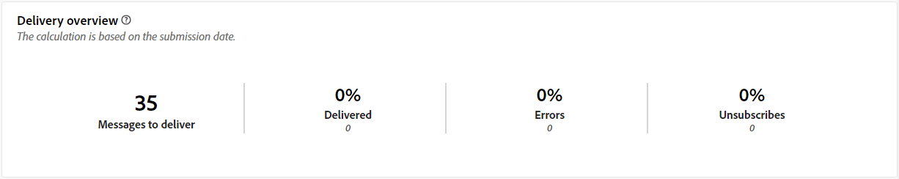

# Algemene rapporten voor het directe-mailkanaal {#global-report-direct}

De wereldwijde rapporten van Direct Mail bieden gebruikers een uitgebreid overzicht van verkeers- en servicemetriek op kanaalniveau.

Navigeer naar het menu **[!UICONTROL Reports]** in de sectie **[!UICONTROL Reporting]** . U kunt de gegevens filteren op basis van de rapportdatum, -map of -regels. [Meer informatie](global-reports.md)

## Leveringsoverzicht {#delivery-summary-direct}

### Overzicht van levering {#delivery-overview-direct}

>[!CONTEXTUALHELP]
>id="acw_global_reporting_delivery_overview_direct_mail"
>title="Overzicht van levering"
>abstract="Het **Overzicht van de Levering** stelt zeer belangrijke prestatiesmetriek (KPIs) voor die diepgaande inzichten in de interactie van uw bezoekers met elke directe postlevering aanbieden. De meetgegevens worden hieronder beschreven."

In **[!UICONTROL Delivery Overview]** worden de belangrijkste prestatiemetriek (KPI&#39;s) gepresenteerd, die diepgaande inzichten biedt in de interactie van uw bezoekers met elke directe-maillevering. De meetgegevens worden hieronder beschreven.

{zoomable="yes"}{align="center"}

+++Meer informatie over de maatstaven van het leveringsoverzicht.

* **[!UICONTROL Messages to deliver]**: Het totale aantal berichten dat tijdens de voorbereiding van de levering wordt verwerkt.

* **[!UICONTROL Delivered]**: Het aantal berichten dat is verzonden in verhouding tot het totale aantal verzonden berichten.

* **[!UICONTROL Errors]**: Totaal aantal fouten die zijn geaccumuleerd tijdens levering en automatische retourverwerking, in verhouding tot het totale aantal verzonden berichten.

* **[!UICONTROL Unsubscribes]**: Aantal ontvangers die op abonnementkoppelingen hebben geklikt.

+++

### Gericht publiek {#delivery-summary-direct-initial-target}

>[!CONTEXTUALHELP]
>id="acw_global_reporting_target_audience_direct_mail_graph"
>title="Gericht publiek"
>abstract="De ontvankelijke gegevens en berichtinformatie worden getoond in de **Gerichte publieksgrafiek**, die op de analyse van de leveringsvoorbereiding wijst."

>[!CONTEXTUALHELP]
>id="acw_global_reporting_target_audience_direct_mail_table"
>title="Gericht publiek"
>abstract="De **gerichte publiek** lijst verstrekt een gedetailleerde uitsplitsing van uw ontvangers en de overeenkomstige berichten, die op de resultaten van het proces van de leveringsvoorbereiding worden gebaseerd."

De tabel en grafiek voor **[!UICONTROL Targeted Audience]** bevatten gegevens over showcase die betrekking hebben op uw ontvangers. Hieronder vindt u gedetailleerde cijfers.

{zoomable="yes"}{align="center"}

+++ Meer informatie over de meetgegevens voor doelgroepen.

* **[!UICONTROL Targeted audience]**: het totale aantal beoogde ontvangers.

* **[!UICONTROL Message to deliver]**: Het totale aantal berichten dat na de voorbereiding van de levering moet worden geleverd.

* **[!UICONTROL Exclusion]**: Het totale aantal adressen dat tijdens de analyse wordt genegeerd wanneer het toepassen van regels, zoals adres mist, quarantined, of op een lijst van gewezen personen.

+++

### Leveringsstatistieken {#delivery-summary-direct-exec-stats}

>[!CONTEXTUALHELP]
>id="acw_global_reporting_delivery_statistics_summary_direct_mail_graph"
>title="Leveringsstatistieken"
>abstract="De **grafiek van de Statistieken van de Levering** verstrekt inzicht in de doeltreffendheid van uw Directe postleveringen, met inbegrip van succesvolle leveringen en om het even welke ontmoet fouten."

>[!CONTEXTUALHELP]
>id="acw_global_reporting_delivery_statistics_summary_direct_mail_table"
>title="Leveringsstatistieken"
>abstract="De **statistieken van de Levering** lijst specificeert het succes van uw Directe postlevering, en fouten die voorkwamen."

De grafiek en de tabel van **[!UICONTROL Delivery statistics]** bevatten een overzicht van het succes van elke directe verzending. Hieronder vindt u gedetailleerde cijfers.

+++Meer weten over de meetgegevens van de leveringsstatistieken?

* **[!UICONTROL Message to deliver]**: Het totale aantal berichten dat na de voorbereiding van de levering moet worden geleverd.

* **[!UICONTROL Success]**: Het aantal berichten dat met succes is verwerkt, in verhouding tot het aantal te leveren berichten.

* **[!UICONTROL Errors / Bounces]**: het totaal van de fouten die tijdens leveringen en automatische oplaadbewerking zijn geaccumuleerd, in verhouding tot het aantal te leveren berichten.

* **[!UICONTROL New quarantines]**: Het totale aantal adressen dat na een mislukte levering in quarantaine is geplaatst (bv. onbekende gebruiker, ongeldig domein), in verhouding tot het aantal te leveren berichten.

+++

### Oorzaken van uitsluiting {#causes-exclusion}

>[!CONTEXTUALHELP]
>id="acw_global_reporting_exclusions_direct_mail_table"
>title="Uitsluitingen"
>abstract="De **Oorzaken van uitsluiting** lijst toont een gedetailleerde onderbreking, door regel, van berichten die tijdens het proces van de leveringsvoorbereiding werden verworpen."

>[!CONTEXTUALHELP]
>id="acw_global_reporting_causes_exclusion_direct_mail_graph"
>title="Oorzaken van uitsluiting"
>abstract="De **Oorzaken van uitsluiting** grafiek illustreert de distributie van verworpen berichten tijdens de voorbereiding voor levering, die door elke regel wordt gecategoriseerd."

{zoomable="yes"}{align="center"}

In de grafiek en de tabel met uitsluitingen worden de redenen weergegeven waarom gebruikersprofielen, die zijn uitgesloten van de doelprofielen, het bericht niet hebben ontvangen.

+++Meer informatie over oorzaken van uitsluitingsmetriek.

* **[!UICONTROL Address in quarantine]**: Fouttype dat wordt gegenereerd wanneer een adres in quarantaine wordt geplaatst.

* **[!UICONTROL Address not specified]**: Fouttype dat wordt gegenereerd bij het verzenden van een levering om aan te geven dat het adres niet bestaat.

* **[!UICONTROL Bad quality address]**: Fouttype dat wordt gegenereerd wanneer de score van de kwaliteit van het postadres te laag is.

* **[!UICONTROL Denylisted address]**: Het type van fout produceerde toen de ontvanger werd gevoegd op lijst van gewenste personen toen de levering werd uitgevoerd.

* **[!UICONTROL Double]**: Fouttype dat is gegenereerd toen de ontvanger werd uitgesloten, omdat de hoofdwaarden niet uniek waren.

* **[!UICONTROL Control group]**: Het adres van de ontvanger maakt deel uit van de controlegroep.

* **[!UICONTROL Target limited in size]**: De maximale leveringsgrootte is bereikt voor de ontvanger.

+++