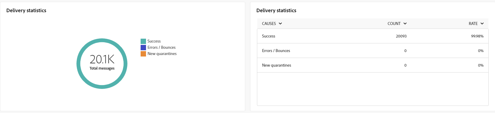

# Algemene rapporten voor het e-mailkanaal {#global-report-direct}

De globale rapporten verstrekken gebruikers van een uitvoerig overzicht van verkeer en betrokkenheidsmetriek op kanaal-niveau.

Ga naar de **[!UICONTROL Reports]** in het menu **[!UICONTROL Reporting]** sectie. U kunt de gegevens filteren op basis van de rapportdatum, -map of -regels. [Meer informatie](global-reports.md)

## Leveringsoverzicht {#delivery-summary-email}

### Overzicht van levering {#delivery-overview-email}

>[!CONTEXTUALHELP]
>id="acw_global_reporting_deliveries_overview_email"
>title="Overzicht van levering"
>abstract="De **Overzicht van levering** geeft belangrijke prestatie-indicatoren (KPI&#39;s) weer die diepgaande inzichten bieden in de manier waarop uw publiek communiceert met de e-mailleveringen en campagnes die u verzendt."

De **[!UICONTROL Delivery Overview]** biedt belangrijke prestatiemetriek (KPIs) die diepgaande inzichten in de interactie van uw bezoekers met elke e-maillevering aanbieden. De meetgegevens worden hieronder beschreven.

{align="center"}

+++ Meer informatie over overzichtsmetriek voor levering.

* **[!UICONTROL Messages to deliver]**: Het totale aantal berichten dat tijdens de voorbereiding van de levering wordt verwerkt.

* **[!UICONTROL Delivered]**: Het aantal berichten dat is verzonden in verhouding tot het totale aantal verzonden berichten.

* **[!UICONTROL Total opens]**: Het totale aantal beoogde ontvangers dat een bericht ten minste eenmaal heeft geopend.

* **[!UICONTROL Total clicks]**: Het totale aantal ontvangers dat minstens één keer op een levering heeft geklikt.

* **[!UICONTROL Bounces & errors]**: Totaal aan fouten gecumuleerd tijdens levering en automatische terugkeerverwerking met betrekking tot het totale aantal verzonden berichten.

* **[!UICONTROL Unsubscribes]**: Aantal ontvangers die op abonnementen hebben geklikt.
+++

### Gericht publiek {#delivery-summary-email-initial-target}

>[!CONTEXTUALHELP]
>id="acw_global_reporting_target_audience_email"
>title="Eerste doelstatistieken"
>abstract="De **Doelgericht publiek** tabel en grafiek geven inzicht in de betrokkenheid van ontvangers, zodat u de doeltreffendheid van uw campagnes en leveringen kunt beoordelen."

De tabel en grafiek voor **[!UICONTROL Targeted Audience]** showcase-gegevens over uw ontvangers, met gedetailleerde hieronder verstrekte gegevens.

{align="center"}

+++ Meer informatie over de meetgegevens voor doelgroepen.

* **[!UICONTROL Targeted audience]**: Totaal aantal beoogde ontvangers.

* **[!UICONTROL Message to deliver]**: Totaal aantal berichten dat na de voorbereiding van de levering moet worden bezorgd.

* **[!UICONTROL Exclusion]**: Het totale aantal adressen dat tijdens de analyse wordt genegeerd wanneer het toepassen van regels: adres ontbreekt, quarantined, op lijst van gewezen personen, enz.

+++

### Leveringsstatistieken {#delivery-summary-email-delivery-stats}

>[!CONTEXTUALHELP]
>id="acw_global_reporting_email_delivery_stats"
>title="Leveringsstatistieken"
>abstract="De **Leveringsstatistieken** grafiek en lijst overzicht zeer belangrijke metriek, met inbegrip van succesvolle leveringen, fouten, en nieuwe quarantines, die een beknopt overzicht aanbieden om leveringsprestaties te evalueren."

De **[!UICONTROL Delivery statistics]** tabel geeft een overzicht van het succes van elke e-maillevering , met gedetailleerde cijfers die hieronder worden beschreven .

{align="center"}

+++ Meer informatie over de statistieken van de Levering metriek.

* **[!UICONTROL Message to deliver]**: Totaal aantal berichten dat na de voorbereiding van de levering moet worden bezorgd.

* **[!UICONTROL Success]**: Het aantal berichten dat met succes is verwerkt in verhouding tot het aantal te leveren berichten.

* **[!UICONTROL Errors / Bounces]**: Totaal aantal fouten bij leveringen en automatische oplevering in verhouding tot het aantal te leveren berichten.

* **[!UICONTROL New quarantines]**: Het totale aantal adressen dat in quarantaine wordt geplaatst na een mislukte levering (onbekend, ongeldig domein) in verhouding tot het aantal te leveren berichten.

+++

### Oorzaken van uitsluiting {#causes-exclusion}

>[!CONTEXTUALHELP]
>id="acw_global_reporting_exclusion_email"
>title="Oorzaken van uitsluiting"
>abstract="De **Uitsluitingsoorzaken** de grafiek en de tabel illustreren de specifieke redenen voor afwijzingen van berichten tijdens de voorbereiding van de levering, met een gedetailleerde uitsplitsing per regel."

{align="center"}

In de grafiek en de tabel met uitsluitingen worden de redenen weergegeven waarom gebruikersprofielen, die zijn uitgesloten van de doelprofielen, het bericht niet hebben ontvangen.

E-mailfouttypen worden weergegeven in het dialoogvenster [Adobe Campaign v8-documentatie (clientconsole)](https://experienceleague.adobe.com/docs/campaign/campaign-v8/send/failures/delivery-failures.html#email-error-types){target="_blank"}.

## Leveringsdoorvoer {#delivery-throughput}

>[!CONTEXTUALHELP]
>id="acw_global_reporting_throughput_email"
>title="Leveringsdoorvoer"
>abstract="Dit **Leveringsdoorvoer** biedt uitgebreide inzichten in de doorvoer van de resultaten, waardoor succes en foutpercentages binnen een opgegeven tijdsperiode worden benadrukt."

{align="center"}

Het rapport Leveringsdoorvoer biedt diepgaande inzichten in de efficiëntie van het leveringsproces en biedt een gedetailleerd overzicht van het succes en de foutenpercentages binnen een bepaald tijdsbestek.

+++ Meer informatie over de maatstaven van de leveringstijd.

* **[!UICONTROL Success]**: Het aantal berichten dat met succes is verwerkt in verhouding tot het aantal te leveren berichten.

* **[!UICONTROL Errors]**: Totaal aantal fouten bij leveringen en automatische oplevering in verhouding tot het aantal te leveren berichten.

+++

## Niet-te leveren items {#non-deliverables-email}

### Uitsplitsing van fouten per type {#delivery-summary-email-breakdown-per-type}

>[!CONTEXTUALHELP]
>id="acw_global_reporting_error_type_email"
>title="Uitsplitsing van fouten per type"
>abstract="De tabel en de grafiek waarin de **Uitsplitsing van fouten per type** omvat informatie over diverse foutentypes die tijdens het proces, met inbegrip van onbekende gebruiker, brievenbus volledig, ongeldig domein, en anderen worden ontmoet."

{align="center"}

De **[!UICONTROL Breakdown of errors per type]** in tabel en grafiek worden de gegevens weergegeven die betrekking hebben op mogelijke fouten op verschillende gebieden , met specifieke cijfers die hieronder worden gegeven .

De fouten die in dit rapport worden weergegeven, activeren het quarantaineproces. Voor meer informatie over quarantainebeheer raadpleegt u [Campagne v8-documentatie (clientconsole)](https://experienceleague.adobe.com/docs/campaign/campaign-v8/campaigns/send/failures/delivery-failures.html){target="_blank"}.

+++ Meer informatie over de uitsplitsing van fouten per type metriek.

* **[!UICONTROL User unknown]**: Fouttype dat tijdens de levering wordt gegenereerd om aan te geven dat het e-mailadres ongeldig is.

* **[!UICONTROL Invalid domain]**: Fouttype dat wordt gegenereerd bij het verzenden van een levering om aan te geven dat het domein van het e-mailadres onjuist is of niet bestaat.

* **[!UICONTROL Mailbox full]**: Fouttype dat wordt gegenereerd na vijf leveringspogingen om aan te geven dat het postvak van de ontvanger te veel berichten bevat.

* **[!UICONTROL Account disabled]**: Fouttype dat wordt gegenereerd bij het verzenden van een levering om aan te geven dat het adres niet langer bestaat.

* **[!UICONTROL Refused]**: Fouttype dat wordt gegenereerd wanneer een adres wordt afgewezen door de IAP (Internet Access Provider), bijvoorbeeld na toepassing van een beveiligingsregel (anti-spamsoftware).

* **[!UICONTROL Unreachable]**: Het type van fout dat in het koord van de berichtdistributie voorkomt: incident op het relais SMTP, domein tijdelijk onbereikbaar etc.

* **[!UICONTROL Not connected]**: Fouttype om aan te geven dat de mobiele telefoon van de ontvanger op het moment van verzending wordt uitgeschakeld of losgekoppeld van het netwerk.

+++

### Uitsplitsing van fouten per domein {#delivery-summary-email-breakdown-per-domain}

>[!CONTEXTUALHELP]
>id="acw_global_reporting_error_domain_email"
>title="Uitsplitsing van fouten per domein"
>abstract="De tabel en grafiek die het **Uitsplitsing van fouten per domein** geeft de gegevens weer die overeenkomen met elk aangetroffen fouttype, gecategoriseerd door specifieke domeinen."

{align="center"}

De **[!UICONTROL Breakdown of errors per domain]** in tabel en grafiek worden de gegevens weergegeven die betrekking hebben op mogelijke fouten binnen elk domein. De metriek is gemeenschappelijk met **[!UICONTROL Breakdown of errors per type]** tabel en grafiek hierboven.

## Trackingsindicatoren {#tracking-indicators-email}

### Leveringsstatistieken {#delivery-summary-email-statistics}

>[!CONTEXTUALHELP]
>id="acw_global_delivery_statistics_summary_email"
>title="Leveringsstatistieken"
>abstract="De **Leveringsstatistieken** De belangrijkste Indicatoren van Prestaties (KPIs) verstrekken een uitvoerig overzicht van uw leverings en campagneprestaties, die inzicht in zowel succesvolle levering, ontmoet fouten als gebruikersbetrokkenheid aanbieden."

De **[!UICONTROL Delivery statistics]** De metriek biedt zeer belangrijke prestatiesindicatoren (KPIs) die gedetailleerde informatie betreffende de gegevens verstrekken verbonden aan elke e-maillevering. Hieronder vindt u nadere informatie over deze cijfers.

{align="center"}

+++ Meer informatie over de statistieken van de Levering metriek.

* **[!UICONTROL Messages to deliver]**: Het totale aantal berichten dat tijdens de voorbereiding van de levering wordt verwerkt.

* **[!UICONTROL Success]**: Het aantal berichten dat met succes is verwerkt in verhouding tot het aantal te leveren berichten.

* **[!UICONTROL Unique opens]**: Het totale aantal beoogde ontvangers dat een bericht ten minste eenmaal heeft geopend.

* **[!UICONTROL Total Opens]**: Aantal verschillende beoogde ontvangers voor dit domein die een bericht minstens één keer hebben geopend.

* **[!UICONTROL Clicks on the opt-out link]**: Het aantal klikken op de koppeling voor het opzeggen van abonnementen.

* **[!UICONTROL Clicks on the mirror link]**: Het aantal klikken op de koppeling naar de spiegelpagina.

* **[!UICONTROL Estimation of forwards]**: Schatting van het aantal e-mails dat door de beoogde ontvangers is doorgestuurd.
+++

### Openen en klikken op dalingssnelheid {#delivery-summary-open-rate}

>[!CONTEXTUALHELP]
>id="acw_global_reporting_open_clickthrough_email"
>title="Open- en doorklikfrequentie"
>abstract="De tabel voor **Open- en doorkliksnelheden** onthult de betrokkenheid van ontvangers bij uw levering, waarbij gegevens over open tarieven en doorkliksnelheden worden getoond voor een snel en inzichtelijk overzicht."

De **[!UICONTROL Open and click-trough rate]** de lijst toont gegevens met betrekking tot uw ontvangers. De cijfers worden hieronder beschreven.

{align="center"}

+++ Meer informatie over Open en klik-dalingssnelheden.

* **[!UICONTROL Sent]**: Totaal aantal verzonden berichten.

* **[!UICONTROL Complaints]**: Aantal en percentage berichten voor dit domein die door de ontvanger als ongewenst zijn gemeld.

* **[!UICONTROL Unique Opens]**: Aantal en percentage verschillende beoogde ontvangers voor dit domein die een bericht minstens één keer hebben geopend.

* **[!UICONTROL Unique Clicks]**: Aantal en percentage verschillende beoogde ontvangers die minstens één keer op dezelfde levering hebben geklikt.

* **[!UICONTROL Raw reactivity]**: Percentage van het aantal ontvangers dat ten minste één keer op een levering heeft geklikt in vergelijking met het aantal ontvangers dat een levering ten minste één keer heeft geopend.
+++

## URL&#39;s en klikpaden {#url-email}

### URL&#39;s en klik op streams KPI&#39;s {#url-email-kpis}

>[!CONTEXTUALHELP]
>id="acw_global_reporting_urls_clickstreams_email"
>title="URL&#39;s en klikpaden"
>abstract="De **URL&#39;s en klik op streams** Het rapport verstrekt essentiële Belangrijkste Indicatoren van Prestaties (KPIs) die gedetailleerde inzichten in meest-geklikte URLs tijdens een levering aanbieden."

De **[!UICONTROL URLs and click streams]** Het rapport verstrekt zeer belangrijke prestatiesindicatoren (KPIs) die gedetailleerde inzichten in URLs verstrekken die het hoogste aantal kliks tijdens een levering ontvingen. De cijfers worden hieronder beschreven.

{align="center"}

+++Leer meer op URLs en klik stromen metriek.

* **[!UICONTROL Reactivity]**: Verhouding van het aantal beoogde ontvangers dat op een levering heeft geklikt, in verhouding tot het geschatte aantal beoogde ontvangers dat een levering heeft geopend.

* **[!UICONTROL Unique clicks]**: Het totale aantal verschillende ontvangers dat minstens één keer op een levering heeft geklikt.

* **[!UICONTROL Total Clicks]**: Het totale aantal klikken op koppelingen in leveringen.

* **[!UICONTROL Platform average]** : Dit gemiddelde tarief, dat onder elk tarief wordt getoond (reactiviteit, verschillende kliks, en gecumuleerde kliks), wordt berekend voor leveringen die in de voorafgaande zes maanden werden verzonden. Alleen leveringen met dezelfde typologie en op hetzelfde kanaal worden in aanmerking genomen. Proefdrukken zijn uitgesloten.
+++

### De tien meest bezochte koppelingen bovenaan {#top10-global-report-email}

>[!CONTEXTUALHELP]
>id="acw_global_reporting_top10_email"
>title="De tien meest bezochte koppelingen bovenaan"
>abstract="De **De tien meest bezochte koppelingen bovenaan**  grafiek en tabel bevatten uitgebreide gegevens over de interactie tussen ontvangers en elke koppeling."

De **[!UICONTROL Top 10 most visited links]** de grafiek en de lijst bevatten de beschikbare gegevens voor ontvankelijk gedrag per verbinding. De cijfers worden hieronder beschreven.

{align="center"}

+++Meer informatie over de tien meest bezochte koppelingen vindt u in de statistieken.

* **[!UICONTROL Total Clicks]**: Het totale aantal klikken op koppelingen in leveringen.

* **[!UICONTROL Percentage]**: Percentage gebruikers dat interactie had met de levering.

+++

### Uitsplitsing van klikken in de tijd {#global-report-email-breakdown-clicks}

>[!CONTEXTUALHELP]
>id="acw_global_reporting_urls_click_breakdown_email"
>title="Uitsplitsing van klikken in de tijd"
>abstract="De **Uitsplitsing van klikken in de tijd** grafiek biedt een uitvoerige mening van hoe de ontvangers met verbindingen door het aangewezen tijdkader in dienst nemen."

De **[!UICONTROL Breakdown of clicks over time]** de grafiek bevat de beschikbare gegevens voor het gedrag van de ontvanger per koppeling.

{align="center"}

## Gebruikersactiviteiten {#user-activities-email}

>[!CONTEXTUALHELP]
>id="acw_global_reporting_user_activities_email"
>title="Gebruikersactiviteiten"
>abstract="De grafische weergave van **Gebruikersactiviteiten** biedt een gedetailleerde specificatie van ontvankelijke interactie aan, portrettering opent en door een informatief grafiekformaat klikt."

De **[!UICONTROL User activities]** het rapport toont de uitsplitsing van opent en klikt in de vorm van een grafiek. De cijfers voor dit rapport worden hieronder beschreven.

{align="center"}

+++ Meer informatie over de metriek van gebruikersactiviteiten.

* **[!UICONTROL Total Clicks]**: Het totale aantal klikken op koppelingen in leveringen.

* **[!UICONTROL Total Opens]**: Het totale aantal verschillende beoogde ontvangers voor dit domein dat ten minste één bericht heeft geopend.

+++
