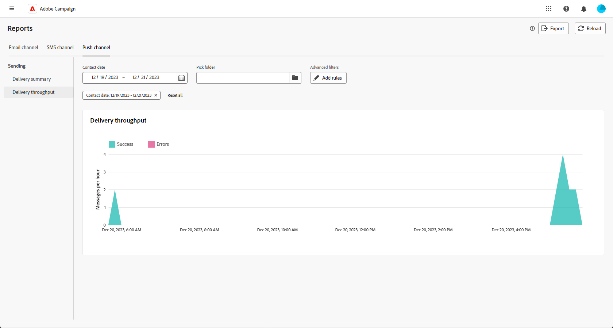

# Globale rapporten voor het kanaal van de Duw {#campaign-reports-push}

De globale rapporten verstrekken gebruikers van een uitvoerig overzicht van verkeer en betrokkenheidsmetriek op kanaal-niveau.

Ga naar de **[!UICONTROL Reports]** in het menu **[!UICONTROL Reporting]** sectie. U kunt de gegevens filteren op basis van de rapportdatum, -map of -regels. [Meer informatie](global-reports.md)

## Leveringsoverzicht {#delivery-summary-push}

### Leveringsoverzicht {#delivery-overview-push}

De **[!UICONTROL Delivery Overview]** biedt prestatiekernindicatoren (KPI&#39;s) die gedetailleerde informatie geven over hoe uw bezoekers omgaan met elke levering van pushberichten. De cijfers worden hieronder beschreven.

+++ Meer informatie over overzichtsmetriek voor levering.

* **[!UICONTROL Messages to deliver]**: Het totale aantal berichten dat tijdens de voorbereiding van de levering wordt verwerkt.

* **[!UICONTROL Delivered]**: Het aantal berichten dat is verzonden in verhouding tot het totale aantal verzonden berichten.

* **[!UICONTROL Total clicks]**: Het totale aantal verschillende ontvangers dat minstens één keer op een levering heeft geklikt.

* **[!UICONTROL Errors]**: Totaal aan fouten gecumuleerd tijdens levering en automatische terugkeerverwerking met betrekking tot het totale aantal verzonden berichten.

+++

### Gericht publiek {#delivery-summary-push-initial-target}

De **[!UICONTROL Targeted audience]** tabel en grafiek geven gegevens weer met betrekking tot uw ontvangers voor elke verzonden pushmelding. De cijfers worden hieronder beschreven.

+++ Meer informatie over de meetgegevens voor doelgroepen.

* **[!UICONTROL Targeted audience]**: Totaal aantal beoogde ontvangers.

* **[!UICONTROL Message to deliver]**: Totaal aantal berichten dat na de voorbereiding van de levering moet worden bezorgd.

* **[!UICONTROL Exclusion]**: Het totale aantal adressen dat tijdens de analyse wordt genegeerd wanneer het toepassen van regels: adres ontbreekt, quarantined, op lijst van gewezen personen, enz.

+++

### Leveringsstatistieken {#delivery-summary-push-exec-stats}

De **[!UICONTROL Delivery statistics]** de lijst specificeert het succes van elke Push berichtlevering. De cijfers worden hieronder beschreven.

+++ Meer informatie over de statistieken van de Levering metriek.

* **[!UICONTROL Total messages]**: Totaal aantal berichten dat na de voorbereiding van de levering moet worden bezorgd.

* **[!UICONTROL Success]**: Het aantal berichten dat met succes is verwerkt in verhouding tot het aantal te leveren berichten.

* **[!UICONTROL Errors / Bounces]**: Totaal aantal fouten bij leveringen en automatische oplevering in verhouding tot het aantal te leveren berichten.

* **[!UICONTROL New quarantines]**: Het totale aantal adressen dat na een mislukte levering in quarantaine is geplaatst (ongeldige registratie, berichtafwijzing, payload fout, bijvoorbeeld.) met betrekking tot het aantal te leveren berichten.

  Typen pushmeldingen worden weergegeven in het dialoogvenster [Adobe Campaign v8-documentatie (clientconsole)](https://experienceleague.adobe.com/docs/campaign/campaign-v8/send/failures/delivery-failures.html#push-error-types){target="_blank"}.

+++

### Oorzaken van uitsluiting {#causes-exclusion}

De **[!UICONTROL Causes of exclusion]** de grafiek en de lijst tonen de redenen die gebruikersprofielen, die van de gerichte profielen werden uitgesloten, het bericht ontvingen.

Typen pushmeldingen worden weergegeven in het dialoogvenster [Adobe Campaign v8-documentatie (clientconsole)](https://experienceleague.adobe.com/docs/campaign/campaign-v8/send/failures/delivery-failures.html#push-error-types){target="_blank"}.

## Leveringsdoorvoer {#delivery-throughput-sms}

Dit rapport bevat uitgebreide informatie over de leveringstijd binnen een opgegeven tijdsperiode.

